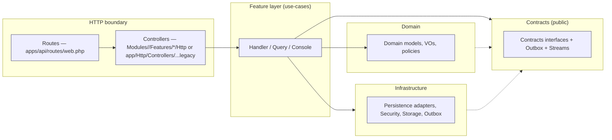
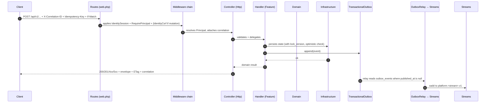
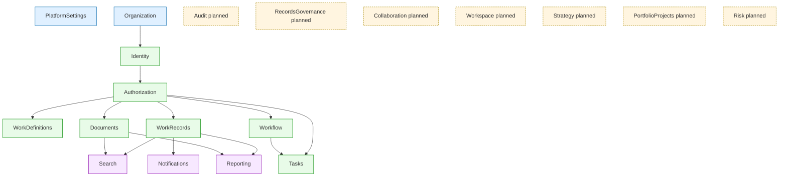

# 01 · البنية العامة والمعمارية (Cluster R3)

## 1 · ملخّص معماري

Cluster مبنيّ كـ **Laravel 13.8 Modular Monolith** على نمط **Module Layered Architecture** يفصل كل موديول إلى خمس طبقات:

* **تكوين المعماريات:** `App\Providers\AppServiceProvider` (الـ composition root) — `apps/api/app/Providers/AppServiceProvider.php:140-318`.
* **التحقق المعماري آلياً:** `apps/api/tests/Architecture/ModuleBoundariesTest.php` (ranking + table ownership + controller placement + outbox rules) و `apps/api/tests/Architecture/ModulePlacementInventory.php` (قائمة موقتة للملفات الـ legacy في `app/` بانتظار النقل).

## 2 · الترتيب الرتبي للموديولات (Module Ranks)

من `apps/api/tests/Architecture/ModuleBoundariesTest.php:13-30`:

| Rank | الموديول | الوصف المختصر |
|------|---------|---------------|
| 0 | `PlatformSettings`, `Organization` | جذور التهيئة وبيانات الشركة |
| 1 | `Identity` | حسابات، جلسات، كلمات مرور |
| 2 | `Authorization` | RBAC + ABAC + Decisions |
| 3 | `Audit` (planned) | سجلات التدقيق |
| 4 | `Workflow`, `RecordsGovernance` (planned) | تدفقات العمل، حوكمة السجلات |
| 5 | `WorkDefinitions`, `Documents` | تعريفات العمل، الوثائق |
| 6 | `Collaboration` (planned) | تعاون |
| 7 | `Tasks` | المهام |
| 8 | `WorkRecords`, `Strategy` (planned) | سجلات العمل، الاستراتيجية |
| 9 | `PortfolioProjects` (planned) | المشاريع |
| 10 | `Risk` (planned) | المخاطر |
| 11 | `Notifications`, `Search`, `Reporting`, `Workspace` (planned) | قنوات جانبية (read-models، تنبيهات) |

القاعدة المطبَّقة: **الموديول الأعلى رتبة لا يستورد من الموديول الأدنى مباشرة**؛ الاستيراد مسموح فقط عبر `Contracts/` أو `Events/`. التحقق آلي عبر `violationsIn()` في `ModuleBoundariesTest.php`.

**الموديولات المُخطَّطة (PLANNED_MODULES):** `Audit, RecordsGovernance, Collaboration, Workspace, Strategy, PortfolioProjects, Risk` (سطر 38–47) — يجب ألّا يُنشأ لها مجلد في `apps/api/Modules`؛ وإلا يفشل الاختبار `test_planned_modules_have_no_implementation_directory_yet`.

## 3 · ملكية الجداول (TABLE_OWNERS)

من `apps/api/tests/Architecture/ModuleBoundariesTest.php:49-119`. الجداول موزّعة كما يلي:

| الموديول | الجداول المملوكة |
|---------|-----------------|
| `PlatformSettings` | `platform_settings` |
| `Organization` | `organizations`, `clusters`, `facility_types`, `facilities`, `unit_types`, `organization_units`, `positions`, `people`, `assignments`, `import_jobs`, `import_rows`, `organization_idempotency_keys`, `temporary_assignments`, `temporary_assignment_capabilities`, `supervisory_relationships`, `relationship_capabilities` |
| `Identity` | `identities`, `users`, `identity_sessions`, `identity_person_account_claims`, `identity_idempotency_keys`, `identity_inbox`, `identity_person_event_watermarks`, `identity_person_provisioning`, `identity_development_fixture_accounts`, `credentials`, `identity_password_history`, `identity_activation_tokens`, `identity_totp`, `identity_auth_attempt_ledgers` |
| `Authorization` | `authorizations`, `roles`, `capabilities`, `role_capabilities`, `role_assignments`, `delegations`, `delegation_capabilities`, `explicit_denies`, `classification_policies`, `field_access_templates`, `sensitive_access_events`, `audit_events` (للـ `Audit` المخطَّط) |
| `WorkDefinitions` | `work_definitions` |
| `Documents` | `documents`, `document_storage_objects`, `document_versions`, `document_upload_intents`, `document_quarantines`, `document_idempotency_keys`, `document_outbox_events` |
| `Tasks` | `tasks` |
| `WorkRecords` | `work_records` |
| `Workflow` | `workflow_instances` |
| `Notifications` | `notifications` (مع جداول `notification_inbox`, `notification_recipients`, `notification_dead_letters` حسب الهجرات) |
| `Search` | `search_index` (الـ migration يضيف `search_index_entries`, `search_checkpoints`, `search_inbox`) |
| `Reporting` | `reporting_read_models` |

**ملاحظات هامة:**

- `Authorizations TABLE_OWNERS` يسجّل `audit_events` رغم أن `Audit` موديول مُخطَّط ولم يُنفَّذ. هذا **انحراف ملكية (ownership drift)** (سطر 86 من `ModuleBoundariesTest`).
- `Identity TABLE_OWNERS` يذكر جداول لا تظهر في التهجيرات فعلياً، مثل `identities` (الـ migration `CreateIdentityAccountTables.php` يُنشئ `users`، `identity_sessions`، `credentials`، `identity_password_history`، `identity_activation_tokens`، `identity_totp`، `identity_auth_attempt_ledgers`). هذا تعارض تسمية يحتاج توضيحاً (هل `identities` مرادف لـ `users` أم جدول منفصل؟).
- موديول `WorkDefinitions` يصرّح فقط عن `work_definitions` لكن في الواقع توجد جداول `work_definition_versions` و `work_definition_idempotency_keys` و `development_work_type_fixtures` تحتاج إضافتها إلى `TABLE_OWNERS`.

## 4 · قواعد الـ boundaries المُطبَّقة آلياً

من `ModuleBoundariesTest.php` و `ModulePlacementInventory.php`:

1. **Cross-module domain import**: ممنوع استيراد `Modules/<Other>/Domain` من داخل `Modules/<Self>` — الاستيراد مسموح فقط عبر `Contracts` أو `Events`. (سطر 173–192).
2. **Cross-owner SQL join/foreign key**: ممنوع الإشارة إلى جدول مملوك لموديول آخر في `Schema::table()` أو `DB::statement` داخل `Migrations/` (سطر 194–215).
3. **Business controller outside its module**: أي controller تحت `app/Http/Controllers/...` يُعتبر legacy ويُسجَّل في `ModulePlacementInventory::misplacedBusinessFiles()` (سطر 217–239).
4. **Business table access from app/**: ممنوع وصول `DB::table('x')` من `app/Integrations/*` أو `app/Http/Controllers/*` إلى جدول مملوك لموديول آخر (سطر 242–282).
5. **HTTP controller must not own transactions/Outbox**: لا يُسمح بـ `use Shared\Contracts\TransactionalOutbox` داخل `Modules/<X>/Features/.../Http/*` (سطر 285–306).
6. **Forbidden `Request*` business identifier**: لا يُسمح بإنشاء `Modules/Requests` أو `RequestCreated`-style identifiers (سطر 218–235).

## 5 · طبقات `Shared/` و`app/`

### 5.1 Shared kernel (الحلقة الأضيق)

- `Shared/Contracts/TransactionalOutbox.php` — واجهة الإخراج للمعاملات: `append(eventId, aggregateId, eventType, payload)`.
- `Shared/Infrastructure/Outbox/DatabaseTransactionalOutbox.php` — تنفيذ Eloquent للـ outbox.
- `Shared/Infrastructure/Streams/RedisStreamTransport.php` — واجهة Streams لـ Redis (XADD/XREADGROUP/XACK/XCLAIM/DLQ).
- `Shared/Infrastructure/Streams/PredisRedisStreamTransport.php` — تنفيذ Predis.

كل الموديولات تستهلك هذه الواجهات فقط؛ لا يوجد استيراد مباشر لـ Predis.

### 5.2 app/ (الطبقة الجانبية)

- `app/Http/Middleware/*` — Middleware خاص بالـ session/CSRF/maintenance/correlation id. مفصّل في [`02-shared-crosscutting.md`](02-shared-crosscutting.md).
- `app/Http/Authentication/SessionPrincipalResolver.php` — يحلّ `Principal` من Session/Attribute (production).
- `app/Http/Controllers/...` — **legacy controllers** (مذكور كل واحد في `ModulePlacementInventory`).
- `app/Integrations/...` — adapters لـ Platform Operations/Platform Settings/Work Records + Database resolvers.
- `app/Support/...` — Seeders/Definition (Organization hierarchy, realistic cluster, W12 E2E fixtures).
- `app/Providers/AppServiceProvider.php` — 474 سطر، يفرض 49 binding + 47 migration load + production guards + commands.

## 6 · تدفّق طلب HTTP نموذجي

## 7 · CI وخطوط التحقق

من `Makefile`:

- `make verify-intake` — فحص lockfiles/manifests.
- `make test-api` — `cd apps/api && composer test` (PHPUnit 12.5 in-memory SQLite + array cache/session/mail).
- `make test-web` — `npm --prefix apps/web run build + lint + coverage`.
- `make verify-boundaries` — يفعّل `tests/Architecture/ModuleBoundariesTest` ويمنع الانحرافات.
- `make lint-api`, `make analyse-api` — Pint + PHPStan/Larastan.
- `make verify-mysql-integration`, `make verify-screens` — تحقق MySQL + شاشات يوم-3.
- `make validate-production-bundle`, `build-production-images`, `verify-production-images`, `deploy-vps` — خط الإنتاج.

`apps/api/phpunit.mysql.xml` يستهدف `verify-mysql-integration`، يقفز تلقائياً عند عدم توفر `pdo_mysql`.

## 8 · الوضع الحالي (الحالة الراهنة)

| الجانب | الحالة |
|--------|-------|
| نمط Modular Monolith | ✅ مُطبَّق بقوة في `Modules/<Name>/{Contracts,Domain,Features,Infrastructure,Tests}` |
| حدود الموديولات (boundaries) | ✅ مفروضة آلياً، لكن **ضعيفة التطبيق على الـ HTTP** (80+ legacy controller) |
| ملكية الجداول (TABLE_OWNERS) | ⚠️ مطبَّقة لكن ناقصة في 3 جداول فرعية (Identity `identities`، WorkDefinitions 3 جداول، Search يُسجِّل `search_index` بدل التفاصيل) |
| Outbox + Streams | ✅ كامل، مع Redis Streams + Reclaim + DLQ |
| RBAC + ABAC | ✅ مع `RbacAbacDecideAccess` و `BootstrapGatedDecideAccess` و `AuthorizationBootstrapState` |
| Audit (موديول مستقل) | ❌ مذكور في ranks لكن **غير منفَّذ** |
| Workflow engine | ✅ مكتمل من حيث الجداول، جزئياً من حيث Endpoints |
| Production guards | ✅ `assertAuthorizationRuntimeSafe`، `assertDocumentsStorageRuntimeSafe`، `technical-logs DEFERRED` |
| Web client alignment | ✅ OpenAPI/Orval + Playwright + 100% coverage on `src/api.ts` |
| توثيق `docs/contracts/api/` | ❌ المجلد **مفقود** رغم الإشارة له في AGENTS.md |
| توثيق `docs/architecture/module-catalog.md` | ❌ مفقود، `validate-docs.sh` سيفشل في الفحص |

## 9 · المشاكل / المخاطر المعمارية

| # | الوصف | المرجع |
|---|-------|--------|
| A1 | `docs/contracts/api/` مفقود رغم أنه مصدر الـ OpenAPI المعتمد | `AGENTS.md:38`، `scripts/validate-docs.sh` |
| A2 | `docs/architecture/module-catalog.md` مفقود رغم أن الاختبار `validate-docs.sh` يطلبه | `scripts/validate-docs.sh` |
| A3 | 80+ controller في `app/Http/Controllers/**` لم يُنقَل إلى `Modules/<Name>/Features/*/Http` | `ModulePlacementInventory::misplacedBusinessFiles()` |
| A4 | 3 adapters في `app/Integrations/...` تقرأ جداول مملوكة (WorkRecord, WorkRecordWorkflowSource, DatabaseTechnicalAlertRecipient) | `ModulePlacementInventory.php:90-95` |
| A5 | ~~`RequireIdentitySessionPrincipal` يضبط `identity.session_only = true` ولا يوجد مستهلِك واضح~~ — **مُنجَز** (Stage 6.5): أُعيد تنفيذه كـ enforcer يفحص تماسك `session.user_id === principal.user_id` ويعيد 401 عند الفشل. القرار موثَّق في `module-catalog.md` §6.5. | `app/Http/Middleware/RequireIdentitySessionPrincipal.php` |
| A6 | `ConsumeSubmittedNotification` middleware في `app/` يحمل منطق outbox وبيئة `testing` فقط | `app/Http/Middleware/ConsumeSubmittedNotification.php` |
| A7 | `audit_events` مملوك لـ `Audit` المُخطَّط لكن التهجيرات تخصّصها لـ `Authorization` | `ModuleBoundariesTest.php:86` |
| A8 | `identities` و`users` مذكوران كلاهما لـ `Identity` — غموض ملكية | `ModuleBoundariesTest.php:66-67` |
| A9 | `work_definition_versions`, `work_definition_idempotency_keys`, `development_work_type_fixtures` غير مُسجَّلة في `TABLE_OWNERS` | `CreateWorkDefinitionTables.php`، `CreateDevelopmentWorkTypeFixturesTable.php` |
| A10 | `search_index` مُسجَّل في TABLE_OWNERS لكن الـ migration الفعلي يُنشئ `search_index_entries`/`search_checkpoints`/`search_inbox` | `CreateSearchProjectionTables.php` |
| A11 | `PlatformSettings TABLE_OWNERS` لا يُسجِّل `platform_settings_outbox` (الذي تستهلكه `TechnicalAlertOutboxRelay`) | `CreatePlatformSettingsTables.php` |
| A12 | `Notifications` الـ outbox (`document_outbox_events`، `outbox_events`) ليس مملوكاً صريحاً في `TABLE_OWNERS` | `ModuleBoundariesTest.php:107-112` |
| A13 | `temporary_assignment_capabilities` و`relationship_capabilities` ينتميان لـ Organization لكن يتمّ تعديلهما من Authorization | التهجيرات بدون فحص صريح في `ModuleBoundariesTest` |
| A14 | `SessionPrincipalResolver` مُسجَّل في `app/Providers/AppServiceProvider.php:235` لكن `app/Http/Authentication/SessionPrincipalResolver.php` لا يتطابق مع نمط الموديول | كلاهما يحلّ `Principal` لكن من سياقات مختلفة |
| A15 | الـ Mock seeders (`OrganizationHierarchyDemoSeeder`, `W12E2EFixtureSeeder`, `RealisticClusterFacilitiesSeeder`) في `app/Support/` تحمل fixtures تطويرية لكن لا توجد production gate واضح | `app/Support/*Seeder.php` |

## 10 · التحسينات المقترحة (مرتّبة بالأولوية)

### أولوية 1 — معالجة الـ documentation gap
1. **استعادة `docs/contracts/api/`** — نقل ملفات OpenAPI من `apps/web/.orval/` إلى `docs/contracts/api/` أو إنشاء `docs/contracts/api/openapi.yaml` + 3 ملفات w1.1/w1.2/r1-screens.
2. **كتابة `docs/architecture/module-catalog.md`** يصف كل موديول (rank, owner, contracts, dependencies, planned status).
3. **تحديث AGENTS.md** لحذف الإشارات إلى `docs/contracts/api/` إن كان سيُستبدل بمسار آخر.

### أولوية 2 — تصفية الـ HTTP legacy
1. نقل 80+ legacy controllers إلى `Modules/<Name>/Features/*/Http` بشكل متدرّج.
2. تحديث `ModulePlacementInventory::misplacedBusinessFiles` بإزالة كل مسار منقول.
3. استبدال `app/Http/Controllers/Api/{LinkDocument,WorkDefinition,WorkRecordLifecycle,Workflow}Controller` بـ Modules-bound controllers.

### أولوية 3 — تنظيف ملكية الجداول
1. توضيح `identities` vs `users` (هل أحدهما alias للآخر؟) وتحديث `TABLE_OWNERS`.
2. إضافة `work_definition_versions`، `work_definition_idempotency_keys`، `development_work_type_fixtures` لـ WorkDefinitions.
3. توسيع `Search TABLE_OWNERS` ليشمل `search_index_entries`, `search_checkpoints`, `search_inbox`.
4. إضافة `platform_settings_outbox` لـ PlatformSettings.
5. توضيح ملكية `outbox_events` (Shared؟ أم كل موديول ملكه؟).

### أولوية 4 — ترقية الـ crosscutting (محدَّث 2026-07-25)
1. ✅ ~~**حذف `RequireIdentitySessionPrincipal`** أو ربطه بمنطق فعلي~~ — **مُنجَز** (Stage 6.5): تحوّل إلى enforcer يفحص التماسك. راجع `module-catalog.md` §6.5.
2. **نقل `ConsumeSubmittedNotification`** إلى موديول Notifications أو حذفه إن كان للاختبارات فقط.
3. **نقل `app/Integrations/...`** إلى `Modules/<Name>/Infrastructure/...` لكل adapter.
### أولوية 5 — Audit
1. إنشاء موديول `Audit` (rank 3) واستخراج `audit_events` من `Authorization`.
2. تحديث `TABLE_OWNERS` و `PLANNED_MODULES` لإزالة `Audit` من المخطَّط.

### أولوية 6 — Web/Contracts
1. ترقية `apps/web` لقراءة `docs/contracts/api/openapi.yaml` بدل `.orval/cluster-master.openapi.yaml` (إزالة الازدواجية).
2. إضافة `make verify-architecture` يستدعي `tests/Architecture/ModuleBoundariesTest` و `validate-docs.sh` كاختبار قبول.

## 11 · مخطّط علاقات الموديولات (اعتماد على ranks)

## 12 · قائمة الملفات الرئيسية للعمق (للقراءة)

| الملف | الدور |
|-------|------|
| `apps/api/composer.json` | Laravel 13.8 + PSR-4 (App, Modules, Shared) |
| `apps/api/bootstrap/app.php` | `withRouting` + `EnforcePlatformMaintenance` + JSON exception render |
| `apps/api/routes/web.php` | كل المسارات + مجموعات middleware |
| `apps/api/app/Providers/AppServiceProvider.php` | 49 binding + 47 migration + production guards |
| `apps/api/app/Http/Middleware/IdentitySessionMiddleware.php` | Session + fixture-bearer fallback |
| `apps/api/app/Http/Middleware/IdentityCsrfMiddleware.php` | CSRF gate (skips fixture-bearer) |
| `apps/api/app/Http/Middleware/EnforcePlatformMaintenance.php` | Maintenance windows + DecideAccess check |
| `apps/api/app/Http/Middleware/ProjectWorkRecordReadModels.php` | بعد كل POST /work-records → Search+Reporting projections |
| `apps/api/Shared/Contracts/TransactionalOutbox.php` | Outbox contract |
| `apps/api/Shared/Infrastructure/Streams/RedisStreamTransport.php` | Streams contract |
| `apps/api/tests/Architecture/ModuleBoundariesTest.php` | Hard rules (ranks, ownership, controller placement, transactions) |
| `apps/api/tests/Architecture/ModulePlacementInventory.php` | Soft-list للملفات legacy |
| `apps/web/src/shell/routes.ts` | Typed + capability-gated routes |
| `apps/web/src/api/http.ts`, `fetcher.ts` | Transport + Fetcher |
| `apps/web/orval.config.ts` | Code-gen للـ client |
