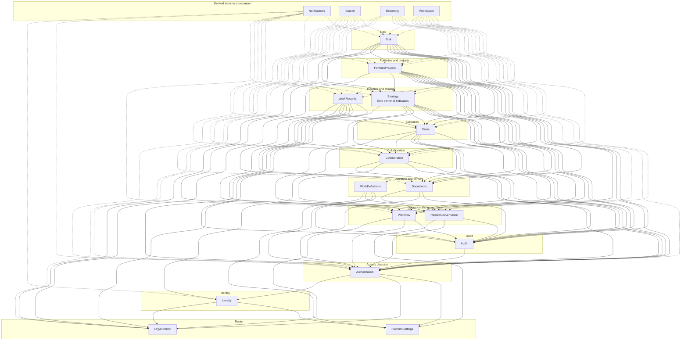
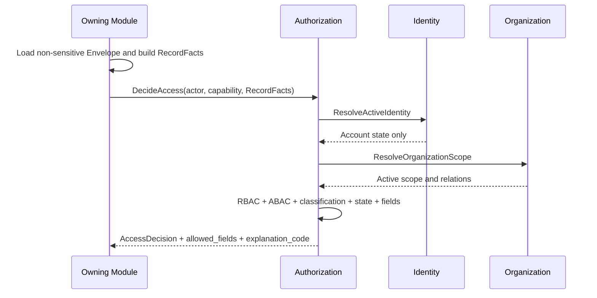
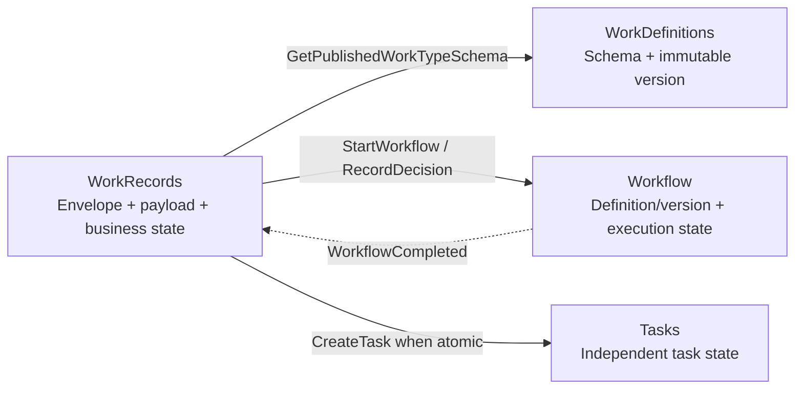
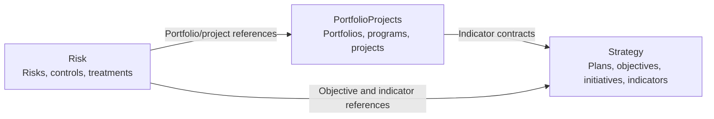

# Context Map

## 1. Scope of the map

This document defines the context boundaries, dependency direction, and integration relationships between the nineteen modules defined in [Architecture Overview](overview.md). The arrow `A → B` means that `A` depends on a published contract from `B`; it does not mean that `A` owns `B`'s data.

## 2. Context layers



Solid arrows are allowed synchronous contracts. Dashed arrows indicate dependency on Published Events or Projection Feeds in addition to calling `Authorization` at read time. Every arrow points to a lower rank; terminal modules do not expose contracts that source modules depend on.

## 3. Direct dependency matrix

| Module | Depends directly on |
|---|---|
| `PlatformSettings` | nothing |
| `Organization` | nothing |
| `Identity` | `Organization`, `PlatformSettings` |
| `Authorization` | `Identity`, `Organization`, `PlatformSettings` |
| `Audit` | `Authorization` |
| `Workflow` | `Organization`, `Authorization`, `Audit` |
| `RecordsGovernance` | `PlatformSettings`, `Authorization`, `Audit` |
| `WorkDefinitions` | `PlatformSettings`, `Workflow`, `Authorization`, `Audit` |
| `Documents` | `RecordsGovernance`, `Authorization`, `Audit` |
| `Collaboration` | `Documents`, `RecordsGovernance`, `Authorization`, `Audit` |
| `Tasks` | `Identity`, `Collaboration`, `Documents`, `RecordsGovernance`, `Authorization`, `Audit` |
| `WorkRecords` | `WorkDefinitions`, `Workflow`, `Tasks`, `Collaboration`, `Documents`, `RecordsGovernance`, `Authorization`, `Audit` |
| `Strategy` | `Organization`, `Workflow`, `Tasks`, `Collaboration`, `Documents`, `RecordsGovernance`, `Authorization`, `Audit` |
| `PortfolioProjects` | `Organization`, `Strategy`, `Workflow`, `Tasks`, `Collaboration`, `Documents`, `RecordsGovernance`, `Authorization`, `Audit` |
| `Risk` | `Organization`, `Strategy`, `PortfolioProjects`, `Workflow`, `Tasks`, `Collaboration`, `Documents`, `RecordsGovernance`, `Authorization`, `Audit` |
| `Notifications` | `Identity`, `Authorization`, and source module events |
| `Search` | `Authorization`, and indexable content events |
| `Reporting` | `Organization`, `Authorization`, and source events or Projection Feeds |
| `Workspace` | `Authorization`, and source work item events |

## 4. Relationship patterns

| Pattern | Use | Rule |
|---|---|---|
| Published Contract | immediate decision or shared invariant | The contract is owned by the offering module and returns an immutable DTO |
| Published Event | an event that occurred with deferred consumption | The producer owns the past-tense schema and persists it in the Outbox |
| Projection Feed | large reporting projection or rebuild | The owner offers a controlled, paginated feed and does not expose its table |
| Reference by ID | linking a record to a record in another context | stable identifier with verification via a contract; no cross-module Foreign Key or Join when module independence forbids it |
| Record Reference | general link to a source | `{record_type, record_id}` with re-delegation when the source is opened |
| Customer/Supplier | higher-ranked module consumes the lower-ranked module's contract | The consumer does not impose its storage model on the supplier |

## 5. Fact ownership map

| Fact | Sole owner | What others keep |
|---|---|---|
| Published platform settings | `PlatformSettings` | key and version, or invalidable cache |
| Person and basic PII | `Organization` | `person_id` and a limited display summary, no FK or join |
| Structure, units, positions, relations | `Organization` | identifiers and derived summaries |
| Account, session, operational profile | `Identity` | `user_id` and a display summary |
| Role, capability, delegation, field policy | `Authorization` | decision or temporary `decision_id`, no policy copy |
| Work type definition and version | `WorkDefinitions` | `work_type_version_id` |
| Dynamic work instance, including the request | `WorkRecords` | `record_ref` and derived projections |
| Route definition, instances, decisions | `Workflow` | `workflow_instance_id` |
| Comments, mentions, participants | `Collaboration` | `thread_id` |
| Task, state, assignee | `Tasks` | `task_id` or workspace projection |
| Document, version, classification | `Documents` | `document_id` and link reason |
| Retention, hold, and disposition policies | `RecordsGovernance` | `governance_subject_id` or decision result |
| Indicator definition, measurements, targets | `Strategy` | `indicator_id` and local planning data only |
| Portfolio, program, project | `PortfolioProjects` | identifiers, links, events |
| Risk, controls, treatment plan | `Risk` | identifiers, links, events |
| Immutable security and operational fact | `Audit` | `audit_event_id` only |
| Search result | `Search` | source modules do not rely on it for truth |
| Report and Read Model | `Reporting` | does not write to the source |
| Workspace item | `Workspace` | derived pointer to the source record |
| Notification | `Notifications` | redirect to the source re-delegated on open |

## 6. RecordFacts and Authorization without cycles

`RecordFacts` is a published language whose schema is owned by `Authorization`. The owning module builds the values from the Envelope or Aggregate it owns and passes them along with the actor and the requested capability:

```text
RecordFacts
- record_type
- record_id
- owner_organization_id
- owner_organization_unit_id
- created_by_user_id
- current_assignee_user_id optional
- participant_user_ids or share group key
- visibility_scope
- shared_organization_unit_ids
- classification
- state
- definition_version_id optional
- field_policy_key optional
- attributes limited and declared per capability
```



Cycle-prevention rules:

- `Authorization` does not import `WorkRecords`, `Tasks`, `Documents`, or any business module.
- `Authorization` does not read record tables or request payload from them.
- The owning module is responsible for the correctness of `RecordFacts` and does not accept them from the client.
- Bulk queries ask `Authorization` for a `ScopePredicate` or `AuthorizedScopeSet` and apply it inside the owner's store.
- `Search` and `Reporting` store derived authorization facts sufficient for the initial filter, then re-check the decision when the record is opened or sensitive fields are exported.
- `Tasks`, `Documents`, and `Collaboration` do not call the source module to verify; the owner's endpoint or the orchestrating application re-passes the correct `RecordFacts`.

## 7. WorkRecords, WorkDefinitions, and Workflow



The last asynchronous arrow does not mutate `WorkRecords` automatically inside a hidden consumer when the business transition is binding; an explicit coordinator issues the Command to `WorkRecords`. `Workflow` does not own the meaning of completing a request or project.

## 8. Strategy, PortfolioProjects, and Risk



- An initiative is an element inside `Strategy` and does not enter the portfolio/program/project chain.
- The only sequence in `PortfolioProjects` is: portfolio ← program ← project.
- `PortfolioProjects` does not own the indicator; it submits expected and actual impact to `Strategy` for approval.
- `Risk` does not copy an objective, indicator, or project; it uses `Tasks` for treatment plans, `Workflow` for approvals, and `Documents` for evidence.

## 9. Derived terminal contexts

`Notifications`, `Search`, `Reporting`, and `Workspace` are terminal consumers relative to business sources:

- the source does not call them synchronously inside its transaction.
- they do not write to source tables.
- they process the event more than once safely.
- they keep a progress mark or an Inbox that prevents duplicate effects.
- their projections can be rebuilt from events or Projection Feeds.
- they do not use a derived result to take a domain transition without re-checking the owner's contract.

## 10. Systems outside the context

There are no external integrations in phase one. "Mawared" and the financial and clinical systems are future entities outside the platform boundary. No Adapter or Contract is created for them before specifying the system, the data, the direction, the owner, and the security and isolation requirements.
