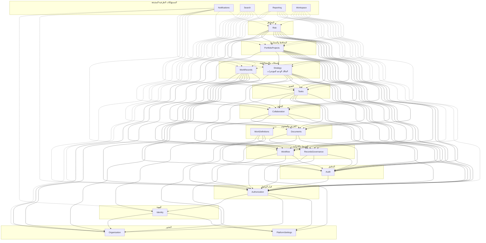
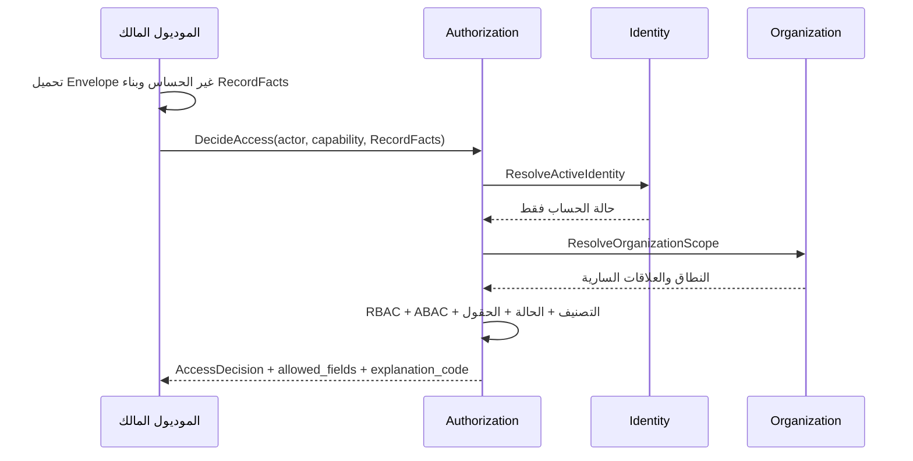
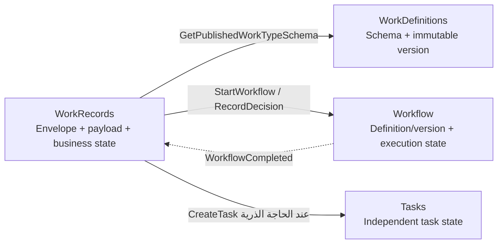
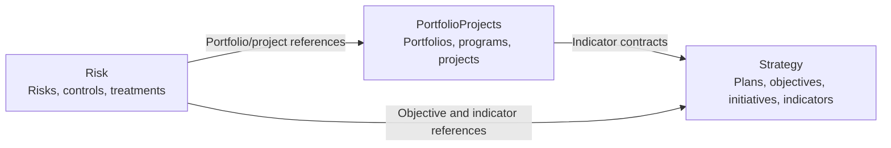

# خريطة السياقات

## 1. نطاق الخريطة

تحدد هذه الوثيقة حدود السياقات، واتجاه الاعتماد، وعلاقات التكامل بين الموديولات التسعة عشر المعرفة في [النظرة المعمارية](overview.md). السهم `A → B` يعني أن `A` يعتمد على عقد منشور من `B`؛ لا يعني أن `A` يملك بيانات `B`.

## 2. طبقات السياق



الأسهم المتصلة عقود متزامنة مسموحة. الأسهم المتقطعة اعتماد على Published Events أو Projection Feeds إضافة إلى استدعاء `Authorization` عند القراءة. جميع الأسهم تتجه إلى رتبة أدنى؛ الموديولات الطرفية لا تقدم عقوداً تعتمد عليها موديولات المصدر.

## 3. مصفوفة الاعتماد المباشر

| الموديول | يعتمد مباشرة على |
|---|---|
| `PlatformSettings` | لا شيء |
| `Organization` | لا شيء |
| `Identity` | `Organization`, `PlatformSettings` |
| `Authorization` | `Identity`, `Organization`, `PlatformSettings` |
| `Audit` | `Authorization` |
| `Workflow` | `Organization`, `Authorization`, `Audit` |
| `RecordsGovernance` | `PlatformSettings`, `Authorization`, `Audit` |
| `WorkDefinitions` | `PlatformSettings`, `Workflow`, `Authorization`, `Audit` |
| `Documents` | `RecordsGovernance`, `Authorization`, `Audit` |
| `Collaboration` | `Documents`, `RecordsGovernance`, `Authorization`, `Audit` |
| `Tasks` | `Identity`, `Collaboration`, `Documents`, `RecordsGovernance`, `Authorization`, `Audit` |
| `WorkRecords` | `WorkDefinitions`, `Workflow`, `Tasks`, `Collaboration`, `Documents`, `RecordsGovernance`, `Authorization`, `Audit` |
| `Strategy` | `Organization`, `Workflow`, `Tasks`, `Collaboration`, `Documents`, `RecordsGovernance`, `Authorization`, `Audit` |
| `PortfolioProjects` | `Organization`, `Strategy`, `Workflow`, `Tasks`, `Collaboration`, `Documents`, `RecordsGovernance`, `Authorization`, `Audit` |
| `Risk` | `Organization`, `Strategy`, `PortfolioProjects`, `Workflow`, `Tasks`, `Collaboration`, `Documents`, `RecordsGovernance`, `Authorization`, `Audit` |
| `Notifications` | `Identity`, `Authorization`، وأحداث الموديولات المصدرية |
| `Search` | `Authorization`، وأحداث المحتوى القابل للفهرسة |
| `Reporting` | `Organization`, `Authorization`، وأحداث أو Projection Feeds المصدرية |
| `Workspace` | `Authorization`، وأحداث عناصر العمل المصدرية |

## 4. أنماط العلاقة

| النمط | الاستخدام | القاعدة |
|---|---|---|
| Published Contract | قرار فوري أو invariant | العقد يملكه الموديول المقدم، ويعيد DTO ثابتاً |
| Published Event | حقيقة حدثت واستهلاك مؤجل | المنتج يملك schema بصيغة ماضية ويحفظه في Outbox |
| Projection Feed | إسقاط تقريري كبير أو إعادة بناء | المالك يقدم feed محكوماً ومتعدد الصفحات ولا يكشف جدوله |
| Reference by ID | ربط سجل بسجل في سياق آخر | معرف ثابت مع تحقق عبر عقد، بلا Foreign Key عابر لملكية الموديول إذا منع الاستقلال |
| Record Reference | ربط عام بمصدر | `{record_type, record_id}` مع إعادة تفويض عند فتح المصدر |
| Customer/Supplier | موديول أعلى رتبة يستهلك عقد الأدنى | المستهلك لا يفرض نموذج تخزينه على المورد |

## 5. خريطة الحقائق الرئيسية

| الحقيقة | المالك الوحيد | ما يحتفظ به الآخرون |
|---|---|---|
| إعدادات المنصة المنشورة | `PlatformSettings` | مفتاح وإصدار أو Cache قابل للإبطال |
| الشخص وPII الأساسية | `Organization` | `person_id` وملخص عرض محدود بلا FK أو join |
| الهيكل والوحدات والمناصب والعلاقات | `Organization` | معرفات وملخصات مشتقة |
| الحساب والجلسة والملف التشغيلي | `Identity` | `user_id` وملخص عرض |
| الدور والقدرة والتفويض وسياسة الحقل | `Authorization` | قرار أو `decision_id` مؤقت، لا نسخة من السياسة |
| تعريف نوع العمل وإصداره | `WorkDefinitions` | `work_type_version_id` |
| مثيل العمل الديناميكي، بما فيه الطلب | `WorkRecords` | `record_ref` وإسقاطات مشتقة |
| تعريف المسار ومثيلاته وقراراته | `Workflow` | `workflow_instance_id` |
| التعليقات والمنشن والمشاركون | `Collaboration` | `thread_id` |
| المهمة وحالتها ومسؤولها | `Tasks` | `task_id` أو إسقاط مساحة عمل |
| الملف وإصداره وتصنيفه | `Documents` | `document_id` وسبب الربط |
| سياسات الاحتفاظ والحجز والإتلاف | `RecordsGovernance` | `governance_subject_id` أو نتيجة قرار |
| المؤشر وتعريفه وقياساته ومستهدفاته | `Strategy` | `indicator_id` وبيانات تخطيط محلية مسموحة |
| المحفظة والبرنامج والمشروع | `PortfolioProjects` | معرفات وروابط وأحداث |
| الخطر والضوابط وخطة المعالجة | `Risk` | معرفات وروابط وأحداث |
| الحقيقة الأمنية والتشغيلية غير القابلة للتعديل | `Audit` | `audit_event_id` فقط |
| نتيجة البحث | `Search` | لا يعتمد عليها مصدر لتقرير الحقيقة |
| التقرير وRead Model | `Reporting` | لا يكتب إلى المصدر |
| عنصر مساحة العمل | `Workspace` | مؤشر مشتق إلى سجل المصدر |
| الإشعار | `Notifications` | رابط إلى المصدر يعاد تفويضه عند الفتح |

## 6. RecordFacts وAuthorization بلا دورات

`RecordFacts` لغة منشورة يملك schema الخاص بها `Authorization`. يبني الموديول المالك القيم من Envelope أو Aggregate الذي يملكه ثم يمررها مع الفاعل والقدرة المطلوبة:

```text
RecordFacts
- record_type
- record_id
- owner_organization_id
- owner_organization_unit_id
- created_by_user_id
- current_assignee_user_id اختياري
- participant_user_ids أو مفتاح مجموعة مشاركة
- visibility_scope
- shared_organization_unit_ids
- classification
- state
- definition_version_id اختياري
- field_policy_key اختياري
- attributes محدودة ومعلنة لكل capability
```



قواعد منع الدورة:

- `Authorization` لا يستورد `WorkRecords` أو `Tasks` أو `Documents` أو أي موديول أعمال.
- `Authorization` لا يقرأ جداول السجل ولا يطلب payload منه.
- الموديول المالك مسؤول عن صحة `RecordFacts` ولا يقبلها من العميل.
- الاستعلامات الجماعية تطلب من `Authorization` `ScopePredicate` أو `AuthorizedScopeSet` ثم تطبقها داخل مخزن المالك.
- `Search` و`Reporting` يخزنان حقائق تفويض مشتقة تكفي للترشيح الأولي، ثم يعاد فحص القرار عند فتح السجل أو تصدير الحقول الحساسة.
- `Tasks` و`Documents` و`Collaboration` لا تستدعي الموديول المصدر للتحقق؛ يعيد endpoint المالك أو التطبيق المنسق تمرير `RecordFacts` الصحيحة.

## 7. WorkRecords وWorkDefinitions وWorkflow



السهم غير المتزامن الأخير لا يغير `WorkRecords` تلقائياً داخل مستهلك خفي إذا كان الانتقال التجاري ملزماً؛ يتولى منسق صريح إصدار Command إلى `WorkRecords`. لا يملك `Workflow` معنى إكمال الطلب أو المشروع.

## 8. Strategy وPortfolioProjects وRisk



- المبادرة عنصر داخل `Strategy` ولا تدخل تسلسل المحفظة والبرنامج والمشروع.
- التسلسل الوحيد في `PortfolioProjects` هو: المحفظة ← البرنامج ← المشروع.
- `PortfolioProjects` لا يملك المؤشر؛ يقدم الأثر المتوقع والفعلي إلى `Strategy` للاعتماد.
- `Risk` لا ينسخ هدفاً أو مؤشراً أو مشروعاً، ويستخدم `Tasks` لخطط المعالجة و`Workflow` للموافقات و`Documents` للأدلة.

## 9. السياقات المشتقة الطرفية

`Notifications` و`Search` و`Reporting` و`Workspace` مستهلكات نهائية بالنسبة إلى مصادر الأعمال:

- لا يستدعيها المصدر متزامناً داخل معاملته.
- لا تكتب في جداول المصدر.
- تعالج الحدث أكثر من مرة بأمان.
- تحفظ نقطة تقدم أو Inbox يمنع تكرار الأثر.
- يمكن إعادة بناء إسقاطاتها من الأحداث أو Projection Feeds.
- لا تستخدم نتيجة مشتقة لاتخاذ انتقال مجال دون إعادة الرجوع إلى عقد المالك.

## 10. الأنظمة خارج السياق

لا توجد تكاملات خارجية في المرحلة الأولى. «موارد» والأنظمة المالية والسريرية جهات مستقبلية خارج حدود المنصة. لا ينشأ Adapter أو Contract لها قبل تحديد النظام والبيانات والاتجاه والمالك ومتطلبات الأمن والتشغيل المعزول.
