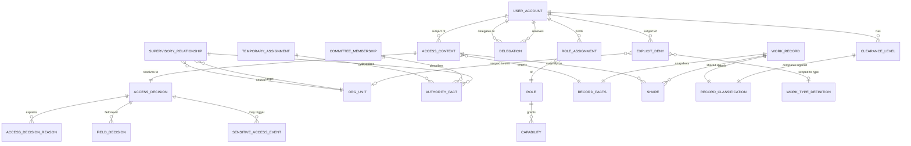

# Authorization and Isolation Model

## 1. Purpose

This document defines the platform's central access decision: its inputs, its
fixed stages in a defined order, its failure behaviour, and the programming
contract between `Authorization` and the business modules.

Every read, write, approval, or export passes through a single decision that
is interpretable and auditable. The platform does not rely on the UI to hide
elements, and it does not rely on ad-hoc queries in every screen.

## 2. Binding Principles

- **Backend-only decisioning.** Laravel resolves the decision; the UI consumes
  the result. No permission decision is taken in React or in any ad-hoc query.
- **Interpretability.** Every `allow` or `deny` decision carries numbered
  reasons shown to the user and recorded in the audit log.
- **Fail closed.** Any uncertainty, error, or missing input produces `deny`.
  There is no default-allow.
- **Fixed order.** The decision stages are always executed in the same order
  and no stage is skipped without recording a reason.
- **Default isolation between facilities.** Two facilities do not see each
  other's records unless an explicit relationship, share, or role applies.
- **No automatic inheritance.** Surfacing a task does not grant visibility into
  the source record's fields. The same rule applies to reports, search, and
  export.

## 3. Mandatory Inputs to an Access Decision

`AccessContext` is assembled at the first moment the request is received and
contains:

1. The actual user account and its current state.
2. The linked person and their personal attributes.
3. Active assignments, memberships, and relationships from Organization, and
   active delegations from Authorization, with their time windows.
4. Granted roles and capabilities.
5. Supervisory relationships and their capabilities.
6. The body's org unit and the organizational context of the request.
7. The requested action (`view`, `edit`, `approve`, `export`, `delete`,
   `assign`, ...).
8. The resource type and identifier when available.
9. The frozen record facts if the record exists.
10. The session, the internal IP address, and the correlation id.

The absence of any mandatory input means the responsible stage records a
reason and returns `deny`.

> **Contractual note.** `AccessContext` items 1, 5, and 9 above are described
> here as the contract that business modules and controllers are expected to
> supply to `Authorization`. The current runtime engine
> (`RbacAbacDecideAccess`) only consumes the actor user id, the requested
> capability, and `RecordFacts`; it does not yet read account-state, share,
> or record-state snapshots as runtime stages. The full ten-stage pipeline
> remains the target contract for future releases.

## 4. Evaluation Order

The runtime evaluation order implemented by `RbacAbacDecideAccess` (first
failure wins; each step records its result on `AccessDecisionReason`) is:

1. **`record_facts_unavailable`** — the `RecordFacts` payload is `null` or
   missing required fields.
2. **`actor_user_id_missing`** — the actor's `user_id` is not present.
3. **`capability_not_supported`** — the capability is not declared in
   `CapabilityCatalog`.
4. **`explicit_deny`** — an active `ExplicitDeny` covers actor + capability +
   facts.
5. **`classification_insufficient`** — `facts.classification` is not a known
   `ClassificationLevel` (unknown or empty).
6. **`role_capability_denied`** — a covering role grant with `effect = deny`
   applies.
7. **Grant resolution via `role_assignments`** (status active, within
   `start_at` / `end_at`) joined to `role_capabilities` with
   `effect = allow`. A matching grant proceeds to scope and clearance checks
   (`organization_unit_scope_mismatch` / `classification_insufficient`); no
   match falls through.
8. **Delegation grants** with the same scope + clearance logic.
9. **Supervisory relationships** (active window, capability listed in
   `relationship_capabilities`, target unit matches `facts.organizationUnitId`)
   — surfaced via `supervisory_relationship_scope_mismatch` /
   `actor_organization_unit_scope_unavailable` / `supervisory_relationship_capability_not_listed`.
10. **Expiry signals** — expired grants, delegations, or supervisory
    relationships emit `role_assignment_expired`, `delegation_expired`, or
    `supervisory_relationship_expired`.
11. **Fallback** — nothing matched → `active_role_assignment_not_found`.

Stages 1–3 reject on missing or unsupported inputs before any policy lookup.
Stages 4–6 reject on hard negative signals. Stages 7–9 are the positive
grant search. Stages 10–11 catch expired-but-existing relationships and the
catch-all no-match.

The numbered "ten-stage" pipeline that previously appeared in this document
(account state, capability, organizational scope, supervisory relationship,
share, explicit deny, classification, record state, field policy, action)
is the **target contract** for future releases. The current runtime engine
implements only the steps above; the remaining checks (account-state, share,
record-state, field-policy, sensitive-audit side effects, scope resolution)
are **planned** and must not be read as implemented runtime behaviour.

## 5. Fail-Closed Behaviour

Fail-closed behaviour applies in the following cases:

| Condition | Result |
|---|---|
| Identity service unavailable | `deny` (engine cannot proceed past stage 1) |
| Authorization service unavailable | `deny` (engine cannot proceed past stage 3) |
| Record or its facts cannot be read | `deny` with `record_facts_unavailable` |
| `AuthorizationRecordFacts` cannot be fetched from the owner | `deny` with `record_facts_unavailable` |
| Assignment, delegation, or membership window expired | `deny` with the matching expiry code (stage 10) |
| Unknown or empty classification | `deny` with `classification_insufficient` (stage 5) |
| Conflict between stage 4 (`explicit_deny`) and stage 7 (grant) | `explicit_deny` always wins |

Reason codes are exposed in the UI only as stable tokens such as
`DENY_BY_CLASSIFICATION`. The full human-readable reason text is recorded in
the audit log only.

### 5.1 Temporary Bootstrap in W1.2

- `Authorization` starts in `bootstrap_pending` mode and returns `deny` for
  every business capability.
- The only exception is the capabilities needed to bootstrap the admin
  account, the organizational structure, and the role contracts, and only
  for a designated bootstrap account, within a bounded time window, with MFA
  and a recorded reason.
- The scope selector `/me/scope` does not grant any capability; it only
  selects from a list that `Authorization` returned after evaluation.
- Bootstrap ends with an idempotent command and a recorded approval; after
  that it can only be reopened via a break-glass action.
- This contract is temporary for W1.2 and does not claim RBAC + ABAC
  completeness; deny-by-default remains in force until W1.3.

## 6. `GetAuthorizationRecordFacts` Contract

### 6.1 Interface

```text
interface GetAuthorizationRecordFacts {
    get(record: RecordReference): AuthorizationRecordFacts
}

record AuthorizationRecordFacts {
    source_module: string
    record_type: string
    record_id: string
    owner_organization_unit_id: string
    classification: public | internal | confidential | top_secret
    state: string
    status: string
    workflow_step: string?
    legal_hold: boolean
    field_policy_key: string
    facts_version: string
    lock_version: string
    document_constraints: DocumentConstraintFacts?
}
```

### 6.2 Rules

- The owning module implements the contract to expose record facts only; it
  does not take `AccessContext` or the actor's identity as input.
- The contract does not return `allow` or `deny`, `FieldDecision`, or any
  executable guard.
- Policy keys and fact-version identifiers are descriptive handles for
  policies owned by `Authorization`; the owning module does not transfer
  policy logic or evaluation results.
- `Authorization` verifies `facts_version` and `lock_version` and applies
  the state, classification, and field policies it owns.
- Any exception, missing mandatory fact, or stale version is translated by
  `Authorization` into a `deny` and recorded in the audit log.

> **Runtime note.** The current engine (`RbacAbacDecideAccess`) consumes
> `RecordFacts` but does not yet evaluate `state`, `workflow_step`,
> `legal_hold`, `field_policy_key`, or `document_constraints` as runtime
> stages. These fields are part of the forward-looking contract and are
> marked **planned**.

### 6.3 Document Constraint Facts

Within `DocumentConstraintFacts`, Documents returns only the constraint keys
and facts: `own_policy_key`, the document's classification and state, and
the list of active links each carrying the source reference, its
classification, the `constraint_policy_key`, and the facts version. The
contract contains no `effect`, link decision, or allowed-field list.
`Authorization` aggregates these facts, applies the strictest-constraint
rule, and is the sole emitter of the access and field decision.

## 7. Read, Search, Report, and Export Decisions

Read, search, report, and export flows use the same runtime evaluation
order above. Differences:

- Bulk reads evaluate every element in the result set.
- Search applies the decision to filters before returning results and does
  not return the identity of a denied record.
- Reports use Read Models and do not write to business tables, but they are
  still subject to the field decision on display and export.
- Export reuses the same `AccessContext` and is recorded in the audit log
  with a hash of the exported fields.

## 8. Access-Decision ERD



> **Contractual note.** Entities marked "planned" in the canonical reference
> (`ClearanceLevel`, `ExplicitDeny` rows, `Share`, `RecordFacts`,
> `FieldDecision`, `SensitiveAccessEvent`, and the supervisory /
> committee / temporary-assignment linkages) are part of the target model.
> The current runtime engine persists only `access_decisions` and
> (conditionally) `sensitive_access_events`; the other entities are
> **planned** and must not be read as implemented runtime tables.

## 9. Runtime Reason Codes

The reason codes emitted by the runtime evaluation order are:

| # | Code | Meaning |
|---|---|---|
| 1 | `record_facts_unavailable` | `RecordFacts` payload missing |
| 2 | `actor_user_id_missing` | Actor `user_id` not present |
| 3 | `capability_not_supported` | Capability not in catalog |
| 4 | `explicit_deny` | Active explicit deny matched |
| 5 | `classification_insufficient` | Unknown or low classification |
| 6 | `role_capability_denied` | Covering role deny matched |
| 7 | `organization_unit_scope_mismatch` | Grant scope does not cover facts |
| 8 | `actor_organization_unit_scope_unavailable` | Actor unit id unavailable |
| 9 | `supervisory_relationship_scope_mismatch` | Supervisory target unit mismatch |
| 10 | `supervisory_relationship_capability_not_listed` | Capability not in relationship list |
| 11 | `role_assignment_expired` | Grant outside its time window |
| 12 | `delegation_expired` | Delegation outside its time window |
| 13 | `supervisory_relationship_expired` | Relationship outside its time window |
| 14 | `active_role_assignment_not_found` | No active grant, delegation, or relationship |
| 15 | `authorization_bootstrap_pending` | Bootstrap gate still pending |

## 10. Access-Decision Scenario Matrix (planned vs runtime)

| Scenario | Decision | Decisive Step |
|---|---|---|
| A user at facility A requests a record at facility B | `deny` | Stage 7 — no grant covers the facts (`organization_unit_scope_mismatch`); **planned** scope-stage check |
| A cluster officer with a `read_only` relationship requests facility details | `deny` | Stage 9 — supervisory relationship grants only the listed capabilities |
| A facility manager opens a `confidential` record without sufficient clearance | `deny` | Stage 5/7 — `classification_insufficient` |
| A user with a `disabled` account attempts any action | `deny` | **Planned** — runtime engine does not currently evaluate account state |
| The owner of a record under legal hold attempts to delete it | `deny` | **Planned** — runtime engine does not currently evaluate `legal_hold` |
| A recipient sees a `top_secret` field via share but has no actual share | `deny` | **Planned** — runtime engine does not currently evaluate share records |
| A user with an `edit` role on a record in `archived` state | `deny` | **Planned** — runtime engine does not currently evaluate record state |
| A user sees the source task without permission to read the source record | `allow` for the task only, `deny` for the sensitive fields | **Planned** — runtime engine does not currently emit field-level decisions |
| An aggregated facility report with indicator-only clearance | `allow` for indicator fields, `hide` for the rest | **Planned** — runtime engine does not currently emit `FieldDecision` |
| Export of a `confidential` record by a user with `confidential` clearance | `allow` with `SensitiveAccessEvent` recorded | Runtime — `DatabasePersistAccessDecision` writes the event on allow |

## 11. Implementation Rules

- No permission is inlined into ad-hoc queries; every query passes through a
  centralized `Scope`.
- Decisions are never passed through the UI; the UI consumes `allowed_fields`
  and `denied_fields`.
- No long-lived cache of decisions is kept; every request is re-evaluated.
- A super-admin may view sensitive content only with the visit recorded.
- A user may contest a `deny` decision by requesting an explanation that is
  itself recorded in the audit log.
- Decision-policy updates carry a `policy_version` and invalidate any cached
  state.

## 12. Implementation Notes

- Every write Slice requests an access decision before any read or write.
- Every read Slice requests an access decision before transforming data into
  a Resource.
- Authorization tests exercise the full runtime evaluation order in positive
  and negative cases for each action and classification.
- `fail_closed` tests verify that the engine rejects the decision when any
  input service is unavailable.
- The contract between Authorization and a business module exposes record
  facts only; it does not leak table structure.

## Changelog

| Version | Date | Role | Change |
|---|---|---|---|
| 0.3.0 | 2026-07-18 | Information Security Officer | Pin bootstrap as closed-by-default and document the scope selector in W1.2 |
| 0.1.0 | 2026-07-15 | Information Security Officer | Initial implementation draft |
| 0.2.0 | 2026-07-15 | Information Security Officer | Restrict the decision to Authorization, convert module and document contracts to facts-only, and align the document controls |