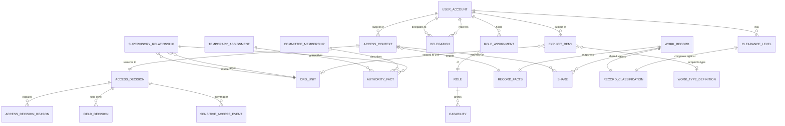

# نموذج الصلاحيات والعزل

## 1. الهدف

تحدد هذه الوثيقة القرار المركزي للوصول في المنصة: مدخلاته، ومراحله الثابتة بترتيب محدد، وسلوك الفشل، والعقد البرمجي بين `Authorization` وموديولات الأعمال.

كل قراءة أو كتابة أو اعتماد أو تصدير يمر عبر قرار واحد قابل للتفسير والتدقيق. لا تعتمد المنصة على الواجهة لإخفاء العناصر، ولا تعتمد على استعلامات مخصصة في كل شاشة.

## 2. المبادئ الملزمة

- **القرار في الخلفية فقط.** Laravel يحسم القرار، والواجهة تستهلك النتيجة. لا تُتخذ قرارات صلاحيات في React أو في استعلام فرعي.
- **قابلية التفسير.** كل قرار `allow` أو `deny` يحوي أسباباً مرقمة تُعرض للمستخدم وتُسجل في التدقيق.
- **فشل مغلق.** أي عدم يقين أو خطأ أو نقص في المدخلات ينتج عنه `deny`. لا يوجد افتراضي للسماح.
- **ترتيب ثابت.** المراحل العشر للقرار تُنفذ دائماً بنفس الترتيب، ولا تتجاوز مرحلة دون تسجيل سبب.
- **عزل افتراضي بين المنشآت.** مستشفيان لا يريان سجلات بعضهما إلا بعلاقة أو مشاركة أو دور صريح.
- **عدم توريث تلقائي.** ظهور المهمة لا يمنح رؤية حقول المصدر. تطبق القاعدة نفسها على التقارير والبحث والتصدير.

## 3. المدخلات الإلزامية لقرار الوصول

يُجمَّع `AccessContext` في اللحظة الأولى من استلام الطلب ويحتوي على:

1. حساب المستخدم الفعلي وحالته الحالية.
2. الشخص المرتبط وصلاحياته الشخصية.
3. حقائق التكليفات والعضويات والعلاقات السارية من Organization، والتفويضات السارية من Authorization، بنوافذها الزمنية.
4. الأدوار والقدرات الممنوحة.
5. العلاقات الإشرافية وقدراتها.
6. الجهة والوحدة والسياق التنظيمي للطلب.
7. الفعل المطلوب (`view`, `edit`, `approve`, `export`, `delete`, `assign`, ...).
8. نوع المورد ومعرفه عند توفره.
9. حقائق السجل المجمَّدة إن وُجد السجل.
10. الجلسة وعنوان IP الداخلي ومعرف الارتباط.

غياب أي عنصر من العناصر الإلزامية يعني أن المرحلة المسؤولة تُسجل سبباً وتُرجع `deny`.

## 4. ترتيب مراحل قرار الوصول

يُنفَّذ القرار بالمراحل العشر التالية، وكل مرحلة تُسجِّل نتيجتها في `AccessDecisionReason`:

### 4.1 المرحلة 1: فحص حالة الحساب النشط

- يجب أن يكون `UserAccount.status = active`.
- لا يُسمح بحساب `pending` أو `locked` أو `disabled` أو `archived`.
- إذا انتهت صلاحية كلمة المرور بحسب السياسة ولم يجددها المستخدم، تُمنع الإجراءات الحساسة.
- فشل الفحص ينتج عنه `deny` فوري عند `account_state` ولا تُكمل المراحل.

### 4.2 المرحلة 2: فحص القدرة الأساسية

- يحدد الفعل المطلوب قدرة أساسية مثل `work_records.view` أو `portfolio_projects.edit`.
- يُمنح المستخدم القدرة من خلال:
  - أدوار RBAC الفعالة في نافذتها الزمنية.
  - سياسة Authorization المطبقة على حقائق علاقة إشرافية فعالة من Organization.
  - قدرات التفويض الساري.
  - سياسة Authorization المطبقة على حقائق عضوية لجنة نشطة عند الحاجة.
- غياب القدرة ينتج عنه `deny` عند `capability` ولا تُكمل المراحل.

### 4.3 المرحلة 3: فحص النطاق التنظيمي

- تُقيَّد القدرة بالجهة أو الوحدة المسموحة للمستخدم عبر:
  - نطاق الدور.
  - نطاق التكليف الأساسي.
  - التكليف المؤقت الساري.
  - العضوية في لجنة تملك نطاقاً.
- خارج النطاق الممنوح يُسجل `deny` عند `organizational_scope` ولا تُكمل المراحل.

### 4.4 المرحلة 4: تطبيق العلاقة الإشرافية

- إذا لم تكفِ القدرة المباشرة للنطاق، يقرأ Authorization حقائق العلاقات الإشرافية الفعالة من Organization ويطبق سياسته:
  - `direct` تكافئ التكليف الإداري.
  - `functional` تكافئ الإشراف الوظيفي.
  - `coordination` تمنح قدرات محددة فقط.
  - `read_only` تمنح رؤية مؤشرات.
- لا تحمل حقائق العلاقة قراراً أو سماحاً؛ Authorization وحده يحولها إلى أثر قدرة محدد دون توسعة ضمنية.
- عدم وجود علاقة فعالة ينتج عنه `deny` عند `relationship` للقدرات التي تعتمد على العلاقة.

### 4.5 المرحلة 5: تطبيق المشاركة الصريحة

- إذا كان السجل مشتركاً مع المستخدم عبر `Share` صريح:
  - يجب أن تكون المشاركة في نافذتها الزمنية.
  - يجب أن تتضمن الفعل المطلوب.
  - يجب أن يكون المستخدم نشطاً ومنتمي للجهة المانحة للمشاركة أو يحمل دور `share_recipient` معتمد.
- المشاركة لا تلغي العزل التنظيمي، لكنها تضيف استثناءً مسجلاً.
- فشل التحقق ينتقل للمنع الصريح في المرحلة التالية.

### 4.6 المرحلة 6: فحص المنع الصريح

- تُطبَّق قواعد `ExplicitDeny` على المستخدم أو نطاقه.
- المنع الصريح يُلغي أي سماح سابق.
- تطابق المنع مع الفعل المطلوب ينتج عنه `deny` فوري عند `explicit_deny` ولا تُكمل المراحل.
- يحق للمستخدم طلب تفسير لقواعد المنع الصريحة النشطة عليه من السوبر أدمن.

### 4.7 المرحلة 7: فحص التصريح والتصنيف

- التصريح (`ClearanceLevel`) للمستخدم يجب أن يكون ≥ تصنيف السجل (`RecordClassification`) في ترتيب المستويات.
- رموز التصنيف الوحيدة هي `public`, `internal`, `confidential`, `top_secret` بهذا الترتيب.
- التصنيف الأعلى على حقل بعينه يرفع المتطلب على ذلك الحقل.
- عدم كفاية التصريح ينتج عنه `deny` عند `classification` أو إخفاء الحقل عند `field`.
- السوبر أدمن يخضع للقاعدة نفسها في المحتوى الحساس، ويسجل اطلاعه.

### 4.8 المرحلة 8: فحص حالة السجل والمسار

- يطبق Authorization سياسته على `state` و`workflow_step` و`legal_hold` وحالة إصدار التعريف الواردة ضمن `AuthorizationRecordFacts`.
- الموديول المالك يصف الحالة والنسخ كحقائق فقط، ولا يرسل guard أو نتيجة `allow` أو `deny`.
- غياب حقيقة مطلوبة أو عدم تطابقها مع سياسة Authorization ينتج عنه `deny` عند `record_state`.

### 4.9 المرحلة 9: فحص صلاحيات الحقول

- يقرأ Authorization `field_policy_key` و`facts_version` من حقائق السجل، ثم يحمّل `field_access_template` الذي يملكه ويحدد حالة كل حقل:
  - `hide`: لا يظهر في الإخراج.
  - `read`: يظهر ولا يعدل.
  - `edit`: يظهر ويعدل.
- تُطبَّق قوالب `field_access_template` المرتبطة بالمنصب والدور.
- تُطبَّق قيود الحقول الإضافية الواردة كحقائق على السجل؛ لا يعيد الموديول المالك خريطة حقول نهائية.
- قرار الحقل يُسجَّل في `FieldDecision` للتفسير والتدقيق.

### 4.10 المرحلة 10: الفعل والتسجيل

- إذا اجتازت المراحل التسع السابقة، يُرجع القرار `allow` مع قائمة `allowed_fields`.
- تُنفَّذ العملية الفعلية على الموارد المسموحة فقط.
- إذا كان الفعل على محتوى مصنف `confidential` (سري) أو `top_secret` (سري للغاية)، يُسجل `SensitiveAccessEvent` في Audit.
- تُسجل في التدقيق قراءات الفهارس والتصدير والطباعة والمشاركة.

## 5. سلوك الفشل المغلق

يُطبَّق الفشل المغلق في الحالات التالية:

| الحالة | النتيجة |
|---|---|
| عدم توفر خدمة Identity | `deny` عند `account_state` |
| عدم توفر خدمة Organization | `deny` عند `organizational_scope` |
| عدم توفر خدمة Authorization | `deny` عند `capability` |
| تعذر قراءة السجل أو حقائقه | `deny` عند `record_state` |
| تعذر جلب `AuthorizationRecordFacts` من المالك | `deny` عند `record_state` |
| انتهاء نافذة التكليف أو التفويض أو العضوية | `deny` عند المرحلة المسؤولة |
| تصنيف غير معروف أو قيمة فارغة | `deny` عند `classification` |
| تعارض بين قرار المرحلة 6 والمرحلة 7 | يُقدَّم المنع الصريح دائماً |

لا يُسجَّل السبب في الواجهة إلا كرمز ثابت مثل `DENY_BY_CLASSIFICATION`. النص الكامل يُسجل في التدقيق فقط.

### 5.1 Bootstrap المؤقت في W1.2

- يبدأ Authorization في وضع `bootstrap_pending` ويعيد `deny` لكل قدرة أعمال.
- الاستثناء الوحيد هو قدرات تهيئة الحساب الإداري والهيكل والعقود، لحساب bootstrap محدد
  وضمن نافذة زمنية منتهية وMFA وسبب مسجل.
- لا يوسع محدد النطاق `/me/scope` أي قدرة؛ يختار فقط نطاقاً من القائمة التي أعادها
  Authorization بعد التحقق.
- ينتهي bootstrap بأمر idempotent وموافقة مسجلة، وبعده لا يعاد فتحه إلا بإجراء break-glass.
- هذا العقد مؤقت لـW1.2 ولا يدعي اكتمال RBAC + ABAC؛ يبقى deny-by-default حتى W1.3.

## 6. عقد GetAuthorizationRecordFacts

### 6.1 الواجهة

```text
interface GetAuthorizationRecordFacts {
    get(record: RecordReference): AuthorizationRecordFacts
}

record AuthorizationRecordFacts {
    source_module: string
    record_type: string
    record_id: string
    owner_organization_unit_id: string
    classification: public | internal | confidential | top_secret
    state: string
    status: string
    workflow_step: string?
    legal_hold: boolean
    field_policy_key: string
    facts_version: string
    lock_version: string
    document_constraints: DocumentConstraintFacts?
}
```

### 6.2 القواعد

- ينفذ الموديول المالك العقد لعرض حقائق السجل فقط، دون أخذ `AccessContext` أو هوية الفاعل كمدخل.
- لا يعيد العقد `allow` أو `deny` أو `FieldDecision` أو guard قابلاً للتنفيذ.
- مفاتيح السياسات ونسخ الحقائق معرفات وصفية لسياسات يملكها Authorization؛ لا تنقل منطق سياسة أو نتيجة تقييم من الموديول المالك.
- يتحقق Authorization من `facts_version` و`lock_version` ويطبق سياسات الحالة والتصنيف والحقول التي يملكها.
- أي استثناء أو حقيقة إلزامية ناقصة أو نسخة قديمة يترجمها Authorization إلى `deny` ويسجلها في التدقيق.

### 6.3 حقائق قيود وصول المستند

يعيد Documents ضمن `DocumentConstraintFacts` مفاتيح وحقائق القيود فقط: `own_policy_key`، وتصنيف المستند، وحالته، وقائمة الروابط النشطة التي تحوي مرجع المصدر وتصنيفه و`constraint_policy_key` ونسخة الحقائق. لا يحتوي العقد `effect` أو قرار رابط أو حقولاً مسموحة. يجمع Authorization هذه الحقائق ويطبق قاعدة أشد القيود ويصدر وحده قرار الوصول والحقول.

## 7. قرارات القراءة والبحث والتقارير والتصدير

تستخدم القراءة والبحث والتقارير والتصدير نفس المراحل العشر. الفروقات:

- القراءة الجماعية تُقيَّم لكل عنصر في النتيجة.
- البحث يطبق `AccessDecision` على المرشحات قبل إرجاع النتائج، ولا يُعيد عنوان سجل محظور.
- التقارير تستخدم Read Models ولا تكتب في جداول الأعمال، لكنها تخضع لقرار الحقول عند العرض والتصدير.
- التصدير يحتفظ بنفس `AccessContext` ويُسجل في التدقيق مع تجزئة الحقول المصدَّرة.

## 8. مخطط ERD لقرار الوصول



## 9. جدول المراحل ورموز التفسير

| المرحلة | الرمز | الوصف المختصر |
|---|---|---|
| 1 | account_state | فحص حالة الحساب |
| 2 | capability | فحص القدرة |
| 3 | organizational_scope | فحص النطاق |
| 4 | relationship | تطبيق العلاقة الإشرافية |
| 5 | share | تطبيق المشاركة الصريحة |
| 6 | explicit_deny | فحص المنع الصريح |
| 7 | classification | فحص التصريح والتصنيف |
| 8 | record_state | فحص حالة السجل والمسار |
| 9 | field | فحص صلاحيات الحقول |
| 10 | action | الفعل النهائي والتسجيل |

## 10. مصفوفة سيناريوهات قرار الوصول

| السيناريو | القرار | المرحلة الحاسمة |
|---|---|---|
| موظف في مستشفى يطلب سجل مستشفى آخر | `deny` | 3 (organizational_scope) |
| مسؤول تجمع بعلاقة `read_only` يطلب تفاصيل سجل منشأة | `deny` | 4 (relationship) |
| مدير منشأة يدخل سجل سري دون تصريح كافٍ | `deny` | 7 (classification) |
| مستخدم بحساب `disabled` يحاول أي فعل | `deny` | 1 (account_state) |
| مالك سجل محجوز قانونياً يحاول الحذف | `deny` | 8 (record_state) |
| مشارَك له حقل `top_secret` (سري للغاية) دون مشاركة فعلية | `deny` | 7 (classification) |
| مستخدم بدور `edit` على سجل في حالة `archived` | `deny` | 8 (record_state) |
| مستخدم يرى المهمة المصدر دون صلاحية رؤية السجل | `allow` للمهمة فقط، `deny` للحقول الحساسة | 9 (field) |
| تقرير مجمع لمنشأة مع السماح بالمؤشرات فقط | `allow` لحقول المؤشرات، `hide` للباقي | 9 (field) |
| تصدير سجل `confidential` (سري) لمستخدم حاصل على تصريح `confidential` | `allow` مع تسجيل `SensitiveAccessEvent` | 10 (action) |

## 11. قواعد التنفيذ

- لا تُحقن صلاحية في استعلام يدوي؛ كل استعلام يمر عبر `Scope` مركزي.
- لا يُسمح بتمرير القرار عبر الواجهة؛ الواجهة تستهلك `allowed_fields` و`denied_fields`.
- لا تُحفظ نسخة من القرار في كاش طويل الأمد؛ يُعاد التقييم في كل طلب.
- يحق للسوبر أدمن الاطلاع على محتوى حساس فقط مع تسجيل الزيارة.
- يحق للمستخدم الاعتراض على قرار `deny` بطلب تفسير يُسجل في التدقيق.
- التحديثات على سياسة القرار تحمل `policy_version`، ويُعاد تقييم المخزن مؤقتاً.

## 12. ملاحظات تنفيذية

- كل Slice كتابة يطلب قرار الوصول قبل أي قراءة أو كتابة.
- كل Slice قراءة يطلب قرار الوصول قبل تحويل البيانات إلى Resource.
- اختبارات Authorization تشغل جميع المراحل العشر في حالات موجبة وسالبة لكل فعل وكل تصنيف.
- اختبارات `fail_closed` تتحقق من رفض القرار عند تعطل أي خدمة من خدمات المدخلات.
- العقد بين Authorization وموديول الأعمال لا يكشف بنية الجداول بل حقائق السجل فقط.

## سجل التغيير

| الإصدار | التاريخ | الدور | التغيير |
|---|---|---|---|
| 0.3.0 | 2026-07-18 | مسؤول أمن المعلومات | تثبيت bootstrap مغلق افتراضياً ومحدد النطاق في W1.2 |
| 0.1.0 | 2026-07-15 | مسؤول أمن المعلومات | إنشاء المسودة التنفيذية |
| 0.2.0 | 2026-07-15 | مسؤول أمن المعلومات | حصر القرار في Authorization وتحويل عقد الموديول والمستندات إلى حقائق فقط وتوحيد ضبط الوثيقة |
