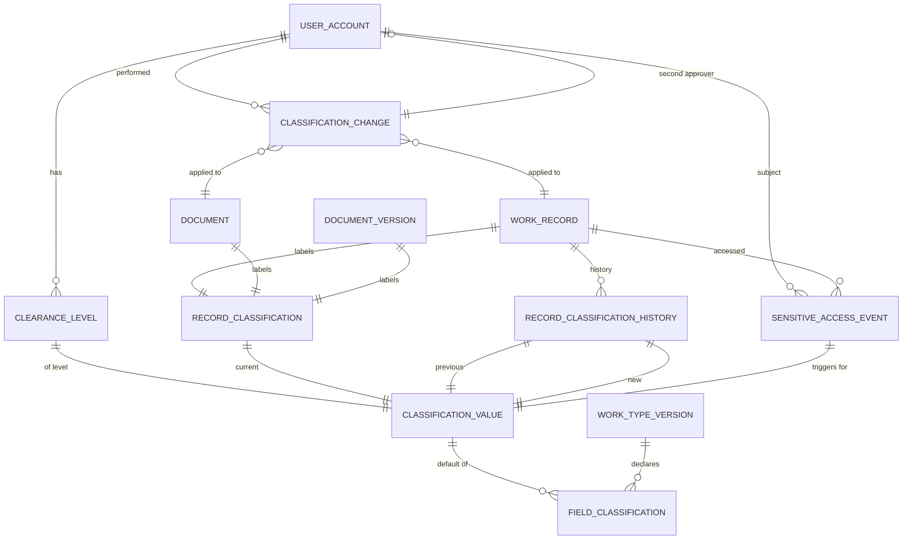

# Data Classification and Handling

> **Status note (planned vs. implemented).** The four classification values and the `SensitiveAccessEvent` audit threshold (recording begins at `confidential`) are implemented by `ClassificationLevel`. The `ClearanceLevel` table, `RecordClassification` history, classification raise/lower capabilities, double-approval workflow, per-field classification storage, and super-admin clearance controls are *planned/policy* targets and are not implemented as runtime mechanisms today. They are tracked in `.codex/plans/audit-data-security.md` as DRIFT-OPEN and are documented here as the target model with acceptance criteria.

## 1. Purpose

This document defines the four approved classification levels used in the platform, and the rules for handling them in viewing, downloading, sharing, exporting, and auditing, in addition to the rules for raising and lowering classification and granting clearance.

The access decision in `authorization-model.md` depends on classification, and any sensitive-content processing in the interface, reports, or search follows these rules.

## 2. The Four Levels

| Storage code | English name | Short description |
| `public` | Public | Content approved for publication within its defined scope |
| `internal` | Internal | Daily work content inside the cluster and facilities |
| `confidential` | Confidential | Content that only those with a work need and justification may see |
| `top_secret` | Top Secret | High-impact sensitive content, subject to double controls |

These four values are the only ones valid for storage or exchange.

### 2.1 Criteria for Determining the Level

- **Public:** Information published for everyone, such as user guides and cluster policies approved for publication.
- **Internal:** Regular administrative work information, such as internal requests, tasks, and general operational decisions.
- **Confidential:** Information that exposes detailed financial data, audit results, sensitive administrative decisions, or non-routine personal data.
- **Top Secret:** Information that affects business continuity, reputation, or security, or highly sensitive personal data, or strategic and financial secrets and contractual relationships.

### 2.2 Default Classification

- A new work type is assigned a default classification in `WorkTypeVersion`.
- An uploaded document is assigned a default classification in `Document` or `DocumentVersion`.
- The default classification is not less than `internal` for any work record or document.
- Only the super admin may lower the default classification, and only with documented justification.

## 3. Clearance

> **Status.** `ClearanceLevel` is a planned/policy table. It is not present in the verified migrations. The rules below describe the target model.

### 3.1 Clearance Levels

| Classification code | Level | Grants default read access to |
|---|---|---|
| `public` | Public | Public |
| `internal` | Internal | Public, Internal |
| `confidential` | Confidential | Public, Internal, Confidential |
| `top_secret` | Top Secret | All levels |

### 3.2 Granting Clearance

- The super admin grants clearance through `ClearanceLevel` with a mandatory justification.
- Granting `top_secret` and `confidential` is time-bound and periodically reviewed.
- Expiration automatically revokes the clearance and is recorded in the audit log.
- A user MUST NOT modify their own classification or clearance.

## 4. Handling Rules per Level

These rules are constraints owned and enforced by Authorization policies; no owner module or interface issues `allow`/`deny` decisions or field decisions.

### 4.1 Public

- Requires no clearance higher than `public`, but is still subject to account status, capability, scope, record status, and the Authorization decision.
- Appears in search and aggregated results only after the Authorization decision for the record and its fields.
- Views are NOT recorded in `SensitiveAccessEvent`.
- May be shared with parties outside the platform through approved channels.

### 4.2 Internal

- Authorization permits display to users inside the same entity or under a supervision relationship whose policy verifies it.
- Authorization issues `deny` for those without a valid scope or relationship.
- Routine views are NOT recorded in `SensitiveAccessEvent`.
- Download and export are subject to the access decision and appear in the activity log.

### 4.3 Confidential

- Does not appear in general search results or in default lists.
- Requires at least `confidential` clearance; explicit sharing does not exceed the clearance requirement.
- Every view of sensitive content classified `confidential` is recorded in `SensitiveAccessEvent`.
- Download and export require a separate `export` decision and are recorded in the audit log.
- Printing requires a separate policy and is recorded in the audit log when activated.
- Documents classified `confidential` are NOT indexed by their sensitive text in the search engine.

### 4.4 Top Secret

- Does not appear in lists or aggregated results.
- Requires `top_secret` clearance and an Authorization decision; explicit sharing is not accepted to raise clearance.
- Every view, download, export, or print is recorded in `SensitiveAccessEvent` with IP and device details.
- The super admin may view with mandatory recording and notification to the security officer.
- A user may request to view under a `break_glass` principle following a separate procedure.
- Documents classified `top_secret` are NOT indexed by their text or their visible titles in search.

## 5. Changing Classification

> **Status.** Raise/lower capabilities, `RecordClassification` history, and double approval are planned/policy and are not implemented as runtime mechanisms today.

### 5.1 Raising Classification

- Requires a single user with `classification.raise` on the record or work type.
- The change is recorded in `RecordClassification` and the previous classification is preserved.
- Exceeding the highest classification set in the work-type policy is prohibited.
- The record owner and anyone who had the previous classification's read right are notified.

### 5.2 Lowering Classification — Mandatory Double Approval

Lowering classification requires all of the following conditions together:

1. At least two distinct users holding `classification.lower` on the record or work type.
2. Neither of them may be the original creator of the record.
3. Neither of them may be the current owner of the record's owning entity.
4. A mandatory justification is recorded for every change.
5. Both the previous and new classification are preserved in `RecordClassification`.
6. The record owner and users who lost read access because of the lowering are notified.
7. Lowering to `public` or `internal` on a record containing non-routine personal data is prohibited without documented written approval.

### 5.3 Classification Change Log

`RecordClassification` is preserved for every change with:

- Change type: `initial`, `raise`, `lower`.
- Previous and current classification.
- The executor and the second approver on lowering.
- Timestamp and justification.
- Effect of the change on the affected user list (without names).

## 6. Relationship Between Classification and Record Fields

- The classification of a record may differ from the classification of a field inside it.
- `field_policies` in `WorkTypeVersion` define the classification of every field.
- The `FieldDecision` uses the clearance and the highest classification for the field.
- A field policy on an existing record may only be modified by publishing a new version of the work type.

## 7. Default Fields and Their Classification

| Field | Default classification |
|---|---|
| `Person.national_id` | `top_secret` |
| `Person.date_of_birth` | `confidential` |
| `Person.primary_email` | `confidential` |
| `Person.primary_phone` | `confidential` |
| `WorkRecord.payload.budget_amount` | `confidential` |
| `WorkRecord.payload.personal_health_data` | `top_secret` |
| `WorkRecord.payload.contract_value` | `confidential` |
| `WorkRecord.payload.public_summary` | `public` |
| `IndicatorMeasurement.value` | `internal` |
| `IndicatorMeasurement.evidence_url` | `confidential` |
| `Document.body` | Follows the document classification |
| `DocumentAccessEvent` | `confidential` |

## 8. Display, Search, and Reporting Rules

- The interface hides every `hide` field without exception.
- The interface shows `read` and `edit` only on a successful access decision for the field.
- Search does not display a title for a forbidden record, nor a snippet from a field classified `confidential` or `top_secret`.
- `confidential` fields are NOT included in aggregated results except through an independently granted capability.
- Export is subject to a separate decision and a hash of the fields is attached to every export batch.

## 9. Document Rules

- A document carries a classification independent of the linked record, and the stricter rules apply.
- Publishing a new version does NOT change the document classification without an explicit change.
- Lowering a document classification is subject to Section 5.2.
- A document classified `confidential` or `top_secret` is stored encrypted at the object level with a separate key.

## 10. ERD for Classification and Clearance

> The entities `RECORD_CLASSIFICATION_HISTORY`, `CLEARANCE_LEVEL`, `CLASSIFICATION_CHANGE`, and `FIELD_CLASSIFICATION` are part of the planned logical model and are not implemented in the verified schema.

## 11. Reference Scenarios

### 11.1 Raising Classification After Adding Sensitive Information

1. The user adds financial data to a request.
2. The system requests raising the classification to `confidential` automatically per policy.
3. Approval by a user with `classification.raise` for the record is required.
4. The change is recorded and the creator and owner are notified.

### 11.2 Lowering Classification With Double Approval

1. User A requests lowering the classification of a document from `confidential` to `internal`.
2. Authorization issues a `deny` decision because user A is the creator.
3. User B, who is not the creator, requests lowering with `classification.lower`.
4. User C, with `classification.lower` and from outside the owning entity, approves.
5. The change is recorded and the affected parties are notified.

### 11.3 Attempt to Share `top_secret` Content

1. The user tries to share a document classified `top_secret` with another user.
2. Authorization issues a `deny` decision because the classification prohibits sharing to raise clearance.
3. The rejection is recorded in the audit log with the request details.

## 12. Implementation Notes

> The notes in this section describe the *target* implementation. Items that depend on planned tables are marked accordingly.

- Unique index on `RecordClassification.(record_type, record_id, current)` to guarantee a single effective classification. *(Planned — table not present.)*
- Full history in `RecordClassificationHistory` with a no-retroactive-modification policy. *(Planned — table not present.)*
- CI tests reject any `WorkTypeVersion` publication with a field that has no classification.
- `ClearanceLevel` changes are subject to immediate notification to the user and the super admin. *(Planned — table not present.)*
- Field classification is stored in `FieldClassification` and is loaded with `WorkTypeVersion`. *(Planned — table not present.)*
- Hiding a `top_secret` field in the interface only is not allowed; the decision happens server-side and is recorded.

## 13. Audit Controls Related to Classification

| Action | Minimum classification for recording |
|---|---|
| Field read | `confidential` |
| Document download | `confidential` |
| Record export | `confidential` |
| Content print | `confidential` |
| Classification change | All changes |
| Open sharing | `confidential` |
| Cancel sharing | `confidential` |
| Raise/lower classification | All changes |
| View `top_secret` content | `top_secret` |

## Change Log

| Version | Date | Role | Change |
|---|---|---|---|
| 0.1.0 | 2026-07-15 | Information Security Officer | Initial executive draft |
| 0.2.0 | 2026-07-15 | Information Security Officer | Unify the classification codes to `public`, `internal`, `confidential`, and `top_secret`, and apply document discipline |