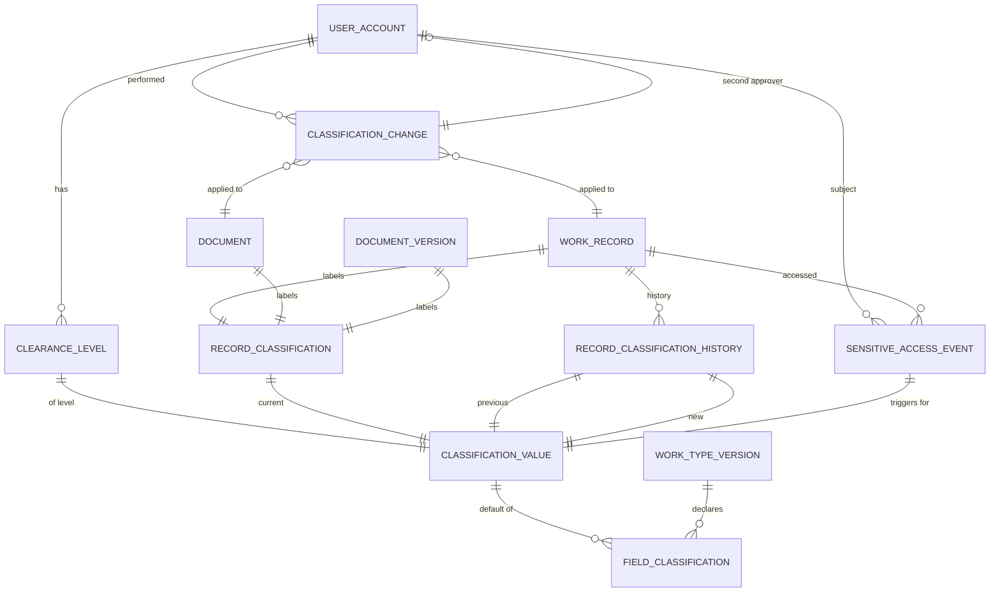

# تصنيف البيانات والتعامل معها

## 1. الهدف

تحدد هذه الوثيقة مستويات التصنيف الأربعة المعتمدة في المنصة، وقواعد التعامل معها في العرض والتنزيل والمشاركة والتصدير والتدقيق، إضافة إلى قواعد رفع وخفض التصنيف ومنح التصريح.

يعتمد قرار الوصول في `authorization-model.md` على التصنيف، وأي معالجة محتوى حساس في الواجهة أو التقارير أو البحث تلتزم بهذه القواعد.

## 2. المستويات الأربعة

| رمز التخزين | الاسم بالعربية | الاسم بالإنجليزية | الوصف الموجز |
|---|---|---|---|
| `public` | عام | Public | محتوى معتمد للنشر ضمن نطاقه المحدد |
| `internal` | داخلي | Internal | محتوى العمل اليومي داخل التجمع والمنشآت |
| `confidential` | سري | Confidential | محتوى لا يطلع عليه إلا من له حاجة عمل ومبرر |
| `top_secret` | سري للغاية | Top Secret | محتوى حساس عالي الأثر، يخضع لإجراءات مزدوجة |

هذه القيم الأربع وحدها صالحة للتخزين أو التبادل؛ أسماء العرض العربية لا تستخدم كرموز تقنية.

### 2.1 معايير تحديد المستوى

- **عام:** معلومات منشورة للجميع مثل دليل الاستخدام وسياسات التجمع المعتمدة للنشر.
- **داخلي:** معلومات العمل الإداري المعتاد مثل طلبات داخلية ومهام وقرارات تشغيلية عامة.
- **سري:** معلومات تكشف بيانات مالية مفصلة أو نتائج تدقيق أو قرارات إدارية حساسة أو بيانات شخصية غير روتينية.
- **سري للغاية:** معلومات تؤثر في استمرار العمل أو السمعة أو الأمن، أو بيانات شخصية عالية الحساسية، أو أسرار استراتيجية ومالية وعلاقات تعاقدية.

### 2.2 التصنيف الافتراضي

- نوع العمل الجديد يحدد له تصنيف افتراضي في `WorkTypeVersion`.
- الوثيقة المرفوعة تحدد لها تصنيف افتراضي في `Document` أو `DocumentVersion`.
- التصنيف الافتراضي لا يقل عن `internal` (داخلي) لأي سجل أعمال أو مستند.
- السوبر أدمن وحده يخفض التصنيف الافتراضي، ولا يخفض دون معطيات.

## 3. التصريح (Clearance)

### 3.1 مستويات التصريح

| رمز التصنيف | المستوى | يمنح قراءة افتراضية لـ |
|---|---|---|
| `public` | عام | عام |
| `internal` | داخلي | عام، داخلي |
| `confidential` | سري | عام، داخلي، سري |
| `top_secret` | سري للغاية | جميع المستويات |

### 3.2 منح التصريح

- السوبر أدمن يمنح التصريح عبر `ClearanceLevel` مع مبرر إلزامي.
- يخضع منح `top_secret` و`confidential` لمدة محددة ومراجعة دورية.
- انتهاء الصلاحية يُلغي التصريح تلقائياً ويُسجل في التدقيق.
- لا يحق للمستخدم تعديل تصنيفه أو تصريحه بنفسه.

## 4. قواعد التعامل لكل مستوى

هذه القواعد قيود تملكها وتطبقها سياسات Authorization؛ ولا يصدر أي موديول مالك أو واجهة قرار `allow` أو `deny` أو قرار حقل.

### 4.1 عام

- لا يتطلب تصريحاً أعلى من `public`، لكنه يبقى خاضعاً لحالة الحساب والقدرة والنطاق وحالة السجل وقرار Authorization.
- يظهر في البحث والنتائج المجمعة فقط بعد قرار Authorization للسجل والحقول.
- لا يُسجل الاطلاع في `SensitiveAccessEvent`.
- يجوز مشاركته مع جهات خارج المنصة عبر القنوات المعتمدة.

### 4.2 داخلي

- يسمح Authorization بعرضه للمستخدمين داخل نفس الجهة أو في علاقة إشراف تحقق سياسته.
- يصدر Authorization `deny` لمن ليس له نطاق أو علاقة صالحة.
- لا يُسجل الاطلاع الروتيني في `SensitiveAccessEvent`.
- التنزيل والتصدير يخضعان لقرار الوصول ويظهران في سجل النشاط.

### 4.3 سري

- لا يظهر في نتائج البحث العامة، ولا في القوائم الافتراضية.
- يحتاج تصريح `confidential` على الأقل؛ المشاركة الصريحة لا تتجاوز متطلب التصريح.
- كل قراءة محتوى حساس مصنف `confidential` (سري) تُسجل في `SensitiveAccessEvent`.
- التنزيل والتصدير يحتاجان قرار `export` منفصل ويُسجلان في التدقيق.
- الطباعة تحتاج سياسة منفصلة وتُسجل في التدقيق عند التفعيل.
- المستندات المصنفة `confidential` لا تُفهرس نصوصها الحساسة في محرك البحث.

### 4.4 سري للغاية

- لا يظهر في القوائم ولا في النتائج المجمعة.
- يحتاج تصريح `top_secret` وقرار Authorization، ولا تُقبل المشاركة الصريحة لرفع التصريح.
- كل قراءة أو تنزيل أو تصدير أو طباعة تسجل في `SensitiveAccessEvent` مع تفاصيل IP والجهاز.
- يحق للسوبر أدمن الاطلاع مع تسجيل إلزامي وإشعار لمسؤول الأمن.
- يحق للمستخدم طلب الاطلاع تحت مبدأ `break_glass` وفق إجراء منفصل.
- المستندات المصنفة `top_secret` لا تُفهرس نصوصها ولا عناوينها الظاهرة في البحث.

## 5. تغيير التصنيف

### 5.1 رفع التصنيف

- يحتاج مستخدم واحد بصلاحية `classification.raise` على السجل أو نوع العمل.
- يُسجل التغيير في `RecordClassification` ويحفظ التصنيف السابق.
- يُمنع تجاوز التصنيف الأعلى المحدد في سياسة نوع العمل.
- يُخطر مالك السجل ومن لديه حق قراءة التصنيف السابق.

### 5.2 خفض التصنيف (Lowering) — موافقة مزدوجة إلزامية

يتطلب خفض التصنيف الشروط التالية مجتمعة:

1. مستخدمان مختلفان على الأقل يحملان صلاحية `classification.lower` على السجل أو نوع العمل.
2. لا يحق لأي منهما أن يكون المنشئ الأصلي للسجل.
3. لا يحق لأي منهما أن يكون المالك الحالي للجهة المالكة للسجل.
4. يُسجل المبرر الإلزامي في كل تغيير.
5. يُحفظ التصنيفان السابق والجديد في `RecordClassification`.
6. يُخطر مالك السجل والمستخدمون الذين خسروا حق القراءة بسبب الخفض.
7. يُمنع الخفض إلى `public` أو `internal` على سجل يحوي بيانات شخصية غير روتينية دون موافقة خطية موثقة.

### 5.3 سجل تغيير التصنيف

يُحفظ `RecordClassification` لكل تغيير مع:

- نوع التغيير: `initial`, `raise`, `lower`.
- التصنيف السابق والحالي.
- المنفذ والمعتمد الثاني عند الخفض.
- الزمن والمبرر.
- أثر التغيير على قائمة المستخدمين المتأثرين (دون أسماء).

## 6. علاقة التصنيف بحقول السجل

- يمكن أن يكون تصنيف السجل مختلفاً عن تصنيف حقل فيه.
- `field_policies` في `WorkTypeVersion` تحدد تصنيف كل حقل.
- قرار `FieldDecision` يستخدم التصريح والتصنيف الأعلى للحقل.
- لا يجوز تعديل سياسة حقل في سجل قائم إلا بنشر إصدار جديد من نوع العمل.

## 7. الحقول الافتراضية وتصنيفها

| الحقل | التصنيف الافتراضي |
|---|---|
| `Person.national_id` | `top_secret` |
| `Person.date_of_birth` | `confidential` |
| `Person.primary_email` | `confidential` |
| `Person.primary_phone` | `confidential` |
| `WorkRecord.payload.budget_amount` | `confidential` |
| `WorkRecord.payload.personal_health_data` | `top_secret` |
| `WorkRecord.payload.contract_value` | `confidential` |
| `WorkRecord.payload.public_summary` | `public` |
| `IndicatorMeasurement.value` | `internal` |
| `IndicatorMeasurement.evidence_url` | `confidential` |
| `Document.body` | يتبع تصنيف المستند |
| `DocumentAccessEvent` | `confidential` |

## 8. قواعد العرض والبحث والتقارير

- تُخفي الواجهة أي حقل `hide` دون استثناء.
- تُظهر الواجهة `read` و`edit` فقط عند نجاح قرار الوصول للحقل.
- لا يعرض البحث عنواناً لسجل محظور، ولا مقتطفاً من حقل مصنف `confidential` أو `top_secret`.
- لا تُضمَّن حقول `confidential` في النتائج المجمعة إلا بقدرة مستقلة ممنوحة.
- التصدير يخضع لقرار منفصل ويُلحق بكل دفعة تصدير تجزئة الحقول.

## 9. قواعد المستندات

- المستند يحمل تصنيفاً مستقلاً عن السجل المرتبط، ويطبق أشد القيود.
- رفع إصدار جديد لا يغير تصنيف المستند دون تغيير صريح.
- تخفيض تصنيف المستند يخضع للقسم 5.2.
- المستند المصنف `confidential` أو `top_secret` يُخزن مشفراً على مستوى الكائن بمفتاح منفصل.

## 10. مخطط ERD للتصنيف والتصريح

## 11. سيناريوهات مرجعية

### 11.1 رفع تصنيف بعد إضافة معلومات حساسة

1. يضيف المستخدم بيانات مالية إلى طلب.
2. يطلب النظام رفع التصنيف إلى `confidential` (سري) تلقائياً بحسب السياسة.
3. يحتاج موافقة مستخدم بصلاحية `classification.raise` للسجل.
4. يُسجل التغيير ويُخطر المنشئ والمالك.

### 11.2 خفض تصنيف مع موافقة مزدوجة

1. يطلب المستخدم A خفض تصنيف وثيقة من `confidential` (سري) إلى `internal` (داخلي).
2. يصدر Authorization قرار `deny` لأن المستخدم A هو المنشئ.
3. يطلب المستخدم B غير المنشئ بصلاحية `classification.lower` الخفض.
4. يوافق المستخدم C بصلاحية `classification.lower` ومن خارج الجهة المالكة.
5. يُسجل التغيير وتُخطر الأطراف المتأثرة.

### 11.3 محاولة مشاركة محتوى `top_secret` (سري للغاية)

1. يحاول المستخدم مشاركة مستند مصنف `top_secret` مع مستخدم آخر.
2. يصدر Authorization قرار `deny` لأن التصنيف يمنع المشاركة لرفع التصريح.
3. يُسجل الرفض في التدقيق مع تفاصيل الطلب.

## 12. ملاحظات تنفيذية

- فهرس فريد على `RecordClassification.(record_type, record_id, current)` لضمان تصنيف واحد فعال.
- تخزين تاريخي كامل في `RecordClassificationHistory` مع سياسة عدم تعديل بأثر رجعي.
- اختبارات CI ترفض أي نشر `WorkTypeVersion` بحقل دون تصنيف.
- تغييرات `ClearanceLevel` تخضع لإشعار فوري للمستخدم والسوبر أدمن.
- تصنيف الحقول يُخزن في `FieldClassification` ويُحمل مع `WorkTypeVersion`.
- لا يُسمح بإخفاء حقل `top_secret` في الواجهة فقط؛ القرار يحدث في الخلفية ويُسجل.

## 13. ضوابط التدقيق المرتبطة بالتصنيف

| الفعل | التصنيف الأدنى للتسجيل |
|---|---|
| قراءة حقل | `confidential` |
| تنزيل مستند | `confidential` |
| تصدير سجل | `confidential` |
| طباعة محتوى | `confidential` |
| تغيير تصنيف | جميع التغييرات |
| فتح المشاركة | `confidential` |
| إلغاء مشاركة | `confidential` |
| رفع/خفض تصنيف | جميع التغييرات |
| عرض محتوى `top_secret` | `top_secret` |

## سجل التغيير

| الإصدار | التاريخ | الدور | التغيير |
|---|---|---|---|
| 0.1.0 | 2026-07-15 | مسؤول أمن المعلومات | إنشاء المسودة التنفيذية |
| 0.2.0 | 2026-07-15 | مسؤول أمن المعلومات | توحيد رموز التصنيف إلى `public` و`internal` و`confidential` و`top_secret` وتطبيق ضبط الوثيقة |
