# Logical Data Model

## 1. Purpose

This document defines the enterprise data shape at the logical level, consolidating in one diagram:

- Core identity and employment-relationship entities.
- Organizational entities and supervisory relationships.
- Business entities and shared platform capabilities.
- Cross-cutting and polymorphic relationships linking records together.
- Classification, retention, and ownership fields on which the access decision depends.

The document prevents data duplication between modules, assigns one owner per piece of information, and determines which joins are allowed and which contracts must be traversed.

## 2. Principles

- One owner per actual piece of information. Other modules reference it by identifiers or consume events.
- Dynamic entities (such as work types) use a stable relational envelope plus a payload bound to the published definition version.
- No ad-hoc joins between business modules; traversal goes through contracts or Read Models.
- Every record carries the owning entity, organizational unit, classification, status, and definition version.
- The only classification values are `public`, `internal`, `confidential`, `top_secret`.
- Version numbers are stored on live records to prevent silent modification.
- Every `UUID` type in the tables below means RFC 9562 UUIDv7 in lowercase, not a generic or database-generated UUID.
- Core employee PII is stored within the Organization module that owns the Person. Identity retains only the `person_id` reference and a limited display projection.

## 3. Overall ERD

```mermaid
erDiagram
    PERSON ||--o| USER_ACCOUNT : "has 0..1"
    PERSON ||--o{ EMPLOYMENT : "has many"
    EMPLOYMENT ||--o{ POSITION_ASSIGNMENT : "history of"
    EMPLOYMENT }o--|| ORG_UNIT : "in"
    POSITION_ASSIGNMENT }o--|| POSITION : "fills"
    PERSON ||--o{ TEMPORARY_ASSIGNMENT : "covers"
    TEMPORARY_ASSIGNMENT }o--|| ORG_UNIT : "at"
    TEMPORARY_ASSIGNMENT }o--|| POSITION : "as"
    PERSON ||--o{ COMMITTEE_MEMBERSHIP : "serves in"
    ORG_UNIT ||--o{ COMMITTEE_MEMBERSHIP : "committee membership"

    USER_ACCOUNT ||--o{ CREDENTIAL : "authenticates by"
    USER_ACCOUNT ||--o{ SESSION : "opens"
    USER_ACCOUNT ||--o{ ACCOUNT_RECOVERY_CASE : "recovers via"
    USER_ACCOUNT ||--o{ BREAK_GLASS_GRANT : "may activate"

    USER_ACCOUNT ||--o{ ROLE_ASSIGNMENT : "holds"
    ROLE ||--o{ ROLE_ASSIGNMENT : "granted by"
    USER_ACCOUNT ||--o{ DELEGATION : "delegates to"
    USER_ACCOUNT ||--o{ DELEGATION : "receives"
    ORG_UNIT ||--o{ SUPERVISORY_RELATIONSHIP : "source of"
    ORG_UNIT ||--o{ SUPERVISORY_RELATIONSHIP : "target of"
    SUPERVISORY_RELATIONSHIP ||--o{ RELATIONSHIP_AUTHORITY_FACT : "describes"

    ORG_UNIT ||--o{ ORG_UNIT : "parent of"
    ORG_UNIT }o--|| ORG_UNIT_TYPE : "typed as"

    WORK_TYPE_DEFINITION ||--o{ WORK_TYPE_VERSION : "versions"
    WORK_TYPE_VERSION ||--o{ FIELD_DEFINITION : "fields"
    WORK_TYPE_VERSION ||--o{ WORK_RECORD : "instance of"
    WORK_RECORD }o--|| ORG_UNIT : "owned by"
    WORK_RECORD }o--|| USER_ACCOUNT : "created by"
    WORK_RECORD ||--o{ WORK_PAYLOAD : "dynamic"
    WORK_RECORD ||--o{ WORK_RELATION : "links"
    WORK_RECORD ||--o{ FIELD_POLICY_FACT : "field facts"

    WORKFLOW_DEFINITION ||--o{ WORKFLOW_VERSION : "versions"
    WORKFLOW_VERSION ||--o{ WORKFLOW_NODE : "nodes"
    WORKFLOW_VERSION ||--o{ WORKFLOW_TRANSITION : "edges"
    WORKFLOW_VERSION ||--o{ WORKFLOW_INSTANCE : "runs"
    WORKFLOW_INSTANCE ||--o{ WORKFLOW_STEP : "steps"
    WORKFLOW_STEP ||--o{ WORKFLOW_DECISION : "decisions"

    TASK ||--o{ TASK_PARTICIPANT : "participants"
    TASK ||--o{ TASK_COMMENT : "comments"
    TASK_COMMENT ||--o{ TASK_MENTION : "mentions"
    TASK }o--o| WORK_RECORD : "may link"

    DOCUMENT ||--o{ DOCUMENT_VERSION : "versions"
    DOCUMENT ||--o{ DOCUMENT_LINK : "linked to"
    DOCUMENT_VERSION ||--o{ DOCUMENT_ACCESS_EVENT : "access"
    DOCUMENT ||--|| STORAGE_OBJECT : "stored as"
    STORAGE_OBJECT ||--|| QUARANTINE_RECORD : "scanned via"

    NOTIFICATION ||--o{ NOTIFICATION_RECIPIENT : "delivered to"
    NOTIFICATION ||--|| EVENT_OUTBOX : "sourced from"

    INDEX_ENTRY }o--|| WORK_RECORD : "indexes"

    REPORT_DEFINITION ||--o{ REPORT_RUN : "executes"
    REPORT_RUN ||--o{ REPORT_RESULT : "produces"

    AUDIT_EVENT ||--o{ AUDIT_HASH_LINK : "chains"
    AUDIT_EXPORT_BATCH ||--o{ AUDIT_EVENT : "bundles"

    STRATEGIC_PLAN ||--o{ STRATEGIC_AXIS : "axes"
    STRATEGIC_AXIS ||--o{ STRATEGIC_OBJECTIVE : "objectives"
    STRATEGIC_OBJECTIVE ||--o{ STRATEGIC_INITIATIVE : "initiatives"
    STRATEGIC_OBJECTIVE ||--o{ INDICATOR : "measured by"
    INDICATOR ||--o{ INDICATOR_TARGET : "targets"
    INDICATOR ||--o{ INDICATOR_MEASUREMENT : "measurements"
    INDICATOR_MEASUREMENT }o--|| ORG_UNIT : "scoped to"

    PORTFOLIO ||--o{ PROGRAM : "programs"
    PROGRAM ||--o{ PROJECT : "projects"
    PROJECT_TEMPLATE ||--o{ PROJECT : "instantiates"
    PROJECT ||--o{ PROJECT_PHASE : "phases"
    PROJECT_PHASE ||--o{ PROJECT_MILESTONE : "milestones"
    PROJECT ||--o{ PROJECT_BUDGET_SNAPSHOT : "budgets"
    PROJECT ||--o{ PROJECT_HEALTH_SNAPSHOT : "health"
    PROJECT }o--o{ INDICATOR : "contributes to"

    RISK_REGISTER ||--o{ RISK : "records"
    RISK }o--|| ORG_UNIT : "owned by"
    RISK ||--o{ RISK_TREATMENT_TASK : "treats via"
    RISK_TREATMENT_TASK }o--|| TASK : "implemented by"

    USER_ACCOUNT ||--o{ ACCESS_CONTEXT : "subject of"
    ACCESS_CONTEXT ||--|| ACCESS_DECISION : "resolves to"
    ACCESS_CONTEXT }o--|| RECORD_FACTS : "targets"
    ACCESS_DECISION ||--o{ ACCESS_DECISION_REASON : "explains"
    ACCESS_DECISION ||--o{ FIELD_DECISION : "field-level"
    WORK_RECORD ||--o{ FIELD_DECISION : "applies to"
    CLEARANCE_LEVEL ||--o{ USER_ACCOUNT : "granted to"
    RECORD_CLASSIFICATION ||--o{ WORK_RECORD : "labels"
    EXPLICIT_DENY ||--o{ USER_ACCOUNT : "applies to"
    EXPLICIT_DENY }o--o| WORK_TYPE_DEFINITION : "scoped to type"
```

> **Planned module (Audit) — not implemented.** The `AUDIT_EVENT`, `AUDIT_HASH_LINK`, and `AUDIT_EXPORT_BATCH` entities shown above are planned and are not present as migrations. Only `access_decisions`, `sensitive_access_events`, and document access events persistence exists today. The audit-related references in the rest of this diagram (e.g. `AUDIT_EVENT` as the target of `RECORD_CLASSIFICATION` consumption and any read paths implied by other entities) are likewise planned.

## 4. Identity and Organizational-Fact Entities

### 4.1 Person

The real person whose operational account the system links to their legal rights.

| Field | Type | Constraint | Description |
|---|---|---|---|
| id | UUID | PK | Stable identifier that does not expose sequence |
| national_id | string | Encrypted, unique | National identity or equivalent |
| full_name_ar | string | Required | Name in Arabic |
| full_name_en | string | Optional | Name in English |
| date_of_birth | date | Encrypted | Date of birth |
| gender | enum | Optional | Gender |
| primary_email | string | Optional, encrypted | Primary contact email |
| primary_phone | string | Optional, encrypted | Primary phone |
| status | enum | Required | active, suspended, left |
| created_at | timestamp | Required | Creation timestamp |
| updated_at | timestamp | Required | Last update timestamp |

Rules:

- `Person` is separated from `UserAccount` to allow creating a record for a person who has not yet obtained an account.
- Sensitive personal fields are stored encrypted at the column level and fall under the "top secret" policy.
- Employees may not modify national-identity fields after approval.

### 4.2 UserAccount

The operational account the user uses to sign in and interact with the platform.

| Field | Type | Constraint | Description |
|---|---|---|---|
| id | UUID | PK | Account identifier |
| person_id | UUID | Optional external reference, no FK | Person owned by Organization |
| person_version | bigint | Optional | Latest reference version verified or applied atomically |
| username | string | Unique, immutable | Sign-in name |
| account_type | enum | Required | individual, break_glass, service |
| status | enum | Required | pending, active, locked, disabled, archived |
| must_change_password | boolean | Required | Forces password change |
| password_changed_at | timestamp | Optional | Last change |
| password_expires_at | timestamp | Optional | Password expiration |
| failed_attempts | int | Default 0 | Consecutive failed attempts |
| locked_until | timestamp | Optional | Lock expiry timestamp |
| last_login_at | timestamp | Optional | Last successful sign-in |
| last_login_ip | string | Optional | Last internal IP |
| created_at, updated_at | timestamp | Required | Creation and update timestamps |
| disabled_reason | enum | Optional | voluntarily, security, hr, other |

Rules:

- At most one active account per Person, enforced by Identity without a cross-module unique FK. Service accounts and break-glass are not linked to a Person.
- Disabling an account terminates all its sessions immediately and revokes all active delegations.
- `break_glass` accounts are subject to special procedures and are not used for daily work.

### 4.3 Employment

A person's formal association with the entity they officially belong to. `Organization` owns both Employment and Person.

| Field | Type | Constraint | Description |
|---|---|---|---|
| id | UUID | PK | Association identifier |
| person_id | UUID | FK | Person |
| organization_unit_id | UUID | FK | Entity |
| employment_type | enum | Required | full_time, part_time, contract, secondment |
| start_date | date | Required | Association start |
| end_date | date | Optional | Association end |
| status | enum | Required | active, suspended, ended |
| source_system | string | Optional | Source system such as "HR" |
| created_at, updated_at | timestamp | Required | Creation and update timestamps |

Rules:

- A person may have multiple historical `Employment` records, but only one active at a given moment for a given entity.
- Ending an `Employment` automatically cancels the primary position, assignments, and active memberships associated with it per policy.

### 4.4 PositionAssignment

The official position an employee holds in a specific unit, owned by `Organization`.

| Field | Type | Constraint | Description |
|---|---|---|---|
| id | UUID | PK | Assignment identifier |
| employment_id | UUID | FK | Employment link |
| position_id | UUID | FK | Position |
| assignment_scope | enum | Required | primary, acting, additional |
| start_date | date | Required | Assignment start |
| end_date | date | Optional | Assignment end |
| status | enum | Required | active, paused, ended |
| created_at, updated_at | timestamp | Required | Creation and update timestamps |

Rules:

- One active primary assignment per `Employment`.
- Additional assignments may be multiple but only one active at the same time for the same position.
- `PositionAssignment` together with `Employment` identifies the entity, unit, and position to be resolved when a manager or approver is needed.

### 4.5 TemporaryAssignment

A temporary assignment to a role in another unit for a defined period. Owned by `Organization` and presented as time-bound facts to Authorization without an access decision.

| Field | Type | Constraint | Description |
|---|---|---|---|
| id | UUID | PK | Temporary assignment identifier |
| person_id | UUID | FK | Person |
| organization_unit_id | UUID | FK | Hosting unit |
| position_id | UUID | FK | Temporary position |
| authority_scope_tags | json | Required | Facts on covered business scope |
| authority_profile_key | string | Optional | Authority facts key interpreted by Authorization per its policy |
| start_at | datetime | Required | Start timestamp |
| end_at | datetime | Required | End timestamp |
| status | enum | Required | scheduled, active, expired, revoked |
| approved_by_user_id | UUID | FK | Assignment approver |
| justification | text | Required | Administrative justification |
| created_at, updated_at | timestamp | Required | Timestamps |

Rules:

- The assignment ends automatically at `end_at`, and its facts no longer apply in the Authorization decision.
- A temporary assignment does not replace or cancel the primary assignment.
- Consumers may only read active assignments.

### 4.6 CommitteeMembership

A user's membership in a committee, team, or council. Owned by `Organization` and exposed only as a time-bound relationship fact.

| Field | Type | Constraint | Description |
|---|---|---|---|
| id | UUID | PK | Membership identifier |
| committee_id | UUID | FK | Committee |
| person_id | UUID | FK | Person |
| role | enum | Required | chair, secretary, member, observer |
| start_at | date | Required | Membership start |
| end_at | date | Optional | Membership end |
| status | enum | Required | active, paused, ended |
| voting_weight | decimal | Optional | Committee voting weight |
| created_at, updated_at | timestamp | Required | Timestamps |

Rules:

- A person may be a member of multiple committees.
- Voting weight and the vote itself do not replace business permissions; Authorization interprets them via its central policy.
- Ending a membership automatically cancels related tasks and decisions per the owning module's rules.

## 5. Organizational Entities and Relationships

### 5.1 Organization, OrgUnit, and OrgUnitType

- `Organization` represents the third-party healthcare cluster at the top level.
- `OrgUnit` is a self-referencing recursive entity via `parent_id` to build a flexible tree of governed types.
- `OrgUnitType` governs the allowed types: cluster, facility, sector, administration, department, unit, committee.
- A committee `OrgUnit` is of type committee and is not an independent aggregate; Organization owns the committee and `Employment`, `PositionAssignment`, `TemporaryAssignment`, `CommitteeMembership`, and their time records.

### 5.2 Position

- Describes the position as a pattern of duties and authorities, not as a person.
- Holds `authority_profile_key` as an organizational fact; Authorization owns the capabilities and field-access templates and interprets this key.
- A position is not linked to a person directly, but via `Employment` and `PositionAssignment`.

### 5.3 SupervisoryRelationship

- Defines a supervisory relationship between a source and a target via `relationship_type`: direct, functional, coordination, read_only, none.
- Carries `effective_from` and `effective_to` so it is counted only within the time window.
- Holds `RelationshipAuthorityFact` as tags, scope, and facts version. Organization issues no allow or deny; only Authorization interprets the facts and decides.

### 5.4 Role and RoleAssignment

- `Role` groups multiple `Capability` entries and defines the default scope.
- `RoleAssignment` links `UserAccount` to `Role` with an optional `OrgUnit` scope and time window.

### 5.5 Delegation

- Delegation of a specific capability from one user to another for a duration and specific `module_tags`.
- The action appears in the log as "executed by X on behalf of Y".
- Ends automatically at `end_at`.

## 6. Shared Platform Capability Entities

### 6.1 WorkDefinitions

- `WorkTypeDefinition` is the work-type identifier (name, description, default classification).
- `WorkTypeVersion` is an immutable published version containing:
  - `FieldDefinition` fields with types, validations, and access rules.
  - `ListViewDefinition` view columns and filters.
  - `FormLayout` form ordering.
  - `RelationDefinition` allowed relations.
- `WorkRecord` is the operational record:
  - `Envelope`: id, work_type_version_id, owner_organization_unit_id, created_by_user_id, status, classification, lock_version.
  - `WorkPayload` for dynamic fields bound to the version.
  - `WorkRelation` to link to other records.
  - `FieldPolicyFact` for the field-policy key, version, and descriptive constraints; Authorization owns the policy and the final decision.

### 6.2 Workflow

- `WorkflowDefinition` and `WorkflowVersion` with an immutable version.
- `WorkflowInstance` stores `workflow_version_id` at start time.
- `WorkflowStep` execution states, and `WorkflowDecision` approval decisions.
- With `workflow_step_id` the start and end timestamps and the user are stored.

### 6.3 Tasks

- `Task` carries `source_type` and `source_id` to re-validate visibility of the source.
- `TaskParticipant` supports owner, contributor, observer.
- `TaskComment` and `TaskMention` for comments and mentions.
- `TaskActivity` is a time record of functional events.

### 6.4 Documents

- `Document` is a logical entity.
- `DocumentVersion` is the actual versions with `checksum`, `size`, and `mime`.
- `StorageObject` is the physical storage inside the quarantine.
- `QuarantineRecord` is the scan result per version.
- `DocumentLink` links to other documents with records.
- `DocumentAccessEvent` is the download and view log.
- Document-specific access rules and its links are exposed only as `DocumentConstraintFacts`; Authorization applies the strictest constraint and issues `allow` or `deny` and the field decision.

### 6.5 Notifications

- `Notification` represents a single notification.
- `NotificationRecipient` is the link to the recipient and its status.
- Linked to `EventOutbox` for retries and deduplication.

### 6.6 Search

- `IndexEntry` is an indexer derived from `WorkRecord`.
- It does not store raw sensitive fields; it stores identifiers and fragments gated by index authorization.

### 6.7 Reporting

- `ReportDefinition` holds an approved query on Read Models.
- `ReportRun` is a single execution with status and result.
- `ReportResult` is the exportable output within field policies.

### 6.8 Audit

**Planned module (Audit) — not implemented.** The Audit module described here — `AuditEvent`, `AuditHashLink`, and `AuditExportBatch` — is planned and is not present in the implemented migrations. Only `access_decisions`, `sensitive_access_events`, and document access events persistence exists today.

- `AuditEvent` is an immutable event.
- `AuditHashLink` is the hash-chain link connecting events.
- `AuditExportBatch` is a daily signed, immutable bundle.

## 7. Business Entities

### 7.1 Strategy

- `StrategicPlan` contains axes, objectives, and initiatives.
- `StrategicAxis`, `StrategicObjective`, `StrategicInitiative`.
- `Indicator` carries `aggregation_formula`, `baseline`, and `owner_user_id`.
- `IndicatorTarget` distributes targets to entities.
- `IndicatorMeasurement` is a periodic reading with evidence.

### 7.2 PortfolioProjects

- `Portfolio` contains programs.
- `Program` contains projects.
- `Project` holds `template_id`, `owner_organization_unit_id`, and `criticality`.
- `ProjectPhase` and `ProjectMilestone`.
- `ProjectBudgetSnapshot` and `ProjectHealthSnapshot`.
- `ProjectIndicatorLink` links a project to an indicator with expected and actual impact.

### 7.3 Risk

- `RiskRegister` and `Risk` are linked to `OrgUnit`.
- `RiskTreatmentTask` uses `Task` for execution.
- `RiskControl` and `RiskIndicator`.

## 8. Mandatory Fields on Every Business Record

Every `WorkRecord` contains at least:

- `owner_organization_unit_id`
- `created_by_user_id`
- `current_responsible_user_id` (optional)
- `classification`
- `status`
- `work_type_version_id`
- `lock_version`
- `legal_hold` (boolean) — **planned retention/legal-hold subsystem; not present in the implemented WorkRecords/Documents schemas.**
- `retention_until` (timestamp) — **planned retention/legal-hold subsystem; not present in the implemented WorkRecords/Documents schemas.**

These fields are used in the access decision and in retention and audit policies.

## 9. Relationship and Join Rules

- Joins are only between tables of the same module.
- References to entities of other modules use a stable identifier such as `person_id`, `organization_unit_id`, or `work_record_id`.
- Any cross-module query traverses a Reporting Read Model or a specific contract.
- Search and Reporting are forbidden from writing to business tables.

## 10. Ownership Card

| Information | Owner | External Use |
|---|---|---|
| Person | Organization | Reference identifier and validation contract; do not copy PII |
| UserAccount | Identity | Account identifier |
| Employment | Organization | Employment-relationship facts via contract |
| PositionAssignment | Organization | Position facts via contract |
| TemporaryAssignment | Organization | Time-bound assignment facts via contract |
| CommitteeMembership | Organization | Time-bound membership facts via contract |
| OrgUnit | Organization | Identifier + contract |
| Position | Organization | Read contract |
| SupervisoryRelationship | Organization | Relationship facts to Authorization without decision |
| Role and RoleAssignment | Authorization | Permission decision |
| Delegation | Authorization | Permission decision |
| WorkTypeDefinition/Version | WorkDefinitions | Definition and version number |
| WorkflowDefinition/Version | Workflow | Definition and version number |
| WorkflowInstance | Workflow | Reference to business record |
| Task | Tasks | Source identifier and contract |
| Document | Documents | Identifier and links |
| Notification | Notifications | Identifier |
| AuditEvent | Audit | Not publicly readable — **Planned module (Audit) — not implemented.** |

## 11. Versioning and Silent-Modification Policy

- Live records store `work_type_version_id` and `workflow_version_id` and are not migrated silently.
- Publishing a new version does not change existing records; migration is optional and preceded by a compatibility check.
- Employees may not directly change `owner_organization_unit_id` or `work_type_version_id`.
- Modifying `classification` is subject to separately documented lowering and raising rules.

## 12. Time Windows

- All employment-relationship links carry `effective_from` and `effective_to` or `start_at` and `end_at`.
- The access decision resolves the user at request time and considers the time window in effect only.
- Expiry of an assignment or membership window automatically cancels the resulting capabilities.

## 13. Sensitive Identification Data and Its Protection

- Fields containing employee PII such as `national_id`, `date_of_birth`, `primary_email`, and `primary_phone` are stored encrypted at the column level using an internal KMS.
- Encryption keys rotate per the key-segregation policy.
- Any backup containing these fields is subject to separate encrypted-storage requirements.

## 14. Implementation Notes

- Migrations are versioned and subject to controlled up/down procedures in every environment.
- Large tables such as `audit_events` are partitioned by time — **planned partitioning; no `audit_events` table or partitioning exists in the implemented schemas.**
- Indexes are built on decision columns: `owner_organization_unit_id`, `classification`, `status`, `created_by_user_id`.
- No large JSON columns are created in tables queried in the traditional way.
- Version numbers are stored alongside operational records in dynamic business to avoid re-interpretation on every read.

## 15. Access-Decision Entities

These entities are separated from core entities to enable an explainable, auditable access decision. No business module owns their fields; only the Authorization module consumes them.

### 15.1 AccessContext

A frozen representation of every access-decision input at the moment of a single request. Stored for the audit period and not modified after issuance.

| Field | Type | Constraint | Description |
|---|---|---|---|
| id | UUID | PK | Context identifier |
| subject_user_account_id | UUID | External identifier, no FK | Request owner |
| subject_person_id | UUID | External identifier, no FK | Identifying version of the person |
| acting_as_user_account_id | UUID | Optional external identifier, no FK | Delegate account under delegation |
| delegation_id | UUID | FK, optional | Active delegation, if any |
| request_action | string | Required | Requested action such as view, edit, approve, export |
| request_resource_type | string | Required | Resource type such as work_record, document, task |
| request_resource_id | UUID | Optional | Target resource identifier |
| captured_at | timestamp | Required | Input capture timestamp |
| expires_at | timestamp | Required | Context expiry timestamp for reuse |
| session_id | UUID | Optional external identifier, no FK | Associated session |
| source_ip | string | Optional | Internal IP |
| correlation_id | UUID | Required | Linking identifier for multi-request flows |

Rules:

- The context is frozen at request reception and sealed with an internal signature to prevent tampering.
- No new information is added after issuance; any new request creates a new context.
- The audit module may read it; no business module may read it.

### 15.2 RecordFacts

The target record's facts on which the access decision depends. Collected in AccessContext and not read directly from the record during evaluation.

| Field | Type | Constraint | Description |
|---|---|---|---|
| id | UUID | PK | Identifier |
| access_context_id | UUID | FK | Owning context |
| record_type | string | Required | Record type |
| record_id | UUID | Required | Record identifier |
| owner_organization_unit_id | UUID | External identifier, no FK | Owning entity |
| classification | enum | Required | public, internal, confidential, top_secret |
| state | string | Required | Record state such as draft, submitted, completed |
| status | string | Required | Operational status |
| field_policy_key | string | Required | Policy key owned by Authorization |
| facts_version | string | Required | Owner's facts version |
| work_type_version_id | UUID | FK, optional | Definition version for dynamic types |
| workflow_version_id | UUID | FK, optional | Workflow version |
| legal_hold | boolean | Required | Legal-hold flag — **planned retention/legal-hold subsystem; the implemented WorkRecords/Documents schemas do not provide this field.** |
| created_by_user_account_id | UUID | External actor identifier, no FK | Creator |
| snapshot_at | timestamp | Required | Facts-freeze timestamp |

Rules:

- Facts are frozen in `AccessContext` to prevent evaluation against variable reads.
- Any modification to the record after context creation does not affect the decision; a new evaluation is required.
- Absence of any required fact means evaluation fails and access is denied.

### 15.3 GetAuthorizationRecordFacts

A read contract executed by the owning module to return `AuthorizationRecordFacts`. It includes the source identity, the organizational owner, classification, status, workflow step, legal hold, `field_policy_key`, `facts_version`, and `lock_version`. It does not take the actor identity or `AccessContext`, and does not return `allow` or `deny`, a guard, or a field map.

For documents, the contract adds `DocumentConstraintFacts`: `own_policy_key`, document status, classification, and active-link facts with source references and their constraint keys and versions. These are descriptive inputs only; Authorization applies the strictest constraint and owns the decision and field policy.

### 15.4 AccessDecision

The final result of the request. Not modified after issuance and stored in audit.

| Field | Type | Constraint | Description |
|---|---|---|---|
| id | UUID | PK | Identifier |
| access_context_id | UUID | FK, unique | Context |
| outcome | enum | Required | allow, deny |
| requested_action | string | Required | Requested action |
| allowed_fields | json | Optional | Allowed fields when permitted |
| denied_fields | json | Optional | Denied fields |
| decision_step_reached | enum | Required | The step that decided the outcome |
| decided_at | timestamp | Required | Decision timestamp |
| policy_version | string | Required | Decision-policy version |
| signature | string | Required | Internal signature against tampering |

Rules:

- Any error or uncertainty in any decision stage produces `deny`.
- Reusing the decision after `expires_at` of the `AccessContext` is not allowed.
- Any `allow` decision on a field classified `confidential` or `top_secret` requires logging a `SensitiveAccessEvent` in Audit — **Planned module (Audit) — not implemented for the broader audit subsystem; only `access_decisions` and `sensitive_access_events` are persisted today.**

### 15.5 AccessDecisionReason

Explanation of the decision, used to explain deny or allow to the user and in audit.

| Field | Type | Constraint | Description |
|---|---|---|---|
| id | UUID | PK | Identifier |
| access_decision_id | UUID | FK | Decision |
| step | enum | Required | Explained step |
| code | string | Required | Stable code such as DENY_BY_CLASSIFICATION |
| message_key | string | Required | Approved message key |
| message_params | json | Optional | Message parameters |
| severity | enum | Required | info, warn, block |

### 15.6 FieldDecision

A field-level decision associated with `AccessDecision`.

| Field | Type | Constraint | Description |
|---|---|---|---|
| id | UUID | PK | Identifier |
| access_decision_id | UUID | FK | Decision |
| field_path | string | Required | Field path such as payload.budget |
| decision | enum | Required | hide, read, edit |
| reason_code | string | Optional | Reason code |
| classification_at_field | enum | Optional | public, internal, confidential, top_secret |

### 15.7 ClearanceLevel

The clearance level granted to a user. Granted by super admin only.

**Planned module (Audit) — not implemented.** The `ClearanceLevel` table/entity described here is planned and has no corresponding migration. Only `access_decisions`, `sensitive_access_events`, and document access events persistence exists today.

| Field | Type | Constraint | Description |
|---|---|---|---|
| id | UUID | PK | Identifier |
| user_account_id | UUID | FK | Account |
| classification | enum | Required | public, internal, confidential, top_secret |
| granted_by_user_account_id | UUID | FK | Granter of the clearance |
| granted_at | timestamp | Required | Grant timestamp |
| expires_at | timestamp | Optional | Expiry |
| justification | text | Required | Grant justification |

Rules:

- The clearance level is the upper bound that the user can read by default.
- It does not replace explicit deny nor record classification.
- `top_secret` requires mandatory dual approval.

### 15.8 RecordClassification

The current classification value of the record. It holds the classification history for audit purposes.

**Planned module (Audit) — not implemented.** The `RecordClassification` table/entity described here is planned and has no corresponding migration. Only `access_decisions`, `sensitive_access_events`, and document access events persistence exists today.

| Field | Type | Constraint | Description |
|---|---|---|---|
| id | UUID | PK | Identifier |
| record_type | string | Required | Record type |
| record_id | UUID | Required | Record identifier |
| classification | enum | Required | public, internal, confidential, top_secret |
| previous_classification | enum | Optional | public, internal, confidential, top_secret |
| change_type | enum | Required | initial, raise, lower |
| changed_by_user_account_id | UUID | FK | Who performed the change |
| approved_by_user_account_id | UUID | FK, optional | Second approver for classification lowering |
| changed_at | timestamp | Required | Change timestamp |
| justification | text | Required | Change justification |

Rules:

- Lowering classification requires at least two different approvers.
- A single user is forbidden from lowering the classification of a record they created.
- The classification history is kept in full and is not retroactively altered.

### 15.9 ExplicitDeny

Explicit deny rules evaluated before clearance and classification. The `explicit_denies` table is implemented by the Authorization module.

| Field | Type | Constraint | Description |
|---|---|---|---|
| id | UUID | PK | Identifier |
| user_account_id | UUID | FK, optional | Target account |
| classification | enum | Optional | public, internal, confidential, top_secret |
| work_type_key | string | Optional | Specific work type |
| organization_unit_id | UUID | FK, optional | Organizational scope |
| resource_pattern | string | Optional | Resource pattern such as prefix or regex |
| reason | text | Required | Reason for denial |
| issued_by_user_account_id | UUID | FK | Deny issuer |
| issued_at | timestamp | Required | Issuance timestamp |
| expires_at | timestamp | Optional | Deny expiry |
| revocable | boolean | Required | Revocable later |

- Explicit deny is applied before clearance and overrides any allow.
- A user may not issue an explicit deny against themselves or a higher role.
- Audit retains every use of an explicit deny rule.

## 16. Quick Reference Card for Access Decision

| Entity | Producer | Consumer | Stored in |
|---|---|---|---|
| AccessContext | Authorization per request | Authorization, Audit — **Audit storage is planned (Audit) — not implemented.** | AccessContext table |
| RecordFacts | Authorization | Authorization | Embedded in AccessContext |
| AuthorizationRecordFacts | Owning module via `GetAuthorizationRecordFacts` | Authorization | Snapshot within AccessContext |
| AccessDecision | Authorization per request | Requesting module, Audit — **Audit storage is planned (Audit) — not implemented.** | AccessDecision table |
| AccessDecisionReason | Authorization | UI for display, Audit — **Audit storage is planned (Audit) — not implemented.** | AccessDecisionReason table |
| FieldDecision | Authorization | Requesting module | Embedded in AccessDecision |
| ClearanceLevel | Authorization | Authorization, Audit — **Planned module (Audit) — not implemented.** | ClearanceLevel table |
| RecordClassification | Authorization | Authorization, Audit — **Planned module (Audit) — not implemented.** | RecordClassification table |
| ExplicitDeny | Authorization | Authorization | `explicit_denies` table |

## 17. Implementation Notes for Access Decision

- Every read of `AccessDecision` must be accompanied by an `expires_at` check on the `AccessContext`.
- The decision may not be passed through the presentation layer; the UI consumes `allowed_fields` only.
- Primary indexes are on `AccessContext.subject_user_account_id`, `AccessContext.request_resource_id`, `AccessDecision.outcome`, and `AccessDecision.decided_at`.
- Time partitioning for `AccessDecision` and `AccessContext` tables after exceeding one year of volume.
- Modules are forbidden from storing a copy of the decision; it is fetched via the contract on every request.
- Any addition or modification to `GetAuthorizationRecordFacts` requires module-boundary tests and a deny-decision-fields test in CI.

## Change log

| Version | Date | Role | Change |
|---|---|---|---|
| 0.4.0 | 2026-07-18 | Chief Information Security Officer | Transfer Person ownership to Organization and remove cross-module FKs per ADR-024 |
| 0.2.0 | 2026-07-15 | Chief Information Security Officer | Create the extended logical data model |
| 0.3.0 | 2026-07-15 | Chief Information Security Officer | Remove request entities and module-decision provider, correct Organization ownership, and convert access contracts to facts only |