```mermaid
erDiagram
    PERSON ||--o| USER_ACCOUNT : "has 0..1"
    PERSON ||--o{ EMPLOYMENT : "has many"
    EMPLOYMENT ||--o{ POSITION_ASSIGNMENT : "history of"
    EMPLOYMENT }o--|| ORG_UNIT : "in"
    POSITION_ASSIGNMENT }o--|| POSITION : "fills"
    PERSON ||--o{ TEMPORARY_ASSIGNMENT : "covers"
    TEMPORARY_ASSIGNMENT }o--|| ORG_UNIT : "at"
    TEMPORARY_ASSIGNMENT }o--|| POSITION : "as"
    PERSON ||--o{ COMMITTEE_MEMBERSHIP : "serves in"
    ORG_UNIT ||--o{ COMMITTEE_MEMBERSHIP : "committee membership"

    USER_ACCOUNT ||--o{ CREDENTIAL : "authenticates by"
    USER_ACCOUNT ||--o{ SESSION : "opens"
    USER_ACCOUNT ||--o{ ACCOUNT_RECOVERY_CASE : "recovers via"
    USER_ACCOUNT ||--o{ BREAK_GLASS_GRANT : "may activate"

    USER_ACCOUNT ||--o{ ROLE_ASSIGNMENT : "holds"
    ROLE ||--o{ ROLE_ASSIGNMENT : "granted by"
    USER_ACCOUNT ||--o{ DELEGATION : "delegates to"
    USER_ACCOUNT ||--o{ DELEGATION : "receives"
    ORG_UNIT ||--o{ SUPERVISORY_RELATIONSHIP : "source of"
    ORG_UNIT ||--o{ SUPERVISORY_RELATIONSHIP : "target of"
    SUPERVISORY_RELATIONSHIP ||--o{ RELATIONSHIP_AUTHORITY_FACT : "describes"

    ORG_UNIT ||--o{ ORG_UNIT : "parent of"
    ORG_UNIT }o--|| ORG_UNIT_TYPE : "typed as"

    WORK_TYPE_DEFINITION ||--o{ WORK_TYPE_VERSION : "versions"
    WORK_TYPE_VERSION ||--o{ FIELD_DEFINITION : "fields"
    WORK_TYPE_VERSION ||--o{ WORK_RECORD : "instance of"
    WORK_RECORD }o--|| ORG_UNIT : "owned by"
    WORK_RECORD }o--|| USER_ACCOUNT : "created by"
    WORK_RECORD ||--o{ WORK_PAYLOAD : "dynamic"
    WORK_RECORD ||--o{ WORK_RELATION : "links"
    WORK_RECORD ||--o{ FIELD_POLICY_FACT : "field facts"

    WORKFLOW_DEFINITION ||--o{ WORKFLOW_VERSION : "versions"
    WORKFLOW_VERSION ||--o{ WORKFLOW_NODE : "nodes"
    WORKFLOW_VERSION ||--o{ WORKFLOW_TRANSITION : "edges"
    WORKFLOW_VERSION ||--o{ WORKFLOW_INSTANCE : "runs"
    WORKFLOW_INSTANCE ||--o{ WORKFLOW_STEP : "steps"
    WORKFLOW_STEP ||--o{ WORKFLOW_DECISION : "decisions"

    TASK ||--o{ TASK_PARTICIPANT : "participants"
    TASK ||--o{ TASK_COMMENT : "comments"
    TASK_COMMENT ||--o{ TASK_MENTION : "mentions"
    TASK }o--o| WORK_RECORD : "may link"

    DOCUMENT ||--o{ DOCUMENT_VERSION : "versions"
    DOCUMENT ||--o{ DOCUMENT_LINK : "linked to"
    DOCUMENT_VERSION ||--o{ DOCUMENT_ACCESS_EVENT : "access"
    DOCUMENT ||--|| STORAGE_OBJECT : "stored as"
    STORAGE_OBJECT ||--|| QUARANTINE_RECORD : "scanned via"

    NOTIFICATION ||--o{ NOTIFICATION_RECIPIENT : "delivered to"
    NOTIFICATION ||--|| EVENT_OUTBOX : "sourced from"

    INDEX_ENTRY }o--|| WORK_RECORD : "indexes"

    REPORT_DEFINITION ||--o{ REPORT_RUN : "executes"
    REPORT_RUN ||--o{ REPORT_RESULT : "produces"

    AUDIT_EVENT ||--o{ AUDIT_HASH_LINK : "chains"
    AUDIT_EXPORT_BATCH ||--o{ AUDIT_EVENT : "bundles"

    STRATEGIC_PLAN ||--o{ STRATEGIC_AXIS : "axes"
    STRATEGIC_AXIS ||--o{ STRATEGIC_OBJECTIVE : "objectives"
    STRATEGIC_OBJECTIVE ||--o{ STRATEGIC_INITIATIVE : "initiatives"
    STRATEGIC_OBJECTIVE ||--o{ INDICATOR : "measured by"
    INDICATOR ||--o{ INDICATOR_TARGET : "targets"
    INDICATOR ||--o{ INDICATOR_MEASUREMENT : "measurements"
    INDICATOR_MEASUREMENT }o--|| ORG_UNIT : "scoped to"

    PORTFOLIO ||--o{ PROGRAM : "programs"
    PROGRAM ||--o{ PROJECT : "projects"
    PROJECT_TEMPLATE ||--o{ PROJECT : "instantiates"
    PROJECT ||--o{ PROJECT_PHASE : "phases"
    PROJECT_PHASE ||--o{ PROJECT_MILESTONE : "milestones"
    PROJECT ||--o{ PROJECT_BUDGET_SNAPSHOT : "budgets"
    PROJECT ||--o{ PROJECT_HEALTH_SNAPSHOT : "health"
    PROJECT }o--o{ INDICATOR : "contributes to"

    RISK_REGISTER ||--o{ RISK : "records"
    RISK }o--|| ORG_UNIT : "owned by"
    RISK ||--o{ RISK_TREATMENT_TASK : "treats via"
    RISK_TREATMENT_TASK }o--|| TASK : "implemented by"

    USER_ACCOUNT ||--o{ ACCESS_CONTEXT : "subject of"
    ACCESS_CONTEXT ||--|| ACCESS_DECISION : "resolves to"
    ACCESS_CONTEXT }o--|| RECORD_FACTS : "targets"
    ACCESS_DECISION ||--o{ ACCESS_DECISION_REASON : "explains"
    ACCESS_DECISION ||--o{ FIELD_DECISION : "field-level"
    WORK_RECORD ||--o{ FIELD_DECISION : "applies to"
    CLEARANCE_LEVEL ||--o{ USER_ACCOUNT : "granted to"
    RECORD_CLASSIFICATION ||--o{ WORK_RECORD : "labels"
    EXPLICIT_DENY ||--o{ USER_ACCOUNT : "applies to"
    EXPLICIT_DENY }o--o| WORK_TYPE_DEFINITION : "scoped to type"
```

# النموذج المنطقي للبيانات

## 1. الهدف

تحدد هذه الوثيقة شكل البيانات المؤسسي على المستوى المنطقي، وتجمع في رسم واحد:

- الكيانات الأساسية للهوية والارتباط الوظيفي.
- الكيانات التنظيمية والعلاقات الإشرافية.
- كيانات الأعمال وقدرات المنصة المشتركة.
- العلاقات العرضية ومتعدد الأشكال التي تربط السجلات ببعضها.
- حقول التصنيف والاحتفاظ والملكية التي يعتمدها قرار الوصول.

تمنع الوثيقة تكرار البيانات بين الموديولات، وتجعل لكل معلومة مالكاً واحداً، وتحدد أي Join مسموح وأي عقد يجب المرور من خلاله.

## 2. المبادئ

- مالك واحد لكل معلومة فعلية. الموديولات الأخرى تشير بمعرفات أو تستهلك أحداثاً.
- الكيانات الديناميكية (مثل أنواع الأعمال) تستخدم Envelope علائقي ثابت وحمولة مرتبطة بإصدار التعريف المنشور.
- لا Joins عشوائية بين موديولات الأعمال؛ يُمر عبر عقد أو Read Model.
- كل سجل يحمل الجهة المالكة والوحدة التنظيمية والتصنيف والحالة وإصدار التعريف.
- قيم التصنيف الوحيدة هي `public` (عام)، `internal` (داخلي)، `confidential` (سري)، `top_secret` (سري للغاية).
- تُحفظ أرقام الإصدارات على السجلات الجارية لمنع التعديل الصامت.
- تُحفظ بيانات PII للموظف فقط داخل Identity. الأعمال تأخذ معرفات مرجعية لا حقولاً موسعة.

## 3. المخطط العام ERD

## 4. كيانات الهوية والحقائق التنظيمية

### 4.1 Person

الشخص الحقيقي الذي يربط النظام حسابه التشغيلي بحقوقه القانونية.

| الحقل | النوع | القيد | الوصف |
|---|---|---|---|
| id | UUID | PK | معرف ثابت لا يكشف تسلسلاً |
| national_id | string | مشفر، فريد | الهوية الوطنية أو ما يعادلها |
| full_name_ar | string | إلزامي | الاسم بالعربية |
| full_name_en | string | اختياري | الاسم بالإنجليزية |
| date_of_birth | date | مشفر | تاريخ الميلاد |
| gender | enum | اختياري | الجنس |
| primary_email | string | اختياري، مشفر | بريد التواصل الرئيسي |
| primary_phone | string | اختياري، مشفر | الهاتف الرئيسي |
| status | enum | إلزامي | active, suspended, archived |
| created_at | timestamp | إلزامي | لحظة الإنشاء |
| updated_at | timestamp | إلزامي | آخر تحديث |

قواعد:

- `Person` منفصل عن `UserAccount` لإتاحة إنشاء سجل لشخص لم يحصل على حساب بعد.
- الحقول الشخصية الحساسة تُخزن مشفرة على مستوى العمود وتدخل ضمن سياسة «سري للغاية».
- لا يحق للموظف تعديل حقول الهوية الوطنية بعد الاعتماد.

### 4.2 UserAccount

الحساب التشغيلي الذي يستخدم المستخدم لتسجيل الدخول والتفاعل مع المنصة.

| الحقل | النوع | القيد | الوصف |
|---|---|---|---|
| id | UUID | PK | معرف الحساب |
| person_id | UUID | FK to Person, unique | المالك الحقيقي |
| username | string | فريد، غير قابل للتغيير | اسم الدخول |
| account_type | enum | إلزامي | individual, break_glass, service |
| status | enum | إلزامي | pending, active, locked, disabled, archived |
| must_change_password | boolean | إلزامي | يجبر على تغيير كلمة المرور |
| password_changed_at | timestamp | اختياري | آخر تغيير |
| password_expires_at | timestamp | اختياري | انتهاء صلاحية كلمة المرور |
| failed_attempts | int | افتراضي 0 | عدد المحاولات الفاشلة المتتالية |
| locked_until | timestamp | اختياري | لحظة انتهاء القفل |
| last_login_at | timestamp | اختياري | آخر دخول ناجح |
| last_login_ip | string | اختياري | آخر IP داخلي |
| created_at, updated_at | timestamp | إلزامي | زمن الإنشاء والتحديث |
| disabled_reason | enum | اختياري | voluntarily, security, hr, other |

قواعد:

- حساب واحد للشخص الواحد في الحالة الافتراضية. يمكن إنشاء حساب طوارئ مغلق وفق إجراء موثق.
- تعطيل الحساب ينهي كل جلساته فوراً ويلغي جميع تفويضاته النشطة.
- `break_glass` حساب يخضع لإجراءات خاصة ولا يستخدم للعمل اليومي.

### 4.3 Employment

ارتباط الشخص بالجهة التي يتبع لها رسمياً. يملكه `Organization` ويشير إلى `Person` المملوك لـ`Identity` بمعرف فقط.

| الحقل | النوع | القيد | الوصف |
|---|---|---|---|
| id | UUID | PK | معرف الارتباط |
| person_id | UUID | FK | الشخص |
| organization_unit_id | UUID | FK | الجهة |
| employment_type | enum | إلزامي | full_time, part_time, contract, secondment |
| start_date | date | إلزامي | بداية الارتباط |
| end_date | date | اختياري | نهاية الارتباط |
| status | enum | إلزامي | active, suspended, ended |
| source_system | string | اختياري | النظام المرجعي مثل «موارد» |
| created_at, updated_at | timestamp | إلزامي | زمن الإنشاء والتحديث |

قواعد:

- يمكن أن يكون للشخص أكثر من `Employment` تاريخياً، لكن نشط واحد في لحظة معينة لجهة بعينها.
- انتهاء `Employment` يلغي تلقائياً المنصب الأساسي والتكليفات والعضويات النشطة المرتبطة به وفق سياسة.

### 4.4 PositionAssignment

المنصب الرسمي الذي يشغله الموظف في وحدة محددة، ويملكه `Organization`.

| الحقل | النوع | القيد | الوصف |
|---|---|---|---|
| id | UUID | PK | معرف التكليف |
| employment_id | UUID | FK | الارتباط الوظيفي |
| position_id | UUID | FK | المنصب |
| assignment_scope | enum | إلزامي | primary, acting, additional |
| start_date | date | إلزامي | بداية التكليف |
| end_date | date | اختياري | نهاية التكليف |
| status | enum | إلزامي | active, paused, ended |
| created_at, updated_at | timestamp | إلزامي | زمن الإنشاء والتحديث |

قواعد:

- تكليف أساسي واحد نشط لكل `Employment`.
- التكليف الإضافي يمكن أن يكون متعدداً لكن نشطاً واحداً في الوقت ذاته لنفس المنصب.
- يحدد `PositionAssignment` مع `Employment` الجهة والوحدة والمنصب اللذين يحلان وقت الحاجة للمدير أو المعتمد.

### 4.5 TemporaryAssignment

تكليف مؤقت على وظيفة في وحدة أخرى لفترة محددة. يملكه `Organization` ويقدمه كحقائق زمنية إلى Authorization دون قرار وصول.

| الحقل | النوع | القيد | الوصف |
|---|---|---|---|
| id | UUID | PK | معرف التكليف المؤقت |
| person_id | UUID | FK | الشخص |
| organization_unit_id | UUID | FK | الوحدة المضيفة |
| position_id | UUID | FK | المنصب المؤقت |
| authority_scope_tags | json | إلزامي | حقائق نطاق الأعمال المشمولة |
| authority_profile_key | string | اختياري | مفتاح حقائق سلطة يفسره Authorization وفق سياسته |
| start_at | datetime | إلزامي | لحظة البداية |
| end_at | datetime | إلزامي | لحظة النهاية |
| status | enum | إلزامي | scheduled, active, expired, revoked |
| approved_by_user_id | UUID | FK | معتمد التكليف |
| justification | text | إلزامي | المبرر الإداري |
| created_at, updated_at | timestamp | إلزامي | الزمن |

قواعد:

- ينتهي التكليف آلياً عند `end_at` ولا تعود حقائقه سارية في قرار Authorization.
- لا يحل التكليف المؤقت محل التكليف الأساسي ولا يلغيه.
- يحق للمستهلك قراءة التكليف النشط فقط.

### 4.6 CommitteeMembership

عضوية المستخدم في لجنة أو فريق أو مجلس. يملكها `Organization` ويعرضها كحقيقة علاقة زمنية فقط.

| الحقل | النوع | القيد | الوصف |
|---|---|---|---|
| id | UUID | PK | معرف العضوية |
| committee_id | UUID | FK | اللجنة |
| person_id | UUID | FK | الشخص |
| role | enum | إلزامي | chair, secretary, member, observer |
| start_at | date | إلزامي | بداية العضوية |
| end_at | date | اختياري | نهاية العضوية |
| status | enum | إلزامي | active, paused, ended |
| voting_weight | decimal | اختياري | وزن تصويت اللجنة |
| created_at, updated_at | timestamp | إلزامي | الزمن |

قواعد:

- يمكن للشخص أن يكون عضواً في عدة لجان.
- وزن التصويت والتصويت نفسه لا يحلان محل صلاحيات الأعمال؛ يفسرهما Authorization وفق سياسته المركزية.
- انتهاء العضوية يلغي تلقائياً المهام والقرارات المرتبطة بها وفق قواعد الموديول المالك.

## 5. الكيانات التنظيمية والعلاقات

### 5.1 Organization و OrgUnit و OrgUnitType

- `Organization` يمثل التجمع الصحي الثالث بأعلى مستوى.
- `OrgUnit` كيان متكرر يشير إلى نفسه عبر `parent_id` لبناء شجرة مرنة بأنواع محكومة.
- `OrgUnitType` يحكم الأنواع المسموحة: تجمع، منشأة، قطاع، إدارة، قسم، وحدة، لجنة.
- اللجنة `OrgUnit` من نوع لجنة وليست Aggregate مستقلاً؛ يملك Organization اللجنة و`Employment` و`PositionAssignment` و`TemporaryAssignment` و`CommitteeMembership` وسجلها الزمني.

### 5.2 Position

- يصف المنصب كنمط مهام وصلاحيات لا كشخص.
- يحوي `authority_profile_key` كحقيقة تنظيمية؛ يملك Authorization القدرات وقوالب الوصول للحقول ويفسر هذا المفتاح.
- المنصب لا يرتبط بشخص مباشرة، بل عبر `Employment` و`PositionAssignment`.

### 5.3 SupervisoryRelationship

- يحدد علاقة إشراف بين مصدر وهدف عبر `relationship_type`: direct, functional, coordination, read_only, none.
- يحوي `effective_from` و`effective_to` ليُحسب فقط داخل النافذة الزمنية.
- يحمل `RelationshipAuthorityFact` كوسوم ونطاق ونسخة حقائق. لا يصدر `Organization` سماحاً أو منعاً؛ Authorization وحده يفسر الحقائق ويقرر.

### 5.4 Role و RoleAssignment

- `Role` يجمع `Capability` متعددة ويحدد النطاق الافتراضي.
- `RoleAssignment` يربط `UserAccount` بـ `Role` بنطاق اختياري `OrgUnit` ونافذة زمنية.

### 5.5 Delegation

- تفويض قدرة محددة من مستخدم إلى آخر لمدة ولـ `module_tags` محددة.
- يظهر الإجراء في السجل بصيغة «نفذه فلان بالنيابة عن فلان».
- ينتهي آلياً عند `end_at`.

## 6. كيانات قدرات المنصة المشتركة

### 6.1 WorkDefinitions

- `WorkTypeDefinition` معرف نوع العمل (اسم، وصف، تصنيف افتراضي).
- `WorkTypeVersion` إصدار منشور غير قابل للتعديل يحوي:
  - `FieldDefinition` الحقول بأنواعها والتحققات وقواعد الوصول.
  - `ListViewDefinition` أعمدة وفلاتر العرض.
  - `FormLayout` ترتيب النموذج.
  - `RelationDefinition` الروابط المسموحة.
- `WorkRecord` سجل تشغيلي:
  - `Envelope`: id، work_type_version_id، owner_organization_unit_id، created_by_user_id، status، classification، lock_version.
  - `WorkPayload` للحقول الديناميكية المرتبطة بالإصدار.
  - `WorkRelation` للربط بسجلات أخرى.
  - `FieldPolicyFact` لمفتاح سياسة الحقول والنسخة والقيود الوصفية؛ Authorization يملك السياسة والقرار النهائي.

### 6.2 Workflow

- `WorkflowDefinition` و`WorkflowVersion` بإصدار غير قابل للتعديل.
- `WorkflowInstance` يحفظ `workflow_version_id` لحظة البدء.
- `WorkflowStep` حالات التنفيذ، و`WorkflowDecision` قرارات الاعتماد.
- مع `workflow_step_id` يُحفظ زمن البدء والانتهاء والمستخدم.

### 6.3 Tasks

- `Task` يحمل `source_type` و`source_id` لإعادة التحقق من رؤية المصدر.
- `TaskParticipant` يدعم owner, contributor, observer.
- `TaskComment` و`TaskMention` للتعليقات والمنشن.
- `TaskActivity` سجل زمني للأحداث الوظيفية.

### 6.4 Documents

- `Document` كيان منطقي.
- `DocumentVersion` إصدارات فعلية مع `checksum` و`size` و`mime`.
- `StorageObject` المخزن الفعلي داخل الحجر.
- `QuarantineRecord` نتائج الفحص لكل إصدار.
- `DocumentLink` ربط بمستندات أخرى بسجلات.
- `DocumentAccessEvent` سجل التحميل والمشاهدة.
- قواعد الوصول الخاصة بالمستند وروابطه تُعرض كـ`DocumentConstraintFacts` فقط؛ Authorization يطبق أشد القيود ويصدر `allow` أو `deny` وقرار الحقول.

### 6.5 Notifications

- `Notification` يمثل إشعاراً واحداً.
- `NotificationRecipient` ربط بالمستلم وحالته.
- مرتبط بـ `EventOutbox` لإعادة المحاولة ومنع التكرار.

### 6.6 Search

- `IndexEntry` مفهرس مشتق من `WorkRecord`.
- لا يخزن حقولاً حساسة خام، ويخزن معرفات وأجزاء مقيدة بصلاحية الفهرس.

### 6.7 Reporting

- `ReportDefinition` يحوي استعلاماً معتمداً على Read Models.
- `ReportRun` تنفيذ واحد بحالة ونتيجة.
- `ReportResult` مخرجات قابلة للتصدير ضمن سياسات الحقول.

### 6.8 Audit

- `AuditEvent` حدث غير قابل للتعديل.
- `AuditHashLink` روابط Hash chain تربط الأحداث.
- `AuditExportBatch` حزمة يومية موقعة وغير قابلة للتغيير.

## 7. كيانات الأعمال

### 7.1 Strategy

- `StrategicPlan` يحتوي محاور وأهداف ومبادرات.
- `StrategicAxis` و`StrategicObjective` و`StrategicInitiative`.
- `Indicator` يحمل `aggregation_formula` و`baseline` و`owner_user_id`.
- `IndicatorTarget` يوزع المستهدفات على الجهات.
- `IndicatorMeasurement` قراءة دورية بأدلة.

### 7.2 PortfolioProjects

- `Portfolio` يحتوي برامج.
- `Program` يحتوي مشاريع.
- `Project` يحوي `template_id` و`owner_organization_unit_id` و`criticality`.
- `ProjectPhase` و`ProjectMilestone`.
- `ProjectBudgetSnapshot` و`ProjectHealthSnapshot`.
- `ProjectIndicatorLink` يربط مشروعاً بمؤشر مع أثر متوقع وفعلي.

### 7.3 Risk

- `RiskRegister` و`Risk` مرتبطان بـ `OrgUnit`.
- `RiskTreatmentTask` يستخدم `Task` للتنفيذ.
- `RiskControl` و`RiskIndicator`.

## 8. الحقول الإلزامية على كل سجل أعمال

كل `WorkRecord` يحوي على الأقل:

- `owner_organization_unit_id`
- `created_by_user_id`
- `current_responsible_user_id` (اختياري)
- `classification`
- `status`
- `work_type_version_id`
- `lock_version`
- `legal_hold` (boolean)
- `retention_until` (timestamp)

تستخدم هذه الحقول في قرار الوصول وفي سياسات الاحتفاظ والتدقيق.

## 9. قواعد العلاقات والـJoins

- Joins بين جداول نفس الموديول فقط.
- الإشارة إلى كيان موديول آخر تتم بمعرف ثابت مثل `person_id` أو `organization_unit_id` أو `work_record_id`.
- أي استعلام عابر للموديولات يمر عبر Reporting Read Model أو عقد محدد.
- يحظر على Search وReporting الكتابة في جداول الأعمال.

## 10. بطاقة المالكيات

| المعلومة | المالك | الاستخدام الخارجي |
|---|---|---|
| Person | Identity | معرف مرجعي |
| UserAccount | Identity | معرف للحساب |
| Employment | Organization | حقائق علاقة وظيفية عبر عقد |
| PositionAssignment | Organization | حقائق منصب عبر عقد |
| TemporaryAssignment | Organization | حقائق تكليف زمني عبر عقد |
| CommitteeMembership | Organization | حقائق عضوية زمنية عبر عقد |
| OrgUnit | Organization | معرف + عقد |
| Position | Organization | عقد قراءة |
| SupervisoryRelationship | Organization | حقائق علاقة إلى Authorization دون قرار |
| Role و RoleAssignment | Authorization | قرار صلاحية |
| Delegation | Authorization | قرار صلاحية |
| WorkTypeDefinition/Version | WorkDefinitions | تعريف ورقم إصدار |
| WorkflowDefinition/Version | Workflow | تعريف ورقم إصدار |
| WorkflowInstance | Workflow | مرجع بسجل أعمال |
| Task | Tasks | معرف مصدر وعقد |
| Document | Documents | معرف وروابط |
| Notification | Notifications | معرف |
| AuditEvent | Audit | غير قابل للقراءة العامة |

## 11. سياسة الإصدارات وعدم التعديل الصامت

- السجلات الجارية تحفظ `work_type_version_id` و`workflow_version_id` ولا تُرحل بصمت.
- نشر إصدار جديد لا يغير السجلات القائمة؛ الترحيل اختياري ومسبوق بفحص توافق.
- لا يحق للموظف تغيير `owner_organization_unit_id` أو `work_type_version_id` مباشرة.
- تعديل `classification` يخضع لقواعد lowering ورفع منفصلتين موثقتتين.

## 12. النوافذ الزمنية

- جميع علاقات الارتباط الوظيفي تحمل `effective_from` و`effective_to` أو `start_at` و`end_at`.
- قرار الوصول يحل المستخدم عند زمن الطلب، ويعتبر النافذة الزمنية سارية المفعول فقط.
- انتهاء نافذة التكليف أو العضوية يلغي آلياً القدرات الناتجة عنها.

## 13. بيانات التعريف الحساسة وحمايتها

- الحقول التي تحتوي PII للموظف مثل `national_id` و`date_of_birth` و`primary_email` و`primary_phone` تخزن مشفرة على مستوى العمود باستخدام KMS داخلي.
- مفاتيح التشفير تدور وفق سياسة فصل المفاتيح.
- أي BackUp يحوي هذه الحقول يخضع لمتطلبات التخزين المنفصل المشفر.

## 14. ملاحظات تنفيذية

- الترحيلات ترقم وتخضع لإجراءات صعود وهبوط محكومة في كل بيئة.
- الجداول الكبيرة مثل `audit_events` تُقسم إلى أقسام زمنية.
- الفهارس تُبنى على أعمدة القرار: `owner_organization_unit_id`، `classification`، `status`، `created_by_user_id`.
- لا تُنشأ حقول JSON ضخمة في الجداول التي تُستعلم بشكل تقليدي.
- تُحفظ أرقام الإصدارات مع السجلات التشغيلية في الأعمال الديناميكية لتجنب إعادة التفسير عند كل قراءة.

## 15. كيانات قرار الوصول

تُفصل هذه الكيانات عن كيانات النواة لتمكين قرار وصول قابل للتفسير والتدقيق. لا تملك أي موديول أعمال حقولها، بل يستهلكها موديول Authorization فقط.

### 15.1 AccessContext

تمثيل مجمَّد لكل مدخلات قرار الوصول في لحظة طلب واحد. يُحفظ لمدة التدقيق ولا يُعدَّل بعد الإصدار.

| الحقل | النوع | القيد | الوصف |
|---|---|---|---|
| id | UUID | PK | معرف السياق |
| subject_user_account_id | UUID | FK to UserAccount | صاحب الطلب |
| subject_person_id | UUID | FK to Person | نسخة تعريفية للشخص |
| acting_as_user_account_id | UUID | FK, optional | حساب المفوَّض له عند التفويض |
| delegation_id | UUID | FK, optional | التفويض الساري إن وُجد |
| request_action | string | إلزامي | الفعل المطلوب مثل view, edit, approve, export |
| request_resource_type | string | إلزامي | نوع المورد مثل work_record, document, task |
| request_resource_id | UUID | اختياري | معرف المورد المستهدف |
| captured_at | timestamp | إلزامي | زمن التقاط المدخلات |
| expires_at | timestamp | إلزامي | زمن انتهاء صلاحية السياق لإعادة الاستخدام |
| session_id | UUID | FK, optional | الجلسة المرتبطة |
| source_ip | string | اختياري | IP داخلي |
| correlation_id | UUID | إلزامي | معرف ربط لطلبات متعددة |

قواعد:

- يُجمَّد السياق لحظة استلام الطلب ويُختم بتوقيع داخلي لمنع العبث.
- لا تُضاف معلومات جديدة بعد الإصدار؛ أي طلب جديد ينشئ سياقاً جديداً.
- يحق لموديول التدقيق قراءته، ولا يحق لأي موديول أعمال قراءته.

### 15.2 RecordFacts

حقائق السجل المستهدف التي يعتمدها قرار الوصول. تُجمَّع في AccessContext ولا تُقرأ مباشرة من السجل عند التقييم.

| الحقل | النوع | القيد | الوصف |
|---|---|---|---|
| id | UUID | PK | معرف |
| access_context_id | UUID | FK | السياق المالك |
| record_type | string | إلزامي | نوع السجل |
| record_id | UUID | إلزامي | معرف السجل |
| owner_organization_unit_id | UUID | FK | الجهة المالكة |
| classification | enum | إلزامي | public, internal, confidential, top_secret |
| state | string | إلزامي | حالة السجل مثل draft, submitted, completed |
| status | string | إلزامي | الحالة التشغيلية |
| field_policy_key | string | إلزامي | مفتاح سياسة يملكها Authorization |
| facts_version | string | إلزامي | نسخة حقائق المالك |
| work_type_version_id | UUID | FK, optional | إصدار التعريف للأنواع الديناميكية |
| workflow_version_id | UUID | FK, optional | إصدار المسار |
| legal_hold | boolean | إلزامي | علم الحجز القانوني |
| created_by_user_account_id | UUID | FK | المنشئ |
| snapshot_at | timestamp | إلزامي | زمن تجميد الحقائق |

قواعد:

- تُجمَّد الحقائق في `AccessContext` لمنع التقييم بناءً على قراءة متغيرة.
- أي تعديل على السجل بعد إنشاء السياق لا يؤثر في القرار؛ يُطلب تقييم جديد.
- غياب أي حقيقة إلزامية يعني فشل التقييم ومنع الوصول.

### 15.3 GetAuthorizationRecordFacts

عقد قراءة ينفذه الموديول المالك لإرجاع `AuthorizationRecordFacts`. يشمل هوية المصدر والمالك التنظيمي والتصنيف والحالة وخطوة المسار والحجز القانوني و`field_policy_key` و`facts_version` و`lock_version`. لا يأخذ هوية الفاعل أو `AccessContext`، ولا يعيد `allow` أو `deny` أو guard أو خريطة حقول.

بالنسبة للمستند، يضيف العقد `DocumentConstraintFacts`: `own_policy_key`، وحالة المستند، وتصنيفه، وحقائق الروابط النشطة مع مراجع المصادر ومفاتيح قيودها ونسخها. هذه مدخلات وصفية فقط؛ Authorization يطبق قاعدة أشد القيود ويملك القرار وسياسة الحقول.

### 15.4 AccessDecision

النتيجة النهائية للطلب. لا تُعدَّل بعد الإصدار وتُحفظ في التدقيق.

| الحقل | النوع | القيد | الوصف |
|---|---|---|---|
| id | UUID | PK | معرف |
| access_context_id | UUID | FK, unique | السياق |
| outcome | enum | إلزامي | allow, deny |
| requested_action | string | إلزامي | الفعل المطلوب |
| allowed_fields | json | اختياري | الحقول المسموحة عند السماح |
| denied_fields | json | اختياري | الحقول الممنوعة |
| decision_step_reached | enum | إلزامي | المرحلة التي حسمت القرار |
| decided_at | timestamp | إلزامي | زمن الحسم |
| policy_version | string | إلزامي | إصدار سياسة القرار |
| signature | string | إلزامي | توقيع داخلي للحماية من العبث |

قواعد:

- أي خطأ أو عدم يقين في أي مرحلة من مراحل القرار ينتج عنه `deny`.
- لا يُسمح بإعادة استخدام القرار بعد `expires_at` للـ`AccessContext`.
- أي قرار `allow` لحقل مصنف `confidential` (سري) أو `top_secret` (سري للغاية) يستوجب تسجيل `SensitiveAccessEvent` في Audit.

### 15.5 AccessDecisionReason

تفسير القرار، يُستخدم في شرح الرفض أو السماح للمستخدم وفي التدقيق.

| الحقل | النوع | القيد | الوصف |
|---|---|---|---|
| id | UUID | PK | معرف |
| access_decision_id | UUID | FK | القرار |
| step | enum | إلزامي | المرحلة المفسِّرة |
| code | string | إلزامي | رمز ثابت مثل DENY_BY_CLASSIFICATION |
| message_key | string | إلزامي | مفتاح الرسالة المعتمدة |
| message_params | json | اختياري | متغيرات الرسالة |
| severity | enum | إلزامي | info, warn, block |

### 15.6 FieldDecision

قرار على مستوى حقل واحد، مرتبط بـ `AccessDecision`.

| الحقل | النوع | القيد | الوصف |
|---|---|---|---|
| id | UUID | PK | معرف |
| access_decision_id | UUID | FK | القرار |
| field_path | string | إلزامي | مسار الحقل مثل payload.budget |
| decision | enum | إلزامي | hide, read, edit |
| reason_code | string | اختياري | سبب القرار |
| classification_at_field | enum | اختياري | public, internal, confidential, top_secret |

### 15.7 ClearanceLevel

مستوى التصريح الممنوح للمستخدم. يُمنح من السوبر أدمن فقط.

| الحقل | النوع | القيد | الوصف |
|---|---|---|---|
| id | UUID | PK | معرف |
| user_account_id | UUID | FK | الحساب |
| classification | enum | إلزامي | public, internal, confidential, top_secret |
| granted_by_user_account_id | UUID | FK | مانح التصريح |
| granted_at | timestamp | إلزامي | لحظة المنح |
| expires_at | timestamp | اختياري | انتهاء الصلاحية |
| justification | text | إلزامي | مبرر المنح |

قواعد:

- مستوى التصريح الحد الأعلى لما يمكن للمستخدم قراءته افتراضياً.
- لا يحل محل المنع الصريح ولا يحل محل تصنيف السجل.
- يخضع `top_secret` (سري للغاية) لموافقة مزدوجة إلزامية.

### 15.8 RecordClassification

قيمة تصنيف السجل الحالية. يحوي سجل السجل التصنيفي لأغراض التدقيق.

| الحقل | النوع | القيد | الوصف |
|---|---|---|---|
| id | UUID | PK | معرف |
| record_type | string | إلزامي | نوع السجل |
| record_id | UUID | إلزامي | معرف السجل |
| classification | enum | إلزامي | public, internal, confidential, top_secret |
| previous_classification | enum | اختياري | public, internal, confidential, top_secret |
| change_type | enum | إلزامي | initial, raise, lower |
| changed_by_user_account_id | UUID | FK | من نفّذ التغيير |
| approved_by_user_account_id | UUID | FK, optional | المعتمد الثاني لخفض التصنيف |
| changed_at | timestamp | إلزامي | لحظة التغيير |
| justification | text | إلزامي | مبرر التغيير |

قواعد:

- تخفيض التصنيف يحتاج معتمدين مختلفين اثنين على الأقل.
- يُحظر على المستخدم الواحد تخفيض تصنيف سجل المنشئ له.
- يحفظ السجل التصنيفي كاملاً ولا يُعدَّل بأثر رجعي.

### 15.9 ExplicitDeny

قواعد منع صريحة تُقيَّم قبل التصريح والتصنيف.

| الحقل | النوع | القيد | الوصف |
|---|---|---|---|
| id | UUID | PK | معرف |
| user_account_id | UUID | FK, optional | الحساب المستهدف |
| classification | enum | اختياري | public, internal, confidential, top_secret |
| work_type_key | string | اختياري | نوع عمل محدد |
| organization_unit_id | UUID | FK, optional | نطاق تنظيمي |
| resource_pattern | string | اختياري | نمط مورد مثل prefix أو regex |
| reason | text | إلزامي | سبب المنع |
| issued_by_user_account_id | UUID | FK | مصدر المنع |
| issued_at | timestamp | إلزامي | لحظة الإصدار |
| expires_at | timestamp | اختياري | انتهاء المنع |
| revocable | boolean | إلزامي | قابل للإلغاء لاحقاً |

قواعد:

- يُطبَّق المنع الصريح قبل التصريح، ويلغي أي سماح آخر.
- لا يحق لمستخدم إصدار منع صريح على نفسه أو على دور أعلى.
- يحفظ التدقيق كل استخدام لقاعدة منع صريحة.

## 16. بطاقة مرجعية سريعة لقرار الوصول

| الكيان | المُنتِج | المُستهلِك | يُحفظ في |
|---|---|---|---|
| AccessContext | Authorization لكل طلب | Authorization، Audit | جدول AccessContext |
| RecordFacts | Authorization | Authorization | مُضمَّن في AccessContext |
| AuthorizationRecordFacts | الموديول المالك عبر `GetAuthorizationRecordFacts` | Authorization | snapshot ضمن AccessContext |
| AccessDecision | Authorization لكل طلب | الموديول الطالب، Audit | جدول AccessDecision |
| AccessDecisionReason | Authorization | الواجهة للعرض، Audit | جدول AccessDecisionReason |
| FieldDecision | Authorization | الموديول الطالب | مُضمَّن في AccessDecision |
| ClearanceLevel | Authorization | Authorization، Audit | جدول ClearanceLevel |
| RecordClassification | Authorization | Authorization، Audit | جدول RecordClassification |
| ExplicitDeny | Authorization | Authorization، Audit | جدول ExplicitDeny |

## 17. ملاحظات تنفيذية لقرار الوصول

- كل قراءة لـ`AccessDecision` يجب أن تكون مصحوبة بفحص `expires_at` على `AccessContext`.
- لا يُسمح بتمرير القرار عبر طبقة العرض؛ الواجهة تستهلك `allowed_fields` فقط.
- الفهارس الأساسية على `AccessContext.subject_user_account_id`، `AccessContext.request_resource_id`، `AccessDecision.outcome`، و`AccessDecision.decided_at`.
- تقسيم زمنية لجداول `AccessDecision` و`AccessContext` بعد تجاوز حجم سنة كاملة.
- يُحظر على الموديولات تخزين نسخة من القرار؛ تُستخرج من العقد في كل طلب.
- أي إضافة أو تعديل على `GetAuthorizationRecordFacts` تتطلب اختبار حدود الموديول واختبار منع حقول القرار في CI.

## سجل التغيير

| الإصدار | التاريخ | الدور | التغيير |
|---|---|---|---|
| 0.2.0 | 2026-07-15 | مسؤول أمن المعلومات | إنشاء النموذج المنطقي الموسع |
| 0.3.0 | 2026-07-15 | مسؤول أمن المعلومات | إزالة كيانات الطلب ومزود قرار الموديول وتصحيح ملكيات Organization وتحويل عقود الوصول إلى حقائق فقط |
