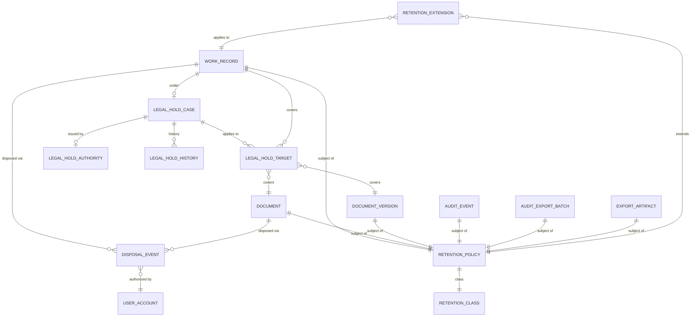

# Retention and Legal Hold

> **Planned policy.** The retention durations, the `LegalHoldCase` / `LegalHoldTarget` / `DisposalEvent` / `RetentionExtension` tables, the scheduler, the destruction workflow, and the audit-export lifecycle described in this document are **planned policy** and are **not implemented** in the verified modules. No `retention_policies`, `legal_hold_cases`, `legal_hold_targets`, `disposal_events`, or `retention_extensions` migrations exist under `apps/api/Modules/`. The `documents` table does carry a nullable `retention_until` and a `retention_policy_key` column, and a `legal_hold` flag, but there is no scheduler, no disposal runner, and no legal-hold lifecycle table behind them. This document therefore defines the target behavior and must not be read as a description of the current runtime.

## 1. Objective

This document defines the approved retention periods for the major data classes, the legal-hold mechanism that suspends destruction, the final-destruction rules, and the responsibilities of each party.

The default periods in this document are the minimum. A work type or a document may adopt a longer period when regulatory or statutory needs require it.

## 2. Approved Retention Classes

| Class | Code | Period | Counting Starts From | Scope |
|---|---|---|---|---|
| Business records | business | 7 years | Record completion or closure | All work types, requests, projects, tasks, and operational documents |
| Audit records | audit | 10 years | Event creation | `AuditEvent`, `SensitiveAccessEvent`, `AuditExportBatch` |
| Export batches | export | 24 hours | Batch creation | `AuditExportBatch`, `ExportArtifact` |

### 2.1 Business Records (7 years)

- Counting starts at the record's closure or completion time, depending on the work type.
- An active record that reaches the end of the period moves to `pending_archival` and the owner is notified.
- The system retains the archive copy while preserving search within authorization.
- Destruction after the period requires approval from the super-admin and the data-governance officer.

### 2.2 Audit Records (10 years)

- Counting starts at event creation time.
- Records are not modified or deleted before the period ends, even on super-admin request.
- Records are stored in an immutable store with a continuous hash chain.
- Backup of the time-series tables is part of the recovery policy.

### 2.3 Export Batches (24 hours)

- Counting starts at batch or file creation time.
- Batches are deleted automatically after 24 hours from the temporary export store.
- The system keeps the export record in `audit_events` for 10 years without the file content.
- Super-admin may extend retention for a specific batch with a documented reason.

## 3. Supporting Fields on Records

> **Planned columns.** The fields below describe the target logical model. They are not all present on the implemented `documents` and `WorkRecord` tables. The implemented `documents` table exposes only `retention_until` (nullable), `retention_policy_key` (nullable), and a `legal_hold` flag with reason/date fields. The full set below is the planned target.

Each `WorkRecord` and each `Document` should at minimum carry:

| Field | Type | Description |
|---|---|---|
| `retention_class` | enum | business, audit, export |
| `retention_until` | timestamp | Expiry timestamp |
| `retention_started_at` | timestamp | Counting start point |
| `legal_hold` | boolean | Legal-hold flag |
| `legal_hold_id` | UUID, optional | Active hold case id |
| `disposal_status` | enum | active, pending_archival, archived, disposed |
| `disposed_at` | timestamp, optional | Actual destruction time |

## 4. Legal Hold

### 4.1 Objective

A legal hold suspends retention enforcement and destruction operations on the affected records, preserving evidence for a potential investigation, dispute, or regulatory obligation.

### 4.2 Hold States

| State | Description | Effect |
|---|---|---|
| `active` | Hold in force | Prevents destruction and sensitive modification |
| `released` | Hold released | Counter resumes, destruction applies at period end |
| `superseded` | Replaced by a newer hold | Linked to the newer case in the record |
| `expired` | Reached expiry without extension | Counter resumes |

### 4.3 Issuing a Hold

- Legal affairs or super-admin may issue a hold.
- A hold requires one of:
  - A case or proceeding reference number.
  - A review-committee decision.
  - A request from a competent government authority.
- The hold is recorded in `LegalHoldCase` and linked to records via `LegalHoldTarget`.
- The hold carries the scope description, reason, originating user, start, and end date.
- Extending the hold issues a new hold that references the predecessor.

### 4.4 Hold Rules

- An ordinary user cannot release an active legal hold.
- The record owner cannot release a hold on their own record.
- Super-admin may issue a blanket hold on a whole work type or whole org unit.
- The module exposes hold state as a fact; Authorization alone interprets it and may issue a `read` field decision in place of `edit` without changing the classification.
- Any deletion or sensitive modification attempt against a held record is recorded in `AuditEvent` and fails.

### 4.5 Hold Scope

- Hold on a single record.
- Hold on a whole work type within an org unit.
- Hold on a whole org unit.
- Hold on a project, initiative, or committee.

Records that fall within the scope are evaluated through `LegalHoldTarget`.

## 5. Record Lifecycle

```text
created → active → (legal_hold?) pending_archival → archived → disposed
                                 ↑
                          release_hold → resumes
```

- `created`: The record is published and in use.
- `active`: The record is complete or in progress and subject to counting.
- `legal_hold`: A flag on the record that prevents destruction.
- `pending_archival`: Period is nearing expiry; the owner has been notified.
- `archived`: Moved to the archive store; writes are disabled.
- `disposed`: Destroyed after documented approval and procedure.

## 6. Destruction Rules

- Final destruction is permitted only after the retention period has elapsed and no active legal hold exists.
- Approval requires:
  - Super-admin.
  - Data-governance officer.
  - A legal-affairs representative when needed.
- Destruction is recorded in `AuditEvent` with type `record_disposed` and the record details.
- The system retains descriptive metadata about the destroyed record (no content) for 10 years.
- Destruction applies to records only; audit records are subject to the full 10-year period and are not destroyed through this flow.

## 7. Exceptions and Extensions

- Retention may be extended when:
  - An explicit regulatory requirement exists.
  - An ongoing or expected litigation ties the record.
  - An external auditor requests retention.
- Extensions are stored in `RetentionExtension` and tied to the record or class of records.
- Super-admin may set a default extension for a whole work type.
- An extension does not replace a legal hold while a proceeding is active.

## 8. Recovery and Backup

- Backup respects retention periods and does not retain records past their expiry without an explicit decision.
- Backups that contain expired records still under hold are kept in a separate unit.
- Partial recovery respects legal hold and never restores a disposed record.
- Recovery testing is part of a periodic operational plan and its result is recorded.

## 9. ERD for Retention and Hold



> **Planned.** All entities in this ERD are planned. No corresponding migrations exist in the verified modules.

## 10. Entity Cards

> **Planned entity cards.** The tables below describe the target logical model. None of these tables exist in the verified migrations today.

### 10.1 RetentionPolicy

| Field | Type | Constraint | Description |
|---|---|---|---|
| id | UUID | PK | Policy id |
| target_type | enum | required | work_record, document, document_version, audit_event, audit_export_batch, export_artifact |
| retention_class | enum | required | business, audit, export |
| retention_years | int | optional | For year-based periods |
| retention_hours | int | optional | For hour-based periods |
| starts_from | enum | required | closed_at, created_at, completed_at, exported_at |
| default | boolean | required | Default policy for the type |
| created_at, updated_at | timestamp | required | Lifecycle timestamps |

### 10.2 LegalHoldCase

| Field | Type | Constraint | Description |
|---|---|---|---|
| id | UUID | PK | Case id |
| case_reference | string | unique | Proceeding reference |
| authority_id | UUID | FK | Hold-issuing authority |
| reason | text | required | Justification |
| scope_type | enum | required | record, work_type, organization_unit, project |
| scope_id | UUID | optional | Scope id |
| issued_by_user_account_id | UUID | FK | Issuer |
| issued_at | timestamp | required | Issue time |
| effective_from | timestamp | required | Effective start |
| effective_until | timestamp | optional | Effective end |
| status | enum | required | active, released, superseded, expired |
| replaces_case_id | UUID | FK, optional | Predecessor hold |

### 10.3 LegalHoldTarget

| Field | Type | Constraint | Description |
|---|---|---|---|
| id | UUID | PK | Target id |
| case_id | UUID | FK | Case |
| target_type | string | required | Target type |
| target_id | UUID | required | Target id |
| added_at | timestamp | required | Add time |
| added_by_user_account_id | UUID | FK | Adder |

### 10.4 DisposalEvent

| Field | Type | Constraint | Description |
|---|---|---|---|
| id | UUID | PK | Event id |
| target_type | string | required | Type of destroyed record |
| target_id | UUID | required | Destroyed record id |
| disposal_method | enum | required | logical_archive, secure_delete, cryptographic_erase |
| retention_class | enum | required | Original class |
| authorized_by_user_account_id | UUID | FK | Approver |
| performed_by_user_account_id | UUID | FK | Executor |
| performed_at | timestamp | required | Execution time |
| certificate_id | UUID | FK | Destruction certificate |

### 10.5 RetentionExtension

| Field | Type | Constraint | Description |
|---|---|---|---|
| id | UUID | PK | Extension id |
| target_type | string | required | Extended record type |
| target_id | UUID | required | Record id |
| additional_years | int | optional | Added years |
| additional_hours | int | optional | Added hours |
| reason | text | required | Justification |
| issued_by_user_account_id | UUID | FK | Issuer |
| issued_at | timestamp | required | Issue time |
| expires_at | timestamp | optional | Extension expiry |

## 11. Responsibilities

| Role | Responsibilities |
|---|---|
| Super-admin | Approve retention policies, issue or lift holds, approve destruction |
| Data-governance officer | Apply policies, schedule destruction, review extensions |
| Legal affairs | Request and extend holds, approve destruction of sensitive records |
| Record owner | Receive expiry notifications, request extensions when needed |
| Ordinary user | Do not attempt to modify or delete a held record, report when needed |

## 12. Reference Scenarios

### 12.1 Business Record Reaches End of Period with No Hold

1. A business record reaches the 7-year mark from completion.
2. It moves to `pending_archival` and the owner is notified.
3. Super-admin and the data-governance officer approve destruction.
4. A `DisposalEvent` is recorded and metadata is kept for 10 years.

### 12.2 Issuing a Hold on a Whole Project

1. Legal affairs requests a hold on a specific project.
2. Super-admin issues a `LegalHoldCase` with `project` scope.
3. All linked records are added to `LegalHoldTarget`.
4. Destruction and sensitive modification are blocked until `release` is issued.
5. Every action is recorded in `AuditEvent`.

### 12.3 Attempted Deletion of a Held Record

1. A user attempts a soft-delete.
2. The action fails because of the active hold.
3. The failure is recorded in `AuditEvent` and the user is informed of the reason.
4. The security officer is alerted on repeated attempts.

### 12.4 Export Batch Expiry

1. An export batch is created at 10:00.
2. It is deleted automatically from the export store at 10:00 the next day.
3. The export record remains in `audit_events` for 10 years without the file content.

## 13. Implementation Notes

> **Planned notes.** All of the following are not yet implemented; they describe the target build.

- Destruction scheduling runs daily as a `Scheduler Singleton` with a lock preventing concurrent runs.
- A unique index on `LegalHoldTarget.(case_id, target_type, target_id)` prevents duplicates.
- A time index on `WorkRecord.retention_until` queries near-expiry records.
- Time-based tables such as `AuditEvent` are partitioned after the first full year.
- CI tests verify that every `WorkTypeVersion` declares an explicit retention policy.
- `fail_closed` tests verify that destruction is rejected when the hold status cannot be read.
- The system links `retention_class` and `classification` to ensure longer retention for higher classifications when no explicit policy exists.

## Change Log

| Version | Date | Role | Change |
|---|---|---|---|
| 0.1.0 | 2026-07-15 | Information Security Officer | Initial draft created |
| 0.2.0 | 2026-07-15 | Information Security Officer | Replaced historical references with current governance and recovery references; applied document tightening |
