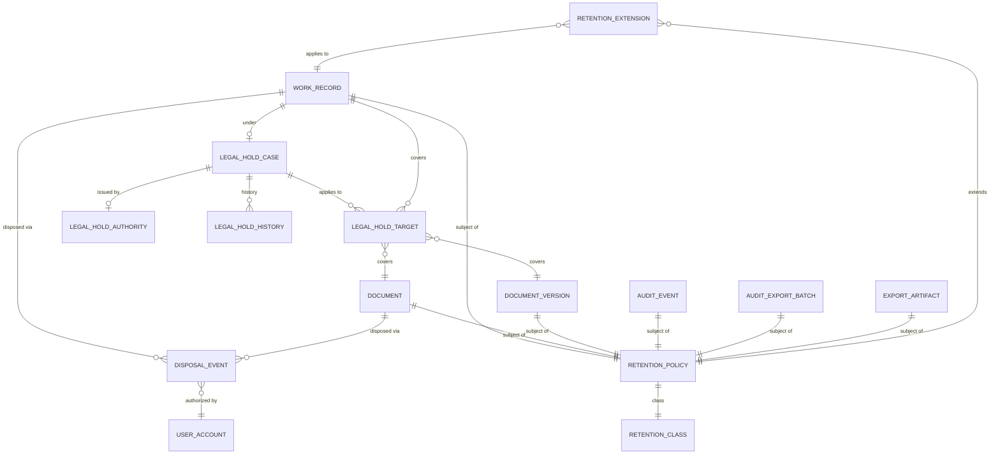

# الاحتفاظ والحجز القانوني

## 1. الهدف

تحدد هذه الوثيقة فترات الاحتفاظ المعتمدة لفئات البيانات الرئيسية، وآلية الحجز القانوني التي تعلّق الإتلاف، وقواعد الإتلاف النهائي، ومسؤوليات كل طرف.

الفترات الافتراضية في هذه الوثيقة هي الحد الأدنى، ويجوز لنوع عمل أو مستند اعتماد مدة أطول عند الحاجة التنظيمية أو النظامية.

## 2. الفئات المعتمدة للاحتفاظ

| الفئة | الرمز | المدة | نقطة بداية العد | النطاق |
|---|---|---|---|---|
| سجلات الأعمال | business | 7 سنوات | اكتمال السجل أو إغلاقه | كل أنواع الأعمال وطلبات ومشاريع ومهام ومستندات تشغيلية |
| سجلات التدقيق | audit | 10 سنوات | لحظة إنشاء الحدث | AuditEvent و SensitiveAccessEvent و AuditExportBatch |
| دفعات التصدير | export | 24 ساعة | إنشاء الدفعة | AuditExportBatch و ExportArtifact |

### 2.1 سجلات الأعمال (7 سنوات)

- يحسب العد من لحظة إغلاق السجل أو اكتماله بحسب نوع العمل.
- السجل النشط في نهاية المدة يدخل في وضع `pending_archival` ويُخطر المالك.
- يحتفظ النظام بنسخة الأرشيف مع الحفاظ على إمكانية البحث ضمن الصلاحيات.
- الإتلاف بعد المدة يخضع لإذن من السوبر أدمن ومسؤول حوكمة البيانات.

### 2.2 سجلات التدقيق (10 سنوات)

- يحسب العد من لحظة إنشاء الحدث.
- لا تُعدَّل ولا تُحذف قبل انتهاء المدة حتى بطلب السوبر أدمن.
- تُحفظ في مخزن غير قابل للتعديل مع Hash chain مستمر.
- النسخ الاحتياطي للجداول الزمنية جزء من سياسة الاستعادة.

### 2.3 دفعات التصدير (24 ساعة)

- يحسب العد من لحظة إنشاء الدفعة أو الملف.
- تُحذف تلقائياً بعد 24 ساعة من مخزن التصدير المؤقت.
- يحتفظ النظام بسجل التصدير في `audit_events` لمدة 10 سنوات دون محتوى الملف.
- يحق للسوبر أدمن تمديد الحفظ لدفعة بعينها مع تسجيل المبرر.

## 3. الحقول الداعمة على السجلات

كل `WorkRecord` وكل `Document` يحويان على الأقل:

| الحقل | النوع | الوصف |
|---|---|---|
| `retention_class` | enum | business, audit, export |
| `retention_until` | timestamp | تاريخ انتهاء الصلاحية |
| `retention_started_at` | timestamp | نقطة بداية العد |
| `legal_hold` | boolean | علم الحجز القانوني |
| `legal_hold_id` | UUID, optional | معرف حالة الحجز النشطة |
| `disposal_status` | enum | active, pending_archival, archived, disposed |
| `disposed_at` | timestamp, optional | لحظة الإتلاف الفعلي |

## 4. الحجز القانوني (Legal Hold)

### 4.1 الهدف

يعلق الحجز القانوني تطبيق فترات الاحتفاظ وعمليات الإتلاف على السجلات المعنية، ويحفظ الأدلة لحاجة محتملة لتحقيق أو نزاع أو التزام نظامي.

### 4.2 حالات الحجز

| الحالة | الوصف | الأثر |
|---|---|---|
| `active` | الحجز ساري | يمنع الإتلاف ويمنع تعديل المحتوى الحساس |
| `released` | أُنهي الحجز | يستأنف العداد ويطبق الإتلاف عند انتهاء المدة |
| `superseded` | استُبدل بحجز أحدث | يُربط بالحجز الجديد في السجل |
| `expired` | انتهى تاريخ الانتهاء دون تمديد | يستأنف العداد |

### 4.3 إصدار الحجز

- يحق للشؤون القانونية أو السوبر أدمن إصدار الحجز.
- يحتاج الحجز واحداً مما يلي:
  - رقم قضية أو إجراء نظامي.
  - قرار لجنة مراجعة.
  - طلب من جهة حكومية مختصة.
- يُسجل الحجز في `LegalHoldCase` ويرتبط بالسجلات عبر `LegalHoldTarget`.
- يحوي الحجز وصف النطاق والمبرر والمستخدم المصدر وتاريخ البداية والنهاية.
- يحق تمديد الحجز بإصدار جديد يربط بالحجز السابق.

### 4.4 قواعد الحجز

- لا يحق لمستخدم عادي إلغاء حجز قانوني ساري.
- لا يحق لمالك السجل إلغاء الحجز على سجله.
- يحق للسوبر أدمن إصدار حجز شامل على نوع عمل كامل أو وحدة كاملة.
- يعرض الموديول حالة الحجز كحقيقة؛ يفسرها Authorization وحده وقد يصدر قرار حقل `read` بدلاً من `edit` دون تغيير التصنيف.
- أي محاولة حذف أو تعديل لسجل محجوز تُسجل في `AuditEvent` ويفشل الإجراء.

### 4.5 نطاق الحجز

- حجز على سجل واحد.
- حجز على نوع عمل بأكمله ضمن وحدة تنظيمية.
- حجز على وحدة تنظيمية بأكملها.
- حجز على مشروع أو مبادرة أو لجنة.

تُقيَّم السجلات الداخلة في النطاق عبر `LegalHoldTarget`.

## 5. دورة حياة السجل

```text
created → active → (legal_hold?) pending_archival → archived → disposed
                                 ↑
                          release_hold → resumes
```

- `created`: السجل منشور وقيد الاستخدام.
- `active`: السجل مكتمل أو جارٍ ويخضع للعد.
- `legal_hold`: علم على السجل يمنع الإتلاف.
- `pending_archival`: قرب انتهاء المدة وأُخطر المالك.
- `archived`: انتقل إلى مخزن الأرشيف مع إيقاف الكتابة.
- `disposed`: أُتلف نهائياً بعد موافقة وإجراء موثق.

## 6. قواعد الإتلاف

- الإتلاف النهائي مسموح فقط بعد انتهاء فترة الاحتفاظ وعدم وجود حجز قانوني ساري.
- يحتاج الإذن إلى:
  - السوبر أدمن.
  - مسؤول حوكمة البيانات.
  - ممثل الشؤون القانونية عند الحاجة.
- يُسجل الإتلاف في `AuditEvent` بنوع `record_disposed` مع تفاصيل السجل.
- يحتفظ النظام ببيانات وصفية عن السجل المُتلف دون المحتوى، لمدة 10 سنوات.
- الإتلاف يطبق على السجلات فقط ولا يطبق على سجلات التدقيق التي تخضع لمدة 10 سنوات كاملة.

## 7. الاستثناءات والتمديد

- يسمح بتمديد فترة الاحتفاظ عند وجود:
  - متطلب نظامي صريح.
  - ربط بدعوى قائمة أو متوقعة.
  - طلب من مدقق خارجي.
- يحفظ التمديد في `RetentionExtension` ويربط بالسجل أو فئة السجلات.
- يحق للسوبر أدمن تحديد تمديد افتراضي لنوع عمل كامل.
- التمديد لا يحل محل الحجز القانوني عند وجود إجراء قضائي.

## 8. الاستعادة والنسخ الاحتياطي

- النسخ الاحتياطي يلتزم بفترات الاحتفاظ ولا يحتفظ بسجلات تجاوزت مدتها إلا بقرار صريح.
- النسخ التي تحوي سجلات منتهية تحت حجز تُحفظ في وحدة منفصلة.
- الاستعادة الجزئية تراعي الحجز القانوني ولا تستعيد سجلاً متلفاً.
- اختبار الاستعادة جزء من خطة تشغيلية دورية ويُسجل نتيجته.

## 9. المخطط ERD للاحتفاظ والحجز



## 10. بطاقات الكيانات الرئيسية

### 10.1 RetentionPolicy

| الحقل | النوع | القيد | الوصف |
|---|---|---|---|
| id | UUID | PK | معرف السياسة |
| target_type | enum | إلزامي | work_record, document, document_version, audit_event, audit_export_batch, export_artifact |
| retention_class | enum | إلزامي | business, audit, export |
| retention_years | int | اختياري | للمدد بالسنوات |
| retention_hours | int | اختياري | للمدد بالساعات |
| starts_from | enum | إلزامي | closed_at, created_at, completed_at, exported_at |
| default | boolean | إلزامي | سياسة افتراضية للنوع |
| created_at, updated_at | timestamp | إلزامي | الزمن |

### 10.2 LegalHoldCase

| الحقل | النوع | القيد | الوصف |
|---|---|---|---|
| id | UUID | PK | معرف القضية |
| case_reference | string | فريد | الرقم المرجعي للإجراء |
| authority_id | UUID | FK | الجهة مصدر الحجز |
| reason | text | إلزامي | المبرر |
| scope_type | enum | إلزامي | record, work_type, organization_unit, project |
| scope_id | UUID | اختياري | معرف النطاق |
| issued_by_user_account_id | UUID | FK | مصدر الحجز |
| issued_at | timestamp | إلزامي | لحظة الإصدار |
| effective_from | timestamp | إلزامي | بداية السريان |
| effective_until | timestamp | اختياري | نهاية السريان |
| status | enum | إلزامي | active, released, superseded, expired |
| replaces_case_id | UUID | FK, optional | الحجز المستبدل |

### 10.3 LegalHoldTarget

| الحقل | النوع | القيد | الوصف |
|---|---|---|---|
| id | UUID | PK | معرف |
| case_id | UUID | FK | القضية |
| target_type | string | إلزامي | نوع الهدف |
| target_id | UUID | إلزامي | معرف الهدف |
| added_at | timestamp | إلزامي | لحظة الإضافة |
| added_by_user_account_id | UUID | FK | من أضاف الهدف |

### 10.4 DisposalEvent

| الحقل | النوع | القيد | الوصف |
|---|---|---|---|
| id | UUID | PK | معرف |
| target_type | string | إلزامي | نوع السجل المتلف |
| target_id | UUID | إلزامي | معرف السجل المتلف |
| disposal_method | enum | إلزامي | logical_archive, secure_delete, cryptographic_erase |
| retention_class | enum | إلزامي | الفئة الأصلية |
| authorized_by_user_account_id | UUID | FK | من أذن |
| performed_by_user_account_id | UUID | FK | من نفذ |
| performed_at | timestamp | إلزامي | لحظة التنفيذ |
| certificate_id | UUID | FK | شهادة الإتلاف |

### 10.5 RetentionExtension

| الحقل | النوع | القيد | الوصف |
|---|---|---|---|
| id | UUID | PK | معرف |
| target_type | string | إلزامي | نوع السجل الممتد |
| target_id | UUID | إلزامي | معرف السجل |
| additional_years | int | اختياري | سنوات مضافة |
| additional_hours | int | اختياري | ساعات مضافة |
| reason | text | إلزامي | المبرر |
| issued_by_user_account_id | UUID | FK | مصدر التمديد |
| issued_at | timestamp | إلزامي | لحظة الإصدار |
| expires_at | timestamp | اختياري | نهاية التمديد |

## 11. مسؤوليات

| الدور | المسؤوليات |
|---|---|
| السوبر أدمن | اعتماد سياسات الاحتفاظ، إصدار أو رفع الحجز، اعتماد الإتلاف |
| مسؤول حوكمة البيانات | تطبيق السياسات، جدولة الإتلاف، مراجعة التمديدات |
| الشؤون القانونية | طلب الحجز وتمديده، اعتماد الإتلاف للسجلات الحساسة |
| مالك السجل | استلام إخطارات الانتهاء، طلب التمديد عند الحاجة |
| المستخدم العادي | عدم محاولة تعديل أو حذف سجل محجوز، الإبلاغ عند الحاجة |

## 12. سيناريوهات مرجعية

### 12.1 انتهاء فترة سجل أعمال دون حجز

1. يصل سجل أعمال إلى نهاية 7 سنوات من اكتماله.
2. يدخل في `pending_archival` ويُخطر المالك.
3. يوافق السوبر أدمن ومسؤول حوكمة البيانات على الإتلاف.
4. يُسجل `DisposalEvent` ويُحفظ Metadata لمدة 10 سنوات.

### 12.2 إصدار حجز على مشروع كامل

1. تطلب الشؤون القانونية حجزاً على مشروع محدد.
2. يصدر السوبر أدمن `LegalHoldCase` بنطاق `project`.
3. تُضاف جميع السجلات المرتبطة إلى `LegalHoldTarget`.
4. يُمنع الإتلاف والتعديل الحساس حتى إصدار `release`.
5. يُسجل كل إجراء في `AuditEvent`.

### 12.3 محاولة حذف سجل محجوز

1. يحاول المستخدم الحذف المنطقي لسجل.
2. يفشل الإجراء بسبب وجود حجز نشط.
3. يُسجل الفشل في `AuditEvent` ويُخطر المستخدم بسبب الرفض.
4. يُخطر مسؤول الأمن عند تكرار المحاولات.

### 12.4 انتهاء دفعة تصدير

1. تُنشأ دفعة تصدير الساعة 10:00.
2. تُحذف تلقائياً من مخزن التصدير الساعة 10:00 من اليوم التالي.
3. يبقى سجل التصدير في `audit_events` لمدة 10 سنوات دون محتوى الملف.

## 13. ملاحظات تنفيذية

- جدولة الإتلاف تعمل يومياً كـ`Scheduler Singleton` مع قفل لمنع التشغيل المتزامن.
- فهرس فريد على `LegalHoldTarget.(case_id, target_type, target_id)` لمنع التكرار.
- فهرس زمني على `WorkRecord.retention_until` لاستعلام السجلات القريبة من الانتهاء.
- تقسيم الجداول الزمنية لـ`AuditEvent` بعد تجاوز سنة كاملة.
- اختبارات CI تتحقق من أن كل `WorkTypeVersion` يحدد سياسة احتفاظ صريحة.
- اختبارات `fail_closed` تتحقق من رفض الإتلاف عند تعذر قراءة حالة الحجز.
- يربط النظام بين `retention_class` و`classification` لضمان احتفاظ أطول للتصنيفات الأعلى عند غياب سياسة خاصة.

## سجل التغيير

| الإصدار | التاريخ | الدور | التغيير |
|---|---|---|---|
| 0.1.0 | 2026-07-15 | مسؤول أمن المعلومات | إنشاء المسودة التنفيذية |
| 0.2.0 | 2026-07-15 | مسؤول أمن المعلومات | استبدال المراجع التاريخية بمراجع الحوكمة والتعافي الحالية وتطبيق ضبط الوثيقة |
