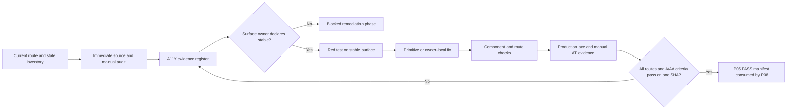

# Cluster Accessibility and WCAG 2.2 AA Implementation Plan

> **For agentic workers:** REQUIRED SUB-SKILL: Use `skill://subagent-driven-development` (recommended) or `skill://executing-plans` to implement this plan task-by-task. Use the accessibility skill for every audit and remediation task. Steps use checkbox (`- [ ]`) syntax for tracking.

```yaml
plan_id: P05
status: planned
depends_on: []
blocks: [P08]
shared_file_owner: []
implementation_commit: null
last_verified_commit: null
last_status_change: '2026-07-26'
tree_digest: "sha256(concat(UTF-8 file bytes for M00-M07 and P01-P08 in ascending plan_id order, removing only each tree_digest YAML scalar token))"
```

**Goal:** Audit every stable Cluster web route and interaction against WCAG 2.2 Level AA, remediate verified barriers without changing product authorization or data semantics, and retain automated and manual evidence on one recorded commit before P08 may close the program.

**Architecture:** Work in two deliberately separate lanes. The immediate lane inventories and audits the current React shell, route/state matrix, primitives, feature screens, Arabic RTL and English LTR presentations, styles, and tests without claiming conformance. The remediation lane opens only per UI surface after that surface's owner declares it stable; it fixes shared primitives first, then shell and feature surfaces, and finishes with production-bundle axe scans plus keyboard, zoom/reflow, contrast, motion, and assistive-technology evidence. Automated axe results are necessary but never sufficient for a conformance decision.

**Tech Stack:** React 19.2, TypeScript 6, Vite 8, Vitest 4 with jsdom and Testing Library, Playwright 1.61.1, `vitest-axe`, `@axe-core/playwright`, `@testing-library/user-event`, semantic HTML, WAI-ARIA Authoring Practices, WCAG 2.2 Level AA, Arabic RTL and English LTR.

**Approved Design:** [`../specs/2026-07-26-cluster-production-and-modules-program-design.md`](../specs/2026-07-26-cluster-production-and-modules-program-design.md)

## Global Constraints

- This plan starts at `planned`, has no start dependency, blocks `P08`, and owns no shared file.
- The immediate audit may begin while `docs/superpowers/plans/2026-07-26-cluster-complete-architecture-closure.md` remains `in_progress`; remediation of a surface waits for its current owner to declare that surface stable and release it.
- The Architecture Closure plan retains `Makefile`, `.github/workflows/ci.yml`, `.github/workflows/ci-e2e.yml`, `docs/contracts/api/openapi.yaml`, `apps/web/src/api/generated/cluster.ts`, `apps/api/tests/Architecture/ModuleBoundariesTest.php`, and sometimes `apps/api/routes/web.php` until explicit handoff. P05 never edits those files.
- P08 alone owns final `Makefile` and workflow integration after `ARCHITECTURE-CLOSURE:T13-HANDOFF`; P05 supplies one npm verification contract, an immutable commit-keyed child manifest, and a checked-in evidence-contract descriptor that contains no run-specific SHA or digest.
- P07 owns E2E runner readiness and the bounded live topology. P05 creates `apps/web/e2e/accessibility.spec.ts`; P07 must add that exact file to the production project's explicit `testMatch`, export the Section 12 HTTPS/CA handoff, and prove nonzero discovery before P05 runs it. P05 never rewrites runner topology or workflow files.
- M07 owns the final `apps/web/src/shell/routes.ts` aggregation token. P05 reads that file to build the final route inventory but never edits it; requested route or navigation-data changes go through the M07 shell integration queue.
- A package integration token is required before changing `apps/web/package.json` or `apps/web/package-lock.json`, because P05 owns neither and P07/P06 may also need them. The token covers only the three accessibility development dependencies and P05 npm scripts described here.
- Generated API clients are changed only by the generation command. This plan needs no API schema or generated-client change.
- Use native HTML semantics before ARIA. ARIA must not conceal a broken native interaction or duplicate visible names.
- Maintain existing session/CSRF, capability checks, problem+json, correlation ID, Idempotency-Key, If-Match/ETag/`lock_version`, cursor pagination, and transactional-outbox behavior. Accessibility remediation cannot bypass or weaken them.
- Evidence must use synthetic fixtures and must not retain PII/PHI, credentials, cookies, access tokens, request bodies, or unredacted traces.
- Do not claim WCAG conformance from source inspection, an axe pass, a component-test pass, or a subset of routes. `PASS` requires every exit gate in Section 14 on one recorded commit.
- Newly validated architecture defects may receive the next available `C` identifier only through the current architecture-register owner/integration token, with source, evidence, owner, and exit criterion. Keep audit work items as `A11Y-###`; never recreate unsourced historical `F001–F123` entries or promote raw `.minimax-flow` findings without fresh validation.
- No commit, push, PR, deployment, or external message is authorized by this plan. After all gates pass, a commit may be recorded only after explicit user authorization.

---

## 1. Status Header and Dependency Fields

The YAML header above is canonical. Phase gates are deliberately narrower than plan dependencies:

| Phase | May start when | Must stop when |
|---|---|---|
| A — immediate source/state audit | Immediately after executor authorization | A required route, state, or owner cannot be identified from current source |
| B — test/evidence harness | Package integration token is granted | `apps/web/package*.json` or Playwright config is concurrently owned |
| C — per-surface remediation | The named surface owner declares the surface stable and releases it | The surface changes again, a shared-file token expires, or red/green evidence is not reproducible |
| D — production browser evidence | All in-scope routes are integrated and stable; P07 production runner is ready | A route is skipped, fixture leaks sensitive data, or runner/config handoff is absent |
| E — final conformance decision | All automated and manual matrices are complete on one commit | Any A/AA finding is open, any route/state is untested, evidence SHA differs, or an exclusion affects a user-facing route |

`planned → ready` applies when an executor is authorized to begin Phase A. Later blocked phases do not change the header's start dependency; they are explicit phase-local gates.

## 2. Goal and User-Visible Outcome

Users must be able to:

- authenticate without a cognitive-function test, paste blocking, or inaccessible error recovery;
- reach and operate every authorized route by keyboard alone, including shell navigation, menus, custom selects, drawers, tables, forms, organization controls, and retry actions;
- see a persistent, unobscured, high-contrast focus indicator and return focus to a logical trigger after overlays close;
- understand page, section, table, form, dialog, status, error, and loading semantics through accessible name, role, state, value, and relationships;
- receive error identification and correction guidance without relying on color, placement, or vision;
- hear asynchronous success, error, loading, stale-data, pagination, scope, and notification changes without duplicate or disruptive announcements;
- read and operate the application at 400% browser zoom/320 CSS-pixel reflow and with WCAG text-spacing overrides without loss of content or function;
- activate controls with targets at least 24 by 24 CSS pixels or a documented WCAG 2.5.8 spacing/equivalent exception;
- use a non-dragging alternative for every dragging interaction;
- suppress non-essential animation with `prefers-reduced-motion: reduce`;
- use Arabic RTL and English LTR with equivalent semantics, logical reading/focus order, localized accessible names, and correct bidirectional rendering for identifiers;
- use the stable application with current VoiceOver/Safari and NVDA/Chrome combinations without critical reading-order, focus, name/role/value, or announcement barriers.

The deliverable is evidence for a bounded WCAG 2.2 AA decision, not a blanket certification of the API, infrastructure, third-party services, or future routes added after the recorded inventory hash.

## 3. Current Source Evidence

The immediate audit must re-read these surfaces before recording findings; line references describe the 2026-07-26 baseline and may move.

### Shell, routing, locale, and focus

- `apps/web/index.html:2` sets the default document to Arabic RTL; `apps/web/src/App.tsx:63-71` updates `html.lang` and `html.dir` when locale changes.
- `apps/web/src/shell/routes.ts:1-39` defines the route union, `:41-42` defines all platform-settings sections, `:141-179` defines primary navigation routes, and `:181-223` maps dynamic route variants to paths.
- `apps/web/src/app/AppWorkspaceShell.tsx:57-66` performs History API route changes but does not itself establish a route-change focus target or announcement. Treat this as an audit question until browser/manual evidence validates or disproves a barrier.
- `apps/web/src/app/AppShell.tsx:352-529` renders aside/header/main/footer landmarks; `:533-580` renders modal mobile-navigation and notification overlays.
- `apps/web/src/app/AppShell.tsx:269-350` traps focus and restores triggers for mobile navigation and notifications. `apps/web/src/app/AppShell.test.tsx:175-185` and `apps/web/e2e/shell.spec.ts:38-47` already cover Escape and focus restoration for mobile navigation.
- `apps/web/src/app/AppShell.tsx:481-515` renders a `role="menu"` user menu. The audit must verify opening focus, Arrow/Home/End behavior, Escape/outside dismissal, tab behavior, and trigger restoration against the chosen disclosure/menu pattern.
- `apps/web/src/app/LoginScreen.tsx:48-59` sends focus to an error summary; `:111-166` uses status/alert, labels, `aria-invalid`, descriptions, and named password visibility. Test accessible authentication, autocomplete, paste, password-manager compatibility, error recovery, and session-expiry announcements.
- `apps/web/src/app/copy.ts:3-4`, `:413-420`, and `:463-472` define the `ar`/`en` locale, persisted preference, formatting locale, and direction helpers.

### Shared primitives and state presentation

- `apps/web/src/ui/Drawer.tsx:10-17` defines focusable descendants, `:48-67` traps Tab, `:69-93` handles Escape/initial/restored focus, and `:97-123` provides dialog semantics.
- `apps/web/src/ui/Select.tsx:21-41` exposes its public label/search/disabled contract and `:43-59` states the intended keyboard/listbox behavior. Audit the rendered combobox/listbox implementation in all open, filtered, empty, disabled, RTL, and error-adjacent states.
- `apps/web/src/ui/Field.tsx:25-37` creates label/help/error IDs, but association still depends on the child control's `aria-describedby`; audit every caller rather than assuming the wrapper wires the relationship.
- `apps/web/src/ui/Page.tsx:4-88` supplies page, header, section, and panel heading structure.
- `apps/web/src/ui/Feedback.tsx:4-57` supplies empty, alert, and skeleton states; the skeleton has an accessible label but no explicit live/status role. Validate announcement behavior before changing it.
- `apps/web/src/ui/Feedback.tsx:59-93` renders text-bearing status badges; verify status is never communicated by color alone.
- `apps/web/src/charts/DashboardChart.tsx:53-57` exposes a canvas as an image with a caption; audit whether equivalent data and trends are available in text, not only a chart name.

### Forms, tables, dialogs, dynamic status, and complex interaction

- Organization drawers under `apps/web/src/features/organization/*Drawer.tsx` use the shared Drawer and error summaries; `OrganizationDrawers.test.tsx` is the existing combined regression surface.
- `apps/web/src/features/identity/IdentityAccounts.tsx:319-320` and `apps/web/src/features/imports/ImportReview.tsx:128-129` use focusable, named scroll regions around tables. Authorization tables use captions in `AccessContext.tsx:341-377`, `AccessScopesScreen.tsx:92-97`, and `AuthorizationAdmin.tsx:119-123`.
- `apps/web/src/features/organization/OrganizationBoard.tsx:611-691` exposes empty state, zoom status, and a pointer-driven canvas. Audit SC 2.5.7 dragging alternatives, keyboard access, instructions, reading order, and zoom/pan controls.
- `apps/web/src/features/dashboard/WorkDashboard.tsx:129-140` uses skeleton, status, alert, button KPIs, and live values.
- `apps/web/src/features/imports/ImportReview.tsx:112-117` wraps changing job state in a polite atomic live region and uses alert-focused form errors throughout `:169-221`; validate announcement frequency and focus order during retries and state transitions.
- `apps/web/src/features/documents/DocumentsWorkspace.tsx:99-154` combines filters, create/update/upload/link forms, file inputs, conflicts, and stale-write errors. Remediation must preserve If-Match/lock-version behavior and avoid putting document metadata into retained evidence.

### Styles, contrast, reflow, target size, and motion

The audit covers every app-authored stylesheet in the active import graph, not only the token file:

- foundations: `apps/web/src/styles/tokens.css`, `apps/web/src/styles/base.css`, `apps/web/src/styles/screens.css`, `apps/web/src/ui/ui.css`;
- shell: `apps/web/src/app/AppShell.css`, `apps/web/src/app/WorkspaceTabs.css`;
- feature styles: `apps/web/src/features/dashboard/WorkDashboard.css`, `apps/web/src/features/organization/organization.css`, `apps/web/src/features/organization/board.css`, `apps/web/src/features/organization/organization-overview.css`, `apps/web/src/features/platform-settings/platform-settings.css`, `apps/web/src/features/requests/RequestDashboard.css`;
- third-party route style: `swagger-ui-react/swagger-ui.css`, loaded by `apps/web/src/features/docs/SwaggerUiScreen.tsx:4`, as rendered inside the `/api-docs` route.

`apps/web/src/styles/tokens.css:7-89` defines palette, control heights, focus ring, motion, and typography. `apps/web/src/styles/base.css:51-53` supplies the global focus outline. `apps/web/src/styles/screens.css:361-367` reduces transitions. `apps/web/src/ui/ui.css:7-8`, `:72-73`, `:164-165`, and `:329-349` animate pages, headers, cards, and drawers. Audit computed styles in light/dark login states and all hover/focus/disabled/selected/status states; source token values alone are not contrast proof.

### Existing automated coverage and missing tooling

- `apps/web/package.json:35-51` includes Playwright, Testing Library, jsdom, and Vitest but no axe package and no `@testing-library/user-event`. Axe and realistic keyboard-tab tooling are new development dependencies.
- `apps/web/vitest.config.ts:3-19` defaults to Node; current DOM tests opt into jsdom per file.
- `apps/web/playwright.production.config.ts:32-47` requires a validated localhost production-bundle origin, serial workers, Arabic locale, and retained-on-failure traces.
- Existing route/browser coverage lives in `apps/web/e2e/*.spec.ts`; shell and component tests already assert several roles, names, RTL/LTR values, and focus restoration, but no repository-wide axe gate exists.

No source item above is, by itself, a conformance finding. Phase A records reproduction steps and fresh evidence before assigning `A11Y-###` status `confirmed`.

## 4. Scope and Explicit Non-Goals

### In scope

1. Anonymous states: session restore/loading, normal login, session-expired login, required-field errors, authentication failure, Arabic/English, login light/dark themes.
2. Authenticated shell states: desktop expanded/collapsed navigation, mobile navigation dialog, notification dialog/list/pagination/error, user menu, global search, scope selector pending/stale/error, route access denied, not found, and lazy loading.
3. Every current path family:
   - `/`, `/work-records/new`, `/work-records/:recordId`;
   - `/documents`, `/documents/:documentId`;
   - `/tasks`, `/tasks/:taskId`;
   - `/approvals`, `/approvals/:stepId`;
   - `/my-requests`, `/my-requests/:instanceId`;
   - `/procedures`, `/procedures/:procedureId`, `/procedures/new`;
   - `/admin/procedures/authoring`, `/admin/procedures/review`;
   - `/admin/work-definitions`, `/admin/workflow`, `/admin/workflow/day2`;
   - `/admin/organization`, `/admin/organization/structure`, `/admin/organization/people`, `/admin/organization/temporary-assignments`;
   - `/admin/imports/organization`, `/admin/imports/organization/:jobId`;
   - `/admin/identity/accounts`;
   - `/admin/authorization/roles`, `/capabilities`, `/role-assignments`, `/access-scopes`, `/delegations`, `/classification-policies`, `/field-access-templates`, `/explain`, `/explain/:decisionId` under the same authorization prefix;
   - `/admin/relationships/supervisory`;
   - `/me/access`, `/me/security`;
   - `/search`, `/reports`, `/dashboards`, `/dashboards/:dashboardId`, `/coverage`, `/api-docs`, `/notifications`;
   - `/admin/platform` and `/admin/platform/{security,calendars,backups,logs,health,maintenance}`;
   - a real unknown path rendered through `RouteNotFound`;
   - every M01-M07 route present after M07 processes the final shell aggregation token.
4. For data-driven screens: loading, empty, ready, denied/forbidden, not found, network error/retry, validation error, success, conflict/stale, disabled/submitting, and cursor-load-more failure where the component supports the state.
5. WCAG 2.2 A and AA success criteria applicable to web UI, with explicit emphasis on 1.3.1/1.3.2, 1.4.3/1.4.10/1.4.11/1.4.12/1.4.13, 2.1.1/2.1.2, 2.2.2, 2.4.1/2.4.2/2.4.3/2.4.6/2.4.7/2.4.11, 2.5.3/2.5.7/2.5.8, 3.1.1/3.1.2, 3.2.3/3.2.4/3.2.6, 3.3.1/3.3.2/3.3.3/3.3.4/3.3.7/3.3.8, and 4.1.2/4.1.3.
6. The WCAG 2.2 additions are mandatory rows in the audit matrix:
   - 2.4.11 Focus Not Obscured (Minimum): sticky shell/header, drawers, notification/mobile overlays, scrollable tables, and custom select popovers;
   - 2.5.7 Dragging Movements: organization canvas and any drag/reorder discovered in the final route inventory;
   - 2.5.8 Target Size (Minimum): compact icon buttons, table actions, tab links, disclosure controls, chart/board controls, and close buttons;
   - 3.2.6 Consistent Help: any help/contact mechanism present in the stable shell or screens; record `not-applicable` with route evidence if none exists;
   - 3.3.7 Redundant Entry: multi-step procedure, request, import, organization, identity, and authorization flows;
   - 3.3.8 Accessible Authentication (Minimum): login, password visibility, paste/autofill/password-manager support, and session reauthentication.

### Non-goals

- No UI implementation occurs while drafting this plan.
- Do not claim legal certification, regulatory attestation, or conformance beyond the exact route/state/locale/viewport/commit boundary in the evidence manifest.
- Do not redesign visual identity, product workflows, capability policy, API contracts, persistence, or backend behavior for aesthetic preference.
- Do not add ARIA to already-correct native controls merely to satisfy a source-text checklist.
- Do not edit generated clients, OpenAPI, backend routes/controllers, migrations, production topology, CI, or Make targets.
- Do not hand-edit `apps/web/src/shell/routes.ts`; M07 owns its final aggregation token.
- Do not suppress axe rules globally, hide violating elements from the accessibility tree, lower color opacity, remove focus outlines, disable zoom, or skip difficult routes/states to make a gate pass.
- Do not treat third-party Swagger UI as automatically exempt. Audit the rendered route; either remediate through supported wrapper/theme configuration, provide an equivalently accessible user path, or leave P05/P08 blocked.

## 5. Architecture and Ownership Boundaries

### Audit/remediation flow



### Ownership rules

- P05 owns newly created P05-specific audit, test, validator, and evidence artifacts only after execution begins; the canonical header remains `shared_file_owner: []` because the approved program grants no shared surface.
- Shared-primitives remediation may modify `apps/web/src/ui/*` only after all active feature owners using that primitive acknowledge the behavior contract and their surfaces are stable. A primitive change must migrate all affected callers in the same integration token; no compatibility shim remains.
- Shell rendering remediation may modify `App.tsx`, `AppShell.tsx`, `AppWorkspaceShell.tsx`, and their styles/tests only after shell stabilization. Route data changes are submitted to M07 rather than edited by P05.
- Feature remediation stays within the feature directory that owns the failing surface. If M01-M07 are still implementing that directory, P05 records the finding and its acceptance test; the module owner lands the fix before handing the surface back for P05 verification.
- Package-lock changes are serialized. E2E config/workflow changes go to P07/P08. P05's browser spec must be an explicit P07 production-project input, and the discovery sentinel must fail if `accessibility.spec.ts` is absent from `testMatch`, resolves to zero tests, is skipped, or is marked `fixme`.
- The evidence validator must fail closed on missing, stale, skipped, malformed, multiply authoritative, descriptor-byte/hash/template, or manifest/P07 digest mismatches. It never converts unknown/untested to pass and never writes a checked-in file.

## 6. Files to Create, Modify, Move, or Remove

### Create during execution

- `docs/architecture/accessibility/wcag-2.2-aa-audit.yaml` — live `A11Y-###` register, criterion applicability matrix, exact route/state reproduction, owner, stabilization gate, remediation status, and evidence links.
- `docs/architecture/accessibility/wcag-2.2-aa-evidence.json` — immutable evidence-contract descriptor for the authoritative commit-keyed manifest; it is not a run result and contains no concrete commit, artifact digest, or conformance decision.
- `scripts/validate-accessibility-evidence.mjs` — descriptor/manifest/P07 schema validation, route coverage, commit consistency, digest binding, replay-mode closure-artifact generation, and sensitive-data guard.
- `scripts/validate-accessibility-evidence.test.mjs` — Node built-in tests proving invalid/missing/stale/duplicate evidence fails closed.
- `scripts/run-accessibility-live.mjs` — validates `P05_EVIDENCE_MODE`/`P05_EVIDENCE_ROOT`, runs the unit and production-browser gates, and writes one immutable `live-manifest.json` beneath the exact allowed root.
- `scripts/run-accessibility-live.test.mjs` — rejects missing/wrong mode, wrong SHA-root mapping, absolute/traversal/symlink/non-empty roots, writes outside the root, skipped/zero tests, and ambiguous child/replay output.
- `apps/web/src/test/accessibility/axe.ts` — one configured `runAxe(container)` helper with WCAG A/AA tags and deterministic report normalization.
- `apps/web/src/test/accessibility/route-inventory.ts` — typed anonymous/shell/route/state/locale/viewport inventory; consumes route exports without modifying them.
- `apps/web/src/test/accessibility/shared-surfaces.test.tsx` — axe plus keyboard/name/role/value regressions for LoginScreen, AppShell, Drawer, Select, Field, Page, Feedback, tables, and status states.
- `apps/web/e2e/accessibility.spec.ts` — explicit P07 production-project input for production-bundle axe, keyboard, focus, zoom/reflow, RTL/LTR, reduced-motion, and route-coverage checks.
- Sealed static root at P05 completion: `artifacts/accessibility/<sha>/{manifest.json,manifest.sha256,validation.json,.complete.json,route-inventory.json}` plus the descriptor digest and the manual-files digest set. Written once, immutable thereafter. P05 run-scoped live root, kept distinct so the sealed root is never overwritten: `artifacts/accessibility-live/<sha>/<run-id>/{live-manifest.json,automated/*,live/*,commands/accessibility-verify.txt}`. For P08 replay, the live root is additionally nested under `artifacts/program-closure/<final-sha>/<program-run-id>/live/accessibility/<run-id>/`. The `<run-id>` is generated by the live wrapper (UUIDv7) and validated as a safe path segment. Sibling files contain generated axe JSON, route matrix, screenshots, computed-contrast records, manual-check records, redacted trace references, digest, and validation report. Both directories are retained by the verification artifact store, not committed with secrets.

### Modify after integration tokens and stabilization

- Tool contract: `apps/web/package.json`, `apps/web/package-lock.json`.
- Document/bootstrap locale: `apps/web/index.html`, `apps/web/src/App.tsx`, `apps/web/src/App.test.tsx` only if the audit confirms document-title, language, direction, restore-status, or login transition defects.
- Shell/focus: `apps/web/src/app/AppShell.tsx`, `AppShell.css`, `AppShell.test.tsx`, `AppWorkspaceShell.tsx`, `AppWorkspace.navigation.test.tsx`, `WorkspaceTabs.tsx`, `WorkspaceTabs.css`, `WorkspaceTabs.test.tsx`, `LoginScreen.tsx`, `LoginScreen.test.tsx`, `NotificationList.tsx`, `NotificationList.test.tsx`, `copy.ts`, `copy.test.ts`.
- Shared primitives: `apps/web/src/ui/Button.tsx`, `Field.tsx`, `Select.tsx`, `Drawer.tsx`, `Page.tsx`, `Feedback.tsx`, `DataFreshness.tsx`, `MetricTile.tsx`, `ui.css`, and their existing tests.
- Foundation styles: `apps/web/src/styles/tokens.css`, `base.css`, `screens.css`.
- Complex/data features and their colocated tests/styles: all current `.tsx`, `.test.tsx`, and CSS files under `apps/web/src/features/{authorization,dashboard,documents,identity,imports,organization,platform-settings,portal,reporting,requests,tasks,work-records,workflow}` plus `apps/web/src/charts/DashboardChart.tsx`.
- Third-party docs wrapper: `apps/web/src/features/docs/SwaggerUiScreen.tsx` only through supported wrapper/theme behavior; do not patch vendored package output.

A file in the modify list is changed only for a confirmed audit row that names the file and a stable owner handoff. The executor records untouched files as reviewed in the audit matrix; it does not perform speculative formatting or broad restyling.

### Move/remove

- No move or removal is planned.
- If the audit proves a duplicated one-off component conflicts with a shared primitive, removal requires a separately recorded clean-cutover row listing every caller and cannot proceed while a feature owner is active.

## 7. Public Contracts, Events, Routes, Schemas, and Capability Names

### Backend/public contract effect

- Public Contracts: none.
- Events: none.
- API routes/schemas: none.
- Capability names: none added or changed.
- Web routes: none added, removed, or renamed by P05.
- Generated clients: no manual or generated change required.

Capability-gated route behavior remains authoritative. Axe/browser fixtures must authenticate through the P07-approved production runner with the real capability matrix or deterministic test users; they must not expose denied screens by bypassing `RouteAccessGuard`.

### Internal route inventory contract

`apps/web/src/test/accessibility/route-inventory.ts` exports:

```ts
export type AccessibilityState =
  | 'loading' | 'empty' | 'ready' | 'denied' | 'not-found'
  | 'error' | 'validation-error' | 'success' | 'conflict'
  | 'stale' | 'disabled' | 'load-more-error'

export interface AccessibilityRouteCase {
  id: string
  path: string
  source: 'anonymous' | 'primaryRoutes' | 'dynamic-route' | 'module-route'
  requiredCapabilities: readonly string[]
  states: readonly AccessibilityState[]
  locales: readonly ('ar' | 'en')[]
  viewports: readonly ('desktop' | 'mobile' | 'reflow-320')[]
  fixtureKey: string
}

export function accessibilityRouteCases(): readonly AccessibilityRouteCase[]
export function uncoveredStableRoutes(stablePaths: readonly string[]): readonly string[]
```

The final browser run serializes the resolved cases and records SHA-256 as `route_inventory_sha256`. Any stable route missing from the inventory fails verification. Dynamic IDs use synthetic UUIDv7 fixtures; the manifest records route patterns rather than real record identifiers.

### Audit register contract

Each `wcag-2.2-aa-audit.yaml` finding has exact fields:

```yaml
- id: A11Y-001
  criterion: '2.4.11'
  level: AA
  source: source-audit
  route_case_ids: [shell-mobile-navigation]
  surface: apps/web/src/app/AppShell.tsx
  state: confirmed
  severity: serious
  reproduction: Open the mobile navigation at 320 CSS pixels, tab through every control, and verify the focused control is not hidden by the viewport or overlay.
  expected: The full focus indicator and focused control remain visible without user scrolling.
  owner_gate: shell-stable-and-released
  remediation_files: [apps/web/src/app/AppShell.tsx, apps/web/src/app/AppShell.css, apps/web/src/app/AppShell.test.tsx]
  evidence_files: [artifacts/accessibility-manual/$P07_COMMIT_SHA/focus-not-obscured-shell.json]
  exit_criterion: Reproduction passes in Arabic RTL and English LTR at desktop, mobile, and 320 CSS-pixel reflow viewports.
```

Allowed `state`: `candidate | confirmed | blocked | remediated | verified | not-applicable`. `not-applicable` requires criterion-specific route evidence. Allowed `severity`: `critical | serious | moderate | minor`. `candidate` never becomes architecture-closure evidence until freshly reproduced.

### Authoritative child manifest and checked-in evidence-contract descriptor

`artifacts/accessibility/<sha>/manifest.json` is the only authoritative P05 evidence manifest at P05's completed commit and uses schema version 1. It is a static, P05-internal handoff artifact: the manifest at P05's completion commit contains no P07 run ID, no P07 manifest path, no run-specific digest, no live accessibility discovery count, no automated command exit codes, no P07-bound reports, no PASS/NOT_READY decision, and no final-HEAD claim. P07's run-scoped live manifest, the final replay root, and the final-HEAD closure binding are responsibilities of P07 and P08 and never appear in P05's own immutable manifest. Conformance evidence lives in three independently-named places with non-overlapping ownership: the descriptor (`docs/architecture/accessibility/wcag-2.2-aa-evidence.json`), the immutable child manifest below (P05-internal only), and P07's per-run live manifest at `artifacts/production-e2e/<p07_run_id>/manifest.json` (P07-internal only); P08 alone joins them in the program-rooted closure artifact.

```json
{
  "schema_version": 1,
  "plan_id": "P05",
  "standard": { "name": "WCAG", "version": "2.2", "level": "AA" },
  "commit_sha": "40 lowercase hexadecimal characters equal to the <sha> path segment",
  "generated_at": "RFC3339 UTC timestamp at P05 completion",
  "contract_descriptor": {
    "path": "docs/architecture/accessibility/wcag-2.2-aa-evidence.json",
    "sha256": "SHA-256 of the descriptor bytes committed at commit_sha"
  },
  "manual_evidence": {
    "path": "artifacts/accessibility-manual/<same-sha>/manifest.json",
    "sha256": "64 lowercase hexadecimal characters"
  },
  "route_inventory": {
    "path": "artifacts/accessibility/<same-sha>/route-inventory.json",
    "sha256": "64 lowercase hexadecimal characters"
  },
  "manual_routes_checked": ["array of stable route paths whose manual/AT evidence is sealed at this commit"],
  "manual_files_digested": [{"path": "repository-relative source/component/style path exercised by manual evidence", "sha256": "lowercase hex SHA-256 of the file bytes at commit_sha"}]
}
```

`manual_routes_checked` is a frozen list of route paths whose manual/AT evidence is sealed at `commit_sha`. `manual_files_digested` is a list of structured `{path, sha256}` entries — every source/component/style file exercised by that manual evidence is recorded with both its repository-relative path and its lowercase hex SHA-256 of the bytes at `commit_sha`. The child-mode validity gate rehashes each `path` at the requested SHA and accepts the entry only when the recomputed digest equals the recorded `sha256`; any mismatch sets `conformance_decision = NOT_READY` and forces a full manual matrix rerun at the new SHA — stale manual evidence never silently passes onto the P08 closure artifact. The immutable child manifest never contains a `conformance_decision`, an `accessibility_discovery_count`, an automated `exit_code`, a `production_discovery` report, a `route_axe` report, a `component_axe` report, a P07 manifest reference, a P07 run ID, or a final-HEAD claim. Accessibility live output (axe results, automated command outcomes, reports, route coverage, per-state accessibility counts) lives in the P05-owned run-scoped `live-manifest.json` under the P05 root; P07's run-scoped manifest owns topology/discovery/lifecycle facts (`accessibility_discovery_count`, cleanup proof, P03 reference, service health); P08's closure artifact alone emits the `conformance_decision` by binding immutable P05 descriptor bytes/digest, P05 child manifest path/digest, P05 `live-manifest.json` path/digest, exact completed same-SHA P07 manifest path/digest/run ID, and the final SHA.

Every `manual` entry inside the sealed manual manifest at `artifacts/accessibility-manual/<same-sha>/manifest.json` includes `check_id`, `criterion`, `route_case_id`, `state`, `locale`, `viewport`, `browser`, `browser_version`, `assistive_technology`, `assistive_technology_version`, `result`, `evidence_files`, `tester`, and `verified_at`; the sealed manual manifest's row list must match the frozen `manual_routes_checked` list in the child manifest exactly. Every `finding` inside the audit register includes the audit-register fields plus `verified_commit`. Manual evidence is valid only when (a) every required manual row is `pass` or evidence-backed `not-applicable`, (b) zero `untested_routes` remain, (c) zero open A/AA findings remain, and (d) no criteria-impacting exclusion is present. The sealed manual manifest is hashed into `manual_evidence.sha256`; the P07 lifecycle never appears in it.


`docs/architecture/accessibility/wcag-2.2-aa-evidence.json` is a committed immutable contract descriptor created before the candidate commit is fixed:

```json
{
  "schema_version": 1,
  "plan_id": "P05",
  "standard": { "name": "WCAG", "version": "2.2", "level": "AA" },
  "manifest_schema_version": 1,
  "hash_algorithm": "sha256",
  "required_bindings": [
    "commit_sha",
    "contract_descriptor.sha256",
    "manual_evidence.path",
    "manual_evidence.sha256",
    "route_inventory.path",
    "route_inventory.sha256",
    "manual_routes_checked",
    "manual_files_digested"
  ],
}
```

The descriptor intentionally contains no concrete `commit_sha`, artifact digest, P07 run identifier, P07 manifest path, P07 path template, P08 path template, P08 closure path, accessibility discovery count, automated exit code, PASS/NOT_READY result, or timestamp, and is strictly P05-internal. The descriptor declares only the immutable bindings that a consumer must recompute; it does not declare or imply the location of any external artifact. Path templates for P07's run-scoped manifest or P08's closure artifact are owned by their respective plans and never appear here. Child-mode validation reads the descriptor bytes from the recorded commit, requires the worktree copy to match, computes its digest, and at the consumer's externally-supplied `<sha>` reads the finished authoritative manifest once to verify descriptor, manual evidence, route inventory, manual route list, and per-file digest set only. Replay mode (used by P08 after the P07 lifecycle completes) consumes immutable G11 output plus the completed P07 run-scoped manifest and writes only `$P05_EVIDENCE_ROOT/closure-evidence.json` beneath the exact P08 program/P07-run-scoped root; it never rewrites the descriptor or child manifest, never inserts P07 run ID values into the immutable child manifest, and never publishes under a mutable `latest` selector. Missing files, traversal, mutable aliases such as `latest`, duplicate manifests, stale commits, wrong run IDs, and digests that fail to recompute from the recorded bytes are all rejected; only the fail-closed atomic creation in `scripts/validate-accessibility-evidence.mjs` may write `manifest.json`, `manifest.sha256`, `validation.json`, and `.complete.json`. The P05 sealed manual manifest and the P05 immutable child manifest are valid only when every per-file digest in `manual_files_digested` recomputes at the recorded `commit_sha`; the manual-validity gate rehashes each listed source/component/style path at the requested SHA, rejects any byte mismatch as `NOT_READY` manual evidence, and forces a full manual matrix rerun at the new SHA — it never silently passes stale manual evidence onto the P07 run-scoped live manifest or the P08 closure artifact.

### npm command contract supplied to P08

After package and P07 tokens, add exactly:

```json
{
  "scripts": {
    "test:a11y:unit": "vitest run src/test/accessibility/shared-surfaces.test.tsx",
    "test:a11y:e2e": "playwright test --config playwright.production.config.ts e2e/accessibility.spec.ts",
    "accessibility:verify": "node ../../scripts/run-accessibility-live.mjs"
  }
}
```

P07 owns the sole discovery authority: `scripts/assert-accessibility-sentinel.mjs`. Its internal `run` executes only after the P05 dependent gate, then records `accessibility_discovery_count >= 1` plus the per-journey automated command outcomes inside the retained P07 run-scoped manifest at `artifacts/production-e2e/$P07_RUN_ID/manifest.json` and fails on missing/zero/skip/fixme. P05 creates no parser or discovery script and never embeds the discovery count, the automated exit codes, the per-run reports, or a `conformance_decision` in its sealed static child manifest at `artifacts/accessibility/<sha>/`; those live values are owned by the P05 run-scoped `live-manifest.json` at `artifacts/accessibility-live/<sha>/<run-id>/`, distinct from the sealed root so the sealed `.complete.json` is never overwritten. `accessibility:verify` is therefore the live component/browser child gate only. **P05 completion does not depend on P07 or P08**: the plan transitions `verification → completed` once the sealed static handoff (descriptor, manual evidence, route inventory, child manifest, `.complete.json`) is in place at `commit_sha`; any invocation of the P05 live wrapper is a post-completion validator run owned by the invoking lifecycle (the P07-dependent gate during executor testing, or the P08 program live-gate wrapper during final-HEAD replay) and is never a P05 completion prerequisite. After lifecycle completion, the invoking executor—either the P07 lifecycle owner for executor-side validation or the P08 owner for final-HEAD replay—resolves the exact completed P07 manifest path, the committed P05 descriptor bytes, the immutable P05 child manifest at `artifacts/accessibility/<sha>/manifest.json`, the sealed manual manifest at `artifacts/accessibility-manual/<sha>/manifest.json`, and the P05 live manifest at `artifacts/accessibility-live/<sha>/<run-id>/live-manifest.json` and invokes `node scripts/validate-accessibility-evidence.mjs` in the appropriate mode. P08, not P05, adds the ordered final-replay calls to Make/CI and is the only plan that joins descriptor bytes, child manifest digest, P05 live-manifest digest, exact P07 run-scoped manifest path/digest/run ID, and final SHA into the program-rooted closure artifact.

The live wrapper is the only authority that translates the validated P07 connection/fixture manifest into a runnable env. The handoff from P07's lifecycle accepts exactly three categories of pre-set keys: the two manifest-pointer handoff keys (`P07_CONNECTION_MANIFEST_PATH`, `P07_CONNECTION_MANIFEST_ENV_PATH`); the lifecycle's own control key (`P07_DEPENDENT_RESULT_PATH`); and the wrapper's own caller-owned control allowlist (`P05_EVIDENCE_MODE`, `P05_EVIDENCE_ROOT`, and for replay `PROGRAM_RUN_ID` and `PROGRAM_EVIDENCE_ROOT`). Every other P07-payload key from the `scripts/emit-connection-manifest.mjs` allowlist (`P07_COMMIT_SHA`, `P07_RUN_ID`, `P07_CONNECTION_MANIFEST_SCHEMA_VERSION`, `P07_WEB_HTTPS_ORIGIN`, `P07_API_HTTPS_ORIGIN`, `P07_API_BASE_PATH`, `W1_1_WEB_ORIGIN`, `W1_1_API_ORIGIN`, `W1_1_API_BASE_PATH`, `W1_1_ALLOW_SELF_SIGNED`, `P07_CA_BUNDLE_PATH`, `P07_CA_BUNDLE_FINGERPRINT`, `P07_CHROMIUM_HOME`, `P07_CHROMIUM_NSSDB_PATH`, `NODE_EXTRA_CA_CERTS`, `P07_SCOPE`, `P07_ROUTE_INVENTORY_PATH`, `P07_ROUTE_INVENTORY_SHA256`, `ACCESSIBILITY_ROUTE_INVENTORY`, `P03_RECOVERY_MANIFEST_PATH`, `P03_RECOVERY_MANIFEST_SHA256`, and every `P06_*`/`W1_2_*` key) must be unset in the wrapper's process env at startup; if any is pre-set the wrapper fails closed. The wrapper then reads the JSON manifest at `P07_CONNECTION_MANIFEST_PATH` via `scripts/validate-connection-manifest.mjs`, **does not** `source` the env-companion file into its own process (it validates the env-companion bytes for `%q`-escaped round-trip correctness in a child Bash probe only, never executes its contents), recomputes `P07_CA_BUNDLE_FINGERPRINT` and `P07_ROUTE_INVENTORY_SHA256`, parses `P07_COMMIT_SHA` and `P07_RUN_ID` from the validated JSON (the wrapper does **not** require `P07_COMMIT_SHA` from the caller; that value is discovered from the manifest), **generates** `P05_RUN_ID` internally as a UUIDv7 (validated once as a safe path segment, never reused), constructs the child environment from those validated JSON values plus the wrapper-generated `P05_RUN_ID` and the caller-supplied `P05_EVIDENCE_MODE`, `P05_EVIDENCE_ROOT`, and (for replay) `PROGRAM_RUN_ID` + `PROGRAM_EVIDENCE_ROOT`, and execs the dependent command. The wrapper requires `P05_EVIDENCE_MODE` and `P05_EVIDENCE_ROOT` from the caller; replay additionally requires `PROGRAM_RUN_ID` and `PROGRAM_EVIDENCE_ROOT`. Allowed pairs are exact: `child` → `P05_EVIDENCE_ROOT=artifacts/accessibility-live/$P07_COMMIT_SHA/$P05_RUN_ID`; `replay` → `PROGRAM_EVIDENCE_ROOT=artifacts/program-closure/$P07_COMMIT_SHA/$PROGRAM_RUN_ID` and `P05_EVIDENCE_ROOT=$PROGRAM_EVIDENCE_ROOT/live/accessibility/$P05_RUN_ID`. The `<sha>` directory under the sealed root and the `<run-id>` directory under the live root are non-overlapping by construction. Every repository-relative root must resolve beneath the repository with no symlink component, and the live root must be absent at startup — a pre-existing, symlinked, foreign, or non-empty live root fails the wrapper before any gate starts.

## 8. Database Tables, Indexes, Constraints, Migration Order, and Rollback/Recovery

- Tables/indexes/constraints: none.
- Migrations: none.
- Data backfill: none.
- Transaction/outbox changes: none.
- Database rollback: not applicable.
- Test fixtures use synthetic browser/API data already approved by P07 and do not persist production data.
- If a proposed accessibility fix requires database, API schema, route, capability, or server error-shape changes, record the finding as `blocked`, name the owning plan, and obtain a separately approved owner change. Do not smuggle backend work into P05.

## 9. TDD Tasks and Red/Green Execution Steps

### Task 1: Immediate WCAG 2.2 route, state, and criterion audit

**Gate:** May begin immediately. Source/audit artifacts only; no UI remediation.

**Files:**
- Create: `docs/architecture/accessibility/wcag-2.2-aa-audit.yaml`
- Create: `apps/web/src/test/accessibility/route-inventory.ts`
- Create: `apps/web/src/test/accessibility/shared-surfaces.test.tsx` with the route-inventory test only; Task 2 extends this file with axe coverage.
- Read: all paths in Sections 3, 4, and 6
- Never modify: `apps/web/src/shell/routes.ts`

**Interfaces:**
- Consumes: `AppRoute`, `primaryRoutes`, `PLATFORM_SETTINGS_SECTIONS`, `pathFromRoute`, `capabilitiesForRoute` from `apps/web/src/shell/routes.ts`.
- Produces: `accessibilityRouteCases()` and a live `A11Y-###` audit register.

- [ ] **Step 1: Write the failing route-coverage test**

Create `apps/web/src/test/accessibility/shared-surfaces.test.tsx` with this route-inventory contract test:

```ts
// @vitest-environment jsdom
import { describe, expect, it } from 'vitest'
import {
  accessibilityRouteCases,
  uncoveredStableRoutes,
} from './route-inventory'

describe('accessibility route inventory', () => {
  it('accounts for every stable route and platform-settings section', () => {
    const cases = accessibilityRouteCases()
    expect(uncoveredStableRoutes(cases.map((entry) => entry.path))).toEqual([])
    expect(cases.every((entry) => entry.locales.includes('ar') && entry.locales.includes('en'))).toBe(true)
    expect(cases.every((entry) => entry.viewports.includes('reflow-320'))).toBe(true)
  })
})
```

- [ ] **Step 2: Run the focused test and confirm red**

Run:

```bash
npm --prefix apps/web exec vitest run -- src/test/accessibility/shared-surfaces.test.tsx -t "accounts for every stable route"
```

Expected: FAIL because the route inventory/test harness does not yet exist or because at least one route family is uncovered.

- [ ] **Step 3: Build the exact route/state matrix**

Implement the Section 7 type contract. Include all Section 4 paths, anonymous states, shell overlays, dynamic-detail variants, all seven platform sections, and integrated M01-M07 routes. Derive canonical primary paths by import; do not copy navigation labels or edit `routes.ts`. Record the route parser source snapshot and inventory hash inputs in the audit YAML.

- [ ] **Step 4: Perform source and static accessibility inspection**

For every case, record applicable A/AA criteria and examine keyboard event handlers, focus lifecycle, landmarks/headings, names/roles/values, field associations, table captions/headers/scroll regions, status/error/live behavior, color tokens/computed-state targets, CSS overflow/reflow, target sizes, motion, and RTL/LTR. Record uncertain items as `candidate`, not `confirmed`.

- [ ] **Step 5: Re-run route coverage**

Run the focused command from Step 2.

Expected: PASS with zero uncovered stable routes and both locales/reflow viewport assigned to every case. This is inventory evidence, not conformance evidence.

- [ ] **Step 6: Freeze audit lane evidence**

Record audit date, source commit, current surface owner, owner gate, reproduction, expected result, exact remediation files, and exit criterion for each confirmed finding. A raw report or source hunch remains `candidate` until reproduced.

### Task 2: Add axe dependencies and the fail-closed evidence validator

**Gate:** Package integration token granted; no concurrent P06/P07/package-lock edit.

**Files:**
- Modify: `apps/web/package.json`
- Modify: `apps/web/package-lock.json`
- Create: `apps/web/src/test/accessibility/axe.ts`
- Modify: `apps/web/src/test/accessibility/shared-surfaces.test.tsx`
- Create: `scripts/validate-accessibility-evidence.mjs`
- Create: `scripts/validate-accessibility-evidence.test.mjs`
- Create: `scripts/run-accessibility-live.mjs`
- Create: `scripts/run-accessibility-live.test.mjs`
- Create: `docs/architecture/accessibility/wcag-2.2-aa-evidence.json`
- Produce: `artifacts/accessibility-live/$P07_COMMIT_SHA/$P05_RUN_ID/live-manifest.json` (P05 run-scoped live evidence root, distinct from the sealed root), then `artifacts/accessibility/$P07_COMMIT_SHA/manifest.json`, `artifacts/accessibility/$P07_COMMIT_SHA/manifest.sha256`, `artifacts/accessibility/$P07_COMMIT_SHA/validation.json`, and `artifacts/accessibility/$P07_COMMIT_SHA/.complete.json` (P05 sealed static child manifest root, immutable after `.complete.json`)

**Interfaces:**
- Produces: `runAxe(container: Element): Promise<NormalizedAxeResult>`.
- Produces: `validateAccessibilityEvidence({ descriptorBytes, manifestBytes, manualManifestBytes, liveManifestBytes, p07ManifestBytes, expectedCommit, stableRoutes })`; hashes exact input bytes before parsing and throws on every missing/stale/duplicate/failed condition without mutating an input. The validator writes only into the sealed `artifacts/accessibility/<sha>/` root and never into any P05 run-scoped live root; it never copies live evidence into the sealed directory.
- Produces: `runAccessibilityLive({ mode, root, commit, runId, env }): Promise<LiveAccessibilityResult>`; validates the exact root/mode/SHA/run-id contract, runs both gates without shell interpolation, fails on zero/skip/fixme/nonzero output, and atomically writes one `live-manifest.json` inside the supplied P05 run-scoped live root only.
- Consumes: the P07-owned `scripts/assert-accessibility-sentinel.mjs` result and retained lifecycle manifest; P05 creates no discovery sentinel or parser.
- Adds dev dependencies: `vitest-axe`, `@axe-core/playwright`, `@testing-library/user-event` with exact resolved versions locked in `package-lock.json`.

- [ ] **Step 1: Write validator red tests**
Cover in `scripts/validate-accessibility-evidence.test.mjs`: missing/mutated descriptor; descriptor containing a concrete commit/digest/result; missing authoritative manifest; malformed or mismatched SHA/path/digest; mutable `latest` path; second manifest for one plan/SHA; missing sealed manual manifest; sealed manual manifest with stale `manual_files_digested` (any per-file SHA mismatch at the recorded SHA); missing P05 run-scoped live manifest; writing into the sealed root from the live runner; pre-existing live root; symlinked/traversal/foreign live root; missing per-file structured digest entry; missing `manual_routes_checked`; and any output outside the requested artifact roots. P07 inputs are not part of the validator at all — the sealed child evidence is fully P05-internal.
```js
import test from 'node:test'
import assert from 'node:assert/strict'
import { createHash } from 'node:crypto'
import { validateAccessibilityEvidence } from './validate-accessibility-evidence.mjs'

// ============================================================
// P05 child/static validator — P05-internal inputs only.
// NO P07 inputs, NO live manifest. The sealed static child manifest
// is validated and finalized BEFORE any P07 lifecycle runs; P05
// completion never depends on P07.
// ============================================================
function validDescriptorBytes() {
  const DESCRIPTOR = {
    schema_version: 1,
    plan_id: 'P05',
    standard: { name: 'WCAG', version: '2.2', level: 'AA' },
    manifest_schema_version: 1,
    hash_algorithm: 'sha256',
    required_bindings: [
      'commit_sha',
      'contract_descriptor.sha256',
      'manual_evidence.path',
      'manual_evidence.sha256',
      'route_inventory.path',
      'route_inventory.sha256',
      'manual_routes_checked',
      'manual_files_digested',
    ],
  }
  return Buffer.from(JSON.stringify(DESCRIPTOR))
}
const SHA = 'a'.repeat(40)
const ROUTE_FILE = 'apps/web/src/app/AppShell.tsx'
const ROUTE_FILE_DIGEST = 'e'.repeat(64)
function validSealedChildManifest() {
  const descriptorBytes = validDescriptorBytes()
  return {
    schema_version: 1,
    plan_id: 'P05',
    standard: { name: 'WCAG', version: '2.2', level: 'AA' },
    commit_sha: SHA,
    generated_at: '2026-07-26T00:00:00Z',
    contract_descriptor: {
      path: 'docs/architecture/accessibility/wcag-2.2-aa-evidence.json',
      sha256: createHash('sha256').update(descriptorBytes).digest('hex'),
    },
    manual_evidence: {
      path: `artifacts/accessibility-manual/${SHA}/manifest.json`,
      sha256: 'd'.repeat(64),
    },
    route_inventory: {
      path: `artifacts/accessibility/${SHA}/route-inventory.json`,
      sha256: 'b'.repeat(64),
    },
    manual_routes_checked: ['/documents'],
    manual_files_digested: [{ path: ROUTE_FILE, sha256: ROUTE_FILE_DIGEST }],
  }
}
function validManualManifestBytes(childManifest) {
  return Buffer.from(JSON.stringify({
    commit_sha: SHA,
    route_inventory_sha256: childManifest.route_inventory.sha256,
    rows: [{ check_id: 'keyboard-documents', criterion: '2.1.1', route_case_id: 'documents-list', state: 'ready', locale: 'ar', viewport: 'desktop', browser: 'Chrome', browser_version: 'recorded-at-execution', assistive_technology: 'none', assistive_technology_version: 'not-applicable', result: 'pass', evidence_files: [`artifacts/accessibility-manual/${SHA}/keyboard-matrix.json`], tester: 'authorized-verifier', verified_at: '2026-07-26T00:00:00Z' }],
  }))
}
function sealedValidate(childManifest) {
  const manualBytes = validManualManifestBytes(childManifest)
  childManifest.manual_evidence.sha256 = createHash('sha256').update(manualBytes).digest('hex')
  return validateAccessibilityEvidence({
    mode: 'child',
    descriptorBytes: validDescriptorBytes(),
    manifestBytes: Buffer.from(JSON.stringify(childManifest)),
    manualManifestBytes: manualBytes,
    expectedCommit: SHA,
    stableRoutes: ['/documents'],
    currentFileDigests: { [ROUTE_FILE]: ROUTE_FILE_DIGEST },
  })
}
test('child: rejects a manifest with an untested route in manual_routes_checked', () => {
  const m = validSealedChildManifest()
  m.manual_routes_checked = []
  assert.throws(() => sealedValidate(m), /untested route/i)
})
test('child: rejects a stale manual_files_digested entry (per-file digest mismatch at recorded SHA)', () => {
  const m = validSealedChildManifest()
  m.manual_files_digested = [{ path: ROUTE_FILE, sha256: 'f'.repeat(64) }]
  assert.throws(() => sealedValidate(m), /manual.*file.*digest|stale|per-file sha mismatch/i)
})
test('child: rejects a descriptor carrying a concrete commit, digest, or result', () => {
  const tainted = JSON.parse(validDescriptorBytes().toString('utf8'))
  tainted.commit_sha = SHA
  assert.throws(
    () => validateAccessibilityEvidence({
      mode: 'child',
      descriptorBytes: Buffer.from(JSON.stringify(tainted)),
      manifestBytes: Buffer.from(JSON.stringify(validSealedChildManifest())),
      manualManifestBytes: validManualManifestBytes(validSealedChildManifest()),
      expectedCommit: SHA,
      stableRoutes: ['/documents'],
      currentFileDigests: { [ROUTE_FILE]: ROUTE_FILE_DIGEST },
    }),
    /descriptor.*concrete|commit_sha|digest/i,
  )
})
test('child: accepts one complete valid fixture', () => {
  assert.doesNotThrow(() => sealedValidate(validSealedChildManifest()))
})

// ============================================================
// P08 replay validator — accepts P05 sealed child inputs PLUS
// P05 live manifest and exact copied P07 manifest. Writes only
// the P08 closure artifact ($PROGRAM_EVIDENCE_ROOT/closure/accessibility.json).
// ============================================================
function validLiveManifest(runId = 'f'.repeat(36)) {
  return {
    plan_id: 'P05',
    commit_sha: SHA,
    run_id: 'live-' + runId,
    component_axe: { command: 'npm --prefix apps/web run test:a11y:unit', exit_code: 0 },
    route_axe: { command: 'npm --prefix apps/web run test:a11y:e2e', exit_code: 0 },
    axe_reports: [`artifacts/accessibility-live/${SHA}/live-${runId}/automated/component-axe.json`],
    manual_routes_checked: ['/documents'],
    untested_routes: [],
    open_findings: [],
    exclusions: [],
  }
}
function validCopiedP07Manifest() {
  // The P08 hydrator copies this manifest from artifacts/production-e2e/$P07_RUN_ID/
  // into $PROGRAM_EVIDENCE_ROOT/live/p07/$P07_RUN_ID/ before the gate runs.
  return {
    schema_version: 1,
    run_id: 'p07-' + 'a'.repeat(32),
    commit_sha: SHA,
    result: 'pass',
    accessibility_discovery_count: 1,
    cleanup: { complete: true, containers: 0, networks: 0, volumes: 0, runtime_paths: 0 },
    connection_manifest: {
      runtime_path: '/run/cluster-p07/p07-' + 'a'.repeat(32) + '/connection-manifest.json',
      sanitized_path: '$PROGRAM_EVIDENCE_ROOT/live/p07/p07-' + 'a'.repeat(32) + '/connection/manifest.sanitized.json',
      sanitized_sha256: '9'.repeat(64),
    },
    image_digests: { api: '1'.repeat(64), web: '2'.repeat(64), worker: '3'.repeat(64), scheduler: '4'.repeat(64), 'documents-worker': '5'.repeat(64), minio: '6'.repeat(64), clamav: '7'.repeat(64) },
    journey_results: { passed: 6, failed: 0, skipped: 0, retried: 0 },
    service_health: { mysql: 'healthy', redis: 'healthy', minio: 'healthy', 'minio-init': 'completed', clamav: 'healthy', 'documents-worker': 'healthy', 'documents-storage-readiness': 'passed', api: 'healthy', worker: 'healthy', scheduler: 'healthy', web: 'healthy', caddy: 'healthy' },
    signals: { requested: 'none', forwarded: 'none', reaped: true, escalation: 'none' },
  }
}
function replayValidate({ childManifest, liveManifest, p07Manifest }) {
  const manualBytes = validManualManifestBytes(childManifest)
  childManifest.manual_evidence.sha256 = createHash('sha256').update(manualBytes).digest('hex')
  return validateAccessibilityEvidence({
    mode: 'p08-replay',
    descriptorBytes: validDescriptorBytes(),
    manifestBytes: Buffer.from(JSON.stringify(childManifest)),
    manualManifestBytes: manualBytes,
    liveManifestBytes: Buffer.from(JSON.stringify(liveManifest)),
    p07ManifestBytes: Buffer.from(JSON.stringify(p07Manifest)),
    expectedCommit: SHA,
    finalCommit: SHA,
    stableRoutes: ['/documents'],
    currentFileDigests: { [ROUTE_FILE]: ROUTE_FILE_DIGEST },
    outputPath: '$PROGRAM_EVIDENCE_ROOT/closure/accessibility.json',
  })
}
test('p08-replay: rejects zero P07 accessibility discovery in the copied manifest', () => {
  const child = validSealedChildManifest()
  const live = validLiveManifest()
  const p07 = validCopiedP07Manifest()
  p07.accessibility_discovery_count = 0
  assert.throws(() => replayValidate({ childManifest: child, liveManifest: live, p07Manifest: p07 }), /accessibility discovery count/i)
})
test('p08-replay: rejects live manifest whose axe_reports point into the sealed root', () => {
  const child = validSealedChildManifest()
  const live = validLiveManifest()
  live.axe_reports = [`artifacts/accessibility/${SHA}/automated/component-axe.json`]
  assert.throws(() => replayValidate({ childManifest: child, liveManifest: live, p07Manifest: validCopiedP07Manifest() }), /sealed root|live root/i)
})
test('p08-replay: rejects a stale manual_files_digested entry (per-file SHA mismatch at final SHA)', () => {
  const child = validSealedChildManifest()
  child.manual_files_digested = [{ path: ROUTE_FILE, sha256: 'f'.repeat(64) }]
  assert.throws(() => replayValidate({ childManifest: child, liveManifest: validLiveManifest(), p07Manifest: validCopiedP07Manifest() }), /manual.*file.*digest|stale|per-file sha mismatch/i)
})
test('p08-replay: accepts one complete valid fixture', () => {
  assert.doesNotThrow(() => replayValidate({
    childManifest: validSealedChildManifest(),
    liveManifest: validLiveManifest(),
    p07Manifest: validCopiedP07Manifest(),
  }))
})
```
- [ ] **Step 2: Confirm validator red**

Run:

```bash
node --test scripts/validate-accessibility-evidence.test.mjs scripts/run-accessibility-live.test.mjs
```

Expected: FAIL with `ERR_MODULE_NOT_FOUND` or missing exported validator.

- [ ] **Step 3: Install and lock the three tools**

Run only after the package token:

```bash
npm --prefix apps/web install --save-dev --save-exact vitest-axe @axe-core/playwright @testing-library/user-event
```

Expected: `package.json` lists all three under `devDependencies`; `package-lock.json` records exact resolved versions; no production dependency is added.

- [ ] **Step 4: Implement fail-closed validation and axe normalization**

The CLI is a post-lifecycle resolver, never part of the P07 dependent child gate. In child mode it requires exact `P07_COMMIT_SHA`, `P05_EVIDENCE_MODE=child`, `P05_EVIDENCE_ROOT`, the owned `.incomplete.json`, `live-manifest.json`, fixed descriptor, exact sealed manual manifest/digest, and exact completed P07 manifest. It reads inputs once, verifies commit/root/run/digests, stages `manifest.json`, `manifest.sha256`, and `validation.json` in same-directory temporary files, fsyncs and renames them, revalidates final bytes, removes `.incomplete.json`, then atomically writes/fsyncs `.complete.json` last. Before that marker, the root is unpublished; after it, immutable. Replay mode receives exact ancestor child commit/path/digest and performs the same sealing beneath the exact P07-run-scoped G11 root, writing `closure-evidence.json` before `.complete.json`. G14 supports one explicit `--resume-seal` recovery path for a crash after the live gate succeeded: it accepts only the exact root exported by the completed P07 manifest, validates `.incomplete.json`, commit/mode/run ownership, every immutable live report, P07/descriptor/child/manual digest, and the absence of failure/foreign files; it may recreate only missing P08-owned staged finalizer files and then publish `.complete.json`. It never reruns or fabricates live results. A failed/incomplete live gate, mismatched input, or unprovable root is quarantined and requires a new full P07 lifecycle with a new run ID. Both modes reject glob/scan/`latest`, wrong root/mode/SHA, incomplete P07 sentinel/journeys/cleanup, foreign files, and any mutation of descriptor/child/P07 inputs.

- [ ] **Step 5: Make validator tests green**

Run:

```bash
node --test scripts/validate-accessibility-evidence.test.mjs scripts/run-accessibility-live.test.mjs
```

Expected: PASS for every fail-closed case and one valid `PASS` fixture.

- [ ] **Step 6: Consume the sole P07 discovery sentinel**

Do not create or invoke a P05 discovery parser. P07 owns `scripts/assert-accessibility-sentinel.mjs`, executes it in the foreground lifecycle, validates production `testMatch`, and records its exact output plus `accessibility_discovery_count` in the retained P07 run-scoped manifest at `artifacts/production-e2e/$P07_RUN_ID/manifest.json`. P05 does **not** copy the P07 manifest path or any P07-bound result into the P05 sealed static child manifest at `artifacts/accessibility/<sha>/manifest.json`; the binding to the exact same-SHA P07 manifest is recorded only in the P08 closure artifact (`$PROGRAM_EVIDENCE_ROOT/closure/accessibility.json`). For the post-completion P05 validator run (executor-side validation, not a P05 completion prerequisite), the wrapper validates the P07 retained manifest by recomputing its SHA-256 from `git show $P05_CHILD_COMMIT_SHA:artifacts/production-e2e/$P07_RUN_ID/manifest.json` and matching the recorded digest in the P05 child completion record, rejecting any missing file, wrong-commit, stale, or zero-`accessibility_discovery_count` P07 evidence at the recorded SHA.

Expected: the referenced P07 manifest at the recorded SHA names `accessibility.spec.ts`, has `accessibility_discovery_count >= 1`, zero sentinel exit, the same `commit_sha` as `$P05_CHILD_COMMIT_SHA`, and passes the same-SHA digest check; missing, zero, skipped, fixme, wrong-commit, or stale P07 evidence at the recorded SHA blocks P05 validator invocation but does **not** block P05 plan completion (P05 completion depends only on the sealed static handoff at `$P05_CHILD_COMMIT_SHA`).

- [ ] **Step 7: Add the npm script contract**

Add the exact scripts from Section 7. Do not add Make/workflow calls. `accessibility:verify` is intentionally limited to the live component/browser child gate; post-lifecycle evidence validation is a separate ordered P08 resolver step.

### Task 3: Stabilize document, shell, focus, keyboard, and localization foundations

**Gate:** App/shell/UI primitives declared stable; current owner handoff received. M07 handles any `routes.ts` data change.

**Files:**
- Modify: `apps/web/index.html`
- Modify: `apps/web/src/App.tsx`, `App.test.tsx`
- Modify: `apps/web/src/app/{AppShell.tsx,AppShell.css,AppShell.test.tsx,AppWorkspaceShell.tsx,AppWorkspace.navigation.test.tsx,WorkspaceTabs.tsx,WorkspaceTabs.css,WorkspaceTabs.test.tsx,LoginScreen.tsx,LoginScreen.test.tsx,copy.ts,copy.test.ts}`
- Test: `apps/web/src/test/accessibility/shared-surfaces.test.tsx`

**Required behavior:**
- one keyboard-operable skip link moves focus to a stable `main` target;
- client-side route changes update a localized document title, announce the new page once, and move focus to the page `h1`/main start without stealing focus during in-page updates;
- mobile navigation, notifications, user menu, and custom popovers have coherent open focus, contained/expected Tab behavior, Escape/outside close where allowed, and trigger restoration;
- user menu implements either a standards-complete menu keyboard pattern or native disclosure navigation semantics; do not retain partial menu ARIA;
- the full focus indicator remains visible and unobscured in sticky/scroll/overlay states;
- Arabic and English expose correct `lang`, `dir`, accessible names, reading order, and localized status/error announcements;
- login permits paste/autocomplete/password managers and provides text correction guidance without cognitive tests.

- [ ] **Step 1: Add red component interaction tests**

Use `userEvent.tab()`, `userEvent.keyboard()`, role queries, and `runAxe` to cover skip-to-main, route focus/title/announcement, both overlay focus loops/restoration, the chosen user-menu pattern, language switching, session-expiry/error recovery, and accessible authentication. Assert the behavior, not source strings.

- [ ] **Step 2: Confirm red on each verified barrier**

Run:

```bash
npm --prefix apps/web exec vitest run -- src/test/accessibility/shared-surfaces.test.tsx src/App.test.tsx src/app/AppShell.test.tsx src/app/AppWorkspace.navigation.test.tsx src/app/LoginScreen.test.tsx
```

Expected: each new regression test fails for its confirmed behavior before implementation; existing unrelated tests remain passing.

- [ ] **Step 3: Implement the smallest semantic fixes**

Prefer HTML patterns such as a skip-to-content link and a labelled main landmark (see generated artifacts for the exact markup), headings, buttons, headings, buttons, links, and disclosure semantics. Keep one focus-management utility only if at least two shell surfaces need identical route/restore behavior. Localize all new visible and accessible copy in `copy.ts`; do not embed Arabic-only fallback labels in shared primitives used by English.

- [ ] **Step 4: Make shell/component tests green**

Run the Step 2 command.

Expected: PASS; axe reports zero A/AA violations for the covered shell/login states; keyboard assertions pass in Arabic and English.

- [ ] **Step 5: Record per-finding evidence**

Move only reproduced rows from `confirmed` to `remediated`; attach red output, green output, route/state, and owner handoff. Final `verified` waits for Task 7/8 browser/manual checks.

### Task 4: Stabilize shared forms, tables, dialogs, statuses, charts, and custom Select

**Gate:** Shared UI consumers and owning feature surfaces stable; primitive integration token granted.

**Files:**
- Modify: `apps/web/src/ui/{Button.tsx,Field.tsx,Select.tsx,Drawer.tsx,Page.tsx,Feedback.tsx,DataFreshness.tsx,MetricTile.tsx,ui.css}`
- Modify tests: `apps/web/src/ui/{Drawer.test.tsx,drawer.test.ts,select-utils.test.ts}` and new shared accessibility tests
- Modify: `apps/web/src/charts/DashboardChart.tsx`
- Modify callers named by each confirmed audit row in Section 6

**Required behavior:**
- every control has one correct accessible name; help/error/status relationships are programmatic and remain valid when messages appear/disappear;
- invalid forms identify fields, describe errors and correction, focus a summary or first invalid field predictably, and do not announce the same error twice;
- dialogs are named, modal only when behavior is modal, trap focus including empty-content fallback, prevent background interaction, close safely, and restore a connected logical trigger;
- custom Select satisfies the selected combobox/listbox pattern for Arrow, Home/End, Enter/Space, Escape, Tab, type/search, active descendant, selected state, disabled state, and RTL/LTR;
- table captions/headers are programmatic, scroll regions are named and keyboard reachable only when they overflow, and responsive rendering preserves relationships;
- loading, success, retry, stale, and pagination states use `status`/`alert`/`aria-busy` according to urgency and announce once;
- charts expose the same facts/trends in text or a table, not only a canvas label;
- buttons/links/close controls meet 24×24 CSS-pixel target or documented spacing/equivalent exceptions.

- [ ] **Step 1: Add red primitive/state tests**

Render Drawer with zero and multiple focusable children, Select in every state, Field with help+error, status transitions, a scroll table, and DashboardChart. Assert name/role/value/description, keyboard sequence, focus restoration, no duplicate alert, and axe result.

- [ ] **Step 2: Confirm red**

Run:

```bash
npm --prefix apps/web exec vitest run -- src/test/accessibility/shared-surfaces.test.tsx src/ui/Drawer.test.tsx src/ui/drawer.test.ts src/ui/select-utils.test.ts
```

Expected: FAIL only for reproduced contract gaps.

- [ ] **Step 3: Implement primitive-first fixes and migrate callers**

Use CSS variables from `tokens.css`; if a new focus/target/status value is needed, add one semantic token and consume it everywhere. Do not clone form children merely to inject ARIA if doing so changes refs/handlers; expose explicit IDs/props and migrate every caller named by the finding in the same token.

- [ ] **Step 4: Make tests green**

Run the Step 2 command.

Expected: PASS with zero covered axe A/AA violations and all keyboard/focus contracts passing.

- [ ] **Step 5: Recheck owner-local tests**

For every migrated caller, run its colocated test file explicitly and record the command/result in the audit row. No all-suite claim is made from this focused step.

### Task 5: Remediate stabilized feature screens in owner-local batches

**Gate:** Each batch begins only after its feature/module owner declares the named files stable. Batches may run independently in isolated worktrees if they do not share primitives/styles.

**Batches and exact surfaces:**

1. Organization/identity/imports: `features/organization/**`, `features/identity/**`, `features/imports/ImportReview.tsx` — drawer forms, organization canvas/tree, account/import tables, error summaries, status transitions, pointer alternatives.
2. Workflow/requests/tasks/work records: `features/workflow/**`, `features/requests/**`, `features/tasks/**`, `features/work-records/**` — multi-step redundant entry, approvals, data-loss confirmation, form errors, detail headings, status/live behavior.
3. Documents: `features/documents/**` — create/update/upload/link forms, file input, conflicts/stale states, classifications, list/detail focus, sensitive evidence redaction.
4. Authorization/access: `features/authorization/**` — dense tables/forms, policy JSON fields, scope/delegation states, explanations, route denial, bidi identifiers.
5. Dashboard/reporting/portal/platform/docs: `features/dashboard/**`, `features/reporting/**`, `features/portal/**`, `features/platform-settings/**`, `features/docs/SwaggerUiScreen.tsx`, `charts/DashboardChart.tsx` — charts/equivalent data, live feeds, backups/log tables, responsive dashboards, third-party docs route.
6. M01-M07 module UI: every module-owned feature directory after M07 final shell aggregation — same criteria, no direct edits while module owner is active.

For each batch:

- [ ] **Step 1: Convert confirmed audit rows to failing owner-local tests**

Each test names criterion, route/state, locale, and observable behavior. Include automated axe for rendered ready/error/dialog states, but use explicit assertions for focus order, error guidance, live regions, dragging alternatives, target size contract classes, and route transitions.

- [ ] **Step 2: Run exact red tests**

Run only the named colocated files plus `shared-surfaces.test.tsx` when a shared primitive is involved.

Expected: FAIL for each confirmed finding and PASS for existing unrelated behaviors in the same files.

- [ ] **Step 3: Implement owner-local remediation**

Preserve capability gating, API error/stale semantics, idempotency, and concurrency. Use published shared primitives. For organization dragging, supply explicit keyboard/button alternatives that perform the same operation; a text instruction without an alternative does not satisfy 2.5.7.

- [ ] **Step 4: Run exact green tests and smoke the state in component harness**

Expected: PASS for the new behavior and the batch's existing tests. Update finding to `remediated`, not `verified`.

- [ ] **Step 5: Return the surface to its owner**

Record files, tests, behavior contract, and unresolved moderate/minor best-practice observations. Any unresolved A/AA row keeps the batch and P05 blocked.

### Task 6: Contrast, focus appearance, reflow/zoom, text spacing, target size, and motion

**Gate:** Foundation and feature CSS stable; no concurrent P06 performance/style edit.

**Files:**
- Modify only confirmed rows in the 12 app-authored CSS files listed in Section 3
- Test: `apps/web/src/test/accessibility/shared-surfaces.test.tsx`
- Browser test: `apps/web/e2e/accessibility.spec.ts`

- [ ] **Step 1: Capture computed-state red evidence**

For light login, dark login, authenticated shell, every status badge, link/button variant, disabled state, hover/focus/selected state, chart/board control, table, dialog, and error/success panel, record foreground/background/border/focus colors and measured ratios. Add tests for semantic token pairs and browser checks for rendered computed styles.

Thresholds:
- normal text: at least 4.5:1;
- large text: at least 3:1;
- UI components, boundaries needed to identify controls, chart meaning, and focus indicators: at least 3:1 against adjacent colors;
- focus is visible, persistent while focused, and not fully obscured;
- target is at least 24×24 CSS pixels or satisfies a recorded WCAG exception.

- [ ] **Step 2: Confirm reflow/text-spacing/motion red where reproduced**

Browser scenarios set 1280×800 then 400% zoom equivalent/320 CSS-pixel viewport; apply WCAG text spacing (line-height 1.5, paragraph spacing 2× font size, letter spacing 0.12×, word spacing 0.16×); emulate reduced motion. Fail on two-dimensional page scrolling except intrinsically two-dimensional tables/diagrams, clipped/overlapped controls, hidden text, inaccessible horizontal regions, nonessential transform/animation, or lost function.

- [ ] **Step 3: Fix tokens before component rules**

Change semantic palette/focus/motion/size tokens first. Use logical properties for RTL/LTR. Feature-specific CSS changes are allowed only when the semantic token cannot express the required state. Preserve information with text/icon/pattern, not color alone.

- [ ] **Step 4: Run focused style/component checks**

Run:

```bash
npm --prefix apps/web run test:a11y:unit
```

Expected: PASS for component-rendered contrast-capable axe rules and explicit token/focus/motion assertions. Browser-only reflow/computed evidence remains pending Task 7.

### Task 7: Add production-bundle axe and keyboard browser smoke

**Gate:** P07 declares its single foreground lifecycle ready; all in-scope routes are integrated and stable; P07 grants the accessibility-spec token, explicitly includes `accessibility.spec.ts` in production `testMatch`, and publishes the exact Section 12 connection manifest. Do not modify `playwright.production.config.ts` without P07 ownership.

**Files:**
- Create: `apps/web/e2e/accessibility.spec.ts`
- Consume: `apps/web/playwright.production.config.ts`, `$P07_CONNECTION_MANIFEST_PATH`, and `$P07_CONNECTION_MANIFEST_ENV_PATH`
- Produce: `artifacts/accessibility/$P07_COMMIT_SHA/automated/*`

- [ ] **Step 1: Write the failing route-level axe test**

Use `@axe-core/playwright` against every resolved `AccessibilityRouteCase`. Scan anonymous, shell overlay, loading/empty/ready/error, and dynamic-detail states in Arabic and English. Attach normalized JSON per case.

```ts
const results = await new AxeBuilder({ page })
  .withTags(['wcag2a', 'wcag2aa', 'wcag21aa', 'wcag22aa'])
  .analyze()
expect(results.violations, routeCase.id).toEqual([])
```

- [ ] **Step 2: Add manual-behavior browser assertions that axe cannot prove**

Cover:
- keyboard-only login and full shell traversal;
- skip link and route-change title/focus announcement target;
- navigation, user menu, custom Select, notifications, every Drawer, table scroll regions, retries, and forms;
- focus restoration and not-obscured checks;
- 24×24 target-size measurements and spacing exceptions;
- organization non-dragging controls;
- 320 CSS-pixel reflow, 400% zoom equivalence, and text spacing;
- reduced motion;
- Arabic RTL/English LTR reading and focus order;
- no console errors caused by accessibility interactions.

- [ ] **Step 3: Require P07 production-project inclusion and nonzero discovery**

P07 must add `'accessibility.spec.ts'` to production `testMatch` before returning the integration token. P07's sole `scripts/assert-accessibility-sentinel.mjs` runs in the foreground lifecycle and records the exact output and `accessibility_discovery_count` in its retained manifest. Expected: the P07 manifest names `accessibility.spec.ts` and records `accessibility_discovery_count >= 1`; missing, zero, `skip`, or `fixme` is a hard P07/P05 failure. P05 does not run a second parser.

- [ ] **Step 4: Confirm red before final remediation**

Run inside the P07-owned foreground lifecycle so start, connection-manifest export, dependent gate, P07 journeys, trapped stop, and cleanup proof remain in the same process:

```bash
: "${P07_COMMIT_SHA:?export the full 40-character candidate SHA}"
./infra/platform/production/run-local-e2e.sh lifecycle -- \
  npm --prefix apps/web run test:a11y:e2e
```

Expected: the wrapper sources `$P07_CONNECTION_MANIFEST_ENV_PATH`, the spec receives the P07 live HTTPS origin/TLS contract, and the test fails with an exact route/state/rule or behavior until all confirmed barriers are fixed. A missing connection manifest, browser, HTTPS origin, CA/self-signed setting, fixture, route, or discovered test is a hard failure, not a skip.

- [ ] **Step 5: Remediate only stable owner surfaces and rerun**

Route each failure to the primitive/shell/feature owner from Tasks 3-6. Do not add rule disables. Repeat the exact P07 lifecycle command.

Expected: PASS with every inventory case executed in both locales and required viewports; normalized route axe reports retained under `$P07_COMMIT_SHA`.

- [ ] **Step 6: Prove inventory completeness**

The spec compares final integrated stable routes to `ACCESSIBILITY_ROUTE_INVENTORY` and writes `untested_routes`. Expected: empty array. Any new M01-M07 route resets Task 7 evidence and requires rerun.

### Task 8: Manual assistive-technology checks and conformance decision

**Gate:** Tasks 1-7 green on the candidate commit; feature set and route inventory frozen; evidence environment records exact versions.

**Files:**
- Modify: `docs/architecture/accessibility/wcag-2.2-aa-audit.yaml`
- Modify: `docs/architecture/accessibility/wcag-2.2-aa-evidence.json` as the immutable no-run-specific-value contract descriptor
- Produce: `artifacts/accessibility/$P07_COMMIT_SHA/{live-manifest.json,manifest.json,manifest.sha256,validation.json,.complete.json}`
- Produce and seal before the live gate: `artifacts/accessibility-manual/$P07_COMMIT_SHA/{manifest.json,manifest.sha256,.complete.json}` plus manual evidence rows/files
- [ ] **Step 1: Execute keyboard and screen-reader matrices**

Required combinations:
- keyboard-only in current stable Chrome and Firefox on desktop;
- VoiceOver with current stable Safari on macOS;
- NVDA with current stable Chrome on Windows;
- VoiceOver with current stable Safari on iOS for mobile navigation, notification dialog, login, one representative form, one table, and custom Select.

For every combination, record versions and test: landmarks/headings/skip navigation; page title and route change; names/roles/states/values; reading order; menu/select/dialog behavior; form instruction/error/recovery; loading/status/live changes; tables; chart equivalents; Arabic and English pronunciation/direction; and no keyboard/screen-reader trap.

- [ ] **Step 2: Execute visual/manual matrices**

Record computed contrast, focus visibility/not-obscured, 400% zoom/320 CSS-pixel reflow, text spacing, 24×24 targets, hover/focus content dismissibility, reduced motion, high-contrast/forced-colors observation, and non-dragging alternatives. Test representative ready/error/dialog states plus every unique primitive and route-specific pattern. Write all Step 1–2 rows under `P05_MANUAL_EVIDENCE_ROOT`, verify commit/route hash and required matrix cardinality, stage/fsync/rename `manifest.json` plus `manifest.sha256`, revalidate, then write `.complete.json` last. Export exact `P05_MANUAL_MANIFEST_PATH` and `P05_MANUAL_MANIFEST_SHA256`; the next live root remains absent.

- [ ] **Step 3: Reopen failures instead of accepting silent exceptions**

A failed A/AA row becomes/open remains an `A11Y-###` finding and returns to the owning remediation task. An unavailable required AT environment sets `conformance_decision` to `NOT_READY`; it does not become `not-applicable`.

- [ ] **Step 4: Run the bounded P05 lifecycle**

The P05 executor invokes the P07-owned foreground lifecycle once. It supplies the exact child output contract before startup; the live runner writes only reports and `live-manifest.json`, then P07 runs its sentinel/journeys, traps cleanup, and prints the exact completed manifest path:

```bash
: "${P07_COMMIT_SHA:?export the full 40-character candidate SHA}"
export P05_EVIDENCE_MODE=child
# P05_RUN_ID is generated by the wrapper; the caller does not pre-set it.
# The wrapper derives P05_EVIDENCE_ROOT from the parsed JSON manifest:
#   P05_EVIDENCE_ROOT = artifacts/accessibility-live/$P07_COMMIT_SHA/$P05_RUN_ID
env -i \
  PATH="$PATH" HOME="$HOME" LANG="${LANG:-C.UTF-8}" \
  P07_CONNECTION_MANIFEST_PATH="$P07_CONNECTION_MANIFEST_PATH" \
  P07_CONNECTION_MANIFEST_ENV_PATH="$P07_CONNECTION_MANIFEST_ENV_PATH" \
  P07_DEPENDENT_RESULT_PATH="$P07_DEPENDENT_RESULT_PATH" \
  P05_EVIDENCE_MODE=child \
  ./infra/platform/production/run-local-e2e.sh lifecycle -- \
  node scripts/run-accessibility-live.mjs --mode child
```

Expected: exit 0 with component axe and production route/browser checks against the P07 HTTPS topology, a freshly generated `P05_RUN_ID` and derived `P05_EVIDENCE_ROOT = artifacts/accessibility-live/$P07_COMMIT_SHA/$P05_RUN_ID/`, an owned incomplete root containing `live-manifest.json`, passing P07 sentinel/journeys, trapped cleanup, and one exact printed `$P07_MANIFEST_PATH`. A wrong/complete/symlinked/foreign root, missing output, skip/fixme/zero tests, write outside the root, or write to the sealed `artifacts/accessibility/` directory fails and no `.complete.json` exists.

Expected: exit 0 with component axe and production route/browser checks against the P07 HTTPS topology, an owned incomplete root containing `live-manifest.json`, passing P07 sentinel/journeys, trapped cleanup, and one exact printed `$P07_MANIFEST_PATH`. A wrong/complete/symlinked/foreign root, missing output, skip/fixme/zero tests, or write outside the root fails and no `.complete.json` exists.

- [ ] **Step 5: Finalize and validate immutable child evidence after lifecycle completion**

```bash
: "${P05_RUN_ID:?the wrapper-generated P05_RUN_ID from Step 4}"
: "${P05_EVIDENCE_ROOT:?the wrapper-derived live root from Step 4}"
: "${P07_MANIFEST_PATH:?exact completed P07 manifest path is required}"
: "${P05_MANUAL_MANIFEST_PATH:?exact sealed manual manifest path is required}"
: "${P05_MANUAL_MANIFEST_SHA256:?exact sealed manual manifest digest is required}"
node scripts/validate-accessibility-evidence.mjs "$P07_MANIFEST_PATH" \
  --mode child \
  --commit "$P05_CHILD_COMMIT_SHA" \
  --descriptor-path "$DESCRIPTOR_PATH" \
  --child-manifest "$P05_CHILD_MANIFEST_PATH" \
  --child-manifest-sha256 "$P05_CHILD_MANIFEST_SHA256" \
  --live-manifest "$P05_EVIDENCE_ROOT/live-manifest.json" \
  --live-manifest-sha256 "$P05_LIVE_MANIFEST_SHA256" \
  --manual-manifest "$P05_MANUAL_MANIFEST_PATH" \
  --manual-manifest-sha256 "$P05_MANUAL_MANIFEST_SHA256" \
  --p07-manifest "$P07_MANIFEST_PATH" \
  --p07-manifest-sha256 "$P07_MANIFEST_SHA256" \
  --output "$P05_CHILD_MANIFEST_PATH"  # sealed static root, never overwrite live root
```

Expected: the completed P07 manifest reports the same commit, `accessibility_discovery_count >= 1`, passing journeys/cleanup, and matching descriptor/live/P07 digests. The CLI stages and verifies final sealed files (under `artifacts/accessibility/$P05_CHILD_COMMIT_SHA/`), then writes `.complete.json` last; only that marker publishes the immutable sealed root. The P05 live root (`artifacts/accessibility-live/...`) is never overwritten or replaced. A crash leaves an unpublished root that must be quarantined before a full rerun. P05 may complete independently once the sealed static handoff is published. P08 later repeats live checks in `replay` mode against the program root and writes only its final-SHA closure artifact.

## 10. Failure, Retry, Idempotency, Concurrency, and Authorization Behavior

- **Audit failure:** inability to render a route/state, missing owner handoff, missing fixture, missing browser/AT, or inconclusive reproduction is `blocked`/`NOT_READY`, never pass.
- **Automated retry:** a failed axe or browser case may be rerun after root-cause remediation. Playwright retries remain zero for evidence; a flaky pass is not retained as proof.
- **Live regions:** polite status for nonurgent progress/success, alert for actionable errors. Clear or replace regions deliberately so retries do not announce duplicate stale messages. Loading containers use `aria-busy` only while content is actually updating.
- **Forms:** focus error summary or first invalid control after validation, keep entered values unless security requires clearing, connect fields to correction text, and preserve server problem details only in sanitized user copy. Repeated submit while busy is disabled and does not create duplicate mutation.
- **Idempotency:** P05 changes no API contract. Existing mutation helpers continue to send required Idempotency-Key. A keyboard or screen-reader activation must dispatch one logical action, not both key and click duplicates.
- **Concurrency:** stale/conflict UI retains 409/412/ETag/`lock_version` semantics, announces the conflict, and offers a keyboard-accessible refresh/recovery path. Accessibility work must not retry a stale mutation automatically.
- **Authorization:** capability checks and `RouteAccessGuard` remain before resource disclosure. Denied routes provide a semantic, localized state without leaking detailed validation/resource content. Tests use permitted synthetic identities instead of disabling the guard.
- **Session/CSRF:** login/logout/session-expiry tests preserve cookie/CSRF behavior. Traces and screenshots are redacted or suppressed around credentials/tokens.
- **Cursor pagination:** load-more buttons expose busy/error/end states, preserve focus after appended content, and do not duplicate rows or announcements.
- **Dialogs:** a non-dismissable dirty/submitting dialog still provides an explicit completion/cancel policy and never creates a keyboard trap; Escape behavior follows the product's safe-dismiss rule and is explained when disabled.
- **Third-party failure:** a Swagger UI accessibility defect that cannot be fixed through supported configuration blocks `/api-docs` and P05. It cannot be waived merely because code is external.

## 11. Targeted Verification Commands and Expected Outcomes

Commands are future execution gates; none are run while drafting this plan.

### Immediate inventory and validator

```bash
npm --prefix apps/web exec vitest run -- src/test/accessibility/shared-surfaces.test.tsx -t "accounts for every stable route"
node --test scripts/validate-accessibility-evidence.test.mjs scripts/run-accessibility-live.test.mjs
```

Expected: both pass after Tasks 1-2; zero uncovered stable routes; validator rejects every negative fixture and accepts one complete valid fixture.

### Shared components and focused owner regressions

```bash
npm --prefix apps/web run test:a11y:unit
npm --prefix apps/web exec vitest run -- src/App.test.tsx src/app/AppShell.test.tsx src/app/AppWorkspace.navigation.test.tsx src/app/LoginScreen.test.tsx src/app/NotificationList.test.tsx src/app/WorkspaceTabs.test.tsx src/ui/Drawer.test.tsx src/ui/drawer.test.ts src/ui/select-utils.test.ts
```

Expected: pass with zero A/AA axe violations in covered component states and all explicit keyboard/focus/name/role/value assertions green.

For each feature batch, append and run every modified colocated `*.test.tsx`/`*.test.ts` path. The evidence manifest records the exact expanded command; a generic all-suite pass does not substitute for a missing owner-local regression.

### Aggregate live P05 child gate

The production route/browser smoke runs only through this aggregate lifecycle; do not start a second topology for `test:a11y:e2e` alone.

```bash
: "${P07_COMMIT_SHA:?export the full 40-character candidate SHA}"
# P05_RUN_ID is generated by the wrapper from the parsed JSON manifest.
env -i \
  PATH="$PATH" HOME="$HOME" LANG="${LANG:-C.UTF-8}" \
  P07_CONNECTION_MANIFEST_PATH="$P07_CONNECTION_MANIFEST_PATH" \
  P07_CONNECTION_MANIFEST_ENV_PATH="$P07_CONNECTION_MANIFEST_ENV_PATH" \
  P07_DEPENDENT_RESULT_PATH="$P07_DEPENDENT_RESULT_PATH" \
  P05_EVIDENCE_MODE=child \
  ./infra/platform/production/run-local-e2e.sh lifecycle -- \
  node scripts/run-accessibility-live.mjs --mode child
```

Expected: the live runner parses the JSON manifest, generates `P05_RUN_ID`, derives `P05_EVIDENCE_ROOT = artifacts/accessibility-live/$P07_COMMIT_SHA/$P05_RUN_ID`, validates/creates the live root, runs both unit and E2E gates before P07 internal `run`, writes root-scoped reports plus `live-manifest.json` with no completion marker, and exits 0. P07 then passes discovery, journeys, evidence capture, and cleanup and prints one exact completed manifest path.

### Post-lifecycle evidence finalization and validation

```bash
: "${P05_RUN_ID:?the wrapper-generated P05_RUN_ID}"
: "${P05_EVIDENCE_ROOT:?the wrapper-derived live root}"
: "${P07_MANIFEST_PATH:?exact completed P07 manifest path is required}"
: "${P05_MANUAL_MANIFEST_PATH:?exact sealed manual manifest path is required}"
: "${P05_MANUAL_MANIFEST_SHA256:?exact sealed manual manifest digest is required}"
node scripts/validate-accessibility-evidence.mjs "$P07_MANIFEST_PATH" \
  --mode child \
  --commit "$P05_CHILD_COMMIT_SHA" \
  --descriptor-path "$DESCRIPTOR_PATH" \
  --child-manifest "$P05_CHILD_MANIFEST_PATH" \
  --child-manifest-sha256 "$P05_CHILD_MANIFEST_SHA256" \
  --live-manifest "$P05_EVIDENCE_ROOT/live-manifest.json" \
  --live-manifest-sha256 "$P05_LIVE_MANIFEST_SHA256" \
  --manual-manifest "$P05_MANUAL_MANIFEST_PATH" \
  --manual-manifest-sha256 "$P05_MANUAL_MANIFEST_SHA256" \
  --p07-manifest "$P07_MANIFEST_PATH" \
  --p07-manifest-sha256 "$P07_MANIFEST_SHA256" \
  --output "$P05_CHILD_MANIFEST_PATH"
```

Expected: exit 0 only after the committed descriptor, live manifest, exact completed same-SHA P07 manifest, route/manual evidence, and all digests validate. The CLI stages/fsyncs/renames the sealed files under `artifacts/accessibility/$P05_CHILD_COMMIT_SHA/` and atomically writes `.complete.json` last. Missing/stale/mutated input, a completed/foreign root, source-file write, write into the sealed root from the live runner, or discovery by scan/`latest` is a hard failure; a crash leaves an unpublished root handled only by verified quarantine and full rerun. P08 later repeats live checks with `--mode replay` and a separate P08 program-rooted live root, binding descriptor + child manifest + live manifest + program-rooted P07 copy + final SHA into `$PROGRAM_EVIDENCE_ROOT/closure/accessibility.json`.
## 12. Shared-File Integration Token Requirements

| Surface | Required token/handoff | P05 action |
|---|---|---|
| `apps/web/package.json`, `apps/web/package-lock.json` | Serialized package token coordinated with P06/P07/current web owner | Add only the three locked dev dependencies and three npm scripts; release token after lock integrity review |
| `apps/web/playwright.production.config.ts` and production runner | P07 E2E-runner readiness and spec-integration token | P07 adds exact `'accessibility.spec.ts'` to production `testMatch`, runs its sole `scripts/assert-accessibility-sentinel.mjs` in lifecycle, and retains the named-file result plus `accessibility_discovery_count >= 1`; P05 consumes that exact P07 manifest evidence without reparsing `--list` output |
| `apps/web/src/shell/routes.ts` | M07 final aggregation token | Read only; send route/nav-data change request to M07; regenerate inventory after M07 merge |
| `App.tsx`, `app/AppShell*`, `app/AppWorkspaceShell.tsx`, `app/WorkspaceTabs*` | Current shell owner declares stable; serialized web-shell token | Land behavior tests and shell rendering fix without route-data edits |
| `src/ui/*`, foundation CSS | All active consumers stable; shared-primitive token | Change primitive contract and migrate every affected caller in same token |
| Module/feature directories | Owning module/feature declares surface stable | Owner-local red/green remediation or hand finding/test to owner; P05 verifies after merge |
| P07 connection manifest and foreground lifecycle | P07 publishes `$P07_CONNECTION_MANIFEST_PATH` and mode-0600 `$P07_CONNECTION_MANIFEST_ENV_PATH`; only `./infra/platform/production/run-local-e2e.sh lifecycle -- <gate>` is sanctioned | Require exact variables `P07_COMMIT_SHA`, `P07_CONNECTION_MANIFEST_PATH`, `P07_CONNECTION_MANIFEST_ENV_PATH`, `P07_CONNECTION_MANIFEST_SCHEMA_VERSION=1`, `P07_WEB_HTTPS_ORIGIN`, `P07_API_HTTPS_ORIGIN`, `P07_API_BASE_PATH`, `W1_1_WEB_ORIGIN`, `W1_1_API_ORIGIN`, `W1_1_API_BASE_PATH`, `W1_1_ALLOW_SELF_SIGNED`, `P07_CA_BUNDLE_PATH`, `P07_CA_BUNDLE_FINGERPRINT`, `P07_CHROMIUM_HOME`, `P07_CHROMIUM_NSSDB_PATH`, `NODE_EXTRA_CA_CERTS`, `P07_SCOPE=e2e`, `P07_ROUTE_INVENTORY_PATH`, `P07_ROUTE_INVENTORY_SHA256`, `ACCESSIBILITY_ROUTE_INVENTORY`, and `P07_CLEANUP_PROOF_PATH`; require `ACCESSIBILITY_ROUTE_INVENTORY=$P07_ROUTE_INVENTORY_PATH`, `W1_1_WEB_ORIGIN=$P07_WEB_HTTPS_ORIGIN`, `W1_1_API_ORIGIN=$P07_API_HTTPS_ORIGIN`, `W1_1_API_BASE_PATH=$P07_API_BASE_PATH`, and `P07_API_BASE_PATH=/api/v1`. Web/API values are credential-free HTTPS origins with no path, query, or fragment |
| CA/TLS and route-inventory integrity | Same P07 connection-manifest handoff | Require exact `W1_1_ALLOW_SELF_SIGNED=0`, `NODE_EXTRA_CA_CERTS=$P07_CA_BUNDLE_PATH`, `P07_CHROMIUM_NSSDB_PATH=$P07_CHROMIUM_HOME/.pki/nssdb`, a fresh NSS database containing the per-run CA, and Playwright `ignoreHTTPSErrors=false`. The pinned CA must be readable, mode `0600`, and hash to `$P07_CA_BUNDLE_FINGERPRINT`; `$ACCESSIBILITY_ROUTE_INVENTORY` must be readable and hash to `$P07_ROUTE_INVENTORY_SHA256`. Never accept `W1_1_ALLOW_SELF_SIGNED=1`, set `NODE_TLS_REJECT_UNAUTHORIZED=0`, use `--insecure`, or fall back to HTTP. Any value, equality, mode, import, readability, CA hash, or route-inventory hash failure blocks P05 before discovery or browser execution |
| `Makefile`, `.github/workflows/ci.yml`, `.github/workflows/ci-e2e.yml` | Current Architecture Closure T13 handoff, then P08 exclusive ownership | Never edit; give P08 the lifecycle-wrapped `npm --prefix apps/web run accessibility:verify`, authoritative manifest/reference, route hash, discovery count, and output paths |
| architecture closure register | Current register owner then serialized documentation token | Add only freshly validated `C###` entries if program owner requires; retain `A11Y-###` audit IDs regardless |
| OpenAPI/generated client/backend routes | Architecture/contract/route queues | No P05 edit; accessibility issue requiring public contract change stays blocked with owner named |

A verbal assumption is not a token. Record owner, files, grant time, release time, exact P07 connection-manifest path/digest, all required variable names/values with secrets redacted, and cleanup proof in the audit register's execution metadata. The lifecycle wrapper loads the env file with `set -a; . "$P07_CONNECTION_MANIFEST_ENV_PATH"; set +a`; values are shell-escaped, mode 0600, and `eval` is forbidden.

## 13. Rollback Procedure

1. Stop the affected P05 phase and mark its findings `blocked` with the failing command/evidence; do not erase the audit history.
2. Revert only the P05 change set through the repository's authorized review mechanism. Do not use destructive reset/clean commands and do not discard unrelated user or module work.
3. For a shared primitive regression, restore the previous primitive and all callers atomically; do not leave mixed APIs or compatibility aliases.
4. For package rollback, remove `vitest-axe`, `@axe-core/playwright`, and `@testing-library/user-event` through npm so both manifest and lockfile agree; remove P05 npm scripts in the same authorized change. Do not hand-edit the lockfile.
5. For shell/feature rollback, restore the prior interaction while retaining the failing accessibility test and set the finding back to `confirmed` or `blocked`; P05 cannot be `completed`.
6. Delete no evidence that explains a failed decision. Mark superseded reports with their commit SHA and retain the latest redacted failure artifact.
7. Browser/runner rollback belongs to P07; Make/workflow rollback belongs to P08. P05 supplies the last known passing/failing command and does not edit their files.
8. No database, migration, API schema, or generated-client rollback exists for this plan.
9. After rollback, rerun the focused owner tests and inventory validator. Expected: product behavior returns to the pre-change baseline, the audit accurately reports unresolved findings, and `conformance_decision` is `NOT_READY`.

## 14. Exit Criteria and Required Retained Evidence

P05 may move to `completed` only when all conditions are true on one recorded, user-authorized commit:

- every stable route from `routes.ts`, all platform sections, all dynamic families, anonymous/login states, shell overlays, and every M01-M07 integrated route appears in the hashed inventory;
- every required state is exercised where supported: loading, empty, ready, denied, not found, error/retry, validation, success, conflict/stale, disabled/submitting, and pagination failure;
- both Arabic RTL and English LTR are covered; desktop, mobile, and 320 CSS-pixel reflow are covered;
- component axe and production-route axe report zero WCAG A/AA violations; no rule is globally disabled and no critical test is skipped;
- P07 production `testMatch` explicitly contains `accessibility.spec.ts`, and the sole P07 sentinel's retained lifecycle manifest names it and records `accessibility_discovery_count >= 1`; missing/zero discovery, `skip`, or `fixme` blocks completion;
- explicit keyboard tests pass for skip navigation, route focus, menus/disclosures, Select, drawers/dialogs, forms, tables, organization alternatives, and retry/pagination controls;
- focus is visible and not obscured; normal text, large text, non-text UI, and focus contrasts meet their thresholds in every rendered state;
- 400% zoom/320 CSS-pixel reflow, text spacing, 24×24 target size, hover/focus content, and reduced motion checks pass;
- organization and every discovered drag interaction have equivalent non-dragging operation;
- accessible authentication, consistent help applicability, redundant entry, error prevention, and correction guidance are evidenced explicitly;
- VoiceOver/Safari macOS, NVDA/Chrome Windows, keyboard Chrome/Firefox, and required iOS VoiceOver/Safari mobile scenarios pass with exact versions recorded;
- charts and other visualizations expose equivalent facts/trends in text or a table;
- all confirmed A/AA `A11Y-###` findings are `verified`; `open_findings` and `untested_routes` are empty; no criteria-impacting exclusion remains;
- third-party `/api-docs` is included and passes or P05 remains blocked;
- evidence contains no PII/PHI, secrets, credentials, tokens, cookies, real record identifiers, or unredacted sensitive traces;
- `artifacts/accessibility/$P07_COMMIT_SHA/manifest.json` is the sole authoritative manifest, says `PASS`, validates against schema v1, records nonzero discovery, and matches the candidate commit and route hash;
- `docs/architecture/accessibility/wcag-2.2-aa-evidence.json` is the immutable no-run-specific-value contract descriptor committed before verification; its exact committed-byte digest appears in the authoritative manifest, and the descriptor itself is never rewritten after the candidate SHA is fixed;
- the P07 lifecycle-wrapped `npm --prefix apps/web run accessibility:verify` exits 0 against the live HTTPS production bundle on that same commit; P07 then completes its sentinel, journeys, and cleanup and emits the retained manifest;
- after lifecycle completion, the P05 executor writes the authoritative manifest once, writes `manifest.sha256`, and runs `node scripts/validate-accessibility-evidence.mjs "$P07_MANIFEST_PATH"` to validate descriptor/manifest/manual/P07 bindings and produce `validation.json`. P05 may then publish immutable child evidence and complete without P08 acknowledgement. P08 later reruns the live gate on final HEAD under `artifacts/program-closure/<sha>/<program-run-id>/live/accessibility/<p07-run-id>/`, writes `closure-evidence.json`, and seals that exact replay root.

Retain at minimum:

```text
artifacts/accessibility/$P07_COMMIT_SHA/.complete.json
docs/architecture/accessibility/wcag-2.2-aa-audit.yaml
docs/architecture/accessibility/wcag-2.2-aa-evidence.json
artifacts/accessibility/$P07_COMMIT_SHA/manifest.json
artifacts/accessibility/$P07_COMMIT_SHA/manifest.sha256
artifacts/accessibility/$P07_COMMIT_SHA/validation.json
artifacts/accessibility/$P07_COMMIT_SHA/route-inventory.json
artifacts/accessibility/$P07_COMMIT_SHA/automated/component-axe.json
artifacts/accessibility/$P07_COMMIT_SHA/automated/route-axe.json
artifacts/accessibility/$P07_COMMIT_SHA/automated/keyboard-focus-reflow.json
artifacts/accessibility-manual/$P07_COMMIT_SHA/keyboard-matrix.json
artifacts/accessibility-manual/$P07_COMMIT_SHA/screen-reader-matrix.json
artifacts/accessibility-manual/$P07_COMMIT_SHA/contrast-focus-target-matrix.json
artifacts/accessibility-manual/$P07_COMMIT_SHA/zoom-text-spacing-motion-rtl-matrix.json
artifacts/accessibility-manual/$P07_COMMIT_SHA/manifest.json
artifacts/accessibility-manual/$P07_COMMIT_SHA/manifest.sha256
artifacts/accessibility-manual/$P07_COMMIT_SHA/.complete.json
artifacts/production-e2e/$P07_RUN_ID/manifest.json
artifacts/accessibility/$P07_COMMIT_SHA/commands/accessibility-verify.txt
```

Screenshots/traces are retained only when redacted and referenced by a matrix row. Evidence older than the final commit remains historical and cannot satisfy closure.

**Conformance boundary:** `PASS` means the listed stable Cluster web routes, states, locales, viewports, browsers, and assistive technologies met the applicable WCAG 2.2 A/AA checks on the recorded commit. It does not certify backend APIs, operating systems, third-party services outside the rendered route, untested browser/AT combinations, or routes changed after the inventory hash. Any subsequent UI route or shared-primitive change invalidates the affected evidence and reopens P05 verification before P08 closure.

## 15. Status Transition Rules

- `planned → ready`: an executor is authorized and can begin the immediate audit; no dependency must complete first.
- `ready → in_progress`: the executor records the source commit and starts the route/state/criterion inventory.
- `in_progress → blocked`: the next required phase lacks a named stabilization handoff, package/shell/primitive/P07/M07 token, production runner, required AT environment, synthetic fixture, or owner response; record the exact gate and unaffected audit work may continue.
- `blocked → in_progress`: the recorded gate is satisfied and the same-source assumptions are revalidated.
- `in_progress → verification`: all stable-surface remediation is merged, M07's final route aggregation is present, P07's runner is ready, route inventory is frozen, and focused red/green evidence is complete.
- `verification → in_progress`: any automated/manual failure, zero discovery, new stable route, changed primitive, route hash change, or candidate commit change requires remediation and fresh affected evidence.
- `verification → blocked`: required browser/AT/environment/owner token, production `testMatch` inclusion, HTTPS/CA handoff, or connection manifest is unavailable, or a third-party route cannot currently meet an A/AA criterion.
- `verification → completed`: every Section 14 criterion passes on one recorded commit; the authoritative artifact manifest says `PASS`; its descriptor digest matches the descriptor bytes in that commit; manifest, sibling digest, validation report, and exact completed P07 manifest agree; immutable completion evidence is published; the user authorizes recording that commit; and orchestration records P05 complete. P08 acceptance is not a prerequisite.
- Any code change after the verified commit that affects a listed route, primitive, style token, locale, shell, focus behavior, test fixture, production `testMatch`, or P07 connection/TLS contract returns P05 to `verification`; no stale evidence is carried forward.
- `planned|ready|in_progress|blocked|verification → superseded`: only a later user-approved plan may supersede P05; record replacement path, reason, dependency/status changes, shared-file ownership changes, and downstream P08 update.
- P08 remains blocked until P05 is `completed`; after completion P08 validates the committed descriptor and immutable child manifest, verifies the child commit is an ancestor of final HEAD, reruns the critical verifier in the P07 lifecycle on final HEAD, and retains a separate final-SHA closure artifact without modifying child/source evidence. A `planned`, `in_progress`, `blocked`, `verification`, `NOT_READY`, partial axe pass, zero-discovery pass, or manual-only pass is insufficient.
