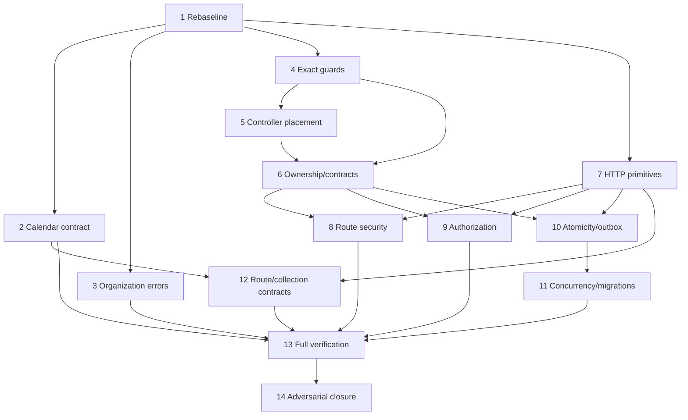

# Cluster Complete Architecture Closure Implementation Plan

> **For agentic workers:** REQUIRED SUB-SKILL: Use superpowers:subagent-driven-development (recommended) or superpowers:executing-plans to implement this plan task-by-task. Steps use checkbox (`- [ ]`) syntax for tracking.

**Goal:** إغلاق جميع المشاكل المعمارية والأمنية والتكاملية المثبتة في Cluster وإصدار قرار إغلاق مبني على بوابات ناجحة على commit واحد.

**Architecture:** يبدأ التنفيذ بإعادة baseline لكل findings القديمة، ثم يعالج مانعي P0، وبعدهما يشدد الحراس ويصلح الحدود والعقود وسلامة البيانات والأمن. كل Task يمثل PR قابلاً للمراجعة مستقلاً، وله اختبار red/green وبوابة خروج؛ لا تبدأ بوابة الإغلاق قبل اكتمال جميع الاعتماديات.

**Tech Stack:** PHP 8.3، Laravel 13.8، PHPUnit 12.5، MySQL/SQLite، React 19، TypeScript 6، Vite 8، Vitest 4، Playwright 1.61، OpenAPI 3.1، Orval، Python 3.12، Make.

**Approved Design:** [`../specs/2026-07-26-cluster-architecture-closure-design.md`](../specs/2026-07-26-cluster-architecture-closure-design.md)

## Global Constraints

- لا تعديل يدوي لـ`apps/web/src/api/generated/cluster.ts` أو أي ملف generated؛ العقد الحاكم أولاً ثم generation.
- clean cutover فقط: تحديث كل caller في PR نفسه، بلا aliases أو compatibility shims متروكة.
- module owner يملك controller وSQL وtransaction وoutbox؛ الاعتماد بين الموديولات يمر عبر `Contracts/` أو `Events/`.
- authorization يسبق detailed validation/resource disclosure.
- state + idempotency + audit + outbox الخاصة بأمر واحد تُعتمد في transaction واحدة.
- optimistic concurrency تُفرض في write predicate وتعيد 412 عند stale version.
- لا إغلاق finding دون test/runtime/static evidence حديث على commit الإغلاق.
- لا commit أو push أو PR إلا بعد تفويض المستخدم؛ أوامر commit أدناه نقاط handoff وليست تفويضاً تلقائياً.
- لا تُعامل checkboxes في خطة 2026-07-25 كحالة حالية؛ سجل الإغلاق المنشأ في Task 1 هو المصدر الحي.

## Scope Amendment (2026-07-26, user-approved)

Canonical historical set for the closure register is exactly the 19
F IDs documented in `Verified scope and corrections` (الخطة القديمة
`docs/superpowers/plans/2026-07-25-cluster-architecture-security-remediation.md`):
F020, F023, F030, F033, F035, F044, F046, F059, F067, F072, F076, F078,
F087, F089, F112, F113, F115, F116, F117. The F001–F123 completeness
claim is **superseded**; the 104 unreachable findings are recorded as
`historical_findings_unrecoverable: 104` in the register's top-level
`scope` metadata, not as placeholders. The closure validator at
`scripts/validate-architecture-closure.py` enforces this via the
`CANONICAL_F_SET` allow-list plus the scope-metadata block; entries
outside that set cannot appear in the register.

Tasks 2–14 remain fully in scope and unmodified. New evidence-backed
defects discovered during execution receive the next available C ID
(C129, C130, …) with `sourced: true` plus at least one evidence item
whose kind is in `{source, command}` and a non-empty exit criterion;
the validator rejects any C### entry without those.

Validator/final-checklist wording referencing the F001–F123 range has
been updated where applicable. Implementation tasks are not changed;
Task 14 closure dossier must print this scope limitation via the plan
amendment and must never state that all 123 historical IDs were tracked.

---

## خريطة الملفات

### ملفات جديدة

- `docs/architecture/` + `architecture-closure-register.yaml` — سجل findings الحي، status/evidence/owner/exit criteria.
- `scripts/validate-architecture-closure.py` — يتحقق من schema، تفرد IDs، وجود المجموعة التاريخية canonical ذات 19 ID و`C124-C128`، صحة `C129+`، وعدم وجود terminal entry بلا evidence صالح.
- `apps/web/src/features/organization/organization-mutation-error.ts` — تصنيف 409/412 ورسالة conflict المشتركة.
- `apps/web/src/features/organization/organization-mutation-error.test.ts` — عقد التصنيف المستقل.
- `docs/architecture/` + `ARCHITECTURE-CLOSURE.md` — dossier النهائي وقرار CLOSED/NOT READY.

### ملفات محورية ستُعدّل

- `docs/contracts/api/openapi.yaml`
- `apps/web/src/api/platform-settings.ts`
- `apps/web/src/features/platform-settings/BusinessCalendarsScreen.tsx`
- `apps/web/src/features/platform-settings/BusinessCalendarsScreen.test.tsx`
- `apps/web/src/features/organization/{PersonDrawer,ClusterDrawer,FacilityDrawer,EndAssignmentDrawer}.tsx`
- `apps/web/src/features/organization/OrganizationDrawers.test.tsx`
- `apps/api/tests/Architecture/ModuleBoundariesTest.php`
- `apps/api/tests/Architecture/ModulePlacementInventory.php`
- `apps/api/Modules/{Reporting,Search}/Http/*.php`
- `apps/api/routes/web.php`
- `apps/api/app/Providers/AppServiceProvider.php`
- `apps/api/Modules/*/Providers/*ServiceProvider.php`
- `apps/api/Shared/Contracts/`
- `apps/api/Shared/Infrastructure/Outbox/`
- `apps/api/Modules/*/Features/*/{Handler,Http}/`
- `apps/api/Modules/*/Tests/`
- `apps/api/composer.json`
- `Makefile`
- `.github/workflows/ci.yml`
- `.github/workflows/ci-e2e.yml`
- `docs/analysis/{SUMMARY,17-cross-cutting-risks}.md`
- `docs/architecture/{ARCHITECTURE,module-catalog}.md`

## Dependency Graph



**Parallel work:** Tasks 2، 3، 4، و7 يمكن تنفيذها بالتوازي بعد Task 1 إذا كانت worktrees منفصلة. Tasks 8، 9، و10 يمكن تنفيذها بالتوازي بعد Tasks 6 و7 بشرط عدم مشاركة handlers نفسها. Task 13 حاجز دمج واحد ولا يُجزّأ.

---

### Task 1: إنشاء baseline وسجل إغلاق حي

**Files:**
- Create: `docs/architecture/` + `architecture-closure-register.yaml`
- Create: `scripts/validate-architecture-closure.py`
- Modify: `scripts/validate-docs.sh`
- Modify: `apps/api/tests/Feature/CiMakeSurfaceTest.php`
- Read: `docs/superpowers/plans/2026-07-25-cluster-architecture-security-remediation.md`
- Read: `docs/analysis/SUMMARY.md`
- Read: `docs/analysis/17-cross-cutting-risks.md`

**Interfaces:**
- Produces: سجل YAML بمعرفات `F020/F023/F030/F033/F035/F044/F046/F059/F067/F072/F076/F078/F087/F089/F112/F113/F115/F116/F117` و`C124+` للمشاكل الجديدة (Scope Amendment 2026-07-26).
- Produces: validator CLI بلا arguments، exit 0 عند سجل صالح وexit 1 عند violation.
- Consumed by: جميع Tasks التالية وTask 14.

**Rollback:** حذف validator والسجل وإزالة استدعائه من `validate-docs.sh`; لا يغير runtime.

- [ ] **Step 1: اكتب test يفشل عند غياب السجل أو نقص findings**

أضف إلى `CiMakeSurfaceTest.php` اختباراً يثبت أن `docs-validate` يستدعي validator وأنه لا يقبل سجلاً ناقصاً:

```php
public function test_docs_validate_requires_a_complete_architecture_closure_register(): void
{
    $makefile = file_get_contents($this->repoRoot.'/Makefile');
    $validator = file_get_contents($this->repoRoot.'/scripts/validate-docs.sh');

    self::assertStringContainsString('scripts/validate-architecture-closure.py', $validator);
    self::assertStringContainsString('docs-validate:', $makefile);
}
```

Run:

```bash
cd apps/api && php artisan test tests/Feature/CiMakeSurfaceTest.php --filter=architecture_closure_register
```

Expected: FAIL لأن validator غير موصول بعد.

- [ ] **Step 2: أنشئ schema ثابتاً للسجل**

ابدأ `architecture-closure-register.yaml` بهذه البنية وكرر entry لكل ID من المجموعة التاريخية canonical ذات 19 ID، ثم أضف المشاكل الحالية `C124` contract/client، `C125` Organization errors، `C126` inventory exactness، `C127` controller layout، و`C128` E2E evidence:

```yaml
version: 1
baseline_date: '2026-07-26'
source_commit: be9dd40
findings:
  - id: F020
    domain: contracts
    priority: P2
    sourced: true
    status: not-a-defect
    claim: Absence of Contracts/ in Tasks, WorkRecords, Search, Reporting is not itself a rule violation; create contracts only when a module publishes a cross-module API.
    evidence:
      - kind: source
        value: docs/superpowers/plans/2026-07-25-cluster-architecture-security-remediation.md#43
    owner_task: 7
    exit_criteria: Verify no module publishes a cross-module API without an accompanying Contracts/ surface.
```

القيم المسموحة:

```text
status: open | blocked | closed | accepted-risk | not-a-defect
priority: P0 | P1 | P2
domain: contracts | boundaries | data-integrity | security | web | migrations | tooling
```

- [ ] **Step 3: اكتب validator ببوابات exact**

في `scripts/validate-architecture-closure.py`:

```python
from pathlib import Path
import sys
import yaml

REGISTER = Path(__file__).resolve().parents[1] / "docs" / "architecture" / "architecture-closure-register.yaml"
ALLOWED_STATUS = {"open", "blocked", "closed", "accepted-risk", "not-a-defect"}
ALLOWED_PRIORITY = {"P0", "P1", "P2"}
ALLOWED_DOMAIN = {"contracts", "boundaries", "data-integrity", "security", "web", "migrations", "tooling"}
REQUIRED_HISTORICAL = {f"F{number:03d}" for number in range(1, 124)}


def fail(message: str) -> None:
    print(f"ERROR: {message}", file=sys.stderr)
    raise SystemExit(1)


def main() -> None:
    payload = yaml.safe_load(REGISTER.read_text(encoding="utf-8"))
    findings = payload.get("findings", [])
    if not isinstance(findings, list):
        fail("findings must be a list")
    ids = [entry.get("id") for entry in findings]
    if len(ids) != len(set(ids)):
        fail("architecture closure finding IDs must be unique")
    missing = sorted(REQUIRED_HISTORICAL - set(ids))
    if missing:
        fail("missing historical findings: " + ", ".join(missing))
    for entry in findings:
        finding_id = entry.get("id")
        if entry.get("status") not in ALLOWED_STATUS:
            fail(f"{finding_id}: invalid status")
        if entry.get("priority") not in ALLOWED_PRIORITY:
            fail(f"{finding_id}: invalid priority")
        if entry.get("domain") not in ALLOWED_DOMAIN:
            fail(f"{finding_id}: invalid domain")
        if not entry.get("claim") or not entry.get("exit_criteria") or not entry.get("owner_task"):
            fail(f"{finding_id}: claim, exit criteria, and owner task are required")
        if entry.get("status") == "accepted-risk" and entry.get("priority") in {"P0", "P1"}:
            fail(f"{finding_id}: P0/P1 findings cannot be accepted risks")
        if entry.get("status") in {"closed", "not-a-defect", "accepted-risk"} and not entry.get("evidence"):
            fail(f"{finding_id}: terminal status requires evidence")


if __name__ == "__main__":
    main()
```

- [ ] **Step 4: صِل validator ببوابة الوثائق**

أضف في `scripts/validate-docs.sh` بعد YAML syntax validation:

```bash
"$PYTHON_BIN" scripts/validate-architecture-closure.py
```
Expected: PASS، وتغطية IDs `F020/F023/F030/F033/F035/F044/F046/F059/F067/F072/F076/F078/F087/F089/F112/F113/F115/F116/F117` و`C124+` بلا duplicate أو terminal entry بلا evidence (per Scope Amendment 2026-07-26).

- [ ] **Step 5: أعد قياس baseline وصحح كل entry**

نفذ القياسات التالية وسجل ناتج كل finding بدل نسخ حالة الخطة القديمة:

```bash
make verify-boundaries
make lint-api
make analyse-api
npm --prefix apps/web run api:check
npm --prefix apps/web run test:unit
npm --prefix apps/web run build
```

صنّف finding `closed` فقط عندما يثبت أمر أو مصدر معاصر معيار خروجه. استخدم `not-a-defect` للتصحيحات الموثقة في قسم “Verified scope and corrections” بالخطة القديمة. لا تستخدم `accepted-risk` لـP0/P1.

- [ ] **Step 6: تحقق من البوابة**

Run:

```bash
make docs-validate
cd apps/api && php artisan test tests/Feature/CiMakeSurfaceTest.php
```

Expected: PASS، وتغطية IDs `F020/F023/F030/F033/F035/F044/F046/F059/F067/F072/F076/F078/F087/F089/F112/F113/F115/F116/F117` و`C124+` بلا duplicate أو terminal entry بلا evidence (per Scope Amendment 2026-07-26).

- [ ] **Step 7: نقطة commit بعد التفويض**

```bash
git add 'docs/architecture/'architecture-closure-register.yaml scripts/validate-architecture-closure.py scripts/validate-docs.sh apps/api/tests/Feature/CiMakeSurfaceTest.php
git commit -m "docs: establish architecture closure register"
```

---

### Task 2: توحيد Business Calendar contract والعميل المولّد

**Files:**
- Modify: `docs/contracts/api/openapi.yaml`
- Modify: `apps/web/src/api/platform-settings.ts`
- Modify: `apps/web/src/features/platform-settings/BusinessCalendarsScreen.tsx`
- Modify: `apps/web/src/features/platform-settings/BusinessCalendarsScreen.test.tsx`
- Modify: `apps/api/Modules/PlatformSettings/Tests/PlatformSettingsHttpAdapterTest.php`
- Regenerate: `apps/web/src/api/generated/cluster.ts`
- Update: closure register (`C124`, `C129`-`C131`)

**Interfaces:**
- Authoritative live paths:
  - `GET /platform-settings/calendars`
  - `POST /platform-settings/calendars`
  - `PUT /platform-settings/calendars/{calendarId}/weekdays/{weekday}`
  - `PUT /platform-settings/calendars/{calendarId}/exceptions/{date}`
  - `POST /platform-settings/calendars/{calendarId}/publish`
- Generated operations: `listPlatformSettingsCalendars`, `createPlatformSettingsCalendar`, `setPlatformSettingsCalendarWeekday`, `setPlatformSettingsCalendarException`, `publishPlatformSettingsCalendar`.
- Generated schemas: `BusinessCalendarCreate`, `BusinessCalendarWeekday`, `BusinessCalendarException`.

**Decision:** التنفيذ الحالي هو surface المعتمد. تُستبدل paths المخططة `/business-calendars` و`/days/{date}` في master OpenAPI بالمسارات الحية أعلاه، ولا تُنشأ aliases.

**User-approved mutation (2026-07-26):** ISO-8601 weekday values are `1..7` (Sunday is `7`, zero is rejected). `BusinessCalendarCreate` requires correlated `scope_type`/`scope_id` values, and the exception enum exactly follows `CalendarException::forRange`.

**Rollback:** revert كامل للعقد والعميل والwrappers؛ لا تستعد generated file وحده.

- [ ] **Step 1: ثبّت route/contract mismatch باختبار**

أضف assertions في `PlatformSettingsHttpAdapterTest.php` أو feature route test تتأكد من أسماء الطرق الخمسة ومن 404 للمسار المخطط القديم.

Run:

```bash
cd apps/api && php artisan test Modules/PlatformSettings/Tests/PlatformSettingsHttpAdapterTest.php
```

Expected before contract change: runtime tests pass، لكن `npm --prefix apps/web run api:check` يغيّر generated client ويكشف mismatch.

- [ ] **Step 2: استبدل calendar paths والoperationIds في OpenAPI**

استخدم البنية التالية في `docs/contracts/api/openapi.yaml`:

```yaml
/platform-settings/calendars:
  get:
    operationId: listPlatformSettingsCalendars
  post:
    operationId: createPlatformSettingsCalendar
/platform-settings/calendars/{calendarId}/weekdays/{weekday}:
  put:
    operationId: setPlatformSettingsCalendarWeekday
/platform-settings/calendars/{calendarId}/exceptions/{date}:
  put:
    operationId: setPlatformSettingsCalendarException
/platform-settings/calendars/{calendarId}/publish:
  post:
    operationId: publishPlatformSettingsCalendar
```

احتفظ بـCorrelation ID وIdempotency-Key وIf-Match وproblem responses المطابقة للroutes الفعلية. عرّف weekday حسب ISO-8601 كعدد `1..7` (الأحد `7`، والصفر مرفوض) وdate بصيغة `date`. اجعل `BusinessCalendarCreate.scope_type` و`scope_id` مطلوبين ومترابطين: المنصة ترسل القيمة الحرفية `platform`، والتجمع/المنشأة يرسلان UUID الفعلي. طابق enum الاستثناءات مع `CalendarException::forRange` حرفياً.

- [ ] **Step 3: ولّد العميل ثم حدّث wrappers ضد الناتج فقط**

```bash
npm --prefix apps/web run api:generate
npm --prefix apps/web run api:check
```

Expected: PASS ولا diff ثانٍ بعد generation المتكرر.

في `platform-settings.ts` استدعِ أسماء generated المحددة في Interfaces أعلاه؛ لا تعرّف schemas يدوياً.

- [ ] **Step 4: تحقق من سلوك الشاشة**

حدّث `BusinessCalendarsScreen.test.tsx` لتثبت create، weekday، exception، publish، 412، ومنع double-submit. ثم:

```bash
npm --prefix apps/web run test:unit -- BusinessCalendarsScreen.test.tsx
npm --prefix apps/web run build
npm --prefix apps/web run api:check
```

Expected: جميعها PASS على الملف المولّد نفسه.

- [ ] **Step 5: أغلق C124 بالدليل**

سجل أوامر `api:check` و`build` وPlatformSettings tests في `C124`، واجعل `closed_by` commit هذا الـPR.

- [ ] **Step 6: نقطة commit بعد التفويض**

```bash
git add docs/contracts/api/openapi.yaml apps/web/src/api/generated/cluster.ts apps/web/src/api/platform-settings.ts apps/web/src/features/platform-settings apps/api/Modules/PlatformSettings/Tests 'docs/architecture/'architecture-closure-register.yaml
git commit -m "fix: align business calendar contract and client"
```

---

### Task 3: إصلاح دلالة 409/412 في Organization drawers

**Files:**
- Create: `apps/web/src/features/organization/organization-mutation-error.ts`
- Create: `apps/web/src/features/organization/organization-mutation-error.test.ts`
- Modify: `apps/web/src/features/organization/PersonDrawer.tsx`
- Modify: `apps/web/src/features/organization/ClusterDrawer.tsx`
- Modify: `apps/web/src/features/organization/FacilityDrawer.tsx`
- Modify: `apps/web/src/features/organization/EndAssignmentDrawer.tsx`
- Modify: `apps/web/src/features/organization/OrganizationDrawers.test.tsx`
- Update: closure register (`C125`)

**Correction:** The earlier `AssignmentDrawer.tsx` entry was a filename typo. The 8-case regression suite exercises the versioned end mutation in `EndAssignmentDrawer.tsx`; `AssignmentDrawer.tsx` only creates assignments and is intentionally unchanged.

**Interfaces:**

```ts
export type OrganizationMutationFailure =
  | { kind: 'stale'; message: null }
  | { kind: 'conflict'; message: string }
  | { kind: 'save'; message: null }

export function classifyOrganizationMutationFailure(error: unknown): OrganizationMutationFailure
```

**Rollback:** revert helper واستخداماته معاً؛ الاختبارات الحالية تمنع الرجوع إلى دمج 409 و412.

- [ ] **Step 1: شغّل reproduction الحالي**

```bash
npm --prefix apps/web run test:unit -- OrganizationDrawers.test.tsx
```

Expected: 8 FAIL بسبب غياب `data-testid="org-drawer-alert"` ودمج 409/412.

- [ ] **Step 2: اكتب unit test للمصنف**

```ts
it('preserves conflict detail and keeps precondition failures stale', () => {
  expect(classifyOrganizationMutationFailure(new ApiError(409, {
    type: 'about:blank', title: 'Conflict', status: 409, detail: 'Duplicate code',
  }))).toEqual({ kind: 'conflict', message: 'Duplicate code' })
  expect(classifyOrganizationMutationFailure(new ApiError(412, {
    type: 'about:blank', title: 'Precondition Failed', status: 412,
  }))).toEqual({ kind: 'stale', message: null })
})
```

Run: `npm --prefix apps/web run test:unit -- organization-mutation-error.test.ts`
Expected: FAIL لأن helper غير موجود.

- [ ] **Step 3: نفذ المصنف**

```ts
import { ApiError } from '../../api/http'

export type OrganizationMutationFailure =
  | { kind: 'stale'; message: null }
  | { kind: 'conflict'; message: string }
  | { kind: 'save'; message: null }

export function classifyOrganizationMutationFailure(error: unknown): OrganizationMutationFailure {
  if (!(error instanceof ApiError)) return { kind: 'save', message: null }
  if (error.status === 412) return { kind: 'stale', message: null }
  if (error.status === 409) {
    return { kind: 'conflict', message: error.problem.detail ?? error.problem.title }
  }
  return { kind: 'save', message: null }
}
```

- [ ] **Step 4: طبّق عقد العرض في drawers الأربعة**

استخدم failure state منفصلاً، واعرض alert واحداً بهذا العقد:

```tsx
<p data-testid="org-drawer-alert" ref={errorRef} className="error-summary" role="alert" tabIndex={-1}>
  {failure.kind === 'conflict' ? failure.message : failure.kind === 'stale' ? text.stale : text.saveError}
</p>
```

لا تغلق drawer عند failure، وانقل focus إلى alert بعد 409/412.

- [ ] **Step 5: تحقق من الاختبارات والـbuild**

```bash
npm --prefix apps/web run test:unit -- organization-mutation-error.test.ts OrganizationDrawers.test.tsx OrganizationOverview.test.tsx
npm --prefix apps/web run test:unit
npm --prefix apps/web run build
```

Expected: 8 حالات regression PASS، ثم suite وbuild PASS.

- [ ] **Step 6: أغلق C125 ثم نقطة commit بعد التفويض**

```bash
git add apps/web/src/features/organization 'docs/architecture/'architecture-closure-register.yaml
git commit -m "fix: distinguish organization conflict and stale errors"
```

---

### Task 4: جعل architecture inventories exact

**Files:**
- Modify: `apps/api/tests/Architecture/ModuleBoundariesTest.php`
- Modify: `apps/api/tests/Architecture/ModulePlacementInventory.php`
- Modify: `docs/architecture/module-catalog.md`
- Modify: `docs/architecture/ARCHITECTURE.md`
- Update: closure register (`C126`، findings 3/16/19/78/123)

**Interfaces:**
- `TABLE_OWNERS` يساوي set جداول `Schema::create` تماماً.
- virtual read models لا تدخل `TABLE_OWNERS`; إن احتاجها الحارس فتوضع في constant منفصل `VIRTUAL_RESOURCES`.
- كل placement exception له path موجود وexpiry غير منتهٍ وreason.

**Rollback:** revert test+inventory+docs كوحدة؛ لا تعيد ghost owner لإسكات الاختبار.

- [ ] **Step 1: أضف test يفشل على owner زائد**

داخل test الحالي `test_every_migrated_table_has_an_owner_and_owners_match_actual_module_layout` احسب:

```php
$extra = array_values(array_diff(array_keys(self::TABLE_OWNERS), array_keys($tables)));
$this->assertSame([], $extra, 'TABLE_OWNERS contains entries without a Schema::create migration.');
```

Run: `make verify-boundaries`
Expected: FAIL ويذكر `project_work_record_read_models`.

- [ ] **Step 2: أضف path-existence assertion**

في اختبار inventory:

```php
$this->assertFileExists(
    base_path($entry['path']),
    "misplaced inventory path does not exist: {$entry['path']}"
);
```

Run: `make verify-boundaries`
Expected: FAIL على مساري `ListDashboardsController.php` و`ListReportsController.php` القديمين.

- [ ] **Step 3: صحح inventories من المصدر**

- احذف `project_work_record_read_models` من `TABLE_OWNERS`; لا يوجد migration له.
- احذف مساري Reporting غير الموجودين.
- أضف `reason` لكل استثناء باقٍ، واختبره non-empty.
- حدّث module catalog وARCHITECTURE لإزالة أرقام 97/96 بعد أن تصبح exact.

- [ ] **Step 4: أضف fixtures سلبية**

أثبت أن ghost owner، missing owner، stale path، وexpired exception تفشل برسائل مستقلة؛ لا تختبر source text فقط، بل مرر inventory مؤقتاً إلى helper قابل للاختبار إذا لزم.

- [ ] **Step 5: تحقق وأغلق findings**

```bash
make verify-boundaries
make docs-validate
```

Expected: PASS؛ sets متساوية وكل inventory path موجود.

- [ ] **Step 6: نقطة commit بعد التفويض**

```bash
git add apps/api/tests/Architecture docs/architecture
git commit -m "test: enforce exact architecture inventories"
```

---

### Task 5: إكمال controller placement وترحيل Reporting/Search

**Files:**
- Move: `apps/api/Modules/Reporting/Http/DownloadExportController.php` → `apps/api/Modules/Reporting/Features/Exports/Http/DownloadExportController.php`
- Move: `apps/api/Modules/Reporting/Http/CreateReportExportController.php` → `apps/api/Modules/Reporting/Features/Exports/Http/CreateReportExportController.php`
- Move: `apps/api/Modules/Reporting/Http/GetReportController.php` → `apps/api/Modules/Reporting/Features/Reports/Http/GetReportController.php`
- Move: `apps/api/Modules/Reporting/Http/GetDashboardController.php` → `apps/api/Modules/Reporting/Features/Dashboards/Http/GetDashboardController.php`
- Move: `apps/api/Modules/Search/Http/SearchController.php` → `apps/api/Modules/Search/Features/Search/Http/SearchController.php`
- Modify: namespaces/imports in `apps/api/routes/web.php`
- Modify: related providers/tests/importers found by LSP references
- Modify: `apps/api/tests/Architecture/ModuleBoundariesTest.php`
- Update: closure register (`C127`، findings 1–3/9–10)

**Interfaces:** controller public route signatures and HTTP behavior remain unchanged.

**Rollback:** revert each module move and route imports as one PR; no alias classes at old paths.

- [ ] **Step 1: أضف failing placement guard**

اجعل الحارس يفحص كل `Modules/*/Http/*Controller.php` ويرفضه، مع السماح بـAPI helper مثل `ReportingApi.php` فقط إذا كان catalog يعرّفه support boundary غير controller.

Run: `make verify-boundaries`
Expected: FAIL على controllers الخمسة.

- [ ] **Step 2: افحص references قبل النقل**

استخدم LSP `references` و`rename_file` لكل controller، ثم حدّث routes/providers/tests؛ لا تستخدم text rename عبر الملفات.

- [ ] **Step 3: انقل controllers حسب feature ownership**

لا تنقل `ReportingApi.php` أو `SearchApi.php` إلى Features؛ هما HTTP support للموديول. حدّث namespaces فقط للcontrollers الخمسة واحذف المسارات القديمة بالكامل.

- [ ] **Step 4: تحقق من route behavior**

```bash
cd apps/api && php artisan route:list --path=api/v1
make verify-boundaries
cd apps/api && php artisan test Modules/Reporting/Tests Modules/Search/Tests
```

Expected: نفس method/path/controller actions، tests PASS، ولا controller تحت `Modules/*/Http/`.

- [ ] **Step 5: نقطة commit بعد التفويض**

```bash
git add apps/api/Modules/Reporting apps/api/Modules/Search apps/api/routes/web.php apps/api/tests/Architecture 'docs/architecture/'architecture-closure-register.yaml
git commit -m "refactor: finish reporting and search controller placement"
```

---

### Task 6: إصلاح cross-module contracts وملكية outbox

**Files:**
- Modify: `apps/api/Shared/Contracts/TransactionalOutbox.php`
- Modify: `apps/api/Shared/Infrastructure/Outbox/DatabaseTransactionalOutbox.php`
- Modify: `apps/api/Shared/Infrastructure/Outbox/OutboxEventType.php`
- Move: `apps/api/Modules/WorkRecords/Infrastructure/Outbox/Migrations/CreateOutboxTable.php` → `apps/api/Shared/Infrastructure/Outbox/Migrations/CreateOutboxTable.php`
- Modify: `apps/api/config/module_migrations.php`
- Modify/Create: module contracts under `apps/api/Modules/{Organization,Authorization,Workflow}/Contracts/`
- Modify: consumers in Tasks، WorkRecords، Reporting، Documents، Organization، Identity
- Modify: `apps/api/app/Providers/AppServiceProvider.php`
- Modify: `apps/api/Modules/*/Providers/*ServiceProvider.php`
- Modify: `apps/api/tests/Architecture/ModuleBoundariesTest.php`
- Update: closure register findings 4–19 و`outbox_events` finding.

**Interfaces:**
- modules consume stable interfaces from owning `Contracts/` namespaces.
- `DatabaseTransactionalOutbox` is the only shared writer to `outbox_events`.
- one explicit owner is recorded for `outbox_events`; producer modules never issue raw SQL to it.

**Decision:** `outbox_events` becomes Shared infrastructure owned through a Shared contract, not a WorkRecords business table. `document_outbox_events` remains Documents-owned only if a tested relay contract justifies separation; otherwise migrate Documents to shared outbox in this PR.

**Rollback:** contract + binding + callers revert together; database migration rollback only after proving no event loss in disposable DB.

- [ ] **Step 1: أضف architecture fixtures تفشل على cross-owner SQL/imports**

اختبر imports إلى `Modules\Other\Infrastructure` و`Shared\Infrastructure`، وraw `DB::table('outbox_events')` داخل producer module.

Run: `make verify-boundaries`
Expected: fixtures FAIL بالرسالة المحددة.

- [ ] **Step 2: عرّف contract الضيق**

```php
namespace Shared\Contracts;

interface TransactionalOutbox
{
    /** @param array<string, mixed> $payload */
    public function append(string $eventId, string $aggregateId, string $eventType, array $payload): void;
}
```

احتفظ بالتنفيذ وقاعدة البيانات داخل Shared Infrastructure، واربطه في composition root.

- [ ] **Step 3: انقل ملكية migration إلى Shared دون إعادة تشغيلها**

انقل ملف migration نفسه مع timestamp/class identity نفسها إلى Shared، وحدّث path في `config/module_migrations.php`. عدّل architecture migration scanner ليقبل owner اسمه `Shared` لهذا الجدول فقط، ويظل يرفض business tables تحت Shared. أثبت على database migrated مسبقاً أن `migrate:status` لا يعيد إنشاء الجدول، وعلى database فارغة أن migration تعمل مرة واحدة.

- [ ] **Step 4: استبدل كل raw/cross-owner caller**

- Organization reads تخرج عبر Organization contracts.
- Tasks reads لـWorkflow تخرج عبر Workflow contract.
- WorkRecords reads لـAuthorization تخرج عبر Authorization contract.
- كل outbox producer يحقن `TransactionalOutbox` ولا يكتب الجدول مباشرة.
- لا تنقل domain types إلى Shared؛ انشر DTOs صغيرة تخص العقد.

- [ ] **Step 5: وحّد event catalog والduplicate semantics**

قرر no-op replay لنفس `eventId` ونفس payload، و409/domain conflict لنفس ID مع payload مختلف. أضف كل `com.cluster.*.v<n>` إلى `OutboxEventType` وJSON schema المقابل.

- [ ] **Step 6: تحقق من الحدود والموديولات**

```bash
make verify-boundaries
cd apps/api && php artisan test Modules/WorkRecords/Tests Modules/Tasks/Tests Modules/Workflow/Tests Modules/Documents/Tests Modules/Organization/Tests
```

Expected: PASS ولا raw write إلى shared outbox خارج adapter.

- [ ] **Step 7: نقطة commit بعد التفويض**

```bash
git add apps/api/Shared apps/api/Modules apps/api/config/module_migrations.php apps/api/app/Providers apps/api/tests/Architecture 'docs/architecture/'architecture-closure-register.yaml
git commit -m "refactor: enforce cross-module contracts and outbox ownership"
```

---

### Task 7: توحيد HTTP problem/envelope/correlation primitives

**Files:**
- Modify: `apps/api/bootstrap/app.php`
- Create or consolidate: `apps/api/app/Support/ProblemEnvelope.php`
- Modify: `apps/api/app/Http/Middleware/IdentitySessionMiddleware.php`
- Modify: `apps/api/app/Http/Middleware/RequireIdentitySessionPrincipal.php`
- Modify: module `*Api.php` HTTP helpers
- Test: API feature/security tests covering 401/403/404/409/412/422.
- Update: closure register findings 25–30/41–42/54–58/61–62.

**Interfaces:** one `application/problem+json` renderer، canonical correlation request attribute، resources use `{data: ...}` and ETags when versioned.

**Rollback:** revert renderer registration and helpers together; do not keep duplicate render paths.

- [ ] **Step 1: اكتب response matrix tests**

لكل status 401/403/404/409/412/422 أثبت content type، `status` body، correlation header/body، وعدم وجود raw exception message.

- [ ] **Step 2: نفذ typed renderers**

```php
final class ProblemEnvelope
{
    /** @param array<string, mixed> $extra */
    public static function make(int $status, string $type, string $title, string $correlationId, array $extra = []): JsonResponse
    {
        return response()->json(['type' => $type, 'title' => $title, 'status' => $status, 'correlation_id' => $correlationId] + $extra, $status, ['Content-Type' => 'application/problem+json']);
    }
}
```

سجل typed exception render callbacks في `bootstrap/app.php`; لا تمسك `Throwable` في controller لتحويله حسب message.

- [ ] **Step 3: وحّد correlation وIf-Match parsing**

ضع correlation ID مرة واحدة في request attributes واستهلكه كل middleware/helper. اقبل strong positive ETags فقط، وارفض weak/malformed tags بـ400 أو412 وفق العقد الموثق.

- [ ] **Step 4: وحّد confirmed envelope sites**

طبّق على Identity/Search/Reporting/Workflow sites المثبتة في register فقط؛ لا تعيد كتابة endpoints المطابقة.

- [ ] **Step 5: تحقق**

```bash
cd apps/api && php artisan test tests/Feature tests/Security
make analyse-api
```

Expected: response matrix PASS وPHPStan 0 errors.

- [ ] **Step 6: نقطة commit بعد التفويض**

```bash
git add apps/api/bootstrap apps/api/app/Support apps/api/app/Http apps/api/Modules apps/api/tests 'docs/architecture/'architecture-closure-register.yaml
git commit -m "refactor: standardize API problem responses"
```

---

### Task 8: إغلاق route security وcapability ordering

**Files:**
- Modify: `apps/api/routes/web.php`
- Modify: named module controllers from closure register findings 21–24/31–35/49–53/59–60/63–67/73–76/90–92.
- Modify: `apps/web/src/shell/routes.ts`
- Modify: affected screens/route-gate tests.
- Modify: `docs/api/rbac-matrix.md` generator/source.

**Interfaces:** mutation middleware matrix = session + principal + CSRF، ثم Idempotency-Key وIf-Match حسب command contract؛ controller authorizes before detailed validation.

**Rollback:** revert per endpoint family; لا تترك route محمية في docs فقط.

- [ ] **Step 1: أنشئ route security matrix test**

لكل mutation في register أثبت 401 بلا session، 403 بلا capability، CSRF failure بلا token، 400 بلا idempotency عند required، و412 عند stale If-Match.

- [ ] **Step 2: طبّق middleware على routes لا reads**

استخدم named middleware/policies الحالية أو استخرج aliases في bootstrap. لا تطبق idempotency/If-Match globally على GET.

- [ ] **Step 3: أصلح authorization ordering**

في controllers الثمانية المثبتة، نفذ capability/resource concealment قبل detailed validation. اختبر أن principal غير المخول لا يميز malformed body من وجود resource.

- [ ] **Step 4: طابق web route gates مع server capabilities**

حدّث `routes.ts` وper-control actions؛ لا تستخدم broad read capability لزر mutation. ولّد RBAC matrix من runtime/controller metadata.

- [ ] **Step 5: تحقق**

```bash
cd apps/api && php artisan test tests/Security tests/Feature
npm --prefix apps/web run test:unit -- routes
make docs-validate
```

Expected: security matrix وroute gates وRBAC generation PASS.

- [ ] **Step 6: نقطة commit بعد التفويض**

```bash
git add apps/api/routes apps/api/bootstrap apps/api/Modules apps/web/src/shell apps/web/src/features docs/api 'docs/architecture/'architecture-closure-register.yaml
git commit -m "fix: close route security and capability gaps"
```

---

### Task 9: إغلاق ABAC/classification/delegation semantics

**Files:**
- Modify: `apps/api/Modules/Authorization/Infrastructure/RbacAbacDecideAccess.php`
- Modify: `apps/api/Modules/Authorization/Domain/FieldAccessTemplate.php`
- Modify: `apps/api/Modules/Authorization/Features/Capabilities/Handler/ListEffectiveCapabilitiesForUser.php`
- Modify: `apps/api/Modules/Authorization/Infrastructure/AuthorizationHttpGateway.php`
- Modify: WorkRecords/Search/Reporting projection handlers.
- Modify: Authorization/WorkRecords/Search/Reporting tests.
- Update: closure register findings 68–84.

**Interfaces:** evaluation order = capability → classification → delegation → explicit deny → field projection. Missing/malformed policy = deny. Effective capabilities subtract active explicit denies.

**Rollback:** revert engine + projections + tests as a unit; لا تعطل policy لتجاوز failure.

- [ ] **Step 1: اكتب denial/masking matrix**

غطِّ Get/List/Search/Report/Dashboard/Export/Download، missing policy، malformed template، explicit deny، revoked/expired delegation، وself-read.

- [ ] **Step 2: نفذ evaluation order fail-closed**

لا تنتج allowed actions أو fields قبل classification/delegation/deny. طبّع field paths إلى `payload.foo` في نقطة واحدة.

- [ ] **Step 3: أصلح delegation lifecycle**

اجعل revoke فورياً ومتوافقاً مع predicate؛ projection الفعال يطرح deny ويستبعد expired/revoked grants. أوصل simulation facts providers الفعلية أو احذف resolver غير المستخدم cleanly بعد إثبات عدم وجود callsites.

- [ ] **Step 4: مرر AccessProjection لكل read/export**

Search لا يسرب denied totals، Reporting/Download يستخدم capabilities الخاصة به، وWorkDefinition policy key يصل إلى submitted record.

- [ ] **Step 5: تحقق**

```bash
cd apps/api && php artisan test Modules/Authorization/Tests Modules/WorkRecords/Tests Modules/Search/Tests Modules/Reporting/Tests
make analyse-api
```

Expected: denial/masking/lifecycle matrix PASS.

- [ ] **Step 6: نقطة commit بعد التفويض**

```bash
git add apps/api/Modules/Authorization apps/api/Modules/WorkRecords apps/api/Modules/Search apps/api/Modules/Reporting 'docs/architecture/'architecture-closure-register.yaml
git commit -m "fix: enforce authorization and projection semantics"
```

---

### Task 10: جعل state/audit/idempotency/outbox atomic

**Files:**
- Modify: Tasks transition/complete handlers.
- Modify: Workflow versions/publish/act/cancel handlers.
- Modify: Documents grant/link/update/transition handlers.
- Modify: Organization/Identity/PlatformSettings producers.
- Modify: module persistence adapters and tests.
- Update: closure register findings 85–89/98–116.

**Interfaces:** application handler owns transaction؛ outbox adapter يشارك connection/transaction؛ duplicate idempotency returns stored response؛ rollback leaves no state/audit/outbox fragment.

**Rollback:** revert each command family independently before merge; never partial-revert transaction wrapper without callers.

- [ ] **Step 1: اكتب failure-injection tests لكل producer family**

أضف adapter fake يرمي بعد state write وقبل outbox append، ثم أثبت أن transaction rollback يعيد count/state السابق. اختبر Tasks، Workflow، Documents، Organization، Identity، PlatformSettings.

- [ ] **Step 2: انقل transaction إلى handler**

النمط المطلوب:

```php
return DB::transaction(function () use ($command): Result {
    $result = $this->repository->apply($command);
    $this->audit->record($result->auditEvent());
    $this->outbox->append($result->eventId(), $result->eventType(), $result->payload());
    $this->idempotency->store($command->idempotencyKey(), $result);
    return $result;
});
```

لا يبدأ controller transaction ولا ينفذ re-read خارجها.

- [ ] **Step 3: وحّد idempotency replay**

نفس key + نفس fingerprint يعيد response المخزن، ونفس key + payload مختلف يعيد 409. خزّن السجل داخل owner module أو shared command contract، لا جدول module آخر.

- [ ] **Step 4: أصلح Documents relay decision**

إما وصل `document_outbox_events` بـrelay مختبر أو انقل Documents إلى shared outbox. لا يبقى جدول event لا يستهلكه relay دون accepted-risk موثق.

- [ ] **Step 5: تحقق**

```bash
cd apps/api && php artisan test Modules/Tasks/Tests Modules/Workflow/Tests Modules/Documents/Tests Modules/Organization/Tests Modules/Identity/Tests Modules/PlatformSettings/Tests
make verify-boundaries
```

Expected: failure injection rollback PASS ولا architecture violations.

- [ ] **Step 6: نقطة commit بعد التفويض**

```bash
git add apps/api/Modules apps/api/Shared 'docs/architecture/'architecture-closure-register.yaml
git commit -m "fix: make commands and outbox atomic"
```

---

### Task 11: توحيد optimistic concurrency وإصلاح migrations

**Files:**
- Modify when still open in Task 1: `apps/api/Modules/Documents/Features/Upload/DocumentUploadHandler.php`
- Modify when still open: `apps/api/Modules/Workflow/Infrastructure/Persistence/WorkflowStepAdvancer.php`
- Modify when still open: `apps/api/Modules/Tasks/Features/CompleteTask/Handler/CompleteTaskHandler.php`
- Modify when still open: `apps/api/Modules/Authorization/Infrastructure/Persistence/AuthorizationBootstrapState.php`
- Modify when still open: `apps/api/Modules/Organization/Features/OrganizationUnit/Handler/OrganizationUnitHandler.php`
- Modify when still open: `apps/api/Modules/WorkDefinitions/Features/Definition/Handler/WorkDefinitionMutator.php`
- Modify when still open: `apps/api/Modules/Workflow/Infrastructure/Persistence/Migrations/{W15CreateWorkflowDecisionsTable,W16CreateWorkflowDecisionsTable,W17AddApprovalColumnsToWorkflowVersions}.php`
- Modify when still open: `apps/api/Modules/Identity/Infrastructure/Persistence/Migrations/CreateIdentityAccountTables.php`
- Modify when still open: `apps/api/Modules/Notifications/Infrastructure/Persistence/Migrations/{W18CreateNotificationDeliveryTables,W20UpgradeTechnicalAlertFanoutSchema}.php`
- Modify when still open: Organization migrations named by `config/module_migrations.php` and classified open in Task 1.
- Modify: `apps/api/tests/Architecture/ModuleBoundariesTest.php` migration manifest tests.
- Modify: `scripts/run-mysql-integration-tests.sh` and `apps/api/phpunit.mysql.xml` only if discovery excludes new tests.

**Interfaces:** CAS uses `WHERE id = ? AND lock_version = ?`; affected rows 0 → 412; version allocation uses lock or unique constraint; migrations have exact up/down schema evidence.

**Rollback:** migration changes require disposable DB rollback proof before PR; production migrations are append-only when already deployed.

- [ ] **Step 1: اكتب two-connection tests**

لكل open CAS finding، افتح اتصالين MySQL، اقرأ نفس version، نفذ تحديثين، وأثبت winner واحد + 412 واحد + child/outbox effect واحد.

- [ ] **Step 2: أصلح write predicates**

```php
$updated = DB::table($table)
    ->where('id', $id)
    ->where('lock_version', $expectedVersion)
    ->update([...$changes, 'lock_version' => $expectedVersion + 1]);

if ($updated !== 1) {
    throw new PreconditionFailedHttpException('Resource version is stale.');
}
```

احذف controller pre-read الذي لا يضمن atomicity بعد تطبيق predicate.

- [ ] **Step 3: أصلح version allocation والchild effects**

Workflow version number يستخدم parent-row lock أو unique `(workflow_definition_id, version_number)` مع bounded retry. حدّث child lock versions عندما تتغير حالتها المرئية.

- [ ] **Step 4: اختبر migration manifest/reversibility**

ثبت أن كل migration مسجلة مرة واحدة، ولا orphan/conflict، وأن up→down يعيد schema السابق لـIdentity credentials وNotifications W20 وWorkflow W17 وOrganization seed ownership.

- [ ] **Step 5: تحقق على MySQL**

```bash
make verify-mysql-integration
make verify-boundaries
cd apps/api && php artisan test
```

Expected: MySQL لا يطبع SKIP في بيئة الإغلاق؛ concurrency والمهاجرات وAPI suite PASS.

- [ ] **Step 6: نقطة commit بعد التفويض**

```bash
git add apps/api/Modules apps/api/tests/Architecture apps/api/phpunit.mysql.xml scripts/run-mysql-integration-tests.sh 'docs/architecture/'architecture-closure-register.yaml
git commit -m "fix: enforce concurrency and migration integrity"
```

---

### Task 12: توحيد route/OpenAPI والـbounded collections

**Files:**
- Modify: `docs/contracts/api/openapi.yaml`
- Modify: collection handlers/adapters classified open in findings 40/43–48/93–97.
- Create/Modify: shared authenticated cursor codec in the existing shared HTTP/application support namespace selected by Task 1 evidence.
- Modify: route/docs generation scripts.
- Regenerate: `apps/web/src/api/generated/cluster.ts`, `docs/api/endpoints.md`, `docs/api/rbac-matrix.md`.

**Interfaces:** canonical collection `{items,next_cursor}`؛ cursor يحمل version/resource/sort tuple/query fingerprint/limit/principal scope وموقّع؛ route reconciliation exact.

**Rollback:** revert contract+implementation+generated output together.

- [ ] **Step 1: أنشئ exact route reconciliation artifact**

قارن method/path للـLaravel route surface مع OpenAPI، وصنّف كل فرق `implemented` أو `planned` أو `remove`. لا تعتبر semantic similarity تطابقاً.

- [ ] **Step 2: اكتب cursor tamper/scope tests**

اختبر valid next page، modified token، wrong resource، changed filters، changed principal/scope، duplicate sort key، وdenied rows بين الصفحات.

- [ ] **Step 3: نفذ codec والقوائم المفتوحة فقط**

استخدم `limit + 1`، sort tuple ثابت، ولا ترسل unauthorized totals. لا تغيّر collection shape المطابق.

- [ ] **Step 4: أغلق live/spec drift**

حدث master OpenAPI حسب route decisions، احذف planned ghosts أو نفذها في PR مستقل قبل العودة، ثم ولّد العميل والوثائق.

- [ ] **Step 5: تحقق من عدم وجود generated drift**

```bash
npm --prefix apps/web run api:generate
npm --prefix apps/web run api:check
npm --prefix apps/web run build
make docs-validate
```

كرر generation مرة ثانية؛ Expected: لا diff إضافي.

- [ ] **Step 6: نقطة commit بعد التفويض**

```bash
git add docs/contracts/api docs/api apps/web/src/api/generated apps/api/Modules apps/api/Shared scripts 'docs/architecture/'architecture-closure-register.yaml
git commit -m "fix: reconcile routes and bounded collections"
```

---

### Task 13: تشغيل بوابة التكامل الكاملة على commit واحد

**Files:**
- Modify: `apps/api/composer.json`
- Modify: `Makefile`
- Modify: `.github/workflows/ci.yml`
- Modify: `.github/workflows/ci-e2e.yml`
- Modify/Add: `apps/web/e2e/*.spec.ts` للرحلات غير المغطاة.
- Update: closure register (`C128` وكل finding لم يغلق بعد).

**Interfaces:** `make verify-architecture-closure` يصبح بوابة واحدة deterministic، وMySQL/E2E لا يُقبل فيهما SKIP كنجاح إغلاق.

**Rollback:** revert gate wiring فقط إذا أثبت أنه tooling defect؛ لا تحذف test فاشلاً لتخضير CI.

- [ ] **Step 1: أصلح Composer process timeout بقياس صريح**

أضف إلى `apps/api/composer.json`:

```json
"config": {
  "process-timeout": 600
}
```

أو أضف `Composer\\Config::disableProcessTimeout` إلى script `test` إذا كان المشروع يفضل عدم وضع حد. اختبر أن `composer --working-dir=apps/api test` يكمل suite التي ثبت أنها تحتاج نحو 380 ثانية.

- [ ] **Step 2: أضف E2E journeys الحرجة**

غطِّ:

1. session restoration وglobal 401 expiry.
2. CSRF rejection/acceptance لمmutation.
3. capability-gated route/control.
4. Organization 409 detail و412 stale feedback.
5. Business Calendar create→weekday/exception→publish.
6. stale-write winner/loser UI refresh.

استخدم role/label locators وlocalhost fixtures وفق conventions الحالية.

- [ ] **Step 3: أضف بوابة Make واحدة**

```make
verify-architecture-closure:
	$(MAKE) verify-intake
	$(MAKE) docs-validate
	$(MAKE) verify-boundaries
	$(MAKE) lint-api
	$(MAKE) analyse-api
	$(MAKE) test-api
	$(MAKE) verify-mysql-integration
	$(MAKE) test-web
	$(MAKE) test-e2e-w1-1
```

أضف preflight يجعل MySQL/E2E missing prerequisites failure في هذا target، مع بقاء targets التطويرية القابلة للـSKIP كما هي.

- [ ] **Step 4: شغّل البوابة كاملة**

```bash
make verify-architecture-closure
```

Expected على commit واحد:

```text
API: 0 failures
PHPStan: 0 errors
Pint: clean
Boundaries: 0 failures
MySQL: executed, 0 failures, not skipped
Web build/lint/unit/coverage/api:check: 0 failures
E2E: executed, 0 failures, not skipped
Docs: passed
Generated files: no regeneration diff
```

- [ ] **Step 5: أغلق register فقط من المخرجات الفعلية**

لا تغيّر finding إلى `closed` إذا لم يكن أمره ضمن output المحفوظ. أي P0/P1 باقٍ يجعل Task 13 FAIL ويعود للموجة المالكة.

- [ ] **Step 6: نقطة commit بعد التفويض**

```bash
git add apps/api/composer.json Makefile .github/workflows apps/web/e2e 'docs/architecture/'architecture-closure-register.yaml
git commit -m "ci: add complete architecture closure gate"
```

---

### Task 14: المراجعة الخصومية وإصدار closure dossier

**Files:**
- Create: `docs/architecture/` + `ARCHITECTURE-CLOSURE.md`
- Modify: `docs/analysis/SUMMARY.md`
- Modify: `docs/analysis/17-cross-cutting-risks.md`
- Modify: `docs/architecture/ARCHITECTURE.md`
- Modify: `docs/architecture/module-catalog.md`
- Modify: closure register

**Interfaces:** dossier يعلن `CLOSED` فقط إذا validator والبوابة الكاملة يثبتان الشروط؛ وإلا يعلن `NOT READY` ويترك findings مفتوحة.

**Rollback:** docs-only revert؛ لا يغير runtime أو نتائج البوابات.

- [ ] **Step 1: نفذ مراجعة خصومية مستقلة**

راجع diff والسجل بهذه الأسئلة، وسجل الإجابة والدليل في dossier:

1. هل IDs `F020/F023/F030/F033/F035/F044/F046/F059/F067/F072/F076/F078/F087/F089/F112/F113/F115/F116/F117` و`C124+` موجودة مرة واحدة؟
2. هل يوجد P0/P1 terminal بلا test/runtime evidence؟
3. هل يعيد generator diff بعد التشغيل الثاني؟
4. هل توجد generated symbols تستخدمها wrappers ولا يعلنها OpenAPI؟
5. هل TABLE_OWNERS وplacement inventories exact؟
6. هل يوجد raw cross-owner SQL أو import إلى internals؟
7. هل rollback injection يثبت atomicity؟
8. هل MySQL two-connection tests نفذت ولم تُتجاوز؟
9. هل E2E يختبر الأمن والتكامل وليس تحميل الشاشة فقط؟
10. هل كل نتائج dossier تخص commit SHA نفسه؟

- [ ] **Step 2: أضف closure decision validator**

وسع `validate-architecture-closure.py`: عند `closure_decision: CLOSED` يرفض أي `open`/`blocked` P0/P1، ويرفض أي finding بلا `closed_by` وevidence، ويتطلب `verification.commit` ونتائج البوابة.

بعد نجاح البوابة، اكتب `verification.commit` آلياً من `git rev-parse HEAD` قبل تغيير القرار إلى `CLOSED`:

```python
from pathlib import Path
import subprocess
import yaml

path = Path("docs") / "architecture" / "architecture-closure-register.yaml"
payload = yaml.safe_load(path.read_text(encoding="utf-8"))
payload["closure_decision"] = "CLOSED"
payload["verification"] = {
    "commit": subprocess.check_output(["git", "rev-parse", "HEAD"], text=True).strip(),
    "command": "make verify-architecture-closure",
    "result": "passed",
}
path.write_text(yaml.safe_dump(payload, sort_keys=False, allow_unicode=True), encoding="utf-8")
```

يشترط validator أن تكون `verification.commit` قيمة lowercase hex من 40 محرفاً، وأن تطابق SHA الذي سبق تشغيل البوابة عليه.

- [ ] **Step 3: اكتب dossier من الأدلة**

`ARCHITECTURE-CLOSURE.md` يحتوي:

- scope وcommit SHA.
- جدول كل gate مع command/result/duration.
- ملخص findings حسب domain/priority/status.
- قرارات `accepted-risk` P2 فقط ومبرراتها.
- generated/route/table/controller counts النهائية.
- rollback/recovery notes.
- القرار `CLOSED` أو `NOT READY`.

- [ ] **Step 4: حدث الوثائق الحالية**

اجعل SUMMARY وrisk register وmodule catalog وARCHITECTURE تشير إلى dossier والسجل الحي، واحذف claims القديمة التي تخالف القياس النهائي. لا تغيّر ملفات 01–16 التاريخية إلا banner/reference.

- [ ] **Step 5: أعد البوابة بعد تحديث الوثائق**

```bash
make docs-validate
make verify-architecture-closure
```

Expected: كلاهما PASS على SHA واحد، والقرار `CLOSED`. إذا فشل أي gate، اكتب `NOT READY` ولا تصف البرنامج كمغلق.

- [ ] **Step 6: نقطة commit النهائية بعد التفويض**

```bash
git add docs/architecture docs/analysis scripts/validate-architecture-closure.py
git commit -m "docs: record complete architecture closure"
```

---

## Adversarial Anti-Pattern Catalog

يُرفض أي PR يقع في واحد من الأنماط التالية:

1. تعديل generated client يدوياً بدلاً من العقد.
2. `git restore` بعد generation لجعل build أخضر.
3. إضافة owner/path exception لإسكات guard دون resource/file حقيقي.
4. رفع module rank لإخفاء dependency عكسية.
5. transaction في controller بينما handler قابل للاستدعاء منفرداً.
6. state commit ثم outbox append خارج transaction.
7. pre-read للـlock version دون CAS في write predicate.
8. 409 و412 يعرضان رسالة واحدة تخفي conflict detail.
9. اختبار concurrency باتصال قاعدة واحد.
10. E2E ينجح عبر mock لمسار يفترض أنه production integration.
11. accepted-risk لـP0/P1.
12. إغلاق finding بوصف source فقط عندما العقد runtime.
13. إضافة compatibility alias بعد نقل controller أو operationId.
14. تشغيل subset ثم ادعاء نجاح البوابة الكاملة.
15. تحديث docs قبل نجاح runtime ثم تركها تصف حالة غير موجودة.

## Plan Mutation Protocol

- **Split:** يجوز تقسيم Task إلى PRs أصغر؛ يحتفظ الجزء الأخير بمعيار الخروج الأصلي.
- **Insert:** finding جديد يأخذ ID `C129+`، priority، owner task، ودليل reproduction قبل الإصلاح.
- **Reorder:** مسموح فقط إذا احترم Dependency Graph ولم يدمج generated contract مع refactor غير متعلق.
- **Skip:** فقط `not-a-defect` بدليل أو `accepted-risk` لـP2 بقرار مؤرخ؛ لا skip لضيق الوقت.
- **Block:** يسجل prerequisite خارجي محدد؛ تستمر المهام المستقلة.
- **Close:** يتطلب command حديثاً و`closed_by`؛ نجاح task المجاور ليس دليلاً.
- **Reopen:** أي regression أو mismatch جديد يعيد finding إلى `open` ويحذف قرار CLOSED حتى إعادة البوابة.

## Final Exit Checklist

- [ ] كل `F020/F023/F030/F033/F035/F044/F046/F059/F067/F072/F076/F078/F087/F089/F112/F113/F115/F116/F117` و`C124+` مصنف مرة واحدة.
- [ ] لا P0/P1 مفتوح أو blocked أو accepted-risk.
- [ ] `api:check` وweb build يمران على generated client نفسه.
- [ ] web unit suite بلا الاختبارات الثمانية الفاشلة.
- [ ] TABLE_OWNERS وplacement inventories exact.
- [ ] لا controller خارج layout المعتمد.
- [ ] لا cross-owner SQL/imports أو raw shared-outbox writes.
- [ ] atomicity rollback tests وMySQL concurrency tests ناجحة.
- [ ] authorization/classification/delegation matrices ناجحة.
- [ ] route/OpenAPI/generated docs بلا drift.
- [ ] API/web/MySQL/E2E/docs gates ناجحة على commit واحد.
- [ ] regeneration الثاني لا ينتج diff.
- [ ] `ARCHITECTURE-CLOSURE.md` يعلن القرار مع SHA والأدلة.

## Execution Handoff

بعد اعتماد الملف، التنفيذ يكون بأحد مسارين:

1. **Subagent-Driven Development:** worktree/agent جديد لكل Task مع review بين المهام؛ الأفضل للمهام المتوازية 2/3/4/7 ثم 8/9/10.
2. **Executing Plans Inline:** تنفيذ Tasks بالترتيب مع checkpoint بعد كل Task وبوابة كاملة في Task 13.

في كلا المسارين، يبدأ التنفيذ بـTask 1 ولا يُستخدم status الخطة التاريخية بديلاً عن rebaseline.
