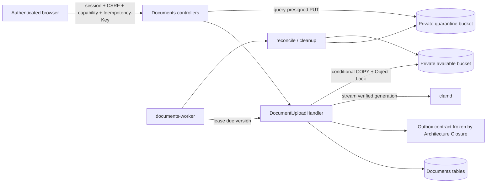

# Cluster Documents S3 and ClamAV Production Runtime Implementation Plan

> **For agentic workers:** REQUIRED SUB-SKILL: Use `skill://subagent-driven-development` (recommended) or `skill://executing-plans` to implement this plan task-by-task. Steps use checkbox (`- [ ]`) syntax for tracking.

```yaml
plan_id: P02
status: blocked
depends_on:
  - P01
  - ARCHITECTURE-CLOSURE:DOCUMENTS-OUTBOX-DECISION
blocks:
  - P03
  - P04:enforcement
shared_file_owner:
  - infra/platform/production/compose.yaml (token after P01)
  - infra/platform/production/.env.example (token after P01)
implementation_commit: null
last_verified_commit: null
last_status_change: '2026-07-26'
tree_digest: "sha256(concat(UTF-8 file bytes for M00-M07 and P01-P08 in ascending plan_id order, removing only each tree_digest YAML scalar token))"
```

**Goal:** Make the existing Documents upload lifecycle run against private, versioned S3-compatible storage and a real ClamAV daemon, fail closed through outages, and prove clean, infected, retry, promotion, cleanup, reconciliation, and legacy-object migration behavior in a production-like Compose environment.

**Architecture:** Keep the current Documents-owned controller → capability/validation → `DocumentUploadHandler` → Documents persistence boundary. Canonicalize the two existing Documents filesystem zones into one zone-scoped configuration contract, use true SigV4 query presigning for browser transfers and header signing for server transfers, stream quarantine bytes through clamd without materializing a 200 MiB payload, and drive retryable scan/promotion/cleanup work from lease fields on `document_versions`. Production uses external S3-compatible storage plus the `clamav` and `documents-worker` services in the existing production Compose topology; MinIO exists only in the production-smoke overlay.

**Tech Stack:** PHP 8.3, Laravel 13.8, PHPUnit 12.5, MySQL, Guzzle/PSR-7 streams, AWS Signature Version 4, S3/MinIO, ClamAV INSTREAM, Docker Compose.

**Approved Design:** [`../specs/2026-07-26-cluster-production-and-modules-program-design.md`](../specs/2026-07-26-cluster-production-and-modules-program-design.md)

---

## 1. Status, dependencies, and start gates

P02 remains `blocked` until both metadata dependencies are evidenced:

1. `P01` has completed its runtime contract and recorded the worker/scheduler service, health-marker, shutdown, logging, and Compose conventions that P02 must extend.
2. `ARCHITECTURE-CLOSURE:DOCUMENTS-OUTBOX-DECISION` is closed. Architecture Closure Task 6/10 must have either retained a tested Documents-owned relay or migrated Documents producers to the shared `TransactionalOutbox`; P02 consumes that frozen result and does not reopen the decision.

Before the first implementation edit, retain these handoff records:

```yaml
p01_runtime_handoff:
  plan: P01
  commit_source: git rev-parse HEAD
  evidence: artifacts/production-readiness/P01/runtime-contract.yaml
architecture_closure_handoff:
  plan: ARCHITECTURE-CLOSURE
  gate: DOCUMENTS-OUTBOX-DECISION
  commit_source: git rev-parse HEAD
  evidence: docs/architecture/architecture-closure-register.yaml
```

The authorized executor writes the actual commit values beside these command sources in the retained handoff record; the plan does not fabricate them.

Additional file-level handoffs apply even after the two start dependencies pass:

- Architecture Closure Tasks 10 and 11 must release `apps/api/Modules/Documents/Features/Upload/DocumentUploadHandler.php` and the Documents migration sequence before Tasks 4–6 below modify them.
- Architecture Closure Task 6 must release `apps/api/config/module_migrations.php` before the new Documents migration is registered.
- P01 must release `PROD-COMPOSE` and `PROD-ENV` from the recorded base commit before Task 7 touches the two shared production files.
- The current Architecture Closure plan retains `Makefile`, `.github/workflows/ci.yml`, `.github/workflows/ci-e2e.yml`, `docs/contracts/api/openapi.yaml`, `apps/web/src/api/generated/cluster.ts`, `apps/api/tests/Architecture/ModuleBoundariesTest.php`, and an actively declared `apps/api/routes/web.php`. P02 never edits them.
- P08 alone performs final `Makefile` and workflow integration after the Architecture Closure Task 13 handoff.

No commit, push, deployment, migration, bucket mutation, credential creation, or external message is authorized by this plan. A commit may be recorded only after explicit user authorization.

## 2. Goal and user-visible outcome

After implementation:

- an authenticated, CSRF-protected, capability-authorized client receives a short-lived one-shot upload URL for the quarantine bucket;
- the browser can execute that URL without receiving a secret key or an `Authorization` header;
- completion verifies checksum, size, MIME, ETag, and version/generation before a scan is scheduled;
- clean content is copied conditionally into the available bucket, re-read, retained under Object Lock, then exposed for download;
- EICAR or another positive verdict is rejected and never enters the available bucket;
- S3, clamd, DNS, credential, timeout, and unknown-response failures remain quarantined and retry without being reported as clean or infected;
- production operators can see readiness, retry backlog, scan engine/signature version, reconciliation drift, and sanitized structured events;
- existing local document objects, when present, can be inventoried, copied, verified, cut over, and rolled back with a retained manifest;
- P03 can back up both versioned buckets and Object Lock metadata, P04 can consume malware/storage enforcement evidence, and P07/P08 can invoke one deterministic lifecycle gate.

## 3. Current source evidence

The executor must re-read these exact sources on the recorded start commit; the current evidence explains why each task exists.

1. `apps/api/Modules/Documents/Providers/DocumentsServiceProvider.php::register` binds the real S3 and ClamAV adapters only when `documentsRuntimeEnabled()` and otherwise binds fail-closed unavailable adapters.
2. `apps/api/Modules/Documents/Infrastructure/Storage/S3/S3CompatibleConfiguration.php::fromEnvironment` reads generic `DOCUMENTS_S3_*` credentials, while `apps/api/config/filesystems.php:3-16,78-112` already defines distinct `DOCUMENTS_QUARANTINE_AWS_*` and `DOCUMENTS_AVAILABLE_AWS_*` zones. Production currently has two contradictory configuration contracts.
3. `apps/api/Modules/Documents/Infrastructure/Storage/PrivateDocumentDiskConfiguration.php::assertRuntimeSafe` requires separate zone credentials and buckets, but `S3CompatibleConfiguration` uses one credential pair for both; the boot-time assertion therefore does not describe the adapter that performs requests.
4. `S3CompatiblePrivateObjectStorage::issueQuarantineUpload` calls header signer `SigV4RequestSigner::sign`, returns `Authorization` in `SignedUploadIntent.requiredHeaders`, and adds only `X-Amz-Expires` to the query. That is not a query-presigned request and the expiration is not enforced as claimed.
5. `S3CompatibleConfiguration::host()` returns `s3[.region].amazonaws.com`; non-path-style calls omit the bucket from the host. `S3CompatiblePrivateObjectStorage`, `S3QuarantineObjectByteSource`, and `S3DocumentDownloadGrantIssuer` duplicate URI/host logic.
6. `S3QuarantineObjectByteSource::fetchBytes` and `GuzzleS3RequestExecutor::execute` cast the entire response body to `string`; `StreamSocketClamAvTransport::instream` then slices that string. The configured upload ceiling in `apps/api/config/documents.php` is 200 MiB, so a scan allocates the complete object plus chunks.
7. `ClamAvConfiguration::fromEnvironment` accepts operator-supplied `DOCUMENTS_CLAMAV_SIGNATURE_VERSION`, so stored scan evidence can be stale or invented instead of coming from clamd `VERSION`.
8. `DocumentUploadHandler::scanTransition` already implements the critical fail-closed mapping: clean → `promotion_pending`; infected/blocked → `rejected`; unavailable/unknown → `failed` + `quarantined`. `assertScannable` already permits retry of failed hard-quarantine rows.
9. `DocumentUploadHandler::reconcilePromotion` conditionally promotes then commits `available`; however the storage boundary has no quarantine cleanup, available-object inspection, Object Lock assertion, or drift reconciliation operation.
10. `document_versions` has `scan_status`, `availability_status`, and `promotion_requested_at`, but no retry time, attempt counter, lease, or last dependency error. There is no durable production dispatcher for the two internal HTTP actions.
11. `CreateDocumentsCoreTables.php` creates `document_outbox_events`; Architecture Closure explicitly owns the keep-or-migrate decision. P02 neither edits that migration nor defines a second relay.
12. `infra/platform/production/compose.yaml` has the P01 application services but no `clamav`, `documents-worker`, Documents environment, or document dependency readiness. `.env.example` has no Documents production keys.
13. `apps/api/tests/Feature/W12E2EDocumentUploadRuntimeTest.php` only proves that a URL can be generated with synthetic environment values; it does not upload to S3, call clamd, promote, download, or exercise an outage.
14. Existing focused tests in `Modules/Documents/Tests/Infrastructure/Storage/S3` and `Modules/Documents/Tests/Infrastructure/Security` use fake executors/transports and are the correct unit-test seams to preserve.

## 4. Scope and explicit non-goals

### In scope

- one canonical zone-scoped S3 configuration and credential model;
- strict production boot validation and sanitized configuration errors;
- real query-presigned PUT/GET and server-side header-signed HEAD/GET/COPY/DELETE;
- bounded streaming from S3 to clamd;
- engine/signature evidence queried from clamd;
- durable lease/retry state on existing Documents tables;
- one Documents processing command and production workload;
- quarantine, rejection, promotion, cleanup, Object Lock, lifecycle, and reconciliation semantics;
- a restartable local-object migration with inventory and verification manifest;
- ClamAV in the base production topology and MinIO only in a smoke overlay;
- readiness, structured logs, production-like smoke scenarios, rollback, and retained evidence.

### Non-goals

- no second deployment topology, standalone Documents stack, Kubernetes manifests, or alternative worker framework;
- no change to P01-owned `worker-loop.sh`, `scheduler-loop.sh`, or `routes/console.php`;
- no edit to `Makefile` or CI workflows; P08 adds the final call to P02's verifier;
- no OpenAPI, generated web client, public route, capability catalog, web UI, or user workflow change;
- no direct edit of `CreateDocumentsCoreTables.php`, no new outbox table, no outbox ownership decision, and no competing relay;
- no new cross-module SQL, foreign key, Domain/Infrastructure import, or production fake;
- no cloud bucket, IAM, KMS, DNS, or deployment mutation during plan execution without separate operator approval;
- no claim that MinIO proves AWS-specific KMS/Object Lock policy; the external-provider preflight remains required.

## 5. Architecture and ownership boundaries

### 5.1 Request and processing flow



The public request path retains existing problem+json, correlation ID, session/CSRF, capability, `Idempotency-Key`, `If-Match`/ETag/`lock_version`, and concealment behavior. Authorization occurs before detailed validation or resource disclosure. The worker is an internal workload and uses the existing Documents worker identity; it does not accept user identity fields.

### 5.2 Credentials and endpoints

Use separate API grant-signing and worker mutation credentials; no process receives the other role's secret material. Clean-cut over from generic `DOCUMENTS_S3_*` variables to this exact contract:

```text
# non-secret shared zone metadata: API and documents-worker
DOCUMENTS_QUARANTINE_AWS_DEFAULT_REGION
DOCUMENTS_QUARANTINE_AWS_BUCKET
DOCUMENTS_QUARANTINE_AWS_ENDPOINT
DOCUMENTS_QUARANTINE_AWS_PUBLIC_ENDPOINT
DOCUMENTS_QUARANTINE_AWS_USE_PATH_STYLE_ENDPOINT
DOCUMENTS_QUARANTINE_KMS_KEY_ID
DOCUMENTS_AVAILABLE_AWS_DEFAULT_REGION
DOCUMENTS_AVAILABLE_AWS_BUCKET
DOCUMENTS_AVAILABLE_AWS_ENDPOINT
DOCUMENTS_AVAILABLE_AWS_PUBLIC_ENDPOINT
DOCUMENTS_AVAILABLE_AWS_USE_PATH_STYLE_ENDPOINT
DOCUMENTS_AVAILABLE_KMS_KEY_ID
DOCUMENTS_AVAILABLE_OBJECT_LOCK_MODE

# API-only short-lived grant signer: injected only into api
DOCUMENTS_API_GRANT_AWS_ACCESS_KEY_ID
DOCUMENTS_API_GRANT_AWS_SECRET_ACCESS_KEY
DOCUMENTS_API_GRANT_AWS_SESSION_TOKEN
DOCUMENTS_API_GRANT_AWS_CREDENTIAL_EXPIRATION

# worker-only credential source metadata: injected only into documents-worker
DOCUMENTS_WORKER_CREDENTIAL_SOURCE_URI
DOCUMENTS_WORKER_CREDENTIAL_SOURCE_AUDIENCE
DOCUMENTS_WORKER_CREDENTIAL_REFRESH_SECONDS
```

The API grant principal may only sign quarantine `PutObject` and available `GetObject` for the tenant/object prefix encoded by the application; it cannot HEAD/GET/DELETE quarantine, COPY/PUT available, inspect buckets, or change retention. Its session tuple is short-lived and independently rotated by the platform secret provider; API configuration rejects missing session token/expiration or a credential lifetime longer than the approved provider maximum.

The dedicated worker principal is assumed through the workload-identity credential source and may only HEAD/GET/DELETE the quarantine prefix, read quarantine as COPY source, COPY/PUT/HEAD available with the required KMS key and Object Lock headers, inspect versioning/Object Lock needed by readiness, and list only the reconciliation prefix. It cannot presign browser requests, administer buckets/policies, or access unrelated prefixes. `DOCUMENTS_WORKER_CREDENTIAL_SOURCE_URI` identifies the local workload-identity endpoint/socket, contains no credential, and must be allowlisted; audience is fixed to `cluster-documents-worker`. `documents-worker` alone receives these source variables and fetched tuples.

Outside tests, bucket names, role IDs, and KMS key IDs must differ as applicable; endpoints must be HTTPS; Object Lock mode must be exactly `GOVERNANCE` or `COMPLIANCE`; public endpoints must match the upload allowlist. Both roles require signed session tokens and expiry. P02 owns the source/refresh implementation and sanitized audit evidence: refresh before 20% of worker lifetime remains, atomically replace a mode-`0600` in-memory/tmpfs snapshot, retry with bounded backoff, remove readiness before expiry, and fail closed after expiry. Rotation changes the worker tuple without topology restart; old credentials fail after revocation while the replacement succeeds. P04 consumes only issuance/expiry, role/scope/policy digests, reason/result, and old-credential rejection evidence—never credential values. Static production credentials or sharing one tuple across API and worker are configuration errors.

An empty endpoint means AWS-style virtual-host resolution (`{bucket}.s3.amazonaws.com` in `us-east-1`, `{bucket}.s3.{region}.amazonaws.com` otherwise). A custom path-style endpoint resolves `{endpoint}/{bucket}/{key}`. `*_PUBLIC_ENDPOINT` is used only in browser grants; server HEAD/GET/COPY/DELETE uses the internal endpoint. Tests may use HTTP and equal MinIO credentials only when `APP_ENV=testing` and `DOCUMENTS_TEST_RUNTIME_ENABLED=true`.

### 5.3 Bucket and object lifecycle

- Both buckets are private, deny public ACL/policy, deny unencrypted transport, enable versioning, and abort incomplete multipart uploads after one day.
- The available bucket is created with Object Lock enabled. Every promoted version receives `x-amz-object-lock-mode`, `x-amz-object-lock-retain-until-date` from `documents.retention_until`, and legal-hold `ON` when `documents.legal_hold=true`.
- The available bucket has no lifecycle rule that deletes current versions. Noncurrent expiration may run only after the provider proves it cannot undercut the longest configured retention.
- A clean quarantine generation is deleted only after available HEAD confirms checksum, size, ETag/generation, retention date, and legal-hold state.
- A rejected generation remains inaccessible for `DOCUMENTS_QUARANTINE_REJECTION_RETENTION_DAYS` (default 7) and is then deleted unless legal hold is active.
- A scan-failed or dependency-unavailable generation is never deleted by age while it remains retryable.
- An abandoned upload may be deleted after upload intent expiry plus `DOCUMENTS_QUARANTINE_ABANDONED_GRACE_HOURS` (default 24), provided it is not completed and no legal hold applies.
- MinIO smoke bootstrap creates `documents-available` with `mc mb --with-lock`, enables versioning on both buckets, and installs private policies; it never runs as a production service.

### 5.4 Retry and concurrency contract

`document_versions` is the durable work record. Work proceeds sequentially per version: `scan` → `promotion` → `cleanup`. Claiming uses one MySQL write predicate over due, unleased work and a UUIDv7 lease token. A worker updates only rows whose lease token it owns.

Retry delay is deterministic:

```text
attempt 1: 30 seconds
attempt 2: 120 seconds
attempt 3: 600 seconds
attempt 4: 1800 seconds
attempt 5 and later: 1800 seconds
```

Scanner/S3 network errors, timeouts, 429, and 5xx are retryable. S3 401/403 is classified `dependency_configuration_error`, marks readiness unhealthy, and retries every 1800 seconds without rejecting content. Checksum/ETag/generation/Object Lock mismatch is `integrity_blocked`, keeps the object quarantined, stops automatic promotion, and requires reconciliation evidence. Infection is a successful scan outcome, not a worker failure. There is no automatic "clean" fallback and no critical skip.

## 6. Files to create, modify, move, or remove

### Create

- `apps/api/Modules/Documents/Infrastructure/Storage/S3/S3ZoneConfiguration.php`
- `apps/api/Modules/Documents/Infrastructure/Storage/S3/S3EndpointResolver.php`
- `apps/api/Modules/Documents/Infrastructure/Storage/S3/SigV4QueryPresigner.php`
- `apps/api/Modules/Documents/Infrastructure/Storage/S3/ApiGrantCredentialConfiguration.php`
- `apps/api/Modules/Documents/Infrastructure/Storage/S3/WorkerCredentialSource.php`
- `apps/api/Modules/Documents/Infrastructure/Storage/S3/WorkloadIdentityWorkerCredentialSource.php`
- `apps/api/Modules/Documents/Infrastructure/Storage/S3/RotatingWorkerCredentialProvider.php`
- `apps/api/Modules/Documents/Infrastructure/Storage/S3/TemporaryS3Credentials.php`
- `apps/api/Modules/Documents/Application/ObjectRetention.php`
- `apps/api/Modules/Documents/Infrastructure/Security/ClamAvVersion.php`
- `apps/api/Modules/Documents/Features/Processing/DocumentProcessingWorker.php`
- `apps/api/Modules/Documents/Features/Processing/Console/ProcessPendingDocumentObjectsCommand.php`
- `apps/api/Modules/Documents/Infrastructure/Health/DocumentsDependencyHealthCheck.php`
- `apps/api/Modules/Documents/Features/StorageOperations/DocumentStorageReconciler.php`
- `apps/api/Modules/Documents/Features/StorageOperations/DocumentObjectMigrationService.php`
- `apps/api/Modules/Documents/Features/StorageOperations/Console/DocumentsHealthCommand.php`
- `apps/api/Modules/Documents/Features/StorageOperations/Console/ReconcileDocumentStorageCommand.php`
- `apps/api/Modules/Documents/Features/StorageOperations/Console/MigrateDocumentStorageCommand.php`
- `apps/api/docker/documents-worker-loop.sh`
- `apps/api/docker/tests/documents-worker-loop-test.sh`
- `infra/platform/production/verify-workload-topology.sh`
- `apps/api/Modules/Documents/Infrastructure/Persistence/Migrations/W21AddDocumentProcessingState.php`
- focused tests mirroring those classes under `apps/api/Modules/Documents/Tests/`
- `apps/api/Modules/Documents/Tests/Infrastructure/Storage/S3/ApiGrantCredentialConfigurationTest.php`
- `apps/api/Modules/Documents/Tests/Infrastructure/Storage/S3/WorkloadIdentityWorkerCredentialSourceTest.php`
- `apps/api/Modules/Documents/Tests/Infrastructure/Storage/S3/RotatingWorkerCredentialProviderTest.php`
- `apps/api/tests/Feature/DocumentsProductionRuntimeTest.php`
- `infra/platform/production/compose.documents-smoke.yaml`
- `infra/platform/production/.env.documents-smoke.example`
- `infra/platform/production/verify-documents-runtime.sh`
- `infra/platform/production/tests/verify-workload-topology-test.sh`
- `infra/platform/production/fixtures/documents-credential-broker/server.php`
- `infra/platform/production/fixtures/documents-credential-broker/router.php`
- `infra/platform/production/tests/documents-credential-broker-test.sh`

### Modify after the named handoffs

- `apps/api/config/filesystems.php`
- `apps/api/config/documents.php`
- `apps/api/.env.example`
- `apps/api/Dockerfile`
- `apps/api/config/module_migrations.php`
- `apps/api/Modules/Documents/Providers/DocumentsServiceProvider.php`
- `apps/api/Modules/Documents/Contracts/PrivateObjectStorage.php`
- `apps/api/Modules/Documents/Contracts/MalwareScanner.php`
- `apps/api/Modules/Documents/Infrastructure/Storage/S3/S3CompatibleConfiguration.php`
- `apps/api/Modules/Documents/Infrastructure/Storage/S3/SigV4RequestSigner.php`
- `apps/api/Modules/Documents/Infrastructure/Storage/S3/S3CompatiblePrivateObjectStorage.php`
- `apps/api/Modules/Documents/Infrastructure/Storage/S3/S3DocumentDownloadGrantIssuer.php`
- `apps/api/Modules/Documents/Infrastructure/Storage/S3/QuarantineObjectByteSource.php`
- `apps/api/Modules/Documents/Infrastructure/Storage/S3/S3QuarantineObjectByteSource.php`
- `apps/api/Modules/Documents/Infrastructure/Storage/S3/S3RequestExecutor.php`
- `apps/api/Modules/Documents/Infrastructure/Storage/S3/GuzzleS3RequestExecutor.php`
- `apps/api/Modules/Documents/Infrastructure/Security/ClamAvConfiguration.php`
- `apps/api/Modules/Documents/Infrastructure/Security/ClamAvSocketTransport.php`
- `apps/api/Modules/Documents/Infrastructure/Security/StreamSocketClamAvTransport.php`
- `apps/api/Modules/Documents/Infrastructure/Security/ClamAvMalwareScanner.php`
- `apps/api/Modules/Documents/Features/Upload/DocumentUploadHandler.php`
- existing S3, ClamAV, upload-core, and HTTP tests named in §3
- `apps/api/tests/Feature/DocumentsRuntimeProviderTest.php`
- `apps/api/tests/Feature/W12E2EDocumentUploadRuntimeTest.php`
- `infra/dev/run-w1-2-e2e.sh`
- `infra/platform/production/compose.yaml` under `PROD-COMPOSE` after P01
- `infra/platform/production/.env.example` under `PROD-ENV` after P01

### Remove in the same clean cutover

- generic `DOCUMENTS_S3_REGION`, `DOCUMENTS_S3_ENDPOINT`, `DOCUMENTS_S3_USE_PATH_STYLE`, `DOCUMENTS_S3_QUARANTINE_BUCKET`, `DOCUMENTS_S3_AVAILABLE_BUCKET`, `DOCUMENTS_S3_ACCESS_KEY_ID`, `DOCUMENTS_S3_SECRET_ACCESS_KEY`, `DOCUMENTS_S3_SESSION_TOKEN`, `DOCUMENTS_S3_QUARANTINE_KMS_KEY_ID`, and `DOCUMENTS_S3_AVAILABLE_KMS_KEY_ID` reads and example entries;
- operator-authored `DOCUMENTS_CLAMAV_ENGINE_NAME` and `DOCUMENTS_CLAMAV_SIGNATURE_VERSION`; engine/signature evidence comes from clamd `VERSION`;
- no old class alias, compatibility environment fallback, or duplicate configuration path remains.

No file is moved. No generated file is edited.

## 7. Contracts, events, routes, schemas, and capability names

### 7.1 Module-owned PHP contracts

Use these exact signatures:

```php
final readonly class S3ZoneConfiguration
{
    public function __construct(
        public string $name,
        public string $region,
        public string $bucket,
        public string $internalEndpoint,
        public string $publicEndpoint,
        public bool $usePathStyle,
        public string $accessKeyId,
        public string $secretAccessKey,
        public ?string $sessionToken,
        public string $kmsKeyId,
    ) {}
}

final readonly class ObjectRetention
{
    public function __construct(
        public DateTimeImmutable $retainUntil,
        public string $mode,
        public bool $legalHold,
    ) {}
}

interface QuarantineObjectByteSource
{
    /** @return iterable<string> Non-empty bounded chunks in object order. */
    public function chunks(VerifiedQuarantineObject $object, int $chunkBytes): iterable;
}

interface ClamAvSocketTransport
{
    /** @param iterable<string> $chunks */
    public function instream(iterable $chunks): string;
    public function version(): ClamAvVersion;
    public function ping(): bool;
}

interface PrivateObjectStorage
{
    public function issueQuarantineUpload(QuarantineUploadRequest $request): SignedUploadIntent;
    public function inspectQuarantineObject(QuarantineObjectReference $reference): StoredObjectProperties;
    public function promoteVerifiedObject(VerifiedQuarantineObject $object, ObjectRetention $retention): StoredObjectProperties;
    public function inspectAvailableObject(QuarantineObjectReference $reference): StoredObjectProperties;
    public function deleteQuarantineObject(VerifiedQuarantineObject $object): void;
}
```

`SigV4QueryPresigner::presign` returns a URL whose query includes `X-Amz-Algorithm`, `X-Amz-Credential`, `X-Amz-Date`, `X-Amz-Expires`, `X-Amz-SignedHeaders`, optional `X-Amz-Security-Token`, and `X-Amz-Signature`. The returned required headers exclude `host` and `authorization` and include exact content length/type/checksum, conditional create, private ACL, and configured encryption headers.

### 7.2 Public HTTP and authorization

P02 creates no public route, OpenAPI operation, schema, or capability. It preserves:

- `POST /api/v1/documents/uploads` — session, principal, CSRF, `documents.initiate-upload`, `Idempotency-Key`;
- `POST /api/v1/documents/uploads/{uploadId}/complete` — session, principal, CSRF, `documents.complete-upload`, `Idempotency-Key`, and `If-Match` when the existing document is versioned;
- `GET /api/v1/documents/uploads/{uploadId}` — session/principal and `documents.get-upload-status`;
- `POST /api/v1/internal/documents/versions/{versionId}/scan` — existing worker authentication, `documents.scan-version`, correlation ID, idempotency;
- `POST /api/v1/internal/documents/versions/{versionId}/reconcile-promotion` — existing worker authentication, `documents.reconcile-promotion`, correlation ID, idempotency.

P02 does not edit `routes/web.php`; the existing internal actions remain an operator/debug boundary while the production `documents-worker` calls the same handler in-process. Every error remains `application/problem+json` with a correlation ID and without a bucket, key, URL, credential, signature, file name, checksum, or scanner raw response.

### 7.3 Events and outbox

Consume the Architecture Closure outbox result exactly. Do not edit `CreateDocumentsCoreTables.php` and do not add another relay. Preserve these existing event types:

```text
com.cluster.documents.uploadinitiated.v1
com.cluster.documents.versionuploaded.v1
com.cluster.documents.versionpromotionrequested.v1
com.cluster.documents.versionrejected.v1
com.cluster.documents.versionquarantined.v1
com.cluster.documents.versionavailable.v1
```

State/idempotency/outbox effects for each handler call remain one transaction. `versionquarantined` may add sanitized `reason_code` and `next_retry_at`; no object coordinates or raw clamd response enter payloads. Any shared event-catalog edit required by the already-frozen outbox implementation must use its owner's explicit integration token; P02 does not claim that file.

### 7.4 Console surface

Register commands through `DocumentsServiceProvider::commands`, not `routes/console.php`:

```text
documents:process-storage --once --batch=25 --lease-seconds=120
documents:storage-health --readiness
documents:storage-reconcile --dry-run|--apply --manifest="$P02_RECONCILIATION_MANIFEST"
documents:storage-migrate --source-root="$P02_SOURCE_ROOT" --dry-run|--apply --manifest="$P02_MIGRATION_MANIFEST"
```

Mutually exclusive `--dry-run`/`--apply`, absolute manifest paths, and explicit `--source-root` are validated before database/object access. The commands emit only JSON Lines with sanitized IDs and codes.

## 8. Database columns, indexes, migration order, data migration, and recovery

### 8.1 Schema migration

Create `W21AddDocumentProcessingState.php` after `W19AddDocumentLinkConstraintPolicyKey.php` and register it only after Architecture Closure releases the migration registry. It adds to `document_versions`:

```php
$table->string('processing_operation', 24)->nullable();
$table->string('processing_state', 24)->nullable();
$table->unsignedInteger('processing_attempts')->default(0);
$table->dateTime('processing_next_attempt_at', 3)->nullable();
$table->uuid('processing_lease_token')->nullable();
$table->dateTime('processing_lease_expires_at', 3)->nullable();
$table->string('processing_last_error_code', 96)->nullable();
$table->index(['processing_state', 'processing_next_attempt_at'], 'document_versions_processing_due_index');
$table->index('processing_lease_expires_at', 'document_versions_processing_lease_index');
```

Allowed persisted values are exact:

```text
processing_operation: scan | promotion | cleanup | null
processing_state: pending | running | retry_wait | integrity_blocked | completed | null
```

Migration backfill is deterministic:

- `pending|failed` scan + `quarantined` availability → `scan/pending`, due immediately;
- `clean` scan + `promotion_pending` availability → `promotion/pending`, due immediately;
- `available` with a still-present quarantine generation, or `rejected` older than retention → `cleanup/pending`;
- all other terminal rows → `completed` with null operation and no lease.

Do not add a table: `TABLE_OWNERS` therefore remains unchanged and P02 does not request the module-registry surface. The `down()` path drops only these columns/indexes and may run only before any production work is processed. After production processing begins, rollback is forward-only: deploy a compensating migration and preserve attempt evidence.

### 8.2 Claim predicate and lease recovery

The repository claim must be one database transaction using MySQL `FOR UPDATE SKIP LOCKED` or an equivalent conditional update. A row is claimable only when state is `pending`/`retry_wait`, `processing_next_attempt_at <= now`, and lease is null/expired. Completion/retry updates include `WHERE id = ? AND processing_lease_token = ?`; affected rows other than one are a concurrency failure. Startup and each loop recover expired `running` rows to `retry_wait` without changing document availability.

### 8.3 Legacy object migration

`documents:storage-migrate` performs four explicit phases:

1. **Inventory/dry run:** join `document_storage_objects` to `document_versions` and `documents`; resolve the local source beneath the required source root; reject path traversal; record object ID, zone, size, SHA-256, expected DB generation, retention date, and legal-hold flag. Do not record names or paths in retained output.
2. **Copy:** conditionally create the destination object. Available objects receive retention/legal-hold headers. Existing destination generations are accepted only when all expected properties and retention controls match.
3. **Verify:** server-side HEAD plus streamed SHA-256/size comparison. Write one JSONL manifest row only after verification, `fsync` the manifest, and leave source bytes intact.
4. **Cutover:** only when every manifest row is verified, run `documents:storage-health --readiness`, production lifecycle smoke, and reconciliation. Existing DB disk names already remain `documents-quarantine`/`documents-available`, so no mass DB rewrite is required. Archive the source volume read-only through P03's backup handoff.

The command is idempotent by object ID + source SHA-256 + destination version ID. A second `--apply` records `already_verified` and performs no copy. Missing local source plus missing/mismatched destination is a hard failure. If inventory count is zero, retain the zero-count manifest and evidence; do not claim a copy test from that result—the smoke fixture still exercises a real copy.

## 9. TDD implementation tasks

### Task 1: Freeze gates and write the executable configuration contract

**Files:** configuration classes, `filesystems.php`, `documents.php`, both API environment examples, provider/configuration tests, `DocumentsRuntimeProviderTest.php`, `W12E2EDocumentUploadRuntimeTest.php`, and `infra/dev/run-w1-2-e2e.sh` listed in §6.

- [ ] **Step 1: Record the two start-gate and file-handoff evidence paths.**

Expected: P01 runtime contract and Architecture Closure Documents-outbox decision identify commits; current-plan owned files are not in P02's first edit set.

- [ ] **Step 2: Add failing configuration tests.**
Add cases to `S3CompatibleConfigurationTest` and `ApiGrantCredentialConfigurationTest` for shared zone metadata, API-only grant variables, distinct role/scope, session-token and expiration enforcement, AWS virtual-host endpoint, custom internal/public endpoints, HTTPS enforcement, allowlist enforcement, and rejection of worker-source variables as API credentials. Add `WorkloadIdentityWorkerCredentialSourceTest` and `RotatingWorkerCredentialProviderTest` cases for URI/audience allowlisting, response schema, 20%-remaining refresh, atomic swap, concurrent single refresh, bounded failure, expiry fail-closed, sanitized errors, and rejection of static tuples or API credential variables. Prove every removed generic `DOCUMENTS_S3_*` credential variable is ignored and cannot make production boot pass.

Run:

```bash
cd apps/api && php artisan test Modules/Documents/Tests/Infrastructure/Storage/S3/S3CompatibleConfigurationTest.php Modules/Documents/Tests/Infrastructure/Storage/S3/ApiGrantCredentialConfigurationTest.php Modules/Documents/Tests/Infrastructure/Storage/S3/WorkloadIdentityWorkerCredentialSourceTest.php Modules/Documents/Tests/Infrastructure/Storage/S3/RotatingWorkerCredentialProviderTest.php
```

Expected before implementation: FAIL because the adapter still reads generic variables and has no zone/public endpoint model.

- [ ] **Step 3: Implement `S3ZoneConfiguration`, aggregate configuration, and endpoint resolver.**
`S3CompatibleConfiguration::fromEnvironment(bool $testing = false)` constructs shared quarantine/available zone metadata. `ApiGrantCredentialConfiguration` consumes only `DOCUMENTS_API_GRANT_AWS_*`; `WorkloadIdentityWorkerCredentialSource` consumes only `DOCUMENTS_WORKER_CREDENTIAL_SOURCE_*`; `RotatingWorkerCredentialProvider` supplies `TemporaryS3Credentials` to worker storage operations and never exports them to process logs/environment. `filesystems.php` must not become a shared secret bridge. `DocumentsServiceProvider` binds the API signer in HTTP/API runtime and the rotating worker provider only for the `documents:process-storage`, storage health/reconcile/migrate command contexts. Pass `app()->environment('testing')` independently of `DOCUMENTS_TEST_RUNTIME_ENABLED`.

- [ ] **Step 4: Remove generic environment reads and migrate every caller.**
Update `apps/api/.env.example`, `infra/platform/production/.env.example`, `DocumentsRuntimeProviderTest.php`, `W12E2EDocumentUploadRuntimeTest.php`, and `infra/dev/run-w1-2-e2e.sh` to the role-separated keys in §5.2. Production examples contain only blank secret/source placeholders; Compose injects API grant secret refs only into `api`, worker credential-source metadata only into `documents-worker`, and shared non-secret zone metadata only where operationally required. `worker`, `scheduler`, and `migrate` receive neither role's secrets. Deterministic MinIO credentials are allowed only in the isolated smoke example. Remove manual ClamAV engine/signature values and generic credentials; search expected zero matches outside plan history.

- [ ] **Step 5: Run focused green tests.**

```bash
cd apps/api && php artisan test Modules/Documents/Tests/Infrastructure/Storage/S3/S3CompatibleConfigurationTest.php Modules/Documents/Tests/Infrastructure/Security/ClamAvConfigurationTest.php
```

Expected: PASS; configuration fails closed outside testing, and no generic S3 environment key is accepted.

### Task 2: Correct SigV4 browser and server request semantics

**Files:** `S3EndpointResolver`, `SigV4QueryPresigner`, signer/storage/download classes, executor fakes, and S3 tests.

- [ ] **Step 1: Add failing presign and addressing tests.**

Assert that upload/download URLs contain the seven SigV4 query fields, contain no secret, return no `Authorization` required header, expire in 60–300 seconds, include the session token when configured, bind all upload headers, use `{bucket}.s3.{region}.amazonaws.com` for AWS, and use `/bucket/key` for MinIO path style. Use the AWS SigV4 published vector plus a MinIO-shaped vector.

Run:

```bash
cd apps/api && php artisan test Modules/Documents/Tests/Infrastructure/Storage/S3/SigV4RequestSignerTest.php Modules/Documents/Tests/Infrastructure/Storage/S3/S3CompatiblePrivateObjectStorageTest.php
```

Expected before implementation: FAIL on upload query fields, `Authorization` leakage, and AWS bucket host.

- [ ] **Step 2: Implement query presigning and central endpoint resolution.**

Canonical query keys are sorted RFC 3986, canonical headers are lowercase/sorted, expiration is signed, and URL generation occurs only after host/URI resolution. Retain `SigV4RequestSigner` for server HEAD/GET/COPY/DELETE. `S3DocumentDownloadGrantIssuer` uses the available-zone presigner and its own 120-second default TTL.

- [ ] **Step 3: Add failure mapping tests.**

Prove HEAD/GET/COPY/DELETE map network/429/5xx to `RetryableStorageException`, 401/403 to sanitized dependency configuration failure, 404 to missing object, and checksum/ETag/generation mismatch to integrity failure. No exception contains response body, key, or signed URL.

- [ ] **Step 4: Run focused green tests.**

```bash
cd apps/api && php artisan test Modules/Documents/Tests/Infrastructure/Storage/S3
```

Expected: PASS; a second generation of a signed request with fixed clock inputs is byte-identical.

### Task 3: Stream verified quarantine content through real clamd semantics

**Files:** byte-source, executor, transport, scanner, version value object, provider, and Security/S3 tests.

- [ ] **Step 1: Write failing bounded-memory and clamd protocol tests.**

Use a generator that yields three chunks and throws if converted to a string. Assert exact `zINSTREAM\0`, big-endian chunk lengths, zero terminator, clean/FOUND/ERROR/unknown mapping, short write recovery, timeout, and socket closure. Add a 200 MiB synthetic generator test whose peak-memory delta remains below 16 MiB.

Run:

```bash
cd apps/api && php artisan test Modules/Documents/Tests/Infrastructure/Security/ClamAvMalwareScannerTest.php Modules/Documents/Tests/Infrastructure/Security/StreamSocketClamAvTransportTest.php Modules/Documents/Tests/Infrastructure/Storage/S3/S3QuarantineObjectByteSourceTest.php
```

Expected before implementation: FAIL because the contracts require a full string and there is no real VERSION/PING contract.

- [ ] **Step 2: Implement streaming contracts.**

Guzzle must return a PSR-7 body stream for S3 GET. The byte source verifies the requested object generation and yields at most `DOCUMENTS_CLAMAV_CHUNK_BYTES` per iteration. The transport writes iterable chunks without `substr` over the full payload. It rejects empty chunks, oversized chunks, premature EOF, and total bytes different from `StoredObjectProperties.sizeBytes`.

- [ ] **Step 3: Derive engine and signature from clamd.**

`ClamAvSocketTransport::version()` sends `zVERSION\0`; parse engine version and signature database number/date into `ClamAvVersion`. `ping()` sends `zPING\0` and accepts only `PONG`. `ClamAvMalwareScanner` stores the version returned by the daemon for the scan and never accepts operator-authored signature metadata.

- [ ] **Step 4: Run focused green tests.**

```bash
cd apps/api && php artisan test Modules/Documents/Tests/Infrastructure/Security Modules/Documents/Tests/Infrastructure/Storage/S3/GuzzleS3RequestExecutorTest.php Modules/Documents/Tests/Infrastructure/Storage/S3/S3QuarantineObjectByteSourceTest.php
```

Expected: PASS; scanner outage/unknown response is unavailable, not clean or infected; peak-memory assertion passes.

### Task 4: Add durable processing leases and the Documents workload

**Files:** W21 migration, migration registry after handoff, upload handler, processing worker/command, `apps/api/Modules/Documents/Providers/DocumentsServiceProvider.php`, `apps/api/docker/documents-worker-loop.sh`, `apps/api/docker/tests/documents-worker-loop-test.sh`, `apps/api/Dockerfile`, and processing/upload tests. `apps/api/routes/console.php` is excluded: P02 neither edits nor registers anything there.

- [ ] **Step 1: Add failing migration and claim tests.**

Test exact columns/indexes/backfill. With two MySQL connections, race two claims and assert one lease winner. Test expired-lease recovery, owner-token CAS, retry delays, attempt reset when operation advances, and no deletion/promotion on unavailable scan.

Run:

```bash
cd apps/api && php artisan test Modules/Documents/Tests/Infrastructure/Persistence/DocumentProcessingStateMigrationTest.php Modules/Documents/Tests/Features/Processing/DocumentProcessingWorkerTest.php
```

Expected before implementation: FAIL because processing fields and worker do not exist.

- [ ] **Step 2: Implement migration and atomic scheduling.**

Completion of an accepted upload sets `scan/pending` inside the same handler transaction as state, idempotency, audit/outbox. Clean scan advances to `promotion/pending`; infected/blocked advances to delayed `cleanup/pending`; unavailable scan sets `scan/retry_wait`; verified promotion sets `cleanup/pending`; cleanup sets `completed` and null operation. Outbox writes use only the frozen Architecture Closure adapter/table decision.

- [ ] **Step 3: Implement `DocumentProcessingWorker::runOnce`.**

Claim at most 25 due versions, create deterministic per-attempt idempotency keys from job version/operation/attempt (never log them), invoke the existing handler/storage boundary, and update only through the owned lease predicate. Process each version in its own transaction and release memory/streams between rows.

- [ ] **Step 4: Register the bounded command in the module provider and implement the P01-aligned wrapper.**

Register `ProcessPendingDocumentObjectsCommand`, `DocumentsHealthCommand`, `ReconcileDocumentStorageCommand`, and `MigrateDocumentStorageCommand` only through `DocumentsServiceProvider::commands`. `documents:process-storage --once --batch=25 --lease-seconds=120` executes one bounded batch and owns no loop, marker, signal trap, or retry sleep. Create `apps/api/docker/documents-worker-loop.sh` with exact modes `{run|run-once|healthcheck}` and marker `/tmp/documents-worker.ready`. Like P01, use POSIX functions `validate_positive_integer`, `json_log`, `mark_ready`, `healthcheck`, `run_child`, `next_backoff`, and `shutdown`; invoke the bounded Artisan command as an argv list; write the marker atomically with `mktemp`, `chmod 0640`, and `mv` only after `documents:storage-health --readiness` and the processing child both succeed; reject missing, malformed, future, or older-than-30-second markers; remove readiness on any failed cycle; retry at 1,2,4,… seconds capped by `DOCUMENTS_WORKER_BACKOFF_MAX_SECONDS`; reset delay after success; and sleep interruptibly for the configured poll interval. Emit one payload-free JSON record per child/cycle with `timestamp`, `service`, `mode`, `operation`, `attempt`, `duration_ms`, `status`, `error_code`, and `next_retry_seconds`. Trap `INT`/`TERM`, remove the marker, forward `TERM` once to the active child, start no new child, wait/reap for at most `WORKLOAD_SHUTDOWN_GRACE_SECONDS`, then `KILL` and reap an ignoring child. An interrupted stream leaves the database lease recoverable.

Install the wrapper in the `production` stage beside P01's loops: update `apps/api/Dockerfile` with `COPY --chown=app:app docker/documents-worker-loop.sh /usr/local/bin/documents-worker-loop` and append `/usr/local/bin/documents-worker-loop` to the existing `RUN chmod 0555 ...` argv. No bind mount or Compose-time copy may mask a missing image artifact.

- [ ] **Step 5: Prove wrapper parity red then green.**


After the shell assertions pass, prove the Compose command exists in the actual production image:

```bash
docker build --target production --tag cluster-api:p02-documents-worker apps/api
docker run --rm --entrypoint /bin/sh cluster-api:p02-documents-worker -c 'test -x /usr/local/bin/documents-worker-loop && test "$(stat -c %a /usr/local/bin/documents-worker-loop)" = 555'
```

Expected: both exit 0; the installed wrapper is executable at the exact absolute path used by Compose with mode `0555`. Retain the build exit/digest and path/mode assertion in `commands/documents-worker-image.log`; do not retain an image tarball.
Create `apps/api/docker/tests/documents-worker-loop-test.sh` with the same hermetic stub-PHP method as P01. Assert exact bounded argv and health command, success marker atomicity/freshness, failed-health and failed-processing marker removal, 1/2/4/capped backoff and reset, required structured keys with injected secret/payload absent, invalid/zero configuration exit 2, idle TERM, active-child TERM forwarding, no next child, and forced kill/reap within the shutdown grace. Run `sh apps/api/docker/tests/documents-worker-loop-test.sh`; before implementation expect FAIL because the wrapper is absent, and after implementation expect `PASS: documents worker loop readiness, backoff, logs, and signals` with exit 0.

- [ ] **Step 6: Run focused green tests, including real MySQL.**

```bash
cd apps/api && php artisan test Modules/Documents/Tests/Infrastructure/Persistence/DocumentProcessingStateMigrationTest.php Modules/Documents/Tests/Features/Processing/DocumentProcessingWorkerTest.php Modules/Documents/Tests/DocumentUploadCoreTest.php
make verify-mysql-integration
```

Expected: PASS, no skip in the MySQL claim race, one winner per version, and atomic state/idempotency/outbox/work advancement.

### Task 5: Enforce Object Lock, cleanup, and reconciliation

**Files:** retention value object, private storage contract/adapter, upload handler, reconciler/command, and tests.

- [ ] **Step 1: Add failing lifecycle tests.**

Assert COPY includes source ETag precondition, destination KMS, Object Lock mode, retain-until date, and legal-hold flag. Assert available HEAD verifies checksum/size/generation/retention/legal hold before DB availability or quarantine deletion. Assert infected content is never copied; scan-failed content is never aged out; held rejected content is retained.

Run:

```bash
cd apps/api && php artisan test Modules/Documents/Tests/Infrastructure/Storage/S3/S3CompatiblePrivateObjectStorageTest.php Modules/Documents/Tests/Features/StorageOperations/DocumentStorageReconcilerTest.php
```

Expected before implementation: FAIL because promotion has no retention parameter and there is no cleanup/reconciler.

- [ ] **Step 2: Implement promotion and cleanup contracts.**

Build `ObjectRetention` from the locked document row. COPY the exact verified source generation, re-read destination, persist `available` in one transaction, then schedule cleanup. `deleteQuarantineObject` sends a version/ETag precondition where supported and treats a confirmed 404 as idempotent success; it never deletes a mismatched generation.

- [ ] **Step 3: Implement reconciliation.**

Dry run classifies, without mutation:

```text
missing_quarantine | orphan_quarantine | available_missing | available_mismatch |
retention_mismatch | legal_hold_mismatch | promotion_pending | cleanup_due |
retry_lease_expired | consistent
```

`--apply` repairs only safe, deterministic cases: retry lease recovery, idempotent re-promotion from a verified quarantine source, and due cleanup after full destination verification. Missing source/destination, property mismatch, or retention mismatch remains `integrity_blocked` and exits nonzero. Each run writes sanitized JSONL and summary counts.

- [ ] **Step 4: Run focused green tests.**

```bash
cd apps/api && php artisan test Modules/Documents/Tests/Features/StorageOperations/DocumentStorageReconcilerTest.php Modules/Documents/Tests/DocumentUploadCoreTest.php Modules/Documents/Tests/Http/DocumentsHttpControllerTest.php
```

Expected: PASS; a second reconcile is idempotent with zero mutations and zero unresolved drift.

### Task 6: Implement restartable legacy-object migration

**Files:** migration service/command and focused tests.

- [ ] **Step 1: Add failing inventory/copy/rollback tests.**

Fixtures cover available, quarantined, held, already-copied, missing-source, checksum mismatch, interrupted manifest write, path traversal, and restart after process death. Assertions verify sources remain untouched and secrets/paths/names never enter the manifest.

Run:

```bash
cd apps/api && php artisan test Modules/Documents/Tests/Features/StorageOperations/DocumentObjectMigrationServiceTest.php
```

Expected before implementation: FAIL because the command/service do not exist.

- [ ] **Step 2: Implement dry-run, copy, verify, and resume.**

Use `O_NOFOLLOW`-equivalent safe path checks available in PHP, require every resolved path to remain beneath the canonical source root, stream SHA-256, conditionally create, apply available retention, HEAD/stream verify, append/fsync JSONL, and resume only when manifest identity matches the current DB/object facts.

- [ ] **Step 3: Prove rollback safety.**

After an injected failure halfway through, run the command again and assert verified objects are not copied twice, remaining objects complete, local source count/checksums are unchanged, and reverting application configuration to the recorded pre-cutover release still reads the source snapshot.

- [ ] **Step 4: Run green tests.**

```bash
cd apps/api && php artisan test Modules/Documents/Tests/Features/StorageOperations/DocumentObjectMigrationServiceTest.php
```

Expected: PASS; manifests are deterministic, restartable, sanitized, and source-preserving.

### Task 7: Integrate ClamAV and the Documents workload into the serialized production topology

**Files:** `compose.yaml`, `.env.example`, smoke overlay/env, `apps/api/docker/documents-worker-loop.sh`, health class/command, provider, `verify-workload-topology.sh`, and infrastructure tests/scripts. `apps/api/routes/console.php` is not an input or edit surface.

- [ ] **Step 1: Request and record `PROD-COMPOSE` and `PROD-ENV`.**

The token grant must identify P01 as releasing owner, P02 as holder, a full base commit, exact two surfaces, and grant evidence. Rebase or revoke a stale token; do not resolve ownership by editing an old copy.

- [ ] **Step 2: Add failing Compose/config/lifecycle tests.**

Extend the existing production surface test convention outside the reserved architecture guard. Assert one base topology, `clamav` and `documents-worker`, immutable image digests, private networking/hardening/signature volume/health/dependency order, and no literal/static credential. Parse each service environment/secret set: `api` has only API grant refs plus shared zone metadata; `documents-worker` has only worker credential-source refs plus shared zone metadata; `worker`, `scheduler`, and `migrate` have neither API nor worker credential refs. Assert the roles/scopes differ, `documents-worker` invokes `/usr/local/bin/documents-worker-loop run`, its healthcheck invokes the wrapper `healthcheck`, and the wrapper alone invokes `documents:storage-health --readiness`.

Run:

```bash
cd infra/platform/production && docker compose --env-file .env.documents-smoke.example -f compose.yaml -f compose.test.yaml -f compose.documents-smoke.yaml config --quiet
```

Expected before integration: FAIL because base Compose lacks the services/environment and the smoke overlay does not exist.

- [ ] **Step 3: Add base services using P01 conventions.**

Use exact services:

```yaml
clamav:
  image: docker.io/clamav/clamav:1.4.3_base@sha256:629a3050df6a706aedb31859fbb8139e9aaf8f56b0ffefbf251b8358a7c9e76c
  restart: unless-stopped
  expose: ["3310"]
  networks: [app]
  volumes: [clamav-signatures:/var/lib/clamav]
  healthcheck:
    test: ["CMD", "clamdscan", "--ping", "3"]
    interval: 15s
    timeout: 5s
    retries: 20
    start_period: 180s

documents-worker:
  <<: *api-common
  command: ["/usr/local/bin/documents-worker-loop", "run"]
  healthcheck:
    test: ["CMD", "/usr/local/bin/documents-worker-loop", "healthcheck"]
    interval: 10s
    timeout: 5s
    retries: 3
    start_period: 30s
  restart: unless-stopped

`documents-worker` depends on `migrate` completed and `clamav` healthy and uses only the wrapper's atomic `/tmp/documents-worker.ready` marker with a 30-second freshness bound. Inject `DOCUMENTS_WORKER_CREDENTIAL_SOURCE_URI`, fixed audience, and refresh interval only into this service; mount the workload-identity socket read-only if the provider requires one. Inject the distinct API grant secret refs only into `api`. Never pass either role's credential refs to `worker`, `scheduler`, or `migrate`, and never put fetched tuples in Compose/env files. The wrapper removes readiness when worker refresh fails or expiry is reached. Do not publish 3310; keep one serialized topology.

- [ ] **Step 4: Add the MinIO smoke overlay only.**


The smoke overlay adds `credential-broker` from the same built `cluster-api` production image (no floating third-party image), with `entrypoint: ["php", "-S", "0.0.0.0:8080", "infra/platform/production/fixtures/documents-credential-broker/router.php"]`, no published port, `networks: [app]`, read-only root filesystem, tmpfs `/run/broker`, all capabilities dropped, and `no-new-privileges`. Mount the two in-repo fixture PHP files read-only at that exact path. The router rejects every environment except `APP_ENV=testing` plus `DOCUMENTS_TEST_RUNTIME_ENABLED=true`, binds only inside the Compose network, requires a per-run control nonce supplied as a Docker secret, and never logs or returns credentials from control endpoints.

`server.php` implements deterministic state transitions in `/run/broker/state.json` under a file lock. `GET /v1/credentials` with audience `cluster-documents-worker` returns the current short-lived tuple plus `issued_at`, `expires_at`, `role_digest`, `scope_digest`, and `policy_digest`. Authenticated control endpoints are exact: `POST /_control/rotate` issues tuple B and revokes tuple A in MinIO; `POST /_control/revoke-current` revokes the current tuple; `POST /_control/outage` makes credential GET return 503; `POST /_control/advance-expiry` advances the fixture clock beyond current expiry; `POST /_control/reset` removes fixture users/state. Control responses contain only transition name, timestamps, and digests. The verifier calls controls from a one-shot container on `app`, never publishes 8080, and asserts direct unauthenticated control calls fail.
Pin:

```text
docker.io/minio/minio:RELEASE.2025-04-22T22-12-26Z@sha256:a1ea29fa28355559ef137d71fc570e508a214ec84ff8083e39bc5428980b015e
docker.io/minio/mc:RELEASE.2025-04-16T18-13-26Z@sha256:aead63c77f9db9107f1696fb08ecb0faeda23729cde94b0f663edf4fe09728e3
```

Overlay services are `minio` and one-shot `minio-init`. `minio-init` waits for readiness, creates private `documents-quarantine`, creates `documents-available` with Object Lock, enables versioning on both, blocks anonymous access, and prints configuration status without credentials. It exits nonzero on any failed command. The overlay maps 9000 only to loopback for the browser upload/download smoke and is never referenced by production deployment scripts.

Use this exact non-production smoke environment contract; the values are isolated fixtures and must never be accepted when `APP_ENV=production`:

```dotenv
APP_ENV=testing
APP_DOMAIN=127.0.0.1
APP_KEY=base64:MDEyMzQ1Njc4OWFiY2RlZjAxMjM0NTY3ODlhYmNkZWY=
DB_DATABASE=cluster
DB_HOST=mysql
DB_PORT=3306
DB_USERNAME=cluster
DB_PASSWORD=p02-smoke-db-password
DB_ROOT_PASSWORD=p02-smoke-db-root-password
TEST_MYSQL_PORT=33306
REDIS_PORT=6379
REDIS_USERNAME=
REDIS_DB=0
REDIS_CACHE_DB=1
REDIS_PREFIX=cluster_p02_
REDIS_HOST=redis
REDIS_PASSWORD=p02-smoke-redis-password
TEST_REDIS_PORT=36379
MINIO_ROOT_USER=p02-smoke-minio
MINIO_ROOT_PASSWORD=p02-smoke-minio-secret-2026
DOCUMENTS_TEST_RUNTIME_ENABLED=true
DOCUMENTS_UPLOAD_ENDPOINT_ALLOWLIST=127.0.0.1
DOCUMENTS_UPLOAD_INTENT_TTL_SECONDS=300
DOCUMENTS_DOWNLOAD_GRANT_TTL_SECONDS=120
DOCUMENTS_QUARANTINE_AWS_DEFAULT_REGION=us-east-1
DOCUMENTS_QUARANTINE_AWS_BUCKET=documents-quarantine
DOCUMENTS_QUARANTINE_AWS_ENDPOINT=http://minio:9000
DOCUMENTS_QUARANTINE_AWS_PUBLIC_ENDPOINT=http://127.0.0.1:19000
DOCUMENTS_QUARANTINE_AWS_USE_PATH_STYLE_ENDPOINT=true
DOCUMENTS_AVAILABLE_AWS_DEFAULT_REGION=us-east-1
DOCUMENTS_AVAILABLE_AWS_BUCKET=documents-available
DOCUMENTS_AVAILABLE_AWS_ENDPOINT=http://minio:9000
DOCUMENTS_AVAILABLE_AWS_PUBLIC_ENDPOINT=http://127.0.0.1:19000
DOCUMENTS_AVAILABLE_AWS_USE_PATH_STYLE_ENDPOINT=true
DOCUMENTS_AVAILABLE_OBJECT_LOCK_MODE=GOVERNANCE
DOCUMENTS_CLAMAV_TRANSPORT=tcp
DOCUMENTS_CLAMAV_HOST=clamav
DOCUMENTS_CLAMAV_PORT=3310
DOCUMENTS_CLAMAV_CONNECT_TIMEOUT=5
DOCUMENTS_CLAMAV_READ_TIMEOUT=60
DOCUMENTS_CLAMAV_CHUNK_BYTES=65536
DOCUMENTS_API_GRANT_AWS_ACCESS_KEY_ID=p02-smoke-api-grant
DOCUMENTS_API_GRANT_AWS_SECRET_ACCESS_KEY=p02-smoke-api-grant-secret-2026
DOCUMENTS_API_GRANT_AWS_SESSION_TOKEN=p02-smoke-api-grant-session
DOCUMENTS_API_GRANT_AWS_CREDENTIAL_EXPIRATION=2030-01-01T00:00:00Z
DOCUMENTS_WORKER_CREDENTIAL_SOURCE_URI=http://credential-broker:8080/v1/credentials
DOCUMENTS_WORKER_CREDENTIAL_SOURCE_AUDIENCE=cluster-documents-worker
DOCUMENTS_WORKER_CREDENTIAL_REFRESH_SECONDS=30
```

Map MinIO only as `127.0.0.1:19000:9000`. `minio-init` creates separate API-grant, worker-quarantine, and worker-available policies/users; the local fake credential broker returns only the worker session tuples and applies least-privilege worker policies. The smoke config omits KMS IDs because MinIO has no external KMS; production still requires distinct non-empty KMS IDs.
The smoke runner creates its bounded worker actor directly in the fixture database; it does not use an application bearer token. The fake broker issues two short-lived scoped worker tuples in sequence, exposes only timestamps/digests to logs, rejects the first after rotation, and expires the second. API grant fixtures are mounted/injected only into `api`; broker source variables only into `documents-worker`. No deterministic smoke credential is accepted outside testing.

- [ ] **Step 5: Implement readiness.**

`documents:storage-health --readiness` validates configuration, HEADs both buckets, proves versioning and available Object Lock through provider APIs, checks clamd PING/VERSION, queries due/blocked backlog, and returns exit 0 only when dependencies and controls are valid. Output fields are `status`, zone availability, clamd engine/signature, due/retry/integrity-blocked counts, and timestamp; no secrets or object metadata.

- [ ] **Step 6: Prove short-lived credential rotation and failure evidence.**

Implement the named credential classes and tests from §6. Inject a worker credential expiring inside the refresh window, observe `RotatingWorkerCredentialProvider` fetch and atomically swap to a distinct tuple without restart, prove revoked-tuple 403 and replacement signed HEAD success, then force `WorkloadIdentityWorkerCredentialSource` outage through expiry and prove readiness removal/no new claim/sanitized logs. Separately prove API presigning still succeeds with only `ApiGrantCredentialConfiguration` and cannot perform worker actions. The verifier writes `credentials/rotation.json` and `credentials/expiry-failure.json` with `role_digest`, `issued_at`, `expires_at`, `scope_digest`, `policy_digest`, `rotation_reason`, `refresh_status`, `old_credential_rejected`, and `readiness_removed`; P04 rejects missing, static, shared-role, unscoped, unrotated, or secret-bearing evidence.
Create `infra/platform/production/tests/documents-credential-broker-test.sh` to start the smoke dependency subset, assert initial tuple works only for worker policy actions, rotate and prove tuple A receives MinIO 403 while tuple B succeeds, combine outage+advance-expiry and prove source 503/readiness removal, reject wrong audience/control nonce/production environment, scan broker logs for both tuple canaries, then always execute this trap: `docker compose --env-file .env.documents-smoke.example -f compose.yaml -f compose.test.yaml -f compose.documents-smoke.yaml down --volumes --remove-orphans`. Run the test; expect `PASS: scoped credential rotation, revocation, outage, expiry, and teardown` and exit 0 with no broker/minio container or fixture volume remaining.


- [ ] **Step 7: Validate merged Compose rendering and the serialized P01/P02 topology contract.**

```bash
cd infra/platform/production
docker compose --env-file .env.documents-smoke.example -f compose.yaml -f compose.test.yaml -f compose.documents-smoke.yaml config --quiet
docker compose --env-file .env.documents-smoke.example -f compose.yaml -f compose.test.yaml -f compose.documents-smoke.yaml config > /tmp/p02-compose-rendered.yaml
```

Expected: exit 0; exactly one `api`, `worker`, `scheduler`, `documents-worker`, `migrate`, `clamav`, `minio`, and `minio-init`; no secret value appears in retained rendered output. Delete the temporary rendered file after the secret scan; retain only the sanitized validator result.

Create `infra/platform/production/verify-workload-topology.sh` and its hermetic test. The verifier accepts exactly `--consumer P02|P08 --commit SHA --connection-manifest PATH --evidence-dir PATH`. `--consumer P02` requires the supplied full SHA to equal `git rev-parse HEAD` and an empty plan-scoped root at `artifacts/production-readiness/P02/<sha>/topology`; `--consumer P08` requires an already-live P07 connection manifest bound to the supplied final SHA and an empty root at `artifacts/program-closure/<sha>/workload-topology`. It rejects symlinks, non-empty roots, abbreviated/mismatched commits, disallowed paths, and any attempt to start a second topology in P08 mode.

### Task 8: Build and run the production-like lifecycle verifier

**Files:** `DocumentsProductionRuntimeTest.php`, `verify-documents-runtime.sh`, `verify-workload-topology.sh`, wrapper tests, and smoke fixtures.

- [ ] **Step 1: Write the verifier before implementation is declared complete.**

The script accepts exactly `--evidence-dir PATH`, requires that `PATH` is an empty directory beneath `artifacts/production-readiness/P02`, records the current full commit SHA, and fails on any missing tool, skipped scenario, unhealthy service, nonzero subcommand, or unresolved drift. It uses a unique test prefix and cleans only objects/database rows created under that prefix.
It starts the worker only through `documents-worker-loop run`, waits on `documents-worker-loop healthcheck`, and uses `documents:storage-health --readiness` as the sole storage readiness command. It invokes the merged-topology verifier first and records its evidence path and digest in the completion manifest.

- [ ] **Step 2: Execute the scenarios in §11.2.**

Use EICAR's standard test string only inside the isolated smoke bucket. Never place it in application source, production buckets, or retained logs. Record ClamAV's `FOUND` verdict code without retaining document bytes.

- [ ] **Step 3: Run the aggregate gate.**

```bash
./infra/platform/production/verify-documents-runtime.sh --evidence-dir "artifacts/production-readiness/P02/$(git rev-parse HEAD)"
```

Expected: exit 0; no `SKIP`; clean upload reaches available and downloads with matching SHA-256; EICAR remains rejected and absent from available; outage remains quarantined then recovers; promotion retry is idempotent; reconciliation ends with zero unresolved drift; migration interruption resumes; manifest validates.

- [ ] **Step 4: Request code review and user-authorized commit recording.**

Review the implementation against this plan, the approved design, P01 runtime handoff, and frozen outbox decision. Do not execute a commit command until the user explicitly authorizes it. After authorization, record `implementation_commit` and rerun the final gate on that exact commit before entering `completed`.

## 10. Failure, retry, idempotency, concurrency, and authorization behavior

| Condition | Required behavior |
|---|---|
| Upload URL replay | `If-None-Match: *` prevents overwrite; same API idempotency key/fingerprint returns stored intent; changed fingerprint returns 409 problem+json. |
| Upload intent expired | Browser transfer fails; API completion returns the existing sanitized domain problem; no replacement under the same idempotency key. |
| S3 network/429/5xx | Leave current object/state quarantined, release stream/socket, schedule exact backoff, 503 + `Retry-After` on synchronous API paths. |
| S3 401/403 | `dependency_configuration_error`; readiness fails; 30-minute retry; never disclose provider body or key. |
| Missing object | Completion remains unconsumed when retryable absence is plausible; expired confirmed absence becomes a sanitized terminal upload failure, never a clean scan. |
| Checksum/size/MIME mismatch | Block, reject availability, persist sanitized failure code atomically, never invoke clamd or copy. |
| clamd unavailable/timeout/ERROR/unknown | `scan_status=failed`, `availability_status=quarantined`, retry; never infected/clean. |
| clamd FOUND | `scan_status=infected`, `availability_status=rejected`; never copy; cleanup after configured period unless held. |
| Clean scan | Atomically set promotion pending and emit frozen outbox event; availability stays unavailable until copy plus verification commits. |
| COPY timeout after provider success | Retry same verified source/destination; existing matching destination is success, mismatch is integrity blocked. |
| DB failure after COPY | Source stays quarantined; retry/reconcile HEADs existing destination and commits only on full match. |
| Cleanup failure | Available content stays available; retry cleanup; never delete destination or weaken retention. |
| Lease owner crash | Expired lease is recovered; a late worker cannot commit because lease-token predicate affects zero rows. |
| Duplicate worker delivery | Attempt idempotency and state predicate yield one scan verdict/promotion/outbox transition. |
| Unauthorized caller | Capability/resource concealment occurs before detailed validation; public 401/403/404 semantics remain those frozen by Architecture Closure. |
| Stale document write | Existing `If-Match`/`lock_version` CAS returns 412; no storage/outbox/processing side effect. |
| Logs/evidence | IDs, operation, attempt, duration, signature version, status/error code only; no PHI/PII, names, paths, object keys, URLs, checksums, tokens, credentials, or raw provider/clamd body. |

Structured event names are exact: `documents.processing.claimed`, `documents.processing.completed`, `documents.processing.retry_scheduled`, `documents.processing.integrity_blocked`, `documents.storage.reconciliation_summary`, `documents.storage.migration_summary`, and `documents.dependencies.readiness`. Each includes correlation ID where one exists, version public ID, operation, attempt, duration milliseconds, and sanitized code.

## 11. Targeted verification commands and production-like smoke scenarios

### 11.1 Targeted commands

Commands belong to future execution; they are not run while drafting this plan.

```bash
cd apps/api && php artisan test Modules/Documents/Tests/Infrastructure/Storage/S3
cd apps/api && php artisan test Modules/Documents/Tests/Infrastructure/Security
cd apps/api && php artisan test Modules/Documents/Tests/Features/Processing Modules/Documents/Tests/Features/StorageOperations
cd apps/api && php artisan test Modules/Documents/Tests/DocumentUploadCoreTest.php Modules/Documents/Tests/Http/DocumentsHttpControllerTest.php
cd apps/api && php artisan test tests/Feature/DocumentsProductionRuntimeTest.php
make verify-mysql-integration
cd infra/platform/production && docker compose --env-file .env.documents-smoke.example -f compose.yaml -f compose.test.yaml -f compose.documents-smoke.yaml config --quiet
./infra/platform/production/verify-documents-runtime.sh --evidence-dir "artifacts/production-readiness/P02/$(git rev-parse HEAD)"
sh apps/api/docker/tests/documents-worker-loop-test.sh
sh infra/platform/production/tests/verify-workload-topology-test.sh
sh infra/platform/production/tests/documents-credential-broker-test.sh
./infra/platform/production/verify-workload-topology.sh --consumer P02 --commit "$(git rev-parse HEAD)" --connection-manifest "$P02_CONNECTION_MANIFEST" --evidence-dir "artifacts/production-readiness/P02/$(git rev-parse HEAD)/topology"
```

Expected: all exit 0; MySQL and production smoke execute with no skip; final script retains the manifest and referenced outputs under one commit directory.

### 11.2 Required smoke scenarios

1. **Readiness:** both buckets private/versioned, available Object Lock enabled, clamd PONG/VERSION, worker fresh, zero integrity-blocked rows.
2. **Clean:** initiate with session/CSRF/capability/idempotency, real query-presigned PUT to MinIO, complete, worker streams to clamd, conditional promote, Object Lock verification, quarantine cleanup, signed GET, exact SHA-256 match.
3. **Infected:** upload EICAR, receive FOUND, persist rejected/infected, prove available HEAD is 404, prove download is denied, retain no bytes.
4. **Scanner outage:** stop `clamav`, upload/complete, process once, prove failed/quarantined and retry schedule; restart, wait healthy, process due row with controlled clock/test override, prove clean path completes once.
5. **S3 outage:** pause `minio` during HEAD/COPY, prove retry and no false availability; resume and complete idempotently.
6. **Copy/DB interruption:** inject process termination after COPY before DB commit, rerun, prove one matching available generation and one available transition.
7. **Concurrency:** run two documents-worker instances against one due version; one lease winner and one scan/promotion chain.
8. **Lifecycle:** clean source deleted only after destination retention verification; rejected held source retained; abandoned intent cleaned after policy clock.
9. **Reconciliation:** seed safe drift plus integrity drift; dry run reports both, apply repairs safe drift, exits nonzero until integrity fixture is explicitly restored, final dry run zero unresolved.
10. **Migration:** copy at least one legacy available and quarantine object, interrupt midway, resume without duplicate, verify manifest/source preservation, then exercise download/scan from destinations.
11. **Credential rotation/secret safety:** rotate short-lived scoped worker credentials without restart, prove old-tuple rejection and new-tuple success, force refresh failure through expiry, prove readiness removal/no new claim, then render Compose and collect logs/problem responses; secret canaries, credential values, object keys, signed queries, file names, and raw EICAR content are absent. Retain the sanitized P04 packet.
12. **Shutdown:** send SIGTERM to `documents-worker-loop` while idle and during a bounded scan; prove marker removal, signal forwarding, no next child, graceful reap or bounded kill within `WORKLOAD_SHUTDOWN_GRACE_SECONDS`, recoverable lease, and no partial availability.

## 12. Shared-file integration token requirements

P02's metadata ownership is limited to:

```text
PROD-COMPOSE: infra/platform/production/compose.yaml, token after P01
PROD-ENV: infra/platform/production/.env.example, token after P01
```

For each token, record `requested → granted → merged → released` with releasing owner `P01`, P02 base commit, exact surface, grant evidence, merge commit after authorization, and verification output. `compose.documents-smoke.yaml`, `.env.documents-smoke.example`, and `verify-documents-runtime.sh` are P02-owned test/verification additions but must layer onto the base topology and may not be used as an alternative production deployment entrypoint.
The merge order is serialized: record P01 release SHA → grant both tokens to P02 → merge P02 Compose/env changes → run `verify-workload-topology.sh --consumer P02` on that merged SHA → publish its immutable manifest/digest → release tokens. P08 accepts the P02 completion manifest when its commit is an ancestor of final HEAD, then reruns `verify-workload-topology.sh --consumer P08 --commit "$SHA" --connection-manifest "$P07_CONNECTION_MANIFEST_PATH"` on final HEAD inside P07's live topology and retains fresh final-SHA output; P02 completion does not wait for P08 acceptance.

P02 requests no `MODULE-REGISTRY`, `API-ROUTES`, `OPENAPI`, `ORVAL`, `WEB-SHELL`, or `CLOSURE-CI` token and never edits `apps/api/routes/console.php`; all four module commands are registered by `DocumentsServiceProvider::commands`. If the frozen outbox decision requires a shared event-catalog registration, request that specific owner token and make the smallest exact catalog change; do not claim ownership through this plan. P08 later integrates the final verifier into `Makefile`/CI after Task 13 releases `CLOSURE-CI`.

Release `PROD-COMPOSE` and `PROD-ENV` to P03 only after the P02 final verifier passes on the integrated commit and P03 acknowledges the canonical zone env, versioned buckets, available Object Lock, ClamAV/signature volume, and `documents-worker` recovery requirements.

## 13. Rollback procedure

### 13.1 Before object/data cutover

1. Stop `documents-worker`; leave API read paths and quarantine objects intact.
2. Revert the P02 application/Compose revision to the recorded P01 base.
3. Do not remove ClamAV signatures or MinIO smoke volumes until evidence is copied.
4. If W21 has run only in a disposable/pre-production database and no processing attempt exists, run its `down()` and verify the prior schema. Otherwise use forward-only compensation.

### 13.2 After S3 copy but before source retirement

1. Stop new uploads and `documents-worker` using the existing maintenance mechanism.
2. Run reconciliation dry-run and retain output.
3. Point the application release back to its recorded pre-cutover storage configuration only after verifying every required source object still exists and matches the migration manifest.
4. Do not delete destination generations; preserve them for forensic comparison and let P03 capture them.
5. Restore service, run the pre-cutover read smoke, and keep the source volume read-only.

### 13.3 After production processing/Object Lock

Object Lock and provider versions are not rolled back by deletion. Deploy a forward fix, keep available generations and retention controls, stop only the failing mutation/worker path, and preserve quarantine. Never disable Object Lock, shorten retention, clear legal hold, overwrite a generation, mark failed content clean, or truncate retry/outbox evidence to make rollback appear successful.

### 13.4 Compose rollback

Use the recorded P01 base files as the only rollback target, not a hand-written alternate compose file. Remove `documents-worker`/`clamav` from the running revision only after draining/expiring leases and confirming no scan/promotion is running. P03 owns later deployment/rollback scripts; P02 supplies service and volume names but does not edit those scripts.

## 14. Exit criteria and required retained evidence

P02 may enter `verification` only when implementation and serialized Compose/env integration are complete, no production fake/stub/fallback is bound, and all required handoffs are recorded. It may enter `completed` only when all criteria pass on one recorded commit:

- canonical zone configuration is the only S3 configuration path;
- production credentials/buckets/KMS are separate and validated; no secret is committed or logged;
- query-presigned upload/download works against MinIO and server-signed requests pass unit vectors;
- 200 MiB streaming test stays under the 16 MiB peak-memory delta;
- clean, EICAR, scanner outage/recovery, S3 outage/recovery, copy/DB interruption, concurrency, lifecycle, reconciliation, migration, and shutdown scenarios pass without skip;
- available Object Lock/retention/legal-hold is observed, not inferred from configuration;
- retries/leases are deterministic and no quarantined failure becomes available;
- frozen outbox behavior remains atomic and has no duplicate relay/table decision;
- production Compose is one topology, token-derived from P01, and P03 has acknowledged the handoff;
- final reconciliation reports zero unresolved drift and readiness is healthy;
- all command outputs and smoke artifacts resolve from the manifest under the same full commit SHA.

Retain:

```text
artifacts/production-readiness/P02/$(git rev-parse HEAD)/manifest.yaml
artifacts/production-readiness/P02/$(git rev-parse HEAD)/commands/*.log
artifacts/production-readiness/P02/$(git rev-parse HEAD)/smoke/*.json
artifacts/production-readiness/P02/$(git rev-parse HEAD)/migration/manifest.jsonl
artifacts/production-readiness/P02/$(git rev-parse HEAD)/reconciliation/final.jsonl
artifacts/production-readiness/P02/$(git rev-parse HEAD)/compose/validation.json
artifacts/production-readiness/P02/$(git rev-parse HEAD)/topology/merged-topology.json
artifacts/production-readiness/P02/$(git rev-parse HEAD)/credentials/rotation.json
artifacts/production-readiness/P02/$(git rev-parse HEAD)/credentials/expiry-failure.json
```

`manifest.yaml` follows orchestration §10 and adds only sanitized storage/scanner facts:

```yaml
plan_id: P02
commit: ${P02_COMMIT_SHA}
started_at: ${P02_STARTED_AT}
finished_at: ${P02_FINISHED_AT}
commands:
  - command: ./infra/platform/production/verify-documents-runtime.sh --evidence-dir artifacts/production-readiness/P02/${P02_COMMIT_SHA}
    exit_code: 0
    output_path: commands/verify-documents-runtime.log
smoke_scenarios:
  - name: clean-upload-scan-promote-download
    result: pass
    evidence_path: smoke/clean.json
open_findings: []
accepted_risks: []
storage_inventory:
  quarantine_verified: 0
  available_verified: 0
  unresolved_drift: 0
clamav:
  engine_version: ${P02_CLAMAV_ENGINE_VERSION}
  signature_version: ${P02_CLAMAV_SIGNATURE_VERSION}
worker_credentials:
  scope_digest: ${P02_WORKER_SCOPE_DIGEST}
  issued_at: ${P02_WORKER_CREDENTIAL_ISSUED_AT}
  expires_at: ${P02_WORKER_CREDENTIAL_EXPIRES_AT}
  rotated: true
  old_credential_rejected: true
  expiry_failure_readiness_removed: true
  p04_evidence_path: credentials/rotation.json
merged_topology:
  evidence_path: topology/merged-topology.json
  evidence_digest: ${P02_MERGED_TOPOLOGY_DIGEST}
  p08_replay_command: ./infra/platform/production/verify-workload-topology.sh --consumer P08 --commit ${P08_FINAL_SHA} --connection-manifest ${P07_CONNECTION_MANIFEST_PATH} --evidence-dir artifacts/program-closure/${P08_FINAL_SHA}/workload-topology
```

The verifier substitutes the dynamic environment fields above with observed runtime values. The committed plan contains no fabricated runtime value. Evidence is stale if it belongs to another commit, omits a scenario/command, contains a skip, lacks the clamd-observed signature, cannot resolve a path, or contains sensitive data.

New audit findings are registered only as the next `C` ID with source/command evidence and an exit criterion. Never recreate the unsourced historical `F001`–`F123` entries or convert raw `.minimax-flow` numbering directly.

## 15. Status transition rules

- `blocked → ready`: P01 runtime contract and Architecture Closure Documents-outbox decision are closed; Task 10/11 Documents files and migration registry are handed off; `PROD-COMPOSE`/`PROD-ENV` are granted from P01 on a recorded base commit; required external/provider prerequisites are available for execution.
- `ready → in_progress`: executor, isolated worktree, base commit, token grants, and evidence directory are recorded.
- `in_progress → blocked`: record exact dependency/token/environment blocker, last safe commit, current object/lease safety state, and owning plan/operator; continue only independent work.
- `in_progress → verification`: all code and topology integration is complete, no fake production binding or duplicate configuration/outbox path remains, and targeted tests are green.
- `verification → completed`: every §14 criterion and final aggregate gate passes without skip on one user-authorized recorded commit; manifest paths resolve; short-lived credential rotation/expiry and merged-topology packets are immutable and published for downstream P04/P08 consumption; orchestration status updates in the same authorized change. P02 completion never depends on P08 acceptance or replay.
- `completed → blocked/in_progress`: any storage drift, Object Lock failure, false-clean result, skipped critical gate, stale evidence, secret exposure, or processing regression reopens P02 and blocks P03/P04 completion.
- `any → superseded`: requires a later user-approved plan, replacement path, orchestration/dependency/ownership updates, downstream migration, and recorded reason.

Planning completion does not change the initial `blocked` status and does not authorize implementation.
