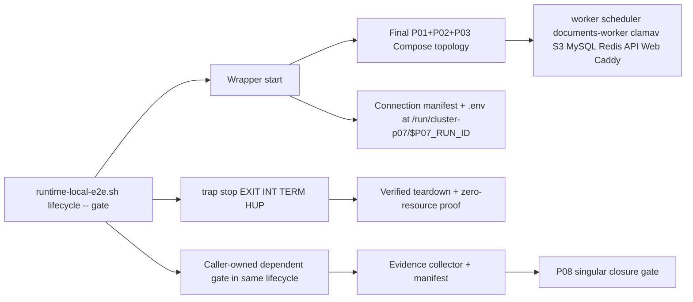

# Cluster Production-like E2E Runner Readiness Implementation Plan

> **For agentic workers:** REQUIRED SUB-SKILL: Use `skill://subagent-driven-development` (recommended) or `skill://executing-plans` to implement this plan task-by-task. Steps use checkbox (`- [ ]`) syntax for tracking.

```yaml
plan_id: P07
status: blocked
depends_on:
  - ARCHITECTURE-CLOSURE:T13-HANDOFF
  - P01
  - P02
  - P03
  - M07
blocks:
  - P08
shared_file_owner: []
implementation_commit: null
last_verified_commit: null
last_status_change: '2026-07-26'
tree_digest: "sha256(concat(UTF-8 file bytes for M00-M07 and P01-P08 in ascending plan_id order, removing only each tree_digest YAML scalar token))"
```

**Goal:** Provide one deterministic, production-like Playwright runner that proves Cluster's browser, API, MySQL, Redis, worker, scheduler, S3/ClamAV, recovery-facing, accessibility, and final Workspace paths on an isolated localhost deployment and retains enough evidence to diagnose every failure. The runner is a bounded lifecycle — `start`, `run`, and `stop` modes dispatched by one wrapper at `infra/platform/production/run-local-e2e.sh` — that brings up the final P01–P03 merged topology, exports an exact commit-bound connection manifest, keeps that topology live for P05/P06/P07 dependent gates, traps teardown, and proves zero remaining resources. P08 alone wires the finished command into `Makefile` and GitHub workflows after the current Architecture Closure Task 13 hands those files off.

**Architecture:** P07 extends the existing `infra/platform/production/run-local-e2e.sh` lifecycle rather than creating a competing topology or closure gate. The runner builds no infrastructure contract of its own: it consumes the serially integrated P01 → P02 → P03 production Compose topology, seeds only an ephemeral `APP_ENV=testing` database through test-owned seeders, runs a deliberately serialized live suite through Caddy HTTPS, captures Playwright and service evidence before teardown, and emits a machine-readable manifest. P08 alone wires the finished command into `Makefile` and GitHub workflows after the current Architecture Closure Task 13 hands those files off.

**Tech Stack:** Playwright 1.61.1 and Chromium, TypeScript 6, React 19/Vite 8, Laravel 13.8/PHP 8.4, MySQL 8.4, Redis 8.2, Docker Compose v2, Caddy 2.10, P01 worker/scheduler loops, P02 S3-compatible object storage and ClamAV, P03 backup/restore tooling, Bash, Node.js 22.

---

## 1. Status header and dependency fields

- The current status is exactly `blocked` because production execution cannot begin until `ARCHITECTURE-CLOSURE:T13-HANDOFF`, `P01`, `P02`, `P03`, and `M07` are complete.
- **Inventory phase is ungated and may start now:** inspect and classify configs, specs, runner requirements, service names, environment inputs, and current artifacts without changing reserved shared surfaces.
- `ARCHITECTURE-CLOSURE:T13-HANDOFF` must explicitly release `.github/workflows/ci-e2e.yml`, `.github/workflows/ci.yml`, and `Makefile`. That release does not grant them to P07; it makes them eligible for P08.
- P01 must hand off healthy `worker` and `scheduler` services whose readiness reflects a successful loop cycle, not process liveness, and must release its first production-topology token.
- P02 must hand off base `clamav` (`clamdscan --ping 3` health), smoke-overlay `minio` plus one-shot `minio-init`, private/versioned `documents-quarantine` and `documents-available` buckets, the `DOCUMENTS_QUARANTINE_AWS_*`/`DOCUMENTS_AVAILABLE_AWS_*` production adapters, and a passing `php artisan documents:storage-health --readiness`.
- P03 must hand off a passing `bash infra/platform/production/test-backup-restore-release.sh`, `P03_RECOVERY_MANIFEST_PATH` set to the exact `artifacts/p03-recovery/${RUN_ID}/evidence.json` printed by its isolated drill, `P03_RECOVERY_MANIFEST_SHA256` set to that file's lowercase SHA-256 digest, and P03's recorded `last_verified_commit`. P07 validates those exact inputs against `docs/operations/schemas/cluster-recovery-evidence.schema.json`; it never runs the recovery command and MUST NEVER discover evidence with a wildcard, timestamp sort, directory scan, or “latest” selection.
- M07 must complete its rank-11 aggregation at `/api/v1/workspace` and `/workspace`, consuming the six M00 query contracts without a same-rank Notifications/Search/Reporting import or test-only production fake.
- P05 must hand off `apps/web/e2e/accessibility.spec.ts` through the recorded P07 integration token before P07 verification. P05 does not have to complete before P07 starts, and **P05 completion never invokes P07 or depends on P07 output**: P05's sealed static child manifest at `artifacts/accessibility/<sha>/manifest.json` is published independently of any P07 lifecycle. Once P07's lifecycle implementation exists, the P05 executor may invoke it for **post-completion live validation only** (a non-blocking executor-side check that the P05 wrapper runs cleanly against an executor-side P07 lifecycle); that invocation writes only to `artifacts/accessibility-live/<sha>/<run-id>/` and never touches the sealed static child manifest. P08 later invokes the same interface for the final-HEAD program replay. P07 adds the handed-off spec to `testMatch` and never edits its body.
- P07 owns one bounded foreground lifecycle in `infra/platform/production/run-local-e2e.sh`: internal `start` → emit connection manifest → invoke exactly one caller-supplied dependent command → on success run P07 journeys → internal `stop`. The connection manifest (and the env companion) is **not** exported before `start`; it is created and sealed only after `start` reports `topology_ready=true`, and the lifecycle injects `P07_CONNECTION_MANIFEST_PATH`/`P07_CONNECTION_MANIFEST_ENV_PATH` into the dependent gate's child env at the moment it invokes that gate — never before `start`, never as a caller-supplied variable. P07's own completion uses its owned live-contract probe; P05/P06 may use their owned child verifiers; P08's final replay supplies `scripts/run-program-live-gates.sh`, which runs G07/G08/G11/G12. No caller runs a dependent gate before startup or after teardown.
- P07 blocks P08 until the bounded lifecycle, exported connection manifest, retained evidence, cleanup checks, and two consecutive clean-run criterion in §14 pass on one recorded commit.

## 2. Goal and user-visible outcome

P07 exposes one public foreground command:

```bash
: "${P07_COMMIT_SHA:?export the full 40-character candidate SHA}"
: "${P03_RECOVERY_MANIFEST_PATH:?export P03's exact recovery evidence path}"
: "${P03_RECOVERY_MANIFEST_SHA256:?export that file's lowercase SHA-256}"
./infra/platform/production/run-local-e2e.sh lifecycle -- <dependent-gate-command> [args...]
```

`start`, `run`, and `stop` are bounded internal functions, not cross-process modes. `lifecycle` validates argv, allocates the run identity and paths, installs `EXIT`, `INT`, `TERM`, and `HUP` handlers before the first Compose mutation, calls `start`, exports the connection contract, and invokes the caller-supplied dependent command exactly as `"$@"`. Only a zero dependent status permits P07's own `run`; a nonzero status records the precise blocked phase and proceeds directly to evidence capture and trapped cleanup. The dependent gate and P07 journeys use the same live topology when both run. Cleanup runs for every exit, and a cleanup failure overrides an otherwise successful result.

The lifecycle launches each active dependent/P07 command in a dedicated child process group and records its PID/PGID. On `INT`, `TERM`, or `HUP`, the signal handler forwards the same signal to that group, waits with a bounded deadline, escalates to `TERM` then `KILL` only if necessary, reaps the child, and only then enters the `EXIT` cleanup trap. The trap preserves the original/signal status, disables recursive traps, runs `stop` once, and exits nonzero when either a gate, child reap, or cleanup fails. It MUST NOT use `eval`, detach the topology, leave an active child, return a live stack, or ask P08 to install a second trap.

Internal `start` performs the final P01 → P02 → P03 merged-topology startup, migration, seeding, merged readiness, exact P03 manifest/digest validation, route inventory, and connection-manifest emission. It writes exactly:

```text
/run/cluster-p07/$P07_RUN_ID/connection-manifest.json
/run/cluster-p07/$P07_RUN_ID/connection-manifest.json.env
```

The runtime JSON manifest at `/run/cluster-p07/$P07_RUN_ID/connection-manifest.json` is mode `0600` and holds the **actual ephemeral** values needed for the lifecycle to run: the exact loopback origins, CA bundle path, NSS database path, Chromium HOME, `NODE_EXTRA_CA_CERTS`, `/api/v1` base path, route inventory path/digest, scope, `P07_RUN_ID`, `P07_COMMIT_SHA`, `P07_STACK_MODE`, and the real per-run fixture credentials (MySQL/Redis password, ephemeral benchmark passwords, MinIO access/secret keys). The runtime JSON is the source of truth that P05/P06/P08 wrappers parse to construct their child env; it never holds redacted values during the lifecycle. Separately, a sanitized copy at `artifacts/production-e2e/$P07_RUN_ID/connection/manifest.sanitized.json` is produced before teardown: it preserves the structure, origins, route inventory digest, CA fingerprint, run identifier, scope, and commit equality, but **redacts every secret value** (passwords, access keys, secret keys, session tokens, cookies) to `null` or an opaque placeholder. The validator and the P08 closure artifact bind only the sanitized copy's path/digest; they never read the runtime JSON. The Bash runner writes the mode-`0600` `.env` companion itself with `printf 'KEY=%q\n' "$value"` for every allowlisted key; `scripts/emit-connection-manifest.mjs` emits the runtime JSON only and writes the sanitized copy via a separate `scripts/emit-connection-manifest-sanitized.mjs` step. Tests must round-trip spaces, single/double quotes, dollar signs, backticks, and embedded newlines through a child Bash process without executing their contents.

  - the two manifest-pointer handoff keys (`P07_CONNECTION_MANIFEST_PATH`, `P07_CONNECTION_MANIFEST_ENV_PATH`),
  - the lifecycle's own control key (`P07_DEPENDENT_RESULT_PATH`),
  - an explicit *caller-owned control allowlist* that the invoking plan is responsible for passing (e.g. `P05_EVIDENCE_MODE`, `P05_EVIDENCE_ROOT`, `P05_RUN_ID`; `P06_*`; `PROGRAM_RUN_ID`, `PROGRAM_EVIDENCE_ROOT`); the lifecycle passes these through unchanged and the dependent wrapper is the final authority on their values,
  - the bare minimum execution keys (`PATH`, `HOME`, `LANG`).

Every P07-payload key that is not on the explicit caller-owned control allowlist (`P07_COMMIT_SHA`, `P07_RUN_ID`, `P07_WEB_HTTPS_ORIGIN`, `P07_API_HTTPS_ORIGIN`, `P07_API_BASE_PATH`, `W1_1_WEB_ORIGIN`, `W1_1_API_ORIGIN`, `W1_1_API_BASE_PATH`, `W1_1_ALLOW_SELF_SIGNED`, `P07_CA_BUNDLE_PATH`, `P07_CA_BUNDLE_FINGERPRINT`, `P07_CHROMIUM_HOME`, `P07_CHROMIUM_NSSDB_PATH`, `NODE_EXTRA_CA_CERTS`, `P07_SCOPE`, `P07_ROUTE_INVENTORY_PATH`, `P07_ROUTE_INVENTORY_SHA256`, `ACCESSIBILITY_ROUTE_INVENTORY`, `P03_RECOVERY_MANIFEST_PATH`, `P03_RECOVERY_MANIFEST_SHA256`) must be unset in the child's process env. The dependent wrapper validates the JSON manifest itself, never sources the env-companion file, and constructs its own env from the validated JSON. The handoff shape is:

The handoff shape is a single executable invocation per dependent gate; the wrapper is invoked with the two manifest-pointer env entries set, the lifecycle control env entry set, and the bare execution keys; everything else is parsed or generated by the wrapper itself:

```bash
# Allowlisted env entries: two manifest pointers + lifecycle control + bare exec keys.
# The dependent wrapper parses JSON for everything else and generates its own run ID.
: "${P07_CONNECTION_MANIFEST_PATH:?export the manifest JSON path}"
: "${P07_CONNECTION_MANIFEST_ENV_PATH:?export the manifest env path}"
: "${P07_DEPENDENT_RESULT_PATH:?export the dependent-result sink path}"
env -i \
  PATH="$PATH" \
  HOME="$HOME" \
  LANG="${LANG:-C.UTF-8}" \
  P07_CONNECTION_MANIFEST_PATH="$P07_CONNECTION_MANIFEST_PATH" \
  P07_CONNECTION_MANIFEST_ENV_PATH="$P07_CONNECTION_MANIFEST_ENV_PATH" \
  P07_DEPENDENT_RESULT_PATH="$P07_DEPENDENT_RESULT_PATH" \
  "$@"
```

For a dependent-gate invocation in `child` mode (a wrapper owned by a plan that has already completed its static handoff, e.g. P05 running a post-completion validator against an executor-side P07 lifecycle), the wrapper parses `P07_COMMIT_SHA` from the validated JSON, generates `P05_RUN_ID` internally, and constructs the live root from those values — nothing plan-specific is passed after `--`. The `child` invocation is **not** a P05 completion prerequisite; P05 completion happens before any P07 invocation:

```bash
# Generic dependent-gate child-mode invocation
env -i \
  PATH="$PATH" HOME="$HOME" LANG="${LANG:-C.UTF-8}" \
  P07_CONNECTION_MANIFEST_PATH="$P07_CONNECTION_MANIFEST_PATH" \
  P07_CONNECTION_MANIFEST_ENV_PATH="$P07_CONNECTION_MANIFEST_ENV_PATH" \
  P07_DEPENDENT_RESULT_PATH="$P07_DEPENDENT_RESULT_PATH" \
  node <plan-owned-wrapper-script>.mjs --mode child
```

For the P08 final-HEAD replay (the only invocation that is a closure prerequisite) the only env entries pre-set are the two program-control values, plus the same manifest pointers and lifecycle control. The wrapper generates `P05_RUN_ID` internally, parses `P07_COMMIT_SHA` from JSON, and derives the live root from `PROGRAM_EVIDENCE_ROOT`:

```bash
# P08 final-HEAD replay (program-rooted, closure prerequisite)
env -i \
  PATH="$PATH" HOME="$HOME" LANG="${LANG:-C.UTF-8}" \
  P07_CONNECTION_MANIFEST_PATH="$P07_CONNECTION_MANIFEST_PATH" \
  P07_CONNECTION_MANIFEST_ENV_PATH="$P07_CONNECTION_MANIFEST_ENV_PATH" \
  P07_DEPENDENT_RESULT_PATH="$P07_DEPENDENT_RESULT_PATH" \
  PROGRAM_RUN_ID="$PROGRAM_RUN_ID" \
  PROGRAM_EVIDENCE_ROOT="$PROGRAM_EVIDENCE_ROOT" \
  node <plan-owned-wrapper-script>.mjs --mode replay
```

For the P08 final replay the only env entries pre-set are the four program-control values, plus the same manifest pointers and lifecycle control. The wrapper generates `P05_RUN_ID` internally, parses `P07_COMMIT_SHA` from JSON, and derives the live root from `PROGRAM_EVIDENCE_ROOT`:

```bash
# P08 replay-mode invocation (program-rooted)
env -i \
  PATH="$PATH" HOME="$HOME" LANG="${LANG:-C.UTF-8}" \
  P07_CONNECTION_MANIFEST_PATH="$P07_CONNECTION_MANIFEST_PATH" \
  P07_CONNECTION_MANIFEST_ENV_PATH="$P07_CONNECTION_MANIFEST_ENV_PATH" \
  P07_DEPENDENT_RESULT_PATH="$P07_DEPENDENT_RESULT_PATH" \
  PROGRAM_RUN_ID="$PROGRAM_RUN_ID" \
  PROGRAM_EVIDENCE_ROOT="$PROGRAM_EVIDENCE_ROOT" \
  node scripts/run-accessibility-live.mjs --mode replay
```

The emitter and validator own this exact exported environment contract:

```text
P07_CONNECTION_MANIFEST_SCHEMA_VERSION=1
P07_CONNECTION_MANIFEST_PATH=/run/cluster-p07/$P07_RUN_ID/connection-manifest.json
P07_CONNECTION_MANIFEST_ENV_PATH=/run/cluster-p07/$P07_RUN_ID/connection-manifest.json.env
P07_RUN_ID=p07-<UTC>-<8hex>
P07_DEPENDENT_RESULT_PATH=/run/cluster-p07/$P07_RUN_ID/dependent-gate-result.json
P07_COMMIT_SHA=<40 lowercase hex>
P07_COMPOSE_PROJECT=cluster-p07-<run-id>-<short-sha>
P07_STACK_MODE=merged
P07_SCOPE=e2e

P07_WEB_HTTPS_ORIGIN=https://localhost:<https-port>
P07_API_HTTPS_ORIGIN=https://localhost:<https-port>
P07_API_BASE_PATH=/api/v1
W1_1_WEB_ORIGIN=$P07_WEB_HTTPS_ORIGIN
W1_1_API_ORIGIN=$P07_API_HTTPS_ORIGIN
W1_1_API_BASE_PATH=$P07_API_BASE_PATH
W1_1_ALLOW_SELF_SIGNED=0
P07_CA_BUNDLE_PATH=/run/cluster-p07/$P07_RUN_ID/caddy-root-ca.pem
P07_CA_BUNDLE_FINGERPRINT=<64 lowercase hex>
P07_CHROMIUM_HOME=/run/cluster-p07/$P07_RUN_ID/chromium-home
P07_CHROMIUM_NSSDB_PATH=$P07_CHROMIUM_HOME/.pki/nssdb
NODE_EXTRA_CA_CERTS=$P07_CA_BUNDLE_PATH

P07_ROUTE_INVENTORY_PATH=/run/cluster-p07/$P07_RUN_ID/route-inventory.json
P07_ROUTE_INVENTORY_SHA256=<64 lowercase hex>
ACCESSIBILITY_ROUTE_INVENTORY=$P07_ROUTE_INVENTORY_PATH

P07_SEED_JSON_PATH=/run/cluster-p07/$P07_RUN_ID/seed.json
P07_FACILITY_A_ID=<UUID>
P07_FACILITY_B_ID=<different UUID>
P07_MYSQL_HOST=127.0.0.1
P07_MYSQL_PORT=<loopback port>
P07_MYSQL_DATABASE=<ephemeral database>
P07_MYSQL_USERNAME=<ephemeral user>
P07_MYSQL_PASSWORD=<ephemeral secret>
P07_REDIS_HOST=127.0.0.1
P07_REDIS_PORT=<loopback port>
P07_REDIS_PASSWORD=<ephemeral secret>
P07_S3_PUBLIC_ENDPOINT=http://127.0.0.1:<loopback port>
P07_S3_ACCESS_KEY=<ephemeral key>
P07_S3_SECRET_KEY=<ephemeral secret>


P07_CONNECTION_FIXTURE_MANIFEST=$P07_CONNECTION_MANIFEST_PATH
P06_COMMIT_SHA=$P07_COMMIT_SHA
P06_API_ORIGIN=$P07_API_HTTPS_ORIGIN
P06_WEB_ORIGIN=$P07_WEB_HTTPS_ORIGIN
P06_USERNAME=<dedicated seeded benchmark username>
P06_PASSWORD=<ephemeral benchmark password>
P06_SCOPE_ID=<dedicated non-sensitive benchmark scope UUID>
W1_2_IDENTITY_USERNAME=<seeded username>
W1_2_IDENTITY_PASSWORD=<ephemeral password>
W1_2_IMPORT_USERNAME=<seeded username>
W1_2_IMPORT_PASSWORD=<ephemeral password>
W1_2_IMPORT_POSITION_ID=<UUID>
W1_2_TEMPORARY_ASSIGNMENT_PERSON_ID=<UUID>
W1_2_TEMPORARY_ASSIGNMENT_UNIT_ID=<UUID>
W1_2_TEMPORARY_ASSIGNMENT_CAPABILITY=<capability token>
W1_2_IDENTITY_COOKIE=cluster_identity_session
W1_2_SESSION_SECURE_COOKIE=true

P03_RECOVERY_MANIFEST_PATH=<exact handed-off path>
P03_RECOVERY_MANIFEST_SHA256=<exact handed-off digest>
```

`P07_WEB_HTTPS_ORIGIN`, `P07_API_HTTPS_ORIGIN`, `W1_1_WEB_ORIGIN`, and `W1_1_API_ORIGIN` must be credential-free loopback HTTPS origins with no path, query, or fragment; `P07_API_BASE_PATH`/`W1_1_API_BASE_PATH` alone carry `/api/v1`. `ACCESSIBILITY_ROUTE_INVENTORY` must equal `P07_ROUTE_INVENTORY_PATH` and hash to `P07_ROUTE_INVENTORY_SHA256`. The runner imports the mode-`0600` CA into a fresh NSS database under `P07_CHROMIUM_HOME`, launches Playwright with that HOME and `ignoreHTTPSErrors: false`, and exports `NODE_EXTRA_CA_CERTS` for Node. `W1_1_ALLOW_SELF_SIGNED` is `0`. CA/NSS validation, hostname validation, and a normal HTTPS request must pass; `NODE_TLS_REJECT_UNAUTHORIZED=0`, `curl --insecure`, `ignoreHTTPSErrors: true`, HTTP fallback, globbed manifest discovery, and secret-bearing retained output are prohibited.

The internal `run` phase executes these journeys against real services, with no request interception or mocked HTTP responses:

1. Arabic-first login, keyboard-usable validation, English/LTR switch, secure cookie session, CSRF enforcement, and no external browser requests.
2. Two-facility work-record creation and symmetric non-disclosure, cursor collection read, correlation IDs, notification delivery through the real outbox/worker path, and page-level 404 problem rendering.
3. A document upload to the quarantine bucket, ClamAV clean scan, promotion to the available bucket, and visible availability through the UI.
4. An authenticated but under-capable principal receiving a non-disclosing 403 before detailed mutation validation.
5. Idempotent replay and stale `If-Match`/`lock_version` 412 behavior.
6. Scheduler-owned temporary-assignment expiry and capability loss without manually invoking the expiry command.
7. Secret-free platform health and backup inventory pages, while P03 retains destructive recovery ownership.
8. M07's `/workspace` aggregation consuming M01–M06 query contracts without direct cross-owner access, cached producer facts, or production fakes.
9. P05-owned `accessibility.spec.ts` WCAG 2.2 AA axe, keyboard, focus, zoom/reflow, RTL/LTR, reduced-motion, and route-coverage journeys through the same production Playwright project.

Expected final output:

```text
PASS: production-like lifecycle completed; manifest=artifacts/production-e2e/$P07_RUN_ID/manifest.json; cleanup=artifacts/production-e2e/$P07_RUN_ID/cleanup.json
```

That line is printed only after manifest validation and zero-resource proof pass. Any dependent-gate, P07, evidence, or cleanup failure exits nonzero and prints no PASS line.
## 3. Current source evidence

The implementer must re-confirm this evidence at `P07_COMMIT_SHA` before changing files and record the result in the run manifest:

- `apps/web/playwright.config.ts` requires a localhost `W1_1_API_ORIGIN`, starts Vite, uses one worker, zero retries, and retains traces only on failure. It is a development runner, not the production-bundle runner.
- `apps/web/playwright.production.config.ts` validates `W1_1_WEB_ORIGIN` as a credential-free localhost HTTP(S) origin, uses one worker and zero retries, but currently has no explicit production `testMatch`, output path, HTML/JSON reporters, screenshot/video policy, global fixture, or run identifier. It is the only configuration file owned by P07.
- `apps/web/playwright.w1-2.config.ts` runs only `w1-2-cookie-csrf.spec.ts` against a caller-started local origin.
- `infra/dev/run-w1-1-e2e.sh` is the W1.1 reference harness: free localhost ports, isolated Compose project, MySQL/Redis health checks, `migrate:fresh`, authorization fixtures, Laravel/Vite startup, bounded coordinator loops, one Playwright worker, and volume cleanup.
- `infra/dev/run-w1-2-e2e.sh` is the external-service reference harness: isolated MySQL, Redis, MinIO and ClamAV; generated credentials; quarantine/available buckets; document worker token; W1.2 seed JSON; and the cookie/CSRF document journey.
- `infra/platform/production/run-local-e2e.sh` already chooses four free ports, generates secrets, starts the production images through `compose.yaml` plus `compose.test.yaml`, waits for migration and health, restarts Redis and the worker, and runs only `login.spec.ts` and `walking-skeleton.spec.ts`. It deletes its only log before exit and therefore loses failure evidence. P07 replaces this single-exit flow with one foreground lifecycle wrapper whose internal start/run/stop phases export a connection manifest, trap teardown, and prove zero remaining resources.
- `infra/platform/production/compose.yaml` names `caddy`, `web`, `api`, `worker`, `scheduler`, and `migrate` after P01 integration; P02 adds `clamav`, `documents-worker`, `minio`, and `minio-init`; P03 does not add a top-level service. P01–P02 own the serialized correction of that topology before P07 execution.
- `infra/platform/production/compose.test.yaml` currently adds isolated MySQL/Redis and named volumes; P02 adds the documents-smoke overlay.
- `.github/workflows/ci-e2e.yml` uses a single `[self-hosted, cluster-e2e]` job, a 30-minute timeout, Node 22, PHP 8.4, Python 3.12, `PLAYWRIGHT_BROWSERS_PATH=${{ runner.temp }}/ms-playwright`, and Chromium installation, but uploads only test-result directories for 14 days. It is reserved first by Architecture Closure Task 13 and then by P08.
- `apps/web/e2e/login.spec.ts` is live and verifies local-only requests. `walking-skeleton.spec.ts` is live and verifies two-facility isolation and notifications. `w1-2-cookie-csrf.spec.ts` is live when all required seed environment values are supplied. `documents.spec.ts`, `day2-workflow.spec.ts`, `day3-r1.spec.ts`, and several visual/navigation specs install mocked routes and cannot count as production evidence. `accessibility.spec.ts` is created by P05 and becomes part of the production `testMatch` only after a P07 integration token; P07 adds it to discovery but never edits its body.
- `apps/api/routes/console.php` currently exposes `e2e:w1-2:seed` only under `APP_ENV=testing` and `e2e:platform-settings:seed` only under local/testing. P01 exclusively owns this file; P07 must consume these commands and must not edit their registration.
- `.gitignore` and `apps/web/.gitignore` already exclude Playwright result directories. P07 evidence is runtime output, not source-controlled output. P07 never writes the connection manifest into the artifacts tree; it lives only under `/run/cluster-p07/$P07_RUN_ID/`.

## 4. Scope and explicit non-goals

### In scope

- One bounded foreground lifecycle in `infra/platform/production/run-local-e2e.sh`, with internal `start`/`run`/`stop` functions and a public `lifecycle -- <gate-command>` entry point that keeps the teardown trap in the same shell as the caller-supplied dependent gate and, after a zero gate result, P07 journeys.
- A deterministic connection manifest written by internal `start` and safely Bash-sourced by the lifecycle before it invokes any dependent gate. The manifest is the single source of truth for the live topology's HTTPS origins, API base path, Caddy CA bundle, credentials, scope, route inventory, run identifier, and P07 commit SHA.
- Production Playwright project selection, localhost validation, serial execution, browser provisioning checks, failure capture, and deterministic run metadata.
- Extending the existing production runner after P01–P03 topology handoff.
- Including `apps/web/e2e/accessibility.spec.ts` (P05-owned) in the production `testMatch` with a nonzero discovery sentinel that the validator requires.
- Ephemeral test-only fixtures, seed isolation, service readiness, bounded waits, cleanup verification, and evidence retention.
- Live representative browser/API journeys and explicit rejection of mocked production evidence.
- A no-retry primary result, a diagnostic rerun policy, and a documented flake disposition.
- A stable final command and artifact manifest for P08 to consume.

### Explicit non-goals

- Editing `Makefile`, `.github/workflows/ci.yml`, or `.github/workflows/ci-e2e.yml`; only P08 may own final integration after Task 13 handoff.
- Editing `apps/api/docker/worker-loop.sh`, `apps/api/docker/scheduler-loop.sh`, or `apps/api/routes/console.php`; P01 owns them.
- Editing base `infra/platform/production/compose.yaml`, `infra/platform/production/.env.example`, or P03 deployment/rollback scripts; P07 consumes their final contracts.
- Running E2E against a deployed, shared, staging, or production hostname. The runner accepts only `localhost`, `127.0.0.1`, or `[::1]` and rejects credentials, paths, query strings, and fragments.
- Browser-driving a real restore or rollback. P03 owns destructive recovery rehearsals; P07 only validates `P03_RECOVERY_MANIFEST_PATH` against `P03_RECOVERY_MANIFEST_SHA256` and P03's recorded `last_verified_commit`, then links that exact evidence.
- Treating route-mocked specs, skipped tests, retries, screenshots alone, or a passing Playwright list command as production proof.
- Hand-editing `docs/contracts/api/openapi.yaml` or `apps/web/src/api/generated/cluster.ts`; generated clients change only through `npm --prefix apps/web run api:generate` when a separately authorized contract owner changes the source.
- Adding application tables, module routes, module capabilities, production fallback adapters, shared accounts, wildcard permissions, or test-only bindings to a production environment.
- Defining another final program live-gate script; P08 alone owns `scripts/run-program-live-gates.sh`, while P07, P05, and P06 may pass only their plan-owned child verifier/probe to the stable `lifecycle --` interface.

## 5. Architecture and ownership boundaries



Ownership rules:

- P07 owns the internal start/run/stop functions and public `lifecycle -- <dependent-gate-command>` entry point in `infra/platform/production/run-local-e2e.sh`, one new P07 live spec/fixture, the Playwright production configuration, the P07 test-only seed composition, the connection manifest emitter, and the evidence validator. The invoking plan supplies one command as argv after `--`; P07 runs its own journeys only after that command exits zero and before teardown.
- The connection manifest is the single source of truth for HTTPS origins, CA bundle, credentials, scope, route inventory, and the P07 commit SHA. P05, P06, P07's probe, and P08's final wrapper inherit it only from `P07_CONNECTION_MANIFEST_ENV_PATH`; they MUST NOT read another connection source.
- Production module flow remains module-owned controller → validation/capability → handler/service → module-owned persistence.
- Cross-module journey assertions use published HTTP routes or M00 Contracts/Events; no P07 PHP code imports module Domain/Infrastructure code or writes module tables directly.
- Test fixture orchestration may invoke existing seeders, but each invoked seeder remains responsible for its module-owned persistence. Test data is never loaded into `APP_ENV=production`.
- P07 does not create a second Compose topology or CI gate. The exact production-like stack is `infra/platform/production/compose.yaml` + `infra/platform/production/compose.test.yaml` + `infra/platform/production/compose.documents-smoke.yaml`; P08 invokes this interface once for the singular final replay lifecycle, while child plans may invoke separate commit-scoped lifecycles for their own completion evidence.
- The browser reaches only Caddy HTTPS on loopback. MySQL, Redis, S3 admin/console, ClamAV, API FastCGI, worker, scheduler, and documents-worker are never browser-addressable.
- The teardown trap lives in the lifecycle process that starts the topology, runs the caller-supplied dependent command, conditionally runs P07 journeys, and stops the topology. Internal phases are not public cross-process handoffs.

## 6. Files to create, modify, move, or remove

### Create

- `apps/web/e2e/fixtures/production-fixtures.ts` — strict environment parsing, UUIDv7 correlation/idempotency helpers, session login, CSRF headers, and localhost request guard shared by live specs. Reads `P07_CONNECTION_MANIFEST_PATH` exclusively.
- `apps/web/e2e/production-security.spec.ts` — live authorization-order, idempotency, stale-write, problem+json, cookie, CSRF, and external-request assertions.
- `apps/web/e2e/production-runtime.spec.ts` — worker notification, scheduler expiry, platform health/backup inventory, and final Workspace aggregation journey.
- `apps/api/database/seeders/ProductionE2ESeeder.php` — test-only composition of already-owned seeders; emits one JSON fixture contract and refuses every environment except `testing`.
- `apps/api/tests/Feature/ProductionE2ESeederTest.php` — refusal, idempotent reseed, fixed persona/capability, facility-isolation, stale-write, and expired-assignment fixture tests.
- `scripts/emit-connection-manifest.mjs` — emits only the **runtime** connection-manifest JSON at `$P07_CONNECTION_MANIFEST_PATH` containing the actual ephemeral values (origins, CA/NSS/Chromium paths, `/api/v1` base path, fixture credentials) needed for the lifecycle to run. Refuses unless the allowlisted fields match schema; never redacts the runtime JSON. The Bash runner separately writes `$P07_CONNECTION_MANIFEST_ENV_PATH` with `printf 'KEY=%q\n'` for each allowlisted value, mode `0600`.
- `scripts/emit-connection-manifest-sanitized.mjs` — emits the sanitized copy at `artifacts/production-e2e/$P07_RUN_ID/connection/manifest.sanitized.json` with every secret value (`P07_MYSQL_PASSWORD`, `P07_REDIS_PASSWORD`, `P07_S3_ACCESS_KEY`, `P07_S3_SECRET_KEY`, `P06_USERNAME`, `P06_PASSWORD`, `P06_SCOPE_ID`, `W1_2_IDENTITY_PASSWORD`, `W1_2_IMPORT_PASSWORD`) redacted to `null`. Preserves structure, origins, route inventory digest, CA fingerprint, run identifier, scope, and commit equality; the validator and the P08 closure artifact bind only this copy's path/digest.
- `scripts/validate-connection-manifest.mjs` — schema validator for the connection manifest: rejects missing required keys, non-loopback origins, wrong commit, wrong run id, missing CA bundle, missing sanitized counterpart, or runtime-credential exposure in the sanitized copy.
- `scripts/validate-production-e2e-manifest.mjs` — validates the retained evidence schema and rejects missing, skipped, retried-as-pass, stale, wrong-commit, missing-accessibility-sentinel, or wrong-P03-path-or-digest evidence.
- `scripts/tests/validate-production-e2e-manifest.test.mjs` — Node tests for accepted and rejected manifests using temporary directories.
- `scripts/assert-accessibility-sentinel.mjs` — asserts that `apps/web/e2e/accessibility.spec.ts` is in the production `testMatch` and that `playwright test --list` discovers at least one test from it. Invoked by `run` in `lifecycle` and recorded in the run manifest.
- `scripts/tests/assert-accessibility-sentinel.test.mjs` — fixtures for missing/present/zero/nonzero accessibility discovery.
- `scripts/tests/probe-p07-live-contract.mjs` — dependent-gate probe for the live exported contract and merged topology.

### Modify after all dependency handoffs

- `apps/web/playwright.production.config.ts` — explicit live suite including `accessibility.spec.ts`, deterministic reporters/output, one worker, zero retries, `ignoreHTTPSErrors: false`, and validated `P07_CONNECTION_MANIFEST_PATH`; Chromium runs with the per-run CA imported into the NSS database identified by `P07_CHROMIUM_HOME`.
- `infra/platform/production/run-local-e2e.sh` — replace the current flow with one bounded foreground `lifecycle -- <dependent-gate-command>` wrapper implemented through internal `start`, `run`, and `stop` functions. P07 owns connection-manifest emission, merged P01+P02+P03 readiness, P07 journeys, trap-driven teardown, and zero-resource proof; P08 supplies only the P05/P06 gate command as argv.

### Read but never modify under P07

- `apps/web/e2e/accessibility.spec.ts` (P05-owned)
- `Makefile`
- `.github/workflows/ci.yml`
- `.github/workflows/ci-e2e.yml`
- `infra/platform/production/compose.yaml`
- `infra/platform/production/.env.example`
- `infra/platform/production/compose.test.yaml`
- `infra/platform/production/compose.documents-smoke.yaml`
- `infra/platform/production/.env.documents-smoke.example`
- `infra/platform/production/verify-documents-runtime.sh`
- `apps/api/docker/worker-loop.sh`
- `apps/api/docker/scheduler-loop.sh`
- `apps/api/routes/console.php`
- `docs/contracts/api/openapi.yaml`
- `apps/web/src/api/generated/cluster.ts`

No file is moved or removed by P07.
## 7. Public Contracts, Events, routes, schemas, and capability names

P07 publishes no runtime Contract, Event, route, schema, or capability. It consumes these public surfaces exactly:

- `POST /api/v1/identity/login`, `GET /api/v1/me`, and session logout behavior.
- `GET/POST /api/v1/work-records`, `GET /api/v1/work-records/{id}`, and `GET /api/v1/notifications`.
- P02's finalized document upload-ticket, completion, scan-status, and document availability routes already represented by `w1-2-cookie-csrf.spec.ts`; runtime readiness is `php artisan documents:storage-health --readiness`.
- `GET /api/v1/platform-operations/health`, `GET /api/v1/platform-operations/backups`, `POST /api/v1/platform-operations/restore-requests`, and `POST /api/v1/platform-operations/restore-requests/{requestId}/confirm`; P07 exercises the GET routes only.
- M07’s exact API/web prefixes `/api/v1/workspace` and `/workspace`, guarded by `workspace.read`; the preference mutation uses `workspace.preferences.update`. Workspace consumes the six query contracts named in §2 and publishes no cross-module Contract/Event.

Every live request that is not a static asset must carry or receive a UUIDv7 `X-Correlation-ID`. Every mutation must use the login-issued CSRF token. Replay-sensitive mutations use UUIDv7 `Idempotency-Key`; optimistic mutations use the current ETag in `If-Match`, then replay an older ETag and assert 412. Error responses must have `Content-Type: application/problem+json`, a stable `type`, `title`, `status`, and non-disclosing `detail`.

Required production test personas are fixed, non-wildcard, facility-scoped fixture accounts generated by `ProductionE2ESeeder`: `p07-facility-a-owner`, `p07-facility-b-owner`, `p07-under-capable`, and `p07-expiring-assignee`. Passwords are generated per run, transported only through the seed JSON file at mode `0600`, redacted from logs/manifests, and removed during cleanup.

## 8. Database tables, indexes, constraints, migration order, and rollback/recovery

P07 owns no database table, index, foreign key, migration, or production data. It must not add direct cross-owner SQL or foreign keys.

Execution order is fixed.

Internal `start`:

1. Before any mutable operation, require `P07_COMMIT_SHA` to match `^[a-f0-9]{40}$`; require readable `P03_RECOVERY_MANIFEST_PATH` and lowercase 64-hex `P03_RECOVERY_MANIFEST_SHA256`; recompute and compare the digest. Derive `P07_RUN_ID` matching `^p07-[0-9]{8}T[0-9]{6}Z-[a-f0-9]{8}$`, `P07_STACK_MODE=merged`, `P07_COMPOSE_PROJECT=cluster-p07-<run-id>-<short-sha>`, and all runtime/evidence path strings without writing them. Immediately install the teardown/evidence trap. Only then create mode-`0700` runtime/evidence directories, allocate free loopback HTTPS/MySQL/Redis/MinIO ports, or generate state. The trap records zero owned resources even when failure occurs before Compose startup.
2. Define one Compose argv array and use it unchanged for every call:

   ```bash
   docker compose --project-name "$P07_COMPOSE_PROJECT" \
     --file infra/platform/production/compose.yaml \
     --file infra/platform/production/compose.test.yaml \
     --file infra/platform/production/compose.documents-smoke.yaml
   ```

3. Generate a per-run mode-`0600` Documents smoke env from `infra/platform/production/.env.documents-smoke.example`. Start MySQL, Redis, base `clamav`, smoke-overlay `minio`, and one-shot `minio-init`; bounded-wait for MySQL `SELECT 1`, Redis PONG, P02's final ClamAV Compose healthcheck, MinIO/S3 readiness, `minio-init` exit 0, and private/versioned `documents-quarantine`/`documents-available` buckets.
4. Run the authoritative production `migrate` service once and require exit 0. Execute `php artisan db:seed --class=Database\\Seeders\\ProductionE2ESeeder --force` with `APP_ENV=testing`; write its JSON result to mode-`0600` `$P07_SEED_JSON_PATH`.
5. Start `api`, `worker`, `scheduler`, `documents-worker`, `web`, and `caddy`. Bounded-wait only for Caddy's TCP listener and generated internal root certificate path—never with insecure HTTP/TLS. Copy that root to mode-`0600` `$P07_CA_BUNDLE_PATH`, fingerprint it, initialize a fresh NSS database at `$P07_CHROMIUM_NSSDB_PATH` with `certutil`, import/verify the CA, and set `HOME=$P07_CHROMIUM_HOME`, `NODE_EXTRA_CA_CERTS=$P07_CA_BUNDLE_PATH`, `W1_1_ALLOW_SELF_SIGNED=0`. Only then perform CA-verified API/web HTTPS waits and the complete merged-pool checks:
   - MySQL and Redis remain ready.
   - S3/MinIO remains ready and `minio-init` remains completed.
   - ClamAV satisfies P02's final Compose healthcheck.
   - `documents-worker` satisfies P02's final Compose healthcheck/readiness contract; P07 does not inspect P02-internal marker paths or invent another lease probe.
   - `worker` and `scheduler` satisfy P01's final Compose healthchecks, each of which proves a successful loop cycle rather than process liveness.
   - API HTTPS `/up` returns 200 through Caddy with the pinned per-run CA.
   - Web HTTPS `/` returns 200 with the production HTML shell.
6. Run `php artisan documents:storage-health --readiness` and `infra/platform/production/verify-documents-runtime.sh`; both must exit 0.
7. Validate the exact P03 file against `docs/operations/schemas/cluster-recovery-evidence.schema.json` and P03's recorded `last_verified_commit`. Wildcards, directory scans, timestamp sorting, and “latest” discovery are prohibited.
8. Generate `$P07_ROUTE_INVENTORY_PATH`, hash it into `P07_ROUTE_INVENTORY_SHA256`, and set `ACCESSIBILITY_ROUTE_INVENTORY` to that exact path. Run `scripts/emit-connection-manifest.mjs` to write the **runtime** `$P07_CONNECTION_MANIFEST_PATH` (mode `0600`, real values) — wrappers depend on these real values to construct their child env, so redaction at this stage would break cold-run execution. In Bash, write `$P07_CONNECTION_MANIFEST_ENV_PATH` with the exact §2 allowlist and `printf 'KEY=%q\n' "$value"` per entry; never pass secrets through argv.
9. Run `scripts/validate-connection-manifest.mjs "$P07_CONNECTION_MANIFEST_PATH"` and a child-Bash source probe for the env file. Fail on any schema, origin/base-path, quoting, mode, equality, CA, route-inventory, commit, or P03-digest violation. Record `topology_ready=true` and the exact manifest path in evidence; do not print a PASS line yet.

After `start`, `lifecycle` invokes the caller-supplied dependent command in a child process whose env contains only the two manifest-pointer handoff keys (`P07_CONNECTION_MANIFEST_PATH`, `P07_CONNECTION_MANIFEST_ENV_PATH`), the lifecycle control key (`P07_DEPENDENT_RESULT_PATH`), and the bare execution keys (`PATH`, `HOME`, `LANG`). The lifecycle **does not** `source` the env companion into the dependent gate's env; the dependent wrapper parses `$P07_CONNECTION_MANIFEST_PATH` directly. The lifecycle records command argv, exit code, start/finish times, and retained output. A dependent command may atomically write that one mode-`0600` JSON file; P07 validates it before retention and never reads the secret values. For `scripts/run-program-live-gates.sh`, the file is mandatory and contains only schema version, final commit, P07 run ID, program run ID/root, G07 manifest path/digest, P05 replay root/live-manifest path/digest, and P06 replay root/manifest path/digest; every path must be repository-relative, beneath the supplied program root, run-bound, and non-symlinked. Generic child probes may om…

Internal `run`:

1. Validate `$P07_CONNECTION_MANIFEST_PATH` again and recheck every merged-pool item from `start`.
2. Run `scripts/assert-accessibility-sentinel.mjs`; missing `apps/web/e2e/accessibility.spec.ts` or `accessibility_discovery_count=0` is `result=failed` with the precise failure code from §9, never a skip.
3. Run the production Playwright project serially with one worker and zero retries, using only the exported contract. This runs all approved P07 specs, including P05-owned `accessibility.spec.ts`.
4. Capture the production E2E manifest, Playwright artifacts, redacted service logs, Compose state/health/digests, document readiness/smoke output, dependency-gate output, and exact P03 reference before teardown.

Internal `stop`, invoked exactly once by the lifecycle trap on `EXIT`, `INT`, `TERM`, or `HUP`:

1. Disable recursive traps, preserve all earlier exit codes, and capture final redacted diagnostics plus Compose `ps -a`.
2. Run the same Compose argv array with `down --volumes --remove-orphans`.
3. Inspect Docker by the exact Compose project label/name and require zero containers, networks, and volumes. Write `artifacts/production-e2e/$P07_RUN_ID/cleanup.json` with those observed counts and `complete`.
4. Copy only the sanitized connection manifest and route inventory into retained evidence; remove the seed JSON, Documents smoke env, real connection `.env`, CA bundle, runtime JSON, and entire `/run/cluster-p07/$P07_RUN_ID` directory, then prove every runtime path is absent.
5. Validate the final production E2E manifest only after `cleanup.complete=true`. A cleanup error forces the lifecycle to exit nonzero even if every gate passed. The sole PASS line is the final line defined in §2.

`ProductionE2ESeeder` must be idempotent for the same run ID, reset test-owned lock versions and expiring-assignment state, and never truncate or delete non-P07 records. Isolation comes from a fresh per-run database volume; rollback is volume disposal.

## 9. TDD tasks and executable red/green steps

### Task 1: Freeze the live-suite inventory and accessibility discovery contract

**Files:** Read `apps/web/e2e/*.spec.ts`, the three Playwright configs, both W1 harnesses, the production runner/topology, and CI workflow. Modify `apps/web/playwright.production.config.ts`; create `scripts/assert-accessibility-sentinel.mjs` and `scripts/tests/assert-accessibility-sentinel.test.mjs`. Evidence owner: P07. Status gate: this task may start during inventory, but P07 verification remains blocked until the P05 spec handoff is recorded.

- [ ] **Step 1: Write the failing inventory/discovery tests**

The test creates temporary mode-correct manifest/CA/route-inventory fixtures and asserts: mocked/mixed production specs fail; missing `accessibility.spec.ts` fails with `ACCESSIBILITY_SPEC_MISSING`; present-but-zero discovery fails with `ACCESSIBILITY_DISCOVERY_ZERO`; a discovered count greater than zero passes; and output records exact file/count without secrets.

```bash
node --test scripts/tests/assert-accessibility-sentinel.test.mjs
```

Expected red result: exit nonzero because the sentinel does not exist. Evidence: `artifacts/production-e2e/contract-tests/accessibility-sentinel-red.txt`.

- [ ] **Step 2: Produce the exact inventory**

Implement deterministic classification with exact fields `path`, `classification`, `required_env`, `journeys`, and `reason`. A spec is `mocked` or `mixed` when it contains `page.route`, `context.route`, `route.fulfill`, or a synthetic response installer. Expected: `login.spec.ts` and `walking-skeleton.spec.ts` are live; `documents.spec.ts` is mocked; `w1-2-cookie-csrf.spec.ts` is live only when its §2 environment is complete.

- [ ] **Step 3: Configure the exact production suite**

Set:

```ts
testMatch: [
  'login.spec.ts',
  'walking-skeleton.spec.ts',
  'w1-2-cookie-csrf.spec.ts',
  'production-security.spec.ts',
  'production-runtime.spec.ts',
  'accessibility.spec.ts',
],
```

Keep `fullyParallel: false`, `workers: 1`, `retries: 0`, and `forbidOnly: true`. Use `../../artifacts/production-e2e/${P07_RUN_ID}/playwright`, `list`/`json`/`junit`/`html` reporters, `trace: 'retain-on-failure'`, `screenshot: 'only-on-failure'`, and `video: 'retain-on-failure'`. Missing/invalid `P07_CONNECTION_MANIFEST_PATH` fails closed.

- [ ] **Step 4: Make discovery green**

```bash
node --test scripts/tests/assert-accessibility-sentinel.test.mjs
```

Expected: exit 0; the real production config names exactly the six approved files, contains no mocked suite, and yields `accessibility_discovery_count >= 1`. Evidence: `artifacts/production-e2e/contract-tests/accessibility-sentinel-green.txt`. Status gate: Task 1 is complete only after the output names `accessibility.spec.ts`; missing/zero discovery is `result=failed`, never skipped.

### Task 2: Create deterministic, test-only fixture composition


**Files:** Create `apps/api/database/seeders/ProductionE2ESeeder.php` and `apps/api/tests/Feature/ProductionE2ESeederTest.php`. Do not edit `routes/console.php`.

- [ ] **Step 1: Write failing environment and idempotency tests**

Tests must assert: `APP_ENV=production` throws before any insert; `APP_ENV=testing` returns JSON with `schema_version: 1`, run ID, four personas, two distinct facility IDs, current ETags, an expired assignment ID, and no plaintext password after JSON is consumed; a second call with the same run ID leaves one row per P07 natural key and resets the P07 test-owned mutable state.

Run:

```bash
cd apps/api && php artisan test tests/Feature/ProductionE2ESeederTest.php
```

Expected red result: FAIL because `Database\\Seeders\\ProductionE2ESeeder` does not exist.

- [ ] **Step 2: Implement minimal fixture composition**

The seeder must validate `app()->environment('testing')`, require `P07_RUN_ID` matching `^[a-z0-9][a-z0-9-]{7,63}$`, invoke only existing test-owned/module-owned seed entry points, generate per-run passwords with `random_bytes`, and return the exact JSON contract. It must not query or update another module’s tables directly.

- [ ] **Step 3: Verify fixture behavior**

Run:

```bash
cd apps/api && php artisan test tests/Feature/ProductionE2ESeederTest.php
```

Expected green result: all tests pass; production refusal occurs before writes; repeated test seeding is stable and facility IDs differ.

### Task 3: Add shared live-fixture primitives and security journey

**Files:** Create `apps/web/e2e/fixtures/production-fixtures.ts` and `apps/web/e2e/production-security.spec.ts`.

- [ ] **Step 1: Write the live failing assertions**

Assert a secure, HttpOnly, SameSite session cookie after HTTPS login; mutation without CSRF returns 419/403 problem+json; under-capable mutation returns 403 before malformed-field disclosure; identical idempotency key/body returns the same resource/result; same key with different body returns 409; stale `If-Match` returns 412; every response echoes a valid correlation ID; every browser request host is loopback.

Run through the isolated runner with only this file:

```bash
: "${P07_COMMIT_SHA:?export the full 40-character commit SHA under test}"
: "${P03_RECOVERY_MANIFEST_PATH:?export P03's exact manifest path}"
: "${P03_RECOVERY_MANIFEST_SHA256:?export P03's exact manifest digest}"
P07_TEST_MATCH=production-security.spec.ts \
  ./infra/platform/production/run-local-e2e.sh lifecycle -- true
```

Expected red result: the runner or missing spec fails before reporting PASS.

- [ ] **Step 2: Implement strict helpers and journey**

`production-fixtures.ts` must expose `requiredEnv(name)`, `uuidV7()`, `loginSession(request, persona)`, `mutationHeaders(csrfToken, etag?)`, and `installLoopbackRequestGuard(page)`. It must never print passwords/tokens, persist auth in browser storage, relax TLS, or accept `W1_1_ALLOW_SELF_SIGNED=1`.

- [ ] **Step 3: Verify the security journey**

Run the same command. Expected green result: one worker, zero retries, all security assertions pass, and the manifest records `retried: 0`, `skipped: 0`.

### Task 4: Add runtime, scheduler, recovery-facing, and Workspace journeys

**Files:** Create `apps/web/e2e/production-runtime.spec.ts`; reuse `walking-skeleton.spec.ts` and `w1-2-cookie-csrf.spec.ts` without route mocking.

- [ ] **Step 1: Write failing runtime assertions**

The new spec must wait with bounded polling, never fixed sleeps, for: worker-produced notification; scheduler expiry and capability removal; 200 health/backup inventory without secret-shaped values; and authorized `/workspace` summaries sourced through the six M00 contracts. It must assert an under-capable user without `workspace.read` cannot read Workspace details and a user without `workspace.preferences.update` cannot mutate preferences. Add tags `@worker`, `@scheduler`, `@recovery-read`, and `@workspace` to make evidence per concern explicit.

Run:

```bash
: "${P07_COMMIT_SHA:?export the full 40-character commit SHA under test}"
: "${P03_RECOVERY_MANIFEST_PATH:?export P03's exact manifest path}"
: "${P03_RECOVERY_MANIFEST_SHA256:?export P03's exact manifest digest}"
P07_TEST_MATCH=production-runtime.spec.ts \
  ./infra/platform/production/run-local-e2e.sh lifecycle -- true
```

Expected red result: missing runtime spec/assertion fails.

- [ ] **Step 2: Implement against public routes only**

Use UI roles/labels for user-visible behavior and API requests only for eventual-state confirmation. Do not import module Domain/Infrastructure classes, inspect DB tables from Playwright, or invoke worker/scheduler commands manually.

- [ ] **Step 3: Verify the runtime journey**

Run the same command. Expected green result: all four tags pass, scheduler/worker health remains healthy, no secret appears in HTML, JSON, trace metadata, or manifest.

### Task 5: Harden the foreground lifecycle and retained evidence

**Files:** Modify `infra/platform/production/run-local-e2e.sh`; create `scripts/emit-connection-manifest.mjs`, `scripts/emit-connection-manifest-sanitized.mjs`, `scripts/validate-connection-manifest.mjs`, `scripts/tests/validate-connection-manifest.test.mjs`, `scripts/validate-production-e2e-manifest.mjs`, `scripts/tests/validate-production-e2e-manifest.test.mjs`, and `scripts/tests/probe-p07-live-contract.mjs`. Evidence owner: P07. Status gate: Task 5 cannot begin production execution until §1 handoffs are recorded.

- [ ] **Step 1: Write failing manifest/lifecycle contract tests**

Cover rejection of: absent/malformed `P07_COMMIT_SHA`; wrong/missing exact P03 path or digest; glob/latest P03 selection; missing/wrong connection key; API origin containing `/api/v1`; non-loopback/HTTP origin; unreadable/wrong-mode/wrong-digest CA; route inventory mismatch; `ACCESSIBILITY_ROUTE_INVENTORY` inequality; lifecycle sourcing the env into the dependent gate's env (must remain unset in child); caller pre-setting any P07 payload key (must remain unset in child); runtime JSON missing real fixture credentials (cold-run would fail); sanitized copy exposing a secret value (must be `null`); missing or wrong-digest sanitized copy; missing `documents-worker`; unhealthy worker/scheduler/documents-worker/ClamAV/S3/DB/Redis/web/API; missing accessibility spec; zero accessibility discovery; skipped/retried journey; missing image digest; incomplete cleanup; and secret-bearing retained evidence. Accept one complete fixture with real runtime values and a sanitized copy with every secret key set to `null`.

```bash
node --test \
  scripts/tests/validate-connection-manifest.test.mjs \
  scripts/tests/validate-production-e2e-manifest.test.mjs
```

Expected red result: module-not-found or failing assertions. Evidence: `artifacts/production-e2e/contract-tests/lifecycle-contract-red.txt`.

- [ ] **Step 2: Implement manifest emission and validation**

`run-local-e2e.sh` writes the env companion with the exact §2 allowlist and `printf 'KEY=%q\n'`; the lifecycle does **not** source the env into the dependent gate's env, only passes the manifest-pointer keys. `emit-connection-manifest.mjs` writes the runtime JSON (real values, mode `0600`); `emit-connection-manifest-sanitized.mjs` writes the sanitized copy under `artifacts/production-e2e/$P07_RUN_ID/connection/manifest.sanitized.json` (secrets redacted to `null`). Tests probe the env companion in a child Bash process and prove values containing spaces, quotes, dollar signs, backticks, and newlines round-trip without execution.

```bash
node --test \
  scripts/tests/validate-connection-manifest.test.mjs \
  scripts/tests/validate-production-e2e-manifest.test.mjs
```

Expected: exit 0. Evidence: `artifacts/production-e2e/contract-tests/lifecycle-contract-green.txt`.

- [ ] **Step 3: Implement the exact lifecycle**

Preflight Docker/Compose, `openssl`, `curl`, `certutil`, Node 22, installed web dependencies, Playwright 1.61.1, matching Chromium, full commit, exact P03 path/digest, clean artifact target, loopback ports, and final service names. Implement §8 exactly, including a fresh Chromium NSS database with the per-run CA imported and `ignoreHTTPSErrors: false`; merged readiness for worker, scheduler, documents-worker, ClamAV, S3, DB, Redis, API, and web/Caddy; `documents:storage-health --readiness`; manifest export; P08 argv; P07 journeys; evidence; trapped teardown; child reap; and zero-resource proof.

- [ ] **Step 4: Capture immutable evidence before cleanup**

Retain rendered/sanitized Compose config, pre/post `ps`, merged health JSON, image digests, migration exit, redacted service logs (including documents-worker), `documents:storage-health --readiness`, `verify-documents-runtime.sh`, dependent-gate argv/output/exit, Playwright JSON/JUnit/HTML and failure media, inventory, accessibility discovery count, **sanitized** connection manifest/digest (from `emit-connection-manifest-sanitized.mjs`; secrets are `null`), route inventory/digest, exact `P03_RECOVERY_MANIFEST_PATH`/`P03_RECOVERY_MANIFEST_SHA256` reference, and cleanup counts. Never copy the runtime env file, runtime JSON, seed JSON, CA private runtime copy, Documents smoke env, or raw secrets to artifacts.

- [ ] **Step 5: Verify fail-closed and signal teardown paths**

Preflight refusal:

```bash
env -u P07_COMMIT_SHA \
  ./infra/platform/production/run-local-e2e.sh lifecycle -- true
```

Expected: nonzero before Compose mutation; observed resource counts are zero; no PASS.

Post-start gate failure:

```bash
: "${P07_COMMIT_SHA:?export the full 40-character commit SHA}"
: "${P03_RECOVERY_MANIFEST_PATH:?export P03's exact manifest path}"
: "${P03_RECOVERY_MANIFEST_SHA256:?export P03's exact manifest digest}"
P07_TEST_MATCH=does-not-exist.spec.ts \
  ./infra/platform/production/run-local-e2e.sh lifecycle -- false
```

Expected: nonzero; manifest `result=failed`; diagnostics retained; cleanup records zero containers/networks/volumes and absent runtime files; no PASS.

Signal path:

```bash
./infra/platform/production/run-local-e2e.sh lifecycle -- \
  sh -c 'kill -TERM "$PPID"; sleep 30'
```

Expected: nonzero; `TERM` is forwarded to the dependent process group; its `sleep` is reaped before Compose teardown; signal/reap evidence is retained; the trap runs once; cleanup is complete with zero resources; no PASS.

- [ ] **Step 6: Verify the live dependent-gate handoff and success path twice**

`scripts/tests/probe-p07-live-contract.mjs` validates the runtime JSON structure, the sanitized JSON's secret-redaction pattern (every secret key is `null`), equality/digests/modes (the runtime and sanitized share non-secret fields verbatim, including `P07_CA_BUNDLE_FINGERPRINT`, `P07_ROUTE_INVENTORY_SHA256`, and the loopback origins), exact commit/P03 inputs, all live HTTPS/API/S3/DB/Redis connections, route inventory, and merged health while the topology is live.

```bash
: "${P07_COMMIT_SHA:?export the full 40-character commit SHA}"
: "${P03_RECOVERY_MANIFEST_PATH:?export P03's exact manifest path}"
: "${P03_RECOVERY_MANIFEST_SHA256:?export P03's exact manifest digest}"
./infra/platform/production/run-local-e2e.sh lifecycle -- \
  node scripts/tests/probe-p07-live-contract.mjs
./infra/platform/production/run-local-e2e.sh lifecycle -- \
  node scripts/tests/probe-p07-live-contract.mjs
```

Expected: both exit 0 on the same commit, with different run IDs/projects/ports, nonzero accessibility discovery, zero skip/retry, exact P03 path/digest, passing dependent probe and P07 journeys, validated manifests, and zero leftovers. Evidence: both immutable `artifacts/production-e2e/$P07_RUN_ID/manifest.json` files.

For the P08 wrapper contract, add a fixture command that writes the exact `P07_DEPENDENT_RESULT_PATH` schema and another that omits, traverses, symlinks, mismatches, or duplicates a field. Expected: the valid file is copied as sanitized `dependent-gate/child-result.json` and bound into the P07 manifest; every invalid case blocks journeys, retains failure evidence, cleans up, and prints no PASS.

- [ ] **Step 7: Record implementation only after user authorization**

Record `implementation_commit` and `last_verified_commit` only after user authorization. P07 becomes `completed` after its own §14 gates and immutable manifest publish; it does not wait for P08 acceptance. P08 later checks ancestor lineage and replays critical verifiers on final HEAD.

## 10. Failure, retry, idempotency, concurrency, and authorization behavior

- **Failure aggregation:** preflight, exact P03 validation, startup, dependency gate, merged-health recheck, accessibility sentinel, P07 journeys, evidence validation, and cleanup each retain their own exit status. The lifecycle result fails when any status is nonzero. `ACCESSIBILITY_SPEC_MISSING` and `ACCESSIBILITY_DISCOVERY_ZERO` use manifest `result=failed`; cleanup failure overrides success.
- **Unskippable teardown:** the trap is installed before mutable state. Signal handlers forward `INT`/`TERM`/`HUP` to the active child process group, bounded-wait/escalate/reap it, then disable recursion, capture diagnostics, invoke internal `stop` once, and prove zero labeled resources/runtime files. No caller-owned finally block is required; an unreaped child is a cleanup failure.
- **Retries:** Playwright retries remain `0`. Service readiness uses bounded polling with a deadline and records attempts; it does not hide an unhealthy transition. A diagnostic rerun creates separate failed-run evidence and never changes the original result.
- **Flake policy:** critical journeys, merged service checks, accessibility discovery, and cleanup cannot be skipped, quarantined, marked `fixme`, softened, or hidden behind retry. One fail followed by pass remains flaky and blocks completion until fixed.
- **Idempotency:** fixture reseed for a run ID is stable. Mutating requests use unique UUIDv7 keys; same key/body replays, same key/different body conflicts. Internal `stop` is safe to call twice but records only one terminal cleanup result.
- **Concurrency:** one Playwright worker and one lifecycle process per Compose project. Future concurrency requires separate projects, ports, volumes, credentials, artifact directories, run IDs, manifests, and traps.
- **Authorization:** session/cookie login and CSRF are mandatory. Facility-scoped capability denial precedes detailed validation and does not disclose target existence or PHI/PII.
- **Security:** only loopback HTTPS origins are accepted. The runner imports the pinned per-run CA into a fresh Chromium NSS database, sets `NODE_EXTRA_CA_CERTS`, and requires `ignoreHTTPSErrors: false`; disabling TLS verification is a hard failure. Real env/seed/storage credentials never enter retained JSON, URLs, browser storage, attachment names, screenshots, logs, manifests, or problem bodies. The Bash-source file is allowlisted and `%q`-escaped; `eval` is prohibited.

## 11. Targeted verification commands and expected outcomes

These commands are for the future executor; they are not run while drafting this plan.

```bash
cd apps/api && php artisan test tests/Feature/ProductionE2ESeederTest.php
```

Expected: exit 0; production refusal, repeatability, personas, facilities, capabilities, ETags, and expiry fixture pass.

```bash
node --test \
  scripts/tests/assert-accessibility-sentinel.test.mjs \
  scripts/tests/validate-connection-manifest.test.mjs \
  scripts/tests/validate-production-e2e-manifest.test.mjs
```

Expected: exit 0; missing/zero accessibility discovery, invalid connection contracts, wrong P03 path/digest, unhealthy merged services, skips/retries, secrets, and incomplete cleanup all fail fixtures; complete fixtures pass.

```bash
: "${P07_COMMIT_SHA:?export the full 40-character candidate SHA}"
: "${P03_RECOVERY_MANIFEST_PATH:?export P03's exact recovery manifest path}"
: "${P03_RECOVERY_MANIFEST_SHA256:?export P03's exact recovery manifest digest}"
./infra/platform/production/run-local-e2e.sh lifecycle -- \
  node scripts/tests/probe-p07-live-contract.mjs
```

Expected: exit 0; the probe runs after readiness against the exported HTTPS/CA/credential/scope/route/commit contract, then all P07 journeys run, evidence validates, teardown proves zero resources, and the sole PASS line names one exact manifest and cleanup path.

```bash
: "${P07_MANIFEST_PATH:?set the exact path printed by the lifecycle; do not glob}"
node scripts/validate-production-e2e-manifest.mjs \
  "$P07_MANIFEST_PATH" "$P07_COMMIT_SHA"
```

Expected: exit 0 for the same commit; every required evidence path is readable and cleanup is complete.

Required smoke scenarios:

- Missing/malformed `P07_COMMIT_SHA` or wrong P03 path/digest → refuse before Compose mutation and observe zero owned resources.
- Chromium absent or port occupied → fail preflight with exact cause; trap/evidence runs and no false skip occurs.
- Migration nonzero → application services/browser do not run; migration/service evidence and zero cleanup remain.
- DB, Redis, S3/MinIO, ClamAV, worker, scheduler, documents-worker, API, or web/Caddy unhealthy → bounded readiness fails and no dependent/browser gate starts.
- `documents:storage-health --readiness` nonzero → document journey cannot skip; retained readiness output identifies the failure.
- Missing `accessibility.spec.ts` or discovery count zero → `result=failed` with the exact failure code.
- Dependent gate nonzero, P07 assertion failure, `TERM`, or `INT` → diagnostics retained, trap runs once, zero resources proven, no PASS.
- Normal lifecycle twice → same commit/P03 inputs, distinct isolation, nonzero accessibility discovery, zero skip/retry, and no leftovers.

## 12. Shared-file integration token requirements

1. Inventory and P07-owned test/validator files may be prepared without shared-file tokens; production execution waits for all five `depends_on` entries.
2. Architecture Closure Task 13 retains `Makefile`, both CI workflows, master OpenAPI, generated client, and declared architecture guards until explicit handoff.
3. P01 retains loop scripts, `routes/console.php`, and first `compose.yaml`/`.env.example` tokens. P02 and P03 then apply topology tokens serially. P07 receives no base-topology token and consumes only the merged files.
4. P05 hands off `apps/web/e2e/accessibility.spec.ts` through the recorded P07 integration token before P07 verification; P05 completion is not a P07 start dependency. P05's live verifier runs inside the lifecycle.
5. If a test-overlay edit is required after P03, the orchestration owner must grant the exact overlay token; otherwise P07 adapts the runner without editing the overlay.
6. P08 alone owns `Makefile`, `.github/workflows/ci.yml`, `.github/workflows/ci-e2e.yml`, and `scripts/run-program-live-gates.sh` after Task 13 handoff. P07 owns the stable lifecycle interface; P07/P05/P06 child execution may pass only their own declared probe/verifier:

```text
command:
  require P07_COMMIT_SHA, P03_RECOVERY_MANIFEST_PATH, P03_RECOVERY_MANIFEST_SHA256
  ./infra/platform/production/run-local-e2e.sh lifecycle -- <caller-owned-dependent-command> [args...]
runtime:
  internal start -> export exact §2 manifest -> caller-owned argv -> if zero P07 run -> trapped stop
manifest:
  artifacts/production-e2e/$P07_RUN_ID/manifest.json (exact path printed)
success:
  exit 0; dependent/P07 gates pass; accessibility_discovery_count > 0;
  zero skips/retries; cleanup.complete=true; containers=networks=volumes=0
```

7. P07 publishes its immutable completion manifest after its own gates and may become `completed` without P08 acceptance. P08 later verifies the child commit is an ancestor of final HEAD and reruns every critical verifier under the final SHA.
8. Generated API client changes occur only through the contract integration queue via `npm --prefix apps/web run api:generate`; P07 never hand-edits generated output.
## 13. Rollback procedure

1. Signal/terminate the active dependent or P07 child process group, bounded-wait, escalate if necessary, and reap it before touching Compose.
2. Capture final redacted logs, merged health, and `ps -a` with the exact Compose argv from §8.
3. Run that exact argv with `down --volumes --remove-orphans`.
4. Query by the exact Compose project label/name; require zero containers, networks, and volumes, and write observed counts to `cleanup.json`.
5. Retain only sanitized manifests, route inventory, diagnostics, and cleanup proof. Delete and prove absent the seed JSON, Documents smoke env, real connection env/JSON, CA, Chromium HOME/NSS database, and entire runtime directory.
6. Database rollback is fresh-volume disposal only; never down-migrate or delete shared data.
7. Retain failed immutable evidence; never delete it to make a rerun look clean.
8. Revert only P07-owned files from §6. Do not overwrite P01–P03 topology, M07, Task 13, P05-owned accessibility spec, or P08 wiring.
9. If P08 integrated the command, P08 removes its own invocation. P07 does not edit shared gates.
10. Return status to `blocked` with the exact failed dependency/gate and retained last-known-good references.

## 14. Exit criteria and required retained evidence

P07 may become `completed` after its own gates publish an immutable manifest; P08 acceptance is not a completion prerequisite. All criteria below must pass twice on one recorded commit:

- §1/§12 dependencies and handoffs are recorded, including the P05 spec handoff and exact P03 path/digest.
- Production `testMatch` names the six approved live specs including `accessibility.spec.ts`; mocked/mixed specs are excluded and `accessibility_discovery_count > 0`.
- `P07_COMMIT_SHA` is required and matches the run manifest. Exact P03 evidence is validated by `P03_RECOVERY_MANIFEST_PATH` and `P03_RECOVERY_MANIFEST_SHA256`; no latest/glob discovery occurs.
- Playwright 1.61.1/Chromium are preinstalled. The per-run CA is imported into a fresh NSS database, `NODE_EXTRA_CA_CERTS` is set, `W1_1_ALLOW_SELF_SIGNED=0`, and `ignoreHTTPSErrors=false`.
- Final images have immutable digests.
- MySQL, Redis, S3/MinIO, ClamAV, `worker`, `scheduler`, `documents-worker`, API, web, and Caddy pass bounded readiness; `minio-init` completes; P01 worker/scheduler successful-cycle readiness and P02 documents-worker readiness pass.
- `php artisan documents:storage-health --readiness` and `infra/platform/production/verify-documents-runtime.sh` exit 0.
- Migration/seeding pass on fresh isolation. P07's owned live-contract probe runs inside each P07 completion lifecycle before all P07 journeys; P08 later supplies its final G07/G08/G11/G12 wrapper through the same interface on final HEAD.
- Every §2 journey passes with zero skip/fixme/retry/mocking.
- Failure and signal smokes retain diagnostics, forward/reap the child process group, run teardown once, and prove zero resources/runtime files.
- Two clean runs use distinct run IDs/projects/ports/volumes and validate manifests.
- No secret/PII/PHI scan finding exists. `implementation_commit` and `last_verified_commit` equal the tested commit after authorization.

Retain under `artifacts/production-e2e/$P07_RUN_ID/`:

```text
manifest.json
inventory.json
connection/manifest.sanitized.json
connection/route-inventory.json
connection/accessibility-discovery.json
dependent-gate/result.json
dependent-gate/child-result.json (required only for the P08 wrapper; sanitized, schema/digest validated)
compose/config.yaml
compose/ps-before.json
compose/health.json
compose/image-digests.json
compose/ps-after.txt
logs/api.log
logs/worker.log
logs/scheduler.log
logs/documents-worker.log
logs/web.log
logs/caddy.log
logs/mysql.log
logs/redis.log
logs/minio.log
logs/clamav.log
documents/storage-readiness.txt
documents/runtime-smoke.txt
playwright/results.json
playwright/junit.xml
playwright/report/
playwright/test-results/
recovery/p03-manifest-reference.json
signals.json
cleanup.json
```

The real connection `.env`, seed JSON, Documents smoke env, CA, Chromium HOME/NSS database, and `/run/cluster-p07/$P07_RUN_ID` are forbidden retained paths.

`manifest.json` rejects unknown top-level fields and requires:

- `schema_version`: integer `1`.
- `run_id`: `^p07-[0-9]{8}T[0-9]{6}Z-[a-f0-9]{8}$`.
- `commit_sha`: `^[a-f0-9]{40}$`, equal to `P07_COMMIT_SHA`.
- `started_at`, `completed_at`: ordered UTC RFC3339.
- `result`: `passed | failed`; `failure_code`: `null` for pass or a precise code for failure.
- `playwright_version`: `1.61.1`; `browser_revision`: nonempty.
- `compose_project`: exact project; `stack_mode`: `merged`.
- `connection_manifest`: required `runtime_path` (mode `0600`, lives only under `/run/cluster-p07/$P07_RUN_ID/` and is **never** copied into retained artifacts), `sanitized_path` (under `artifacts/production-e2e/$P07_RUN_ID/connection/manifest.sanitized.json`), `sanitized_sha256`, env schema version, loopback HTTPS origins, `/api/v1` base path, CA fingerprint, route path/digest, `ACCESSIBILITY_ROUTE_INVENTORY` equality, `scope=e2e`, and commit equality. The runtime path is recorded for provenance only; the validator and P08 closure bind only the sanitized path/digest. Every secret key in the sanitized copy is `null`.
- `accessibility_discovery_count`: positive integer for pass.
- `dependent_gate`: argv, timestamps, exit code, retained output, and optional validated `structured_result`; pass requires exit 0. When argv identifies `scripts/run-program-live-gates.sh`, `structured_result` is mandatory and records exact schema/commit/P07 run/program run/program root plus G07/P05/P06 paths and SHA-256 values copied from `dependent-gate/child-result.json`; every value must match the active run and no secret may appear.
- `image_digests`: required `api`, `web`, `worker`, `scheduler`, `documents-worker`, `minio`, and `clamav`, each immutable `sha256`.
- `journey_results`: nonnegative `passed`, `failed`, `skipped`, `retried`; pass requires `passed>0` and all others `0`.
- `service_health`: exact keys `mysql`, `redis`, `minio`, `minio-init`, `clamav`, `documents-worker`, `documents-storage-readiness`, `api`, `worker`, `scheduler`, `web`, `caddy`; pass requires `minio-init=completed`, `documents-storage-readiness=passed`, and all others `healthy`.
- `p03_recovery_evidence`: exact `path`, `sha256`, `schema`, `result`, `skipped`, `commit_sha`; values equal handoff inputs, schema is `docs/operations/schemas/cluster-recovery-evidence.schema.json`, result is `pass`, skipped is `0`, and commit equals P03's recorded `last_verified_commit`.
- `signals`: requested/forwarded signal, child PID/PGID, reaped boolean, escalation; a signal run requires `reaped=true`.
- `cleanup`: `complete`, `containers`, `networks`, `volumes`, `runtime_paths`; pass requires true/zero/zero/zero/zero.
- `artifact_paths`: unique traversal-free relative paths containing every retained path above, all readable.

## 15. Status transition rules

- `blocked` → `planned`: prohibited. `blocked` is the approved initial status and remains while integration dependencies are unmet.
- `blocked` → `ready`: allowed only when `ARCHITECTURE-CLOSURE:T13-HANDOFF`, P01, P02, P03, and M07 are complete, all production topology tokens have merged serially, and P07-owned files have no collision with active work.
- `ready` → `in_progress`: set when the executor begins the first P07-owned red test or runner edit. Read-only inventory before this transition does not imply integration readiness.
- `in_progress` → `blocked`: required when a named dependency regresses, a shared-file token is absent, runner prerequisites are unavailable, a producer contract is inconsistent, or a critical journey would require a fake/skip. Record the exact gate and retained evidence.
- `in_progress` → `verification`: allowed only after all five tasks are implemented, the P05 `accessibility.spec.ts` handoff is recorded, targeted red/green cycles pass, accessibility discovery is nonzero, and failure/signal smokes retain zero-resource cleanup evidence.
- `verification` → `in_progress`: required for any code/config correction after a failed gate; prior evidence becomes historical and cannot prove completion.
- `verification` → `completed`: allowed only when every §14 exit criterion passes twice on one recorded commit, the manifest validator passes, and the commit is recorded after user authorization.
- Any state → `superseded`: allowed only through the approved plan mutation protocol, with replacement path, dependency/status updates, shared ownership update, downstream update, reason, and approving user decision.
- `completed` is invalid if P08’s final gate observes missing, skipped, stale, retried-as-pass, wrong-commit, secret-bearing, or cleanup-incomplete evidence. Reopen P07 as `blocked` or `in_progress` according to the cause.

No status transition authorizes a commit, push, PR, workflow dispatch, deployment, migration against shared data, external message, or cloud change.
