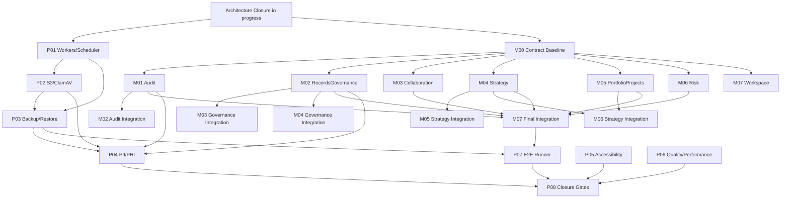

# Cluster Production and Planned-Modules Program Orchestration Plan

> **For execution agents:** Use `skill://executing-plans` or `skill://subagent-driven-development` to execute an approved child plan. This file coordinates status, dependencies, handoffs, and serialized merge queues; it does not replace any child plan.

```yaml
program_id: CLUSTER-PROGRAM-2026-07-26
status: planned
source_design: docs/superpowers/specs/2026-07-26-cluster-production-and-modules-program-design.md
current_prerequisite: docs/superpowers/plans/2026-07-26-cluster-complete-architecture-closure.md
implementation_commit: null
last_verified_commit: null
last_status_change: '2026-07-26'
final_closure_authority: P08
```

## 1. Purpose and authority

This is the single source of truth for cross-plan status, dependency gates, integration-token ownership, and execution order for the production-readiness and seven-module program approved on 2026-07-26. Each child plan owns its implementation details and retained evidence. This file must not duplicate or weaken a child plan's acceptance criteria.

The current architecture-closure plan remains `in_progress`. Until its relevant task explicitly hands off a shared surface, that plan is the exclusive owner. Creating these plans does not authorize implementation, commits, pushes, deployments, migrations, external messages, or cloud changes.

## 2. Status lifecycle

Every child plan uses exactly one status:

| Status | Required condition |
|---|---|
| `planned` | The plan exists; ungated inventory or baseline work may be available, but execution has not started. |
| `ready` | Every start gate and required shared-file handoff is recorded. |
| `in_progress` | Plan-owned work is executing. |
| `blocked` | A named dependency, integration token, approval, or environment prerequisite prevents the next required phase. |
| `verification` | Implementation and integration are complete; declared gates are running on one commit. |
| `completed` | Every exit criterion passed and retained evidence identifies one recorded commit. |
| `superseded` | A later user-approved plan replaces this plan and records the replacement path. |

A child plan may have an ungated inventory phase while its implementation or integration phase remains blocked. That does not make the whole plan `ready`.

## 3. Canonical plan inventory

### 3.1 Production readiness

| ID | Plan | Status | Start dependency | Completion/integration dependency | Blocks |
|---|---|---:|---|---|---|
| `P01` | [Production workers and scheduler](./2026-07-26-cluster-production-workers-scheduler.md) | `blocked` | Architecture Closure Tasks 6 and 10 | Production-topology token | `P02`, `P03` |
| `P02` | [Documents S3/ClamAV production runtime](./2026-07-26-cluster-documents-s3-clamav-production.md) | `blocked` | `P01` runtime contract; current Documents outbox decision closed | Production-topology token after `P01` | `P03`, `P04` completion |
| `P03` | [Backup, restore, and release rollback](./2026-07-26-cluster-backup-restore-release-rollback.md) | `blocked` | `P01`, `P02` | Production-topology token after `P02` | `P07` production execution |
| `P04` | [Healthcare PII/PHI and compliance](./2026-07-26-cluster-healthcare-privacy-compliance.md) | `planned` | Inventory: none | Enforcement evidence: `M01`, `M02`, `P02`, and `P03` | `P08` |
| `P05` | [Accessibility and WCAG 2.2 AA](./2026-07-26-cluster-accessibility-wcag.md) | `planned` | Audit: none | Remediation/evidence: each in-scope UI surface stabilized | `P08` |
| `P06` | [Quality and performance hardening](./2026-07-26-cluster-quality-performance-hardening.md) | `planned` | Baseline: none | Broad remediation: API/web feature set stabilized | `P08` |
| `P07` | [E2E runner readiness](./2026-07-26-cluster-e2e-runner-readiness.md) | `blocked` | Inventory: none | Workflow handoff from current Task 13; `P01`–`P03`; required module integrations including `M07` | `P08` |
| `P08` | [Closure-gates expansion](./2026-07-26-cluster-closure-gates-expansion.md) | `blocked` | Current Task 13 CI/Make handoff; all required child plans complete | `CLOSURE-CI` remains granted through final integration; architecture-register phase waits for Task 14 handoff | Program closure |

### 3.2 Planned modules

| ID | Plan | Status | Start dependency | Blocked integration phase | Blocks |
|---|---|---:|---|---|---|
| `M00` | [Planned-module contracts and ownership baseline](./2026-07-26-cluster-planned-module-contracts-baseline.md) | `blocked` | Architecture Closure Tasks 4, 6, 7, and 12 | User approval of frozen decisions | `M01`–`M07` |
| `M01` | [Audit](./2026-07-26-cluster-audit-module.md) | `blocked` | `M00`; current Authorization/outbox work complete | Shared integration queues | `M02` audit integration, `M07`, `P04` |
| `M02` | [RecordsGovernance](./2026-07-26-cluster-records-governance-module.md) | `blocked` | `M00` | Final audit integration requires `M01` | `M03`, `M04`, `M07`, `P04` |
| `M03` | [Collaboration](./2026-07-26-cluster-collaboration-module.md) | `blocked` | `M00` | Final governance integration requires `M02`; Documents facts, Notifications consumer, and workload registration use their owning queues | `M07` |
| `M04` | [Strategy](./2026-07-26-cluster-strategy-module.md) | `blocked` | `M00` | Final governance integration requires `M02` | `M05`, `M06`, `M07` |
| `M05` | [PortfolioProjects](./2026-07-26-cluster-portfolio-projects-module.md) | `blocked` | `M00` | Final strategy integration requires `M04` | `M06`, `M07` |
| `M06` | [Risk](./2026-07-26-cluster-risk-module.md) | `blocked` | `M00` | Final strategy/project integration requires `M04`, `M05` | `M07` |
| `M07` | [Workspace](./2026-07-26-cluster-workspace-module.md) | `blocked` | `M00` | Final aggregation requires `M01`–`M06` | `P07` production execution |

## 4. Dependency graph



The integration nodes are phases inside the owning child plans, not extra plan files.

## 5. Maximum-safe parallel execution

### Wave 0 — Current closure plus read-only baselines

May proceed concurrently in isolated worktrees:

- current Architecture Closure Tasks 2, 3, 4, and 7 according to that plan;
- `P04` PHI/PII inventory only;
- `P05` accessibility audit only;
- `P06` warning/performance baseline only;
- `P07` runner/environment inventory only;
- `M00` investigation and decision drafting only, without runtime artifacts.

### Wave 1 — Freeze shared foundations

After Architecture Closure Tasks 4, 6, 7, and 12:

1. execute and approve `M00`;
2. continue current Closure Tasks 8, 9, 10, 11, 13, and 14 under their own gates;
3. retain current-plan ownership of `Makefile`, workflows, master OpenAPI, generated clients, architecture guards, and any declared active route edit until explicit handoff.

### Wave 2 — Module-owned implementation fan-out

After `M00` approval, run `M01`–`M07` concurrently in separate worktrees, limited to module-owned API paths and plan-owned web feature paths.

- `M01`–`M04`: full module-owned cores may execute concurrently.
- `M05`, `M06`: module-owned cores may use frozen `M00` contracts and deterministic test fakes; real producer integrations remain blocked.
- `M07`: aggregation model and shell-independent views may use frozen contracts and test fakes; final aggregation remains blocked.
- Test fakes never become production bindings. A module cannot enter `verification` while a fake production binding remains.

In parallel, `P01` may start after its closure gates, `P04`/`P05` may review stabilized surfaces, and `P06` may address isolated measured hotspots outside active module files.

### Wave 3 — Production runtime lanes

1. `P01` establishes the worker/scheduler workload contract and first production-topology revision.
2. `P02` integrates document storage/scanning after `P01`.
3. `P03` integrates backup/restore/release rollback after `P01` and `P02`.
4. Module-owned work continues subject to the serialized queues.

### Wave 4 — Serialized integrations

Process one token at a time in this order:

1. architecture/module registry;
2. Laravel routes;
3. OpenAPI then Orval generation;
4. web shell/navigation;
5. production topology;
6. CI/Make closure.

A module cannot become `completed` until its required shared integration tokens are merged and its final gates pass on the integrated commit.

### Wave 5 — System verification

1. `P07` executes production E2E after `P01`–`P03` and required module integrations.
2. `P04` completes enforcement evidence after `M01`, `M02`, `P02`, and `P03`.
3. `P05` completes evidence after all in-scope routes stabilize.
4. `P06` confirms budgets after feature freeze.
5. `P08` executes last and is the only final closure authority.

## 6. Shared-file ownership and integration-token ledger

### 6.1 Current architecture-closure reservation

Until explicit handoff, the current plan owns:

- `Makefile`;
- `.github/workflows/ci.yml`;
- `.github/workflows/ci-e2e.yml`;
- `docs/contracts/api/openapi.yaml`;
- `apps/web/src/api/generated/cluster.ts`;
- `apps/api/tests/Architecture/ModuleBoundariesTest.php`;
- `apps/api/routes/web.php` while an active current-plan task declares it.
- `docs/architecture/architecture-closure-register.yaml` through Task 14.

No child plan may edit one of these surfaces in parallel. A token record must identify the releasing task, receiving plan, base commit, exact surface, and expiry/merge result.
#### Architecture Closure handoff aliases

The child-plan aliases resolve to exact current-plan evidence:

| Alias | Producer evidence required before release |
|---|---|
| `ARCHITECTURE-CLOSURE:T4` | Task 4 completed; migrated-table inventory, module placement, rank, planned-module, and ownership guards pass; the release record names `ModuleBoundariesTest.php` and `module-catalog.md` surfaces granted to `MODULE-REGISTRY`. |
| `ARCHITECTURE-CLOSURE:T6` | Task 6 completed; public Contract/Event boundaries and Shared transactional-outbox ownership pass; the release record names affected provider/composition and event-catalog surfaces. |
| `ARCHITECTURE-CLOSURE:T7` | Task 7 completed; the canonical problem renderer, correlation request attribute, resource envelope, strong precondition parser, and focused response matrix pass; the release record names the Shared HTTP surfaces. |
| `ARCHITECTURE-CLOSURE:T10` | Task 10 completed; every named producer family passes state/idempotency/audit/outbox failure-injection rollback and the Documents outbox decision is recorded. |
| `ARCHITECTURE-CLOSURE:T12` | Task 12 completed; route/OpenAPI/generated-client reconciliation, authenticated cursor codec, bounded-collection tests, repeat generation, `api:check`, build, and docs validation pass; the release record names route, contract, generated-client, and Shared cursor surfaces. |
| `ARCHITECTURE-CLOSURE:AUTHORIZATION-OUTBOX` | Tasks 6, 9, and 10 completed; focused Authorization/outbox/rollback evidence retained; affected Contracts and bindings listed in the release record. |
| `ARCHITECTURE-CLOSURE:DOCUMENTS-OUTBOX-DECISION` | Tasks 6, 10, and 11 completed for Documents; atomicity, optimistic-concurrency, and rollback evidence retained. |
| `ARCHITECTURE-CLOSURE:T13-HANDOFF` | Task 13 gate passed on its recorded commit; `Makefile`, `.github/workflows/ci.yml`, `.github/workflows/ci-e2e.yml`, and `scripts/production_bundle_policy.py` are explicitly released. |
| `ARCHITECTURE-CLOSURE:T14-HANDOFF` | Task 14 dossier and validator completed; `docs/architecture/architecture-closure-register.yaml` is explicitly released. |

Each handoff record must contain the current task numbers, full base commit, exact released surfaces, retained command outputs, receiving token, and releasing owner. A child plan cannot infer a handoff from a task checkbox or commit alone.


### 6.2 Production topology queue

| Token | Surface | Order |
|---|---|---|
| `PROD-WORKER` | `apps/api/docker/worker-loop.sh` | `P01` only |
| `PROD-SCHEDULER` | `apps/api/docker/scheduler-loop.sh` | `P01` only |
| `PROD-CONSOLE` | `apps/api/routes/console.php` | `P01` only |
| `PROD-WORKLOAD-REGISTRY` | P01 worker command allowlist/order/readiness tests | `P01` defines; downstream workload integrations receive one serialized token |
| `PROD-COMPOSE` | `infra/platform/production/compose.yaml` | `P01 → P02 → P03` |
| `PROD-ENV` | `infra/platform/production/.env.example` | `P01 → P02 → P03` |
| `PROD-RELEASE` | deployment/rollback scripts selected by `P03` | `P03` after `P01`, `P02` |
| `PROD-MERGED-SMOKE` | final P01/P02/P03 workload and dependency topology | `P07` runs the merged topology; `P08` consumes the retained result |

`P02` and `P03` may use validated overlays when clearer, but must not create a competing production topology.

### 6.3 Module and closure queues

| Token | Surface | Decision/merge owner |
|---|---|---|
| `MODULE-REGISTRY` | ranks, planned-module inventory, table ownership | `M00` defines; one module merge at a time applies |
| `API-ROUTES` | `apps/api/routes/web.php` | route integration queue after current-plan release |
| `OPENAPI` | authoritative master OpenAPI | contract integration queue after current-plan release |
| `ORVAL` | generated web client | same contract token; generation command only |
| `WEB-SHELL` | typed routes and navigation | shell queue; `M07` owns final aggregation only |
| `WEB-PACKAGE` | `apps/web/package.json` and `apps/web/package-lock.json` as one atomic lockfile unit | Current web/package owner releases; `P05` may hold one grant for the three exact accessibility dev dependencies and declared npm scripts; any P06/P07 need requires a later non-overlapping grant |
| `AUDIT-MYSQL-SUITE` | `apps/api/phpunit.mysql.xml`; exactly one explicit Audit `<file>` in the existing MySQL suite, never a runner-script edit | MySQL XML integration owner applies M01's entry once, proves class discovery, executes the existing runner, then releases |
| `AUTHORIZATION-AUDIT-PRODUCER` | Authorization-owned bootstrap capability/role-grant producer integration and focused atomicity/rollback tests | M01 publishes immutable packet; Authorization owner alone applies and releases |
| `DOCUMENTS-AUDIT-PRODUCER` | Documents-owned selected sensitive-access producer integration and focused atomicity/rollback tests | M01 publishes immutable packet; Documents owner alone applies and releases |
| `DOCUMENTS-LINKED-FACTS` | Documents-owned `LinkedResourceAuthorizationFacts` composite/provider binding | Documents integration owner applies M03's packet after current-plan release |
| `COLLABORATION-SHARED-RELAY` | Shared-owned bounded relay/command/provider/tests for M03 events | Shared outbox integration owner applies M03's packet before the Notifications consumer and P01 workload registration |
| `NOTIFICATIONS-COLLABORATION-CONSUMER` | Notifications-owned Collaboration event consumer/provider binding | Notifications integration owner applies M03's packet, then requests `PROD-WORKLOAD-REGISTRY` |
| `SEARCH-PRIVACY` | Search GET-to-POST privacy cutover, routes, contract, wrapper | Search integration owner, then `API-ROUTES`/`OPENAPI`/`ORVAL` |
| `PLATFORMSETTINGS-RETENTION` | technical-log archive cleanup/disposition integration | PlatformSettings integration owner consuming M02 public Contracts/Events |
| `CLOSURE-CI` | `Makefile`, CI workflows | `P08` only after current Task 13 handoff |
| `PRODUCTION-POLICY` | `scripts/production_bundle_policy.py` | `P08` after `ARCHITECTURE-CLOSURE:T13-HANDOFF` |
| `ARCHITECTURE-REGISTER` | `docs/architecture/architecture-closure-register.yaml` | `P08` only after `ARCHITECTURE-CLOSURE:T14-HANDOFF` |

## 7. Integration-token protocol

Before touching a shared surface, the executor must record in this file's execution copy or approved tracking system:

```yaml
token: OPENAPI
state: requested | granted | merged | released | revoked
requesting_plan: M01
releasing_owner: ARCHITECTURE-CLOSURE
base_commit: '<full-sha>'
surface:
  - docs/contracts/api/openapi.yaml
grant_evidence: '<path-or-link>'
merge_commit: null
```

Rules:

1. one granted holder per token;
2. grant only from a clean, recorded base commit;
3. generated clients share the OpenAPI token and are regenerated, never hand-edited;
4. revoke and rebase a stale token rather than resolving ownership conflicts ad hoc;
5. release only after targeted integration checks pass;
6. `MODULE-REGISTRY` applies a module's rank, planned-list removal, and table owners only in the same integrated change that contains the module directory and owned migrations; ghost pre-registration is forbidden;
7. `CLOSURE-CI` remains `granted` to `P08` until P08's edits and targeted integration checks pass, then becomes `merged` and `released`;
8. Architecture Closure aliases are grantable only from the handoff table above; a child plan may not synthesize an alias from partial predecessor work;
9. owning-module packets (`AUTHORIZATION-AUDIT-PRODUCER`, `DOCUMENTS-AUDIT-PRODUCER`, `DOCUMENTS-LINKED-FACTS`, `COLLABORATION-SHARED-RELAY`, `NOTIFICATIONS-COLLABORATION-CONSUMER`, `SEARCH-PRIVACY`, `PLATFORMSETTINGS-RETENTION`) are immutable inputs applied by the named existing-module owner, never by the requesting module; each producer-audit owner must prove producer state/idempotency/outbox plus Audit commit atomically and all roll back on injected Audit failure;
10. `AUDIT-MYSQL-SUITE` has one owner and one application: add one explicit `<file>` to `apps/api/phpunit.mysql.xml`, discover the Audit class with that XML configuration using `--list-tests` or equivalent class-name output, then execute `scripts/run-mysql-integration-tests.sh`; neither runner script may be edited;
11. update affected child status and this inventory in the same authorized change.

## 8. Status-update protocol

A status change is valid only when accompanied by evidence:

- `planned → ready`: the approved immediate lane has an authorized executor/worktree, its no-edit boundary is recorded, and every lane-specific prerequisite that exists at start is satisfied;
- `blocked → ready`: every named start gate and token is recorded;
- `ready → in_progress`: executor/worktree and base commit are recorded;
- `in_progress → blocked`: blocker, owning dependency, and last safe commit are recorded;
- `in_progress → verification`: implementation and required integrations are complete with no production fake/stub;
- `verification → completed`: the child plan's own exit criteria pass on one recorded commit and its immutable retained evidence resolves; acceptance by `P08` is not a child completion prerequisite;
- any status `→ superseded`: user approval, replacement plan, and migration of downstream dependencies are recorded.

`P08` may consume a completed child manifest from an ancestor commit, but it must replay every critical child verifier on final integrated `HEAD`. Only those fresh replay outputs count toward P08's single-SHA closure decision.

Update order for an approved dependency change:

1. approved design amendment;
2. affected child plan metadata;
3. this inventory and graph;
4. shared-file ownership/token queue;
5. every downstream dependency;
6. reason and approving user decision.

## 9. Cross-plan invariants

- Module-owned controller → boundary validation/capability check → handler/application service → module-owned persistence.
- Cross-module dependencies use published `Contracts/` or `Events/`; never another module's Domain or Infrastructure.
- Authorization precedes detailed validation and resource disclosure.
- Command state, idempotency, audit, and outbox effects commit atomically.
- Optimistic concurrency is enforced in the write predicate.
- Production adapters fail closed; test fakes remain test-only.
- Mutations define idempotency and stale-write behavior.
- PHI/PII never enters URLs, browser persistence, error bodies, or unsanitized logs.
- Generated clients are reproducible from the authoritative contract.
- Every in-scope UI route retains WCAG 2.2 AA evidence before closure.
- E2E, MySQL, production bundle, dependency, and recovery gates cannot pass by skipping.
- Newly validated audit findings receive new `C` identifiers with source evidence. Never recreate unsourced historical `F001`–`F123` placeholders; revalidate useful `.minimax-flow/reports/agent-*.json` content as new findings.

## 10. Program evidence manifest

Each child plan must retain an evidence manifest containing:

```yaml
plan_id: P01
commit: '<full-sha>'
tree_digest: '<sha256-of-plan-owned-deliverables>'
started_at: '<iso-8601>'
finished_at: '<iso-8601>'
commands:
  - command: '<exact command>'
    exit_code: 0
    output_path: '<retained-output>'
smoke_scenarios:
  - name: '<observable scenario>'
    result: pass
    evidence_path: '<retained-artifact>'
open_findings: []
accepted_risks: []
```

The child manifest is immutable after completion. P08 records its commit and digest as lineage evidence, verifies that commit is an ancestor of final `HEAD`, and writes fresh final-SHA replay outputs only to one atomically created `artifacts/program-closure/<final-sha>/<program-run-id>/` root; live outputs beneath it are additionally bound to the exact P07 run ID. A child manifest is not rewritten to pretend it was produced at final `HEAD`. Same-HEAD retries use new program/P07 run IDs and preserve prior sealed or failed roots; no mutable `latest` selector is evidence.

Evidence is stale if its recorded commit/digest does not match the child completion tree, it omits a required command, hides a skip, or cannot be resolved. For P08 closure, ancestor child evidence is lineage only: every critical verifier must be replayed and retained on the final SHA. Critical skips are failures, not warnings.

## 11. Final closure authority: P08

`P08` extends the current closure gate; it must not create a competing path. On one recorded commit, it must retain passing evidence for:

P08 uses the P07-owned bounded runtime lifecycle: start the final merged topology, export a commit-bound connection/fixture manifest, run P05/P06/P07 and production workload/document gates against those live origins, stop under a trap, and prove cleanup. It must not run live gates before topology start or after teardown.

- intake and lockfile validation;
- documentation and contract validation;
- `api:check` with zero generated drift;
- API formatting, static analysis, tests, and module boundaries;
- MySQL integration/concurrency with no skip;
- web build, lint, unit tests, and coverage;
- dependency audits and secret scanning;
- production bundle and image checks;
- worker/scheduler workload smoke tests;
- S3/ClamAV document lifecycle E2E;
- backup/restore/rollback rehearsal;
- accessibility evidence;
- PII/PHI/compliance evidence;
- explicit performance budgets;
- production E2E on the configured runner;
- architecture-register reconciliation using only source-backed findings.
- child-manifest ancestry/content-digest validation plus fresh replay of every critical child verifier on the final commit.

Any missing, skipped, stale, or failed critical gate leaves `P08` and the program blocked.

## 12. Program exit criteria

The program may become `completed` only when:

1. `P01`–`P08` and `M00`–`M07` are `completed` or an explicitly user-approved replacement records equivalent closure;
2. every earlier shared token is `merged` and `released`; `CLOSURE-CI`, `PRODUCTION-POLICY`, and `ARCHITECTURE-REGISTER` are released only after P08 finishes their integrations and targeted checks;
3. no production binding is a fake, stub, no-op, or placeholder;
4. no required API/web/module/production callsite or contract is left on a deprecated path;
5. `P08` passes every final gate on the same recorded commit;
6. the evidence manifest and closure dossier identify that commit and all retained outputs;
7. open risks are explicitly accepted by the user, with scope and expiry recorded.

Planning completion is not program completion. The initial program status remains `planned` until an authorized executor satisfies the first start gate.
