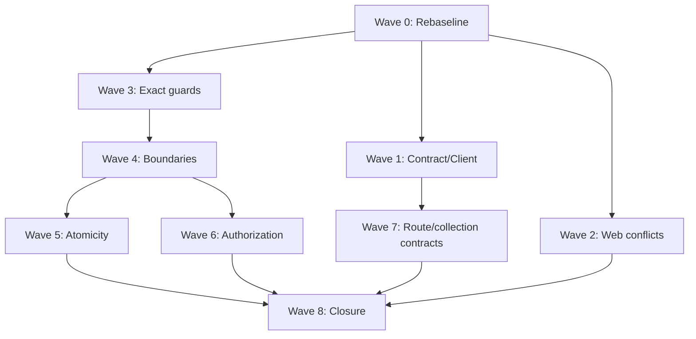

# مواصفة تصميم الإغلاق المعماري الكامل لمشروع Cluster

> **الحالة:** معتمدة من المستخدم على مستوى التصميم بتاريخ 2026-07-26.
> **المرجع التنفيذي الحالي:** [`../../analysis/SUMMARY.md`](../../analysis/SUMMARY.md)
> **سجل المخاطر:** [`../../analysis/17-cross-cutting-risks.md`](../../analysis/17-cross-cutting-risks.md)
> **الخطة التاريخية:** [`../plans/2026-07-25-cluster-architecture-security-remediation.md`](../plans/2026-07-25-cluster-architecture-security-remediation.md)

## 1. الهدف

إغلاق جميع المشاكل المعمارية والأمنية والتكاملية المثبتة في Cluster من خلال مسار واحد قابل للتدقيق، يبدأ بإعادة بناء baseline حي، ثم ينفذ الإصلاحات على موجات مستقلة، وينتهي بإثبات أن التطبيق والعقود والوثائق تعمل على commit واحد دون ملفات مستعادة أو استثناءات يدوية.

## 2. قرار التصميم

اعتماد **الخطة الهجينة**:

1. لا تُعامل checkboxes في خطة 2026-07-25 كحالة تنفيذية.
2. يُعاد فحص كل finding/task قديم وتصنيفه بالأدلة.
3. تبدأ الإصلاحات المثبتة الحالية فوراً، ولا تنتظر إعادة تدقيق البنود التي لا تعتمد عليها.
4. تُنفذ الأعمال كموجات PR صغيرة ذات بوابات دخول وخروج.
5. لا يُغلق البرنامج قبل نجاح بوابة تكامل نهائية على commit واحد.

هذا القرار يجمع اكتمال إعادة التدقيق مع سرعة معالجة موانع P0 الحالية.

## 3. تعريف الإغلاق

يُعتبر الإغلاق المعماري محققاً فقط عند اجتماع الشروط التالية:

### 3.1 المخاطر

- لا finding مفتوح بدرجة P0 أو P1.
- كل finding بدرجة P2 إما مغلق، أو مقبول بقرار معماري مؤرخ يحدد المالك والأثر وسبب القبول.
- لا finding بحالة `unverified` في الرحلات الحرجة: session، CSRF، authorization، stale writes، outbox، generated API client.

### 3.2 حدود الموديولات

- كل جدول مهاجر له owner واحد، ولا يوجد owner entry بلا جدول مهاجر إلا virtual resource موثق في inventory منفصل.
- كل entry في `ModulePlacementInventory` يشير إلى ملف موجود.
- كل controller يتبع layout المعتمد؛ الاستثناءات مسماة ومختبرة.
- لا cross-owner SQL ولا imports إلى module internals أو `Shared\Infrastructure` من خارج مالكها.
- composition root يقتصر على wiring والحراس، وتبقى business bindings داخل module providers.

### 3.3 العقود والويب

- authoritative OpenAPI هو مصدر الحقيقة الوحيد للعميل.
- ينجح `api:check` ثم `build` على الناتج نفسه دون `git restore` أو تعديل generated files يدوياً.
- تتطابق Business Calendar operations/types مع wrappers والشاشات أو تُزال كل callsites القديمة في cutover واحد.
- route inventory وRBAC matrix يعاد توليدهما من التنفيذ ولا يحتويان drift.

### 3.4 سلامة البيانات والأمن

- mutation + idempotency + audit + outbox التي تصف command واحداً تلتزم في transaction واحدة.
- كل عقد optimistic concurrency ينفذ CAS داخل write predicate ويعيد 412 عند stale version.
- authorization يسبق resource disclosure والتفاصيل الحساسة.
- كل projection/search/report/export يطبق classification وfield-access policy المناسبة.
- لا production behavior يعتمد على `argv` عندما يمكن تمثيله بسياسة config/environment صريحة.

### 3.5 الإثبات التشغيلي

على commit الإغلاق نفسه:

- `make verify-boundaries` ناجح.
- `make lint-api` ناجح.
- `make analyse-api` ناجح.
- API PHPUnit الكامل ناجح ضمن بوابة CI لا تنتهي قبل زمنه المثبت.
- MySQL integration/concurrency suites المطلوبة ناجحة.
- web build وlint وunit وcoverage و`api:check` ناجحة.
- رحلات E2E الحرجة ناجحة.
- `make docs-validate` ناجح.
- لا generated diff ينتج بعد إعادة تشغيل generators.

## 4. النطاق

### داخل النطاق

1. إعادة baseline للخطة التاريخية وكل findings المرتبطة بها.
2. OpenAPI/Orval/Business Calendar drift.
3. Organization drawer conflict/precondition semantics.
4. exact architecture inventories والحراس.
5. controller layout وحدود الموديولات.
6. cross-module contracts وtable/outbox ownership.
7. transaction، outbox، audit، idempotency، وoptimistic concurrency.
8. authorization، classification، delegation، capability gates، وerror semantics.
9. pagination/cursor contracts عندما تكون finding قديمة ما زالت مفتوحة.
10. migration manifest/reversibility عندما يثبت أنها ما زالت مفتوحة.
11. CI timeouts، E2E، production bundle، والوثائق النهائية.

### خارج النطاق

- إضافة ميزات منتج جديدة لا يحتاجها إغلاق finding مثبت.
- إعادة تصميم واجهة المستخدم لأسباب جمالية.
- تغيير framework أو قاعدة البيانات أو نمط modular monolith.
- تحسينات أداء بلا قياس أو بلا ارتباط ببوابة إغلاق.
- قبول shims أو aliases أو generated edits يدوية كحل دائم.

## 5. نموذج الحالة والأدلة

ينشأ سجل واحد لكل finding بالحقول التالية:

| الحقل | القيم/المعنى |
|---|---|
| `id` | رقم finding القديم أو معرف جديد ثابت |
| `domain` | Contracts، Boundaries، Data Integrity، Security، Web، Migrations، Tooling |
| `status` | `open`، `blocked`، `closed`، `accepted-risk`، `not-a-defect` |
| `priority` | P0، P1، P2 |
| `evidence` | ملف/رمز + أمر ونتيجة حديثة |
| `owner` | موجة التنفيذ/PR المالكة |
| `exit_criteria` | ملاحظة قابلة للإثبات وليست وصفاً عاماً |
| `closed_by` | commit/PR ونتيجة التحقق |

لا يُسمح بحالة “يبدو مغلقاً”. إما دليل runtime/static مناسب، أو يبقى finding مفتوحاً.

## 6. موجات العمل

### الموجة 0 — Rebaseline وحارس الحالة

- تحويل findings القديمة إلى سجل حي.
- إعادة قياس routes، operations، tables، owners، controllers، providers، migrations، tests، وgenerated drift.
- تصنيف كل finding إلى مفتوح/مغلق/not-a-defect/blocked.
- منع استخدام checkboxes التاريخية كمؤشر تقدم.

**الخروج:** كل finding له status ودليل ومعيار خروج ومالك.

### الموجة 1 — P0 Contract/Client Integration

- حسم ما إذا كان Business Calendar surface جزءاً من العقد الحالي.
- تحديث authoritative OpenAPI أو إزالة wrappers/callsites في clean cutover.
- regeneration ثم `api:check` ثم TypeScript build ووحدات PlatformSettings.

**الخروج:** لا generated diff، و`api:check` وbuild يمران على الشجرة نفسها.

### الموجة 2 — P0 Web Conflict Semantics

- إعادة إنتاج حالات Organization 409/412.
- تثبيت contract موحد لعرض conflict/precondition errors في drawers.
- إصلاح implementation أو fixtures وفق السلوك المثبت.

**الخروج:** اختبارات Organization الثمانية والـweb unit suite كاملة ناجحة.

### الموجة 3 — Exact Architecture Enforcement

- فصل table inventory عن virtual read-model/resource inventory.
- رفض owner entries الزائدة والمفقودة.
- رفض placement entries غير الموجودة.
- فرض layout المعتمد على Reporting/Search أو توثيق استثناء narrow ومختبر.

**الخروج:** الحراس تفشل على fixtures السلبية ثم تمر على الشجرة الفعلية.

### الموجة 4 — Module Boundaries and Ownership

- إعادة فحص imports وSQL وtransactions/outbox ownership عبر كل module files.
- تمرير cross-module reads خلال Contracts/Events فقط.
- حسم مالك shared outbox وأي outbox خاص بالموديولات.
- إبقاء composition root طبقة wiring فقط.

**الخروج:** لا import أو SQL أو transaction ownership violation معروف.

### الموجة 5 — Atomicity and Concurrency

- إعادة تدقيق command handlers ذات state + audit/idempotency/outbox.
- إضافة rollback injection tests للمنتجين الفعليين.
- إضافة MySQL two-connection tests لعقود CAS/locking الحرجة.
- إصلاح migration manifest/reversibility المفتوحة.

**الخروج:** rollback لا يترك partial state، وstale writes تعيد 412، وMySQL suites ناجحة.

### الموجة 6 — Authorization and Information Control

- capability → classification → delegation → explicit deny → projection.
- fail-closed عند غياب/فساد classification policy.
- endpoint capability gates وauthorization-before-validation.
- delegation lifecycle/effective capability semantics.
- typed problem responses وعدم كشف exception messages.

**الخروج:** denial/masking/lifecycle tests ناجحة عبر Get/List/Search/Report/Export والحدود الحساسة.

### الموجة 7 — Collection and Route Contract Consistency

- إعادة فحص cursor/pagination findings القديمة قبل تعديلها.
- توحيد opaque authenticated cursor فقط للمسارات المثبتة المفتوحة.
- exact live-route/OpenAPI reconciliation.
- إعادة توليد endpoint/RBAC docs.

**الخروج:** لا live/spec drift غير مصنف، والقوائم bounded ولا تسرب totals أو denied rows.

### الموجة 8 — Integration and Closure

- ضبط API test timeout وفق القياس الفعلي.
- تشغيل كل البوابات على commit واحد.
- تشغيل E2E للـsession/CSRF/capability/stale-write/contract journeys.
- تحديث summary، risk register، module catalog، architecture، وclosure dossier.

**الخروج:** تتحقق جميع شروط القسم 3، ويصدر قرار `CLOSED` أو `NOT READY` بالأدلة.

## 7. الاعتماديات والتوازي

- الموجتان 1 و2 تعملان بالتوازي بعد الموجة 0.
- الموجة 3 تبدأ بعد baseline، ولا تعتمد على 1 أو2.
- الموجتان 5 و6 تعملان بالتوازي بعد استقرار الحدود في الموجة 4 إذا لم تتداخل ملفاتهما.
- الموجة 8 حاجز نهائي ولا تبدأ قبل اكتمال كل المسارات السابقة.

## 8. سياسة PR والتراجع

- كل موجة تُقسم إلى PRs يمكن رفض كل منها مستقلاً.
- لا يجمع PR واحد تغيير authoritative contract مع إصلاح unrelated module boundary.
- كل PR يبدأ باختبار/fixture يفشل على العيب المثبت، ثم implementation، ثم بوابة النطاق.
- generated output يلتزم فقط في PR العقد الذي أنتجه.
- التراجع هو revert كامل للـPR؛ لا تُترك compatibility shims بعد cutover.
- migration PRs تتضمن forward/rollback evidence على قاعدة disposable قبل الدمج.

## 9. بوابة المراجعة الخصومية

قبل دخول الموجة 8، يراجع reviewer مستقل:

1. هل كل finding قديم مصنف بدليل؟
2. هل يوجد P0/P1 مغلق بوصف فقط دون اختبار أو فحص؟
3. هل تمر generators دون diff؟
4. هل توجد callsites تعتمد generated symbols غير موجودة في العقد؟
5. هل حراس الحدود exact أم تسمح بزيادات صامتة؟
6. هل اختبارات atomicity تحقن failure بين state وoutbox؟
7. هل اختبارات concurrency تستخدم اتصالين حقيقيين حيث يلزم؟
8. هل E2E يغطي الأمن والتكامل لا مجرد تحميل الصفحات؟
9. هل وثائق الإغلاق تصف commit الذي شُغلت عليه البوابات؟

أي finding نقدي يعيد العمل إلى موجته المالكة ولا يُؤجل لما بعد الإغلاق.

## 10. بروتوكول تعديل الخطة

- **Split:** تقسيم مهمة إذا صار لها أكثر من عقد خروج مستقل؛ تبقى dependencies الأصلية على آخر جزء ينتج العقد.
- **Insert:** إضافة finding جديد في الموجة التي تملك سببه، مع priority ودليل ومعيار خروج.
- **Reorder:** مسموح فقط إذا لم يكسر dependency graph أو بوابة دخول.
- **Skip:** مسموح فقط بحالة `not-a-defect` أو `accepted-risk` موثقة؛ ليس بسبب ضيق الوقت.
- **Block:** يسجل prerequisite خارجي محدد، وتستمر الموجات غير المعتمدة عليه.
- **Abandon:** لا يُستخدم لإخفاء scope؛ يتطلب تغييراً معتمداً في تعريف الإغلاق.

## 11. المخرجات النهائية

1. سجل findings حي مع evidence وclosure mapping.
2. PRs تنفيذية لكل موجة.
3. generated OpenAPI client مطابق للعقد.
4. architecture guards exact.
5. نتائج API/web/MySQL/E2E/docs على commit واحد.
6. تحديث وثائق architecture/module catalog/summary/risks.
7. closure dossier يعلن `CLOSED` أو يحدد بدقة لماذا المشروع `NOT READY`.

## 12. قرار النجاح

لا يكفي أن ينجح build أو أن تنخفض قائمة المخاطر. النجاح هو أن تكون الحدود والعقود وسلامة البيانات والأمن قابلة للمنع آلياً، وأن تتفق الشفرة المولدة والتنفيذ والوثائق على commit واحد، وألا يبقى finding حرج بلا دليل إغلاق.
