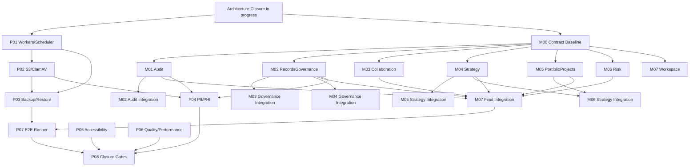

# Cluster Production Readiness and Planned Modules Program Design

> **Date:** 2026-07-26  
> **Design status:** Approved by the current user  
> **Program status:** `planned`  
> **Current prerequisite:** `docs/superpowers/plans/2026-07-26-cluster-complete-architecture-closure.md` is `in_progress`  
> **Purpose:** Define independently executable plans, explicit dependency gates, shared-file ownership, and the maximum safe parallel execution model for production readiness and all seven planned modules.

## 1. Decision

The program will use:

- one orchestration/status plan;
- eight independent production-readiness plans;
- one module-contract and ownership baseline plan (`M00`);
- seven independent module implementation plans (`M01`–`M07`).

Total: **16 implementation plans plus one orchestration plan**.

Every concern and every module receives its own plan. A plan may start discovery or module-owned implementation before all dependencies are complete, but it must not enter a blocked integration or verification phase until its declared gates pass.

## 2. Goals

1. Make the current Cluster runtime deployable, operable, recoverable, and independently verifiable in production-like infrastructure.
2. Implement all seven planned modules as first-class module-owned capabilities.
3. Maximize safe parallel work without allowing concurrent ownership of the same shared files.
4. Keep every plan executable by a fresh agent with cold-start context.
5. Produce one final closure gate on one commit after all required plans complete.

## 3. Non-goals

- This design does not implement application code.
- It does not change the current architecture-closure plan while that plan is executing.
- It does not permit hand-editing generated API clients.
- It does not permit merging placeholder modules, runtime no-ops, fake production adapters, or incomplete scaffolds.
- It does not treat a passing narrow check as proof of system closure.
- It does not authorize commits, pushes, deployments, migrations, external messages, or cloud changes.

## 4. Canonical status lifecycle

Every plan must expose exactly one current status:

| Status | Meaning |
|---|---|
| `planned` | The plan exists, but execution has not started. |
| `ready` | All start gates are satisfied and an executor may begin. |
| `in_progress` | Module-owned or plan-owned work is actively executing. |
| `blocked` | A named dependency, shared-file owner, approval, or environment prerequisite prevents the next step. |
| `verification` | Implementation is complete and the declared gates are running. |
| `completed` | Exit criteria passed on a recorded commit. |
| `superseded` | A later approved plan replaced this plan; the replacement path is recorded. |

Each plan header must include:

```yaml
plan_id: P01
status: blocked
depends_on: []
blocks: []
shared_file_owner: []
implementation_commit: null
last_verified_commit: null
last_status_change: '2026-07-26'
```

The orchestration plan is the single source of truth for cross-plan status. A plan file owns its detailed evidence; the orchestration plan owns only status, dependency, and merge-queue summaries.

## 5. Plan inventory

### 5.1 Production-readiness plans

| ID | Plan | Initial status | Start/integration gate |
|---|---|---|---|
| `P01` | Production workers and scheduler | `blocked` | Architecture Closure Tasks 6 and 10 complete. |
| `P02` | Documents S3/ClamAV production runtime | `blocked` | `P01` runtime contract complete and the current Documents outbox decision is closed. |
| `P03` | Backup, restore, and release rollback | `blocked` | `P01` and `P02` complete. |
| `P04` | Healthcare PII/PHI and compliance | `planned` | Inventory may start immediately; enforcement integration requires `M01`, `M02`, and `P02`. |
| `P05` | Accessibility and WCAG 2.2 AA | `planned` | Audit may start immediately; remediation waits for each affected UI surface to stabilize. |
| `P06` | Quality and performance hardening | `planned` | Baseline may start immediately; broad edits wait for current API/web stabilization. |
| `P07` | E2E runner readiness | `blocked` | Runner inventory may start immediately; workflow integration requires current Task 13 handoff and `P01`–`P03`. |
| `P08` | Closure-gates expansion | `blocked` | All required plans complete and current Task 13 releases ownership of CI/Make files. |

### 5.2 Planned-module plans

| ID | Plan | Initial status | Integration gate |
|---|---|---|---|
| `M00` | Planned-module contracts and ownership baseline | `blocked` | Current Architecture Closure Tasks 4, 6, 7, and 12 complete. |
| `M01` | Audit module | `blocked` | `M00` approved; current Authorization/outbox work complete. |
| `M02` | RecordsGovernance module | `blocked` | `M00` approved. Final audit integration requires `M01`. |
| `M03` | Collaboration module | `blocked` | `M00` approved. Final governance integration requires `M02`. |
| `M04` | Strategy module | `blocked` | `M00` approved. Final governance integration requires `M02`. |
| `M05` | PortfolioProjects module | `blocked` | `M00` approved. Final strategy integration requires `M04`. |
| `M06` | Risk module | `blocked` | `M00` approved. Final strategy/project integration requires `M04` and `M05`. |
| `M07` | Workspace module | `blocked` | `M00` approved. Final aggregation integration requires `M01`–`M06`. |

`M00` is documentation and contract design only. It must not create runtime module scaffolds, empty migrations, no-op adapters, placeholder routes, or generated-client output. It freezes:

- module purpose and non-goals;
- owned aggregates and tables;
- published Contracts and Events;
- authorization capability namespaces;
- route and OpenAPI reservations;
- cross-module reference semantics;
- data classification and audit requirements;
- shared-file merge order.

## 6. Parallel execution model

### Wave 0 — Continue current closure and gather read-only baselines

Run in parallel where worktrees and current-plan gates allow:

- Architecture Closure Tasks 2, 3, 4, and 7 after its rebaseline decision;
- `P04` PII/PHI inventory only;
- `P05` accessibility audit only;
- `P06` quality/performance baseline only;
- `P07` runner/environment inventory only;
- drafting `M00` contracts without modifying runtime code.

### Wave 1 — Freeze shared foundations

After current Architecture Closure Tasks 4, 6, 7, and 12:

- execute `M00`;
- finish current Tasks 8, 9, 10, 11, 13, and 14 according to their own dependency graph;
- no new plan may take ownership of `Makefile`, CI workflows, master OpenAPI, generated clients, or shared architecture guards until the current owner hands them off.

### Wave 2 — Maximum module-owned parallelism

After `M00`, start module-owned implementation for `M01`–`M07` in separate worktrees. Parallel implementation is allowed only in module-owned files and plan-owned web feature directories.

- `M01`–`M04` may implement full module-owned cores concurrently.
- `M05` and `M06` may implement their owned domains against the frozen `M00` contract and deterministic in-memory contract fakes; their real integration gates remain blocked until their producers are merged.
- `M07` may implement its aggregation model and shell-independent views against frozen contracts/fakes; production integration remains blocked until `M01`–`M06` pass.
- No branch may merge with unresolved fake production bindings. Contract fakes are test-only.

In parallel with module work:

- `P01` may execute after current outbox/atomicity work completes;
- `P04` and `P05` continue reviewing each stabilized surface;
- `P06` may perform isolated hotspot work that does not touch active module files.

### Wave 3 — Production runtime lanes

- `P02` starts after `P01` establishes the runtime workload contract.
- `P03` starts after `P01` and `P02` so backups include database, Redis/outbox state, and document objects.
- Module branches continue in parallel, subject to the shared integration queues below.

### Wave 4 — Serialized integration queues

Module-owned implementation may be parallel; shared surfaces are merged serially:

1. architecture/module registry queue;
2. Laravel route queue;
3. OpenAPI/Orval generation queue;
4. web shell/navigation queue;
5. production topology queue;
6. CI/Make closure queue.

A module is not `completed` until its shared integration token is processed and its final tests pass on the integrated branch.

### Wave 5 — System verification

- `P07` runs production E2E only after `P01`–`P03` and required module integrations.
- `P04` completes compliance evidence after `M01`, `M02`, and `P02`.
- `P05` completes accessibility evidence after all in-scope UI routes stabilize.
- `P06` completes performance/quality budgets after the feature set freezes.
- `P08` executes last and is the only final closure authority.

## 7. Dependency graph



Conceptual integration nodes in execution must be represented as explicit blocked phases inside the owning module plan, not as extra plan files.

## 8. Shared-file ownership

### 8.1 Current-plan reservation

While the existing Architecture Closure plan is in progress, it retains ownership of:

- `Makefile`;
- `.github/workflows/ci.yml`;
- `.github/workflows/ci-e2e.yml`;
- `docs/contracts/api/openapi.yaml`;
- `apps/web/src/api/generated/cluster.ts`;
- `apps/api/tests/Architecture/ModuleBoundariesTest.php`;
- `apps/api/routes/web.php` when its active task declares that file.

A new plan must wait for handoff or receive a non-overlapping integration token. It must not independently edit these files in parallel.

### 8.2 Production topology queue

| Surface | Owner/order |
|---|---|
| `apps/api/docker/worker-loop.sh` | `P01` |
| `apps/api/docker/scheduler-loop.sh` | `P01` |
| `apps/api/routes/console.php` | `P01` |
| base `infra/platform/production/compose.yaml` | `P01`, then serialized `P02`, then `P03` |
| `infra/platform/production/.env.example` | serialized `P01 → P02 → P03` |
| deployment/rollback scripts | `P03` after `P01/P02` |

`P02` and `P03` should prefer validated Compose overlays when that preserves operational clarity; they must not introduce a second competing production topology.

### 8.3 Module integration queues

| Shared surface | Exclusive integration owner |
|---|---|
| module ranks, planned-module inventory, table ownership | `M00` defines decisions; module merge queue applies one module at a time |
| `apps/api/routes/web.php` | route integration queue |
| master OpenAPI | contract integration queue |
| generated Orval client | contract queue only, generation command only |
| web shell routes/navigation | shell integration queue; `M07` owns final aggregation |
| `Makefile` and CI workflows | `P08` after current Task 13 handoff |

## 9. Plan format contract

Every implementation plan must contain:

1. status header and dependency fields;
2. goal and user-visible outcome;
3. current source evidence;
4. scope and explicit non-goals;
5. architecture and ownership boundaries;
6. files to create, modify, move, or remove;
7. public Contracts, Events, routes, schemas, and capability names;
8. database tables, indexes, constraints, migration order, and rollback/recovery;
9. TDD steps with a failing test before implementation;
10. failure, retry, idempotency, concurrency, and authorization behavior;
11. targeted verification commands;
12. shared-file integration token requirements;
13. rollback procedure;
14. exit criteria and required retained evidence;
15. status transition rules.

A plan must be self-contained enough for a fresh executor. It must not say “follow the previous task” without repeating the required contract and evidence paths.

## 10. Cross-cutting invariants

- Module-owned controller → validation/capability check → handler/application service → module-owned persistence.
- Cross-module dependencies use published `Contracts/` or `Events/`; no module imports another module’s Domain or Infrastructure.
- Authorization precedes detailed validation or resource disclosure.
- State, idempotency, audit, and outbox effects for one command commit atomically.
- Optimistic concurrency is enforced in the write predicate.
- Production adapters fail closed; tests may use fakes, production may not.
- Generated clients are never edited manually.
- Every mutation defines idempotency and stale-write semantics where applicable.
- PHI/PII never enters URLs, browser persistence, error bodies, or unsanitized logs.
- Every UI route must meet WCAG 2.2 AA evidence requirements before final closure.
- E2E, MySQL, production bundle, dependency audits, and recovery checks may not pass by skipping.

## 11. Final closure gate

`P08` must extend the current closure gate rather than create a competing gate. At minimum it must execute and retain evidence for:

- intake and lockfile validation;
- docs and contract validation;
- `api:check` with zero generated drift;
- API formatting/static analysis/tests;
- module-boundary tests;
- MySQL integration and concurrency tests without skip;
- web build/lint/unit/coverage;
- dependency audits and secret scan;
- production-bundle validation and image checks;
- workers/scheduler workload smoke tests;
- S3/ClamAV document lifecycle E2E;
- backup/restore/rollback rehearsal;
- accessibility evidence;
- PII/PHI/compliance evidence;
- explicit performance budgets;
- production E2E on the configured runner;
- all results on one recorded commit SHA.

Closure is blocked by any missing, skipped, stale, or failed critical gate.

## 12. Plan mutation protocol

A plan may be split or reordered only by updating:

1. its own status/dependencies;
2. the orchestration plan;
3. shared-file ownership;
4. downstream `depends_on` fields;
5. the reason and approving user decision.

Newly verified findings receive new `C` identifiers with source and evidence. The program must not recreate unsourced historical `F001–F123` placeholders. Raw `.minimax-flow/reports/agent-*.json` findings may be revalidated and registered as new `C` findings; dropping the unrecoverable global numbering must not discard real audit content.

## 13. Acceptance criteria for this design

- Every requested production concern has an independent plan.
- Every planned module has an independent plan.
- A shared `M00` contract baseline enables parallel module-owned work without runtime stubs.
- Shared files have one owner or a serialized integration queue.
- Dependencies gate only the phases that truly require them; discovery and module-owned work may proceed earlier.
- The existing Architecture Closure plan remains authoritative until it hands off its shared files.
- The final closure gate is singular and evidence-backed.

## 14. Post-draft adversarial-review amendment

The first complete plan set was independently reviewed before delivery. The following decisions refine execution detail without changing the approved 16-plan decomposition:

- child plans complete from their own gates and immutable evidence; they never wait for `P08` acceptance;
- `P08` accepts ancestor child manifests as lineage evidence, then replays every critical verifier on the final integrated commit;
- P07 owns one bounded live-runtime lifecycle for P05, P06, P07, and P08 production gates;
- Architecture Closure handoff aliases map to exact task evidence and released surfaces in the orchestration plan;
- `MODULE-REGISTRY` cutover is atomic with each module directory and owned migrations; ghost pre-registration is forbidden;
- existing-module changes use explicit owning queues for Documents linked facts, Notifications Collaboration consumption, Search privacy cutover, and PlatformSettings retention;
- P01's production workload command registry is extendable only through a serialized token and readiness/order regression tests;
- P08 receives separate post-handoff ownership for the production bundle policy and, after Task 14, the architecture register;
- `GetStrategySnapshot` carries `StrategyAccessContext` so producer-side authorization is executable;
- Workspace preference writes atomically record M01 audit; they publish no domain event or outbox row because no downstream side effect exists.

The orchestration plan is authoritative for the exact token ledger, handoff evidence, final-SHA replay model, and corrected status transitions.
